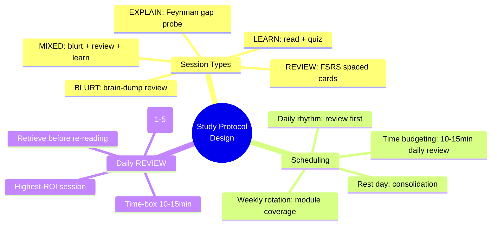

# Module 11: Study Protocol Design

Est. study time: 1h
Language: en
Description: Designing the skeleton of a study system — session types, weekly scheduling, and the daily review routine that anchors retention.

## Knowledge Map



---

## Learning Objectives
- Design a weekly study schedule combining LEARN, EXPLAIN, BLURT, and REVIEW sessions
- Implement FSRS-5-based scheduling with daily review before new learning
- Apply the daily REVIEW routine: retrieve first, grade honestly, time-box
- Understand why REVIEW is the highest-ROI session for retention

---

## Real-World Example

A learner studies fiercely for 2 months but can't remember anything from month 1 when quizzed. They studied each module once, in sequence, and never looked back. All effort, no retention.

With a study protocol:
1. **Daily review**: 10-15 min FSRS-5 spaced cards across all completed modules
2. **Weekly LEARN**: 1 new module, read + Feynman + quiz
3. **Weekly REVIEW**: cumulative interleaved review of modules from 2+ weeks ago
4. **Monthly BLURT**: brain-dump everything remembered about a module, compare to lesson
5. **Protocol review**: after 4 weeks, analyze weak areas, adjust schedule

Result: retention at 4 months is >90% instead of <30%.

> **Note on the "~30%" figure**: This is a teaching shorthand, not a measured constant. Ebbinghaus's original forgetting curve (1885) reported ~40% retention at 24h for nonsense syllables. Modern replications put 1-week retention of unrehearsed material in the 20-40% range, varying by content type (meaningful text > nonsense syllables) and learner. Treat "<30% without review" as a working rule of thumb that motivates the protocol — not a precise prediction. The protocol's value is the *direction* (review preserves), not the specific percentage.

> **Think**: Why does studying a module once and never reviewing it produce such poor long-term retention?
>
> *Answer: The forgetting curve drops to ~30% within days without review. Each review session resets the curve at a higher stability (FSRS-5). Without review, the initial effort is largely wasted. The protocol ensures review reinforces earlier investment.*

---

## Core Content

### Session Types and Their Purpose

Five session types serve different learning phases:

```mermaid
graph TD
    subgraph "Weekly Cycle"
        L[LEARN: 45-60min] --> Q[Quiz: 10-15min]
        Q --> F[Feynman Explain: 15-20min]
    end
    subgraph "Daily Practice"
        R[REVIEW: 10-15min]
    end
    subgraph "Deep Review"
        B[BLURT: 10-15min]
        B --> C[Compare to source]
        C --> G[Fill gaps]
    end
    subgraph "Protocol Review"
        M[Meta-Learning: 15min]
        M --> A[Adjust protocol]
    end
    style L fill:#5c7a99,stroke:#333
    style R fill:#5c8a6a,stroke:#333
    style B fill:#b8924a,stroke:#333
    style M fill:#7a5a8a,stroke:#333
```



| Session | Duration | Frequency | Purpose | Key Method |
|---------|----------|-----------|---------|------------|
| **LEARN** | 45-60 min | 3-4x/week | New material | Read lesson → cloze → predict → quiz |
| **EXPLAIN** | 15-20 min | After each LEARN | Gap detection | Feynman technique + AI probe |
| **BLURT** | 10-15 min | 1x/week per module | Retrieval strength | Brain-dump → compare → fill gaps |
| **REVIEW** | 10-15 min | Daily | Spaced retention | FSRS-5 active recall cards |
| **MIXED** | 30-45 min | 1x/week | Complete practice | BLURT(10min) → REVIEW(10min) → LEARN(20min) → EXPLAIN(5min) |

> **Cloze**: "The five session types are: {LEARN}, EXPLAIN, {BLURT}, REVIEW, and MIXED."
>
> *Answer: LEARN, BLURT*

---

### Scheduling: The Weekly Template

```python
weekly_schedule = {
    "Monday":    {"type": "REVIEW", "duration": 15, "focus": "all due cards"},
    "Tuesday":   {"type": "LEARN",  "duration": 60, "focus": "new module"},
    "Wednesday": {"type": "REVIEW", "duration": 15, "focus": "most-overdue cards"},
    "Thursday":  {"type": "MIXED",  "duration": 45, "focus": "blurt module-2 + review + learn"},
    "Friday":    {"type": "LEARN",  "duration": 60, "focus": "new module"},
    "Saturday":  {"type": "REVIEW", "duration": 15, "focus": "weakest module cards"},
    "Sunday":    {"type": "REST",   "duration": 0,  "message": "consolidation day"}
}
```

Design principles:
1. **REVIEW first** — daily review before learning new material ensures retention baseline
2. **New LEARN on fresh days** — Tuesday and Friday, not after heavy cognitive load
3. **MIXED mid-week** — Thursday combines blurt of earlier module + review + small learn session
4. **Rest day** — Sunday with no study allows consolidation; FSRS-5 does not penalize rest days
5. **Weak-module targeting** — Saturday review focuses on cards with lowest easeFactor

> **Predict**: What happens if a learner crams 4 LEARN sessions in a row without any REVIEW days?
>
> *Answer: Each module will be forgotten at ~70% within a week. The learner has 4x the content but rapidly decaying retention for all of it. Worse: cram sessions are exhausting, reducing comprehension for later modules in the same sitting.*

---

### Daily REVIEW: FSRS-5 in Practice

Daily review is the highest-ROI session. Implementation:

```python
def daily_review(cards, time_limit_minutes=15):
    due_cards = [
        c for c in cards
        if is_due(c, datetime.now())
    ]

    # Sort: most-overdue first
    due_cards.sort(key=lambda c: c.next_review)

    # Filter to time budget
    review_budget = due_cards[:estimate_count(time_limit_minutes)]

    for card in review_budget:
        # Show question → learner recalls
        quality = ask_card(card)  # returns 1-5

        # Update FSRS-5 parameters
        card = fsrs_update(card, quality)

        # Quality-dependent feedback
        if quality <= 2:
            show_source(card)  # return to material
        elif quality == 5:
            increase_interval(card)  # mastered

    return review_budget, len(due_cards) - len(review_budget)
```

Key practices:
1. **Retrieve before re-reading** — attempt recall first, then check answer
2. **Grade honestly** — quality 4 (correct after hesitation) is different from 5 (instant recall)
3. **Self-correct** — after wrong answer, understand why before moving on
4. **Time-box** — 10-15 min daily prevents burnout and maintains consistency

> **Think**: Why grade on a 5-point scale instead of just correct/incorrect?
>
> *Answer: FSRS-5 uses quality for stability calculation. Quality 5 (effortless) → stability grows more than quality 4 (hesitated). Grading quality captures retrieval effort, which predicts future retention better than binary correct/incorrect.*

---

### Why This Matters

The protocol skeleton determines whether spaced repetition works. Session types give each learning phase a clear job. The weekly template balances new learning with retention maintenance. Daily REVIEW is the anchor — 10-15 minutes that preserves every previous hour of study. Modules later in the course build execution methods (BLURT, Feynman, interleaving) and meta-learning on top of this skeleton. Without the skeleton, those methods have no schedule to live in.

---

## Key Takeaways
- Five session types serve different phases: LEARN (new), EXPLAIN (gap detection), BLURT (retrieval), REVIEW (spacing), MIXED (all)
- Schedule: daily REVIEW (10-15min), LEARN 3-4x/week, BLURT weekly per module
- REVIEW before new LEARN — retention baseline first
- Daily REVIEW is the highest-ROI session — it preserves previous LEARN investment
- Retrieve before re-reading; grade honestly on 1-5; time-box to prevent burnout
- Rest days aid consolidation — FSRS-5 does not penalize them

---

## Common Misconception

**Misconception**: "Learning new material is the most important part of studying."

**Why wrong**: Without review, new material decays to ~30% within days. REVIEW is the highest-ROI session — a daily 10-15 minutes preserves every prior hour. Learning without a review scaffold is like filling a leaking bucket.

---

## Spot the Mistake

"A learner designs their weekly schedule: Monday LEARN, Tuesday LEARN, Wednesday LEARN, Thursday LEARN, Friday LEARN, Saturday LEARN, Sunday rest — all new modules, zero review."

What's wrong?

*Answer: No review sessions means all modules decay. By week 4, module 1 retention is <30%. The learner spent 24 hours learning but retained <8 hours of content. Daily REVIEW (10-15min) would preserve weeks 1-3 at >85% retention.*

---

## Feynman Explain
(Explain to a fellow learner the weekly study protocol and why each session type exists. Use the analogy of a workout program: strength (LEARN), cardio (REVIEW), flexibility (BLURT), rest day.)


---

## Reframe
(Pause. Judge: the protocol is 18 hours of scheduled time per course. Is that realistic? What's the minimum viable protocol for a busy learner — which session types would you cut first? Write your evaluation.)

---

## Drill
Run: `learn.sh quiz learning-methods-deep 11-study-protocol-design`
