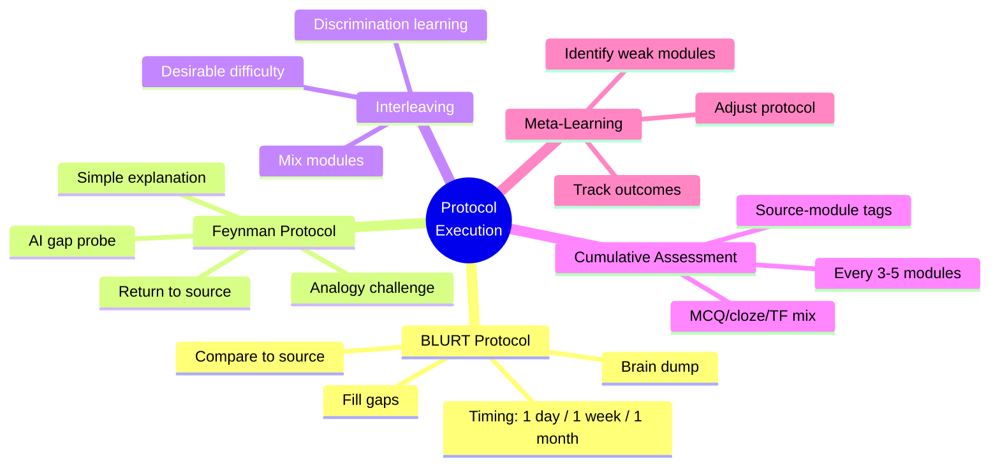
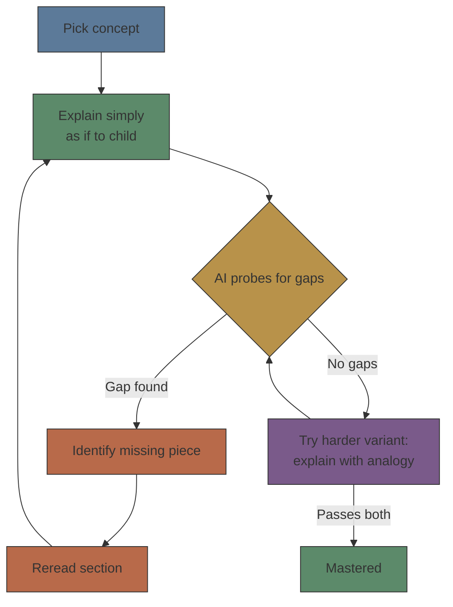

# Module 12: Protocol Execution Methods

Est. study time: 1h
Language: en
Description: The execution layer of a study protocol — BLURT retrieval, Feynman explanation, interleaving, cumulative assessment, and meta-learning iteration.

## Knowledge Map



---

## Learning Objectives
- Execute the BLURT protocol: brain dump, compare to source, fill gaps
- Execute the Feynman protocol with simple explanation and analogy rounds
- Apply interleaving across modules and understand its retention benefit
- Use meta-learning to track outcomes and iterate the protocol

---

## Real-World Example

A learner has a weekly protocol on paper, but sessions feel aimless. BLURT is just "think about the module" — no structure, no output. Feynman ends when the learner gets bored. REVIEW cards come one module at a time, so every card feels the same. Nothing tells them what to review next week or what works.

The problem: a protocol skeleton without execution methods is a calendar, not a system.

Execution methods fix this:
1. **BLURT**: timed brain-dump → compare → fill top 3 gaps — produces a concrete gap list
2. **Feynman**: explain simply → AI probes → analogy → return to source — structured until mastery
3. **Interleaving**: shuffle cards across modules so each requires discrimination
4. **Meta-learning**: weekly analysis of what worked → adjust the protocol

> **Think**: Why does the Feynman protocol require a second round (analogy) even after the simple explanation passes?
>
> *Answer: Simple explanation can be memorized without deep understanding. An analogy requires mapping the concept to a different domain — this forces relational reasoning and reveals whether understanding is flexible or rigid.*

---

## Core Content

### The BLURT Protocol

Blurting is brain-dump retrieval practice. Protocol:

```python
def blurt_protocol(module):
    # Phase 1: Brain dump (5 min)
    timer_start()
    recalled = {}
    while timer() < 5 * 60:
        concept = learner_remembers()
        recalled[concept] = {
            "details": learner_recalls_details(),
            "confidence": learner_rates_confidence()
        }

    # Phase 2: Compare to lesson (5 min)
    gaps = []
    misconceptions = []
    for section in module.sections:
        if section.concept not in recalled:
            gaps.append(section.concept)
        elif has_error(recalled[section.concept], section):
            misconceptions.append(section.concept)

    # Phase 3: Fill gaps (5 min)
    for gap in gaps[:3]:  # Focus on 3 most important gaps
        reread_section(module, gap)

    return {
        "recalled_count": len(recalled),
        "gap_count": len(gaps),
        "misconception_count": len(misconceptions)
    }
```

Blurting timing:
- **Immediate**: right after LEARN — tests initial encoding, finds weak points immediately
- **1 week**: tests medium-term retention — what survived vs decayed
- **1 month**: tests long-term retention — what's consolidated

> **Cloze**: "The three phases of blurting are: brain {dump}, {compare} to source, and fill gaps."
>
> *Answer: dump, compare*

---

### The Feynman Protocol

Systematic Feynman technique for structured review:



```python
def feynman_protocol(concept, module_reference):
    # Round 1: Simple explanation
    explanation = learner_explains_simply(concept)
    gaps = ai_probes_gaps(explanation, concept)

    if not gaps:
        # Round 2: Analogy challenge
        analogy = learner_gives_analogy(concept)
        gaps = ai_probes_analogy(analogy, concept)

    if not gaps:
        return "mastered"

    # Return to source for each gap
    for gap in gaps:
        section = find_section(module_reference, gap)
        reread(section)

    return {"gaps_found": gaps, "needs_retry": True}
```

> **Predict**: Why does the Feynman protocol require a second round (analogy) even after the simple explanation passes?
>
> *Answer: Simple explanation can be memorized. An analogy forces mapping the concept to a different domain — revealing whether understanding is flexible or rigid.*

---

### Interleaving Across Modules

Interleaved review mixes cards from different modules:

```python
def interleaved_review(cards, modules, focus_module=None):
    interleaved = []
    for module in modules:
        module_cards = [c for c in cards if c.module == module]
        weight = 2 if module == focus_module else 1
        interleaved.extend(module_cards * weight)
    import random
    random.shuffle(interleaved)
    return interleaved
```

Benefits over blocked practice:
| Aspect | Blocked (one module at a time) | Interleaved |
|--------|-------------------------------|-------------|
| Short-term quiz | Higher (appears to work) | Lower (feels harder) |
| Long-term retention | Lower (~30% at 1 month) | Higher (~60% at 1 month) |
| Discrimination learning | Poor — same context each card | Good — must identify which concept applies |
| Learner preference | Preferred (feels easier) | Disliked (feels harder) |

**Critical insight**: Interleaving feels worse but works better — the protocol must override learner preference for blocked practice.

> **Think**: Why does interleaving feel harder than blocked practice?
>
> *Answer: Blocked practice uses the same mental context — each card reinforces the previous. Interleaving requires context-switching — identifying which concept applies before answering. That extra effort is desirable difficulty driving better retention.*

---

### Cumulative Assessment

After every 3-5 modules, take a cumulative quiz:

```yaml
# cumulative_quiz.yaml structure
- id: "cq.1"
  source_modules: [01, 02, 03, 04]
  question: "Which technique combines Feynman's gap detection with Marva Collins' no-fail philosophy?"
  type: mcq
  options:
    A: "Deliberate practice"
    B: "Socratic probing with immediate correction and reframed failure"
    C: "Generation effect"
    D: "FSRS-5 scheduling"
  answer: B
  explanation: "Marva Collins uses Socratic questioning to find gaps (like Feynman) but always reframes wrong answers as growth signals — 'this gap means we found what to work on next.'"
  difficulty: 2
```

Cumulative quiz design:
1. **Every 3-5 modules** — early and often to build cross-module connections
2. **Mix of MCQ, cloze, T/F** — varied formats test different retrieval pathways
3. **Answers distributed across A-D** — no answer position pattern
4. **Tagged with source_modules** — identify which modules need review
5. **Difficulty progression** — start with recall, end with application

> **Cloze**: "Cumulative quizzes should occur every {3-5} modules. Questions should {mix} MCQ, cloze, and T/F formats."
>
> *Answer: 3-5, mix*

---

### Meta-Learning: Iterating the Protocol

The protocol itself must be adaptable:

```python
class ProtocolTracker:
    def __init__(self):
        self.sessions = []  # {date, type, module, duration, score}

    def weekly_review(self):
        """Analyze last 7 days and suggest adjustments"""
        recent = [s for s in self.sessions if s.date > 7_days_ago]

        # Find weakest modules
        module_scores = defaultdict(list)
        for s in recent:
            if s.score is not None:
                module_scores[s.module].append(s.score)

        weakest = sorted(module_scores.items(),
                        key=lambda x: sum(x[1])/len(x[1]))[:3]

        # Find best session types
        type_scores = defaultdict(list)
        for s in recent:
            if s.score is not None:
                type_scores[s.type].append(s.score)

        best_type = max(type_scores,
                       key=lambda t: sum(type_scores[t])/len(type_scores[t]))

        suggestions = {
            "focus_modules": [m for m, _ in weakest],
            "recommended_type": best_type,
            "missed_days": sum(1 for s in recent if s.skipped)
        }
        return suggestions
```

Meta-learning questions to answer weekly:
1. **Which modules are weakest?** — allocate more REVIEW time
2. **Which session type scores highest?** — prioritize effective types
3. **How many days missed?** — if >1, check trigger/friction issues
4. **REVIEW completion rate?** — if <80%, extend time budget
5. **Protocol adherence?** — did I follow the plan? If not, why?

> **Predict**: After 4 weeks, meta-learning shows REVIEW sessions at 70% completion. What should change?
>
> *Answer: Reduce daily review time, lower FSRS-5 desired retention from 0.9 to 0.85 (fewer due cards), or schedule reviews at the time of day with highest completion.*

---

### Why This Matters

Execution methods make the protocol tangible. BLURT produces a concrete gap list; Feynman forces explanation until mastery; interleaving builds discrimination; cumulative assessment builds cross-module connections; meta-learning closes the loop. Each converts "follow the schedule" into "know exactly what to do — and what to change."

---

## Key Takeaways
- BLURT: brain dump (5min) → compare to source (5min) → fill top 3 gaps (5min)
- Blurt at 1 day, 1 week, 1 month — each tests a different retention horizon
- Feynman: simple explanation → AI gap probe → analogy challenge → return to source
- Interleaving feels harder but triples long-term retention vs blocked practice
- Cumulative quizzes every 3-5 modules build cross-module connections
- Meta-learning weekly: track outcomes, identify weak areas, adjust protocol
- The protocol must override learner preference for blocked/easy practice

---

## Common Misconception

**Misconception**: "A good study protocol means following the same schedule rigidly every week."

**Why wrong**: A good protocol is adaptable. Meta-learning tells you when to adjust: weak modules need more REVIEW, missed days indicate trigger/friction issues, low scores suggest reallocation. Protocol is a starting point, not a prison.

---

## Spot the Mistake

"A learner says: 'My REVIEW session has 70% completion rate, so I'll add more REVIEW time to get through all the cards.'"

What's wrong?

*Answer: Adding time treats the symptom, not the cause. 70% completion means capacity is exceeded. Reduce FSRS-5 desired retention (fewer due cards), shorten the budget, or reschedule to a higher-focus time.*

---

## Feynman Explain
(Explain to a fellow learner the difference between "doing review" and "doing BLURT." Why brain-dump-before-looking is the retrieval that builds memory, and why interleaving feels hard but works. Use the analogy of lifting weights in random order vs the same exercise repeatedly.)


---

## Reframe
(Pause. Judge: execution methods add overhead — tracking sessions, grading quality, generating analogies. When does protocol overhead exceed its benefit? For which learners or subjects would simpler methods serve better? Write your evaluation.)

---

## Drill
Run: `learn.sh quiz learning-methods-deep 12-protocol-execution-methods`
