---

# Module 1: Cognitive Architecture — Working Memory & Long-Term Memory

Est. study time: 2h
Language: en
Description: Foundation module — how your brain processes and stores information. Everything else builds on this.

## Learning Objectives
- Describe the three-part cognitive architecture (sensory → working → long-term memory)
- Explain why working memory capacity limits learning
- Identify causes of cognitive overload and strategies to reduce it
- Apply chunking and attention management to own study sessions

---

## Real-World Example

You sit down to study a dense textbook chapter. Three pages in, you feel foggy. You re-read the same paragraph three times. Nothing sticks. You check your phone. You close the book frustrated.

Why? Not because you're lazy. Because your brain's processing system has a hard bottleneck — and you hit it.

> **Think**: What part of your brain got overwhelmed — storage space or processing speed?
>
> *Answer: Processing speed and temporary holding space. Your {working memory} filled up faster than your brain could transfer information to permanent storage.*

---

## Core Content

### The Three-Box Model

Human memory has three stages. Information flows through them sequentially:

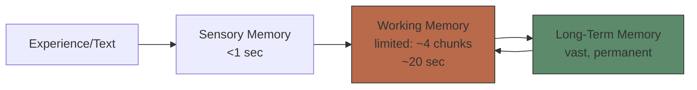

**Sensory Memory** — holds raw sensory input for <1 second. Most of it decays immediately. Only what you *attend to* enters working memory.

**Working Memory** — your mental workspace. Holds ~4 chunks of information for ~20 seconds unless you actively rehearse or manipulate it. This is the bottleneck.

**Long-Term Memory** — effectively unlimited storage. Once information is consolidated here, it persists for years. The goal of learning is to move knowledge from WM into LTM reliably.

> **Think**: You read a phone number, walk to the other room, and forget it. Which memory system failed?
>
> *Answer: Working memory. The number never made it past ~20 seconds into LTM because you didn't rehearse or encode it.*

> **Cloze**: "Information enters through {sensory memory}, but only what we {attend to} passes into {working memory}."
>
> *Answer: sensory memory, attend to, working memory*

### Working Memory: The Bottleneck

Working memory is the gatekeeper of learning. If WM is overloaded, nothing passes through to LTM.

**Key properties:**
- **Capacity**: ~4 chunks (Miller 1956 proposed 7±2; Cowan 2010 revised to 4±1)
- **Duration**: ~20 seconds without active maintenance (rehearsal, manipulation)
- **Dual subsystems**: verbal (phonological loop) + visual-spatial (visuospatial sketchpad), coordinated by central executive

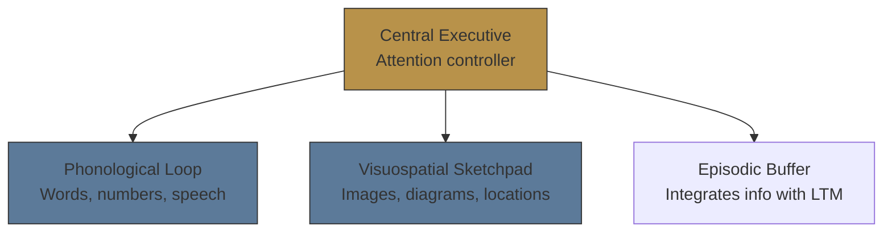

**Implication**: Reading text uses the phonological loop. Looking at a diagram uses the visuospatial sketchpad. Using both simultaneously = more total capacity → dual coding advantage.

> **Think**: Why does listening to music with lyrics while reading hurt comprehension?
>
> *Answer: Both compete for the phonological loop. Instrumental music uses visuospatial (no lyrics), so it interferes less.*

> **Predict**: You're studying anatomy. You read a text description of the heart (verbal) while looking at a labeled diagram (visual). Will this overload WM more or less than reading the description alone?
>
> *Answer: Less. Text uses phonological loop, diagram uses visuospatial sketchpad — different subsystems, more total bandwidth.*

### Long-Term Memory: The Destination

LTM has no known capacity limit. The challenge is not storage space — it's **retrieval**. Can you find what you stored when you need it?

**LTM types:**
- **Explicit (declarative)**: facts, events, concepts — "knowing that"
  - Semantic: general knowledge (Paris is capital of France)
  - Episodic: personal experiences (yesterday's lunch)
- **Implicit (procedural)**: skills, habits — "knowing how"
  - Riding a bike, typing, playing an instrument

**Retrieval strength vs Storage strength** (Bjork & Bjork 1992):
- **Storage strength**: how deeply information is embedded in LTM (grows with study, never declines)
- **Retrieval strength**: how easily you can access it right now (declines with disuse, spikes with practice)

You can have high storage strength but low retrieval strength — it's "in there" but you can't pull it out. This is the tip-of-the-tongue feeling.

> **Think**: You haven't played piano in 10 years. You sit down and struggle. After 15 minutes, muscle memory returns. Which changed — storage strength or retrieval strength?
>
> *Answer: Storage strength was intact (never declined). Retrieval strength was low from disuse and rose with practice.*

> **Cloze**: "A fact you learned years ago but can't recall right now has high {storage strength} but low {retrieval strength}."
>
> *Answer: storage strength, retrieval strength*

### The Attention Bottleneck

Before any of the above works, you must **pay attention**. Attention selects what enters WM from the firehose of sensory input.

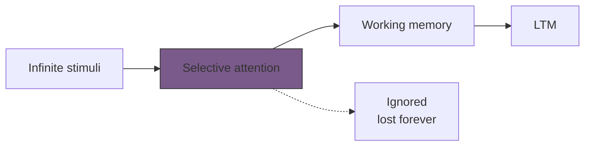

Key finding: **humans cannot multitask**. Task-switching creates a "switch cost" — every context switch drains cognitive resources.

> **Spot the Mistake**: "I'm great at multitasking — I listen to podcasts while studying and it works fine."
>
> What's wrong?
>
> *Answer: You're not multitasking; you're task-switching. Your attention bounces between podcast and study material. Each switch costs mental energy, reduces comprehension, and slows encoding into LTM. What you learn is shallower.*

**Implication for study**: Single-task. Protect your attention. Block 25-50min focused intervals.

---

> **Think**: What's more effective: 3 hours of distracted studying with phone by your side, or 1 hour of focused deep work?
>
> *Answer: 1 hour of focused work. Distracted study fragments attention, increases switch costs, and prevents elaboration — information never moves from WM to LTM reliably.*

---

## Why This Matters

Every learning strategy in this course — spaced repetition, retrieval practice, dual coding, elaboration, interleaving — works *because of* cognitive architecture. They don't bypass the bottleneck; they work *within* its constraints.

If you ignore cognitive architecture:
- You re-read instead of retrieving (WM stays full, LTM stays empty)
- You multitask, hit the attention bottleneck, retain nothing
- You cram (single exposure, no consolidation → storage strength stays low)

If you respect it:
- You chunk information to fit WM's 4-slot limit
- You use dual coding to engage both WM subsystems
- You space practice to build retrieval strength over time
- You eliminate distractions to protect attention

---

## Key Takeaways
- Working memory holds ~4 chunks for ~20 seconds — it's the bottleneck
- LTM has unlimited storage; the real problem is retrieval, not space
- Storage strength and retrieval strength are different — you can know something but not access it
- Attention is the gatekeeper: no attention, no learning
- Dual coding (text + image) uses two WM subsystems = more bandwidth
- Multitasking is task-switching — each switch costs cognitive resources

---

## Common Misconception

**Misconception**: "I have a bad memory. I can't learn this."

**Reality**: Memory is not fixed. Learning is about *skills*, not *traits*. Retrieval strength builds with practice. Storage strength is permanent — once encoded, it never degrades. The feeling of "bad memory" is often low retrieval strength because of poor encoding strategies, not a fixed limit.

**Correct framing**: Memory responds to training. Use the right strategies, and retrieval improves.

---

## Spot the Mistake

"You should study 4 hours straight to really get into deep learning. Marathon sessions build mastery."

What's wrong?

*Answer: Working memory fatigues. After ~45-60 minutes of focused work, the central executive depletes and encoding efficiency drops. Short breaks restore WM capacity. The Pomodoro Technique (25min work + 5min break) or 50min + 10min aligns with cognitive limits. Marathon sessions = diminishing returns.*

---

## Feynman Explain
(Teach the three-box model to a child. Use simplest words — a bucket that fills up fast, a storage room that's huge, and a doorman who decides what goes in.)


---

## Reframe
(Pause. Judge cognitive architecture theory: does this match your experience? Can you think of a time you "knew" something but couldn't recall it? When does the bottleneck feel most limiting in your daily study? Write your evaluation.)

---

## Drill
Take the quiz. MCQs test recall, application, and scenario analysis.

Run: `learn.sh quiz learning-theories 1`

## Quiz: 01-cognitive-architecture

<p class="quiz-question">What is the approximate capacity of working memory?</p>

<p class="quiz-difficulty">★☆☆</p>

<p class="quiz-option"><strong>A.</strong> 7±2 items</p>

<p class="quiz-option"><strong>B.</strong> ~4 chunks</p>

<p class="quiz-option"><strong>C.</strong> ~10 items</p>

<p class="quiz-option"><strong>D.</strong> Unlimited</p>

<p class="quiz-answer"><strong>Answer:</strong> B</p>

<p class="quiz-explanation">Cowan (2010) revised Miller's 7±2 to ~4 chunks. Working memory is severely limited.</p>

<hr/>

<p class="quiz-question">What determines whether sensory information enters working memory?</p>

<p class="quiz-difficulty">★☆☆</p>

<p class="quiz-option"><strong>A.</strong> Rehearsal</p>

<p class="quiz-option"><strong>B.</strong> Attention</p>

<p class="quiz-option"><strong>C.</strong> Emotional salience</p>

<p class="quiz-option"><strong>D.</strong> Repetition</p>

<p class="quiz-answer"><strong>Answer:</strong> B</p>

<p class="quiz-explanation">Attention is the gatekeeper. Only attended stimuli pass from sensory memory to working memory.</p>

<hr/>

<p class="quiz-question">You learned Spanish in high school. Years later you struggle to recall words, but they come back after a week of practice. Which describes this?</p>

<p class="quiz-difficulty">★★☆</p>

<p class="quiz-option"><strong>A.</strong> Storage strength was low, retrieval strength was high</p>

<p class="quiz-option"><strong>B.</strong> Storage strength was high, retrieval strength was low</p>

<p class="quiz-option"><strong>C.</strong> Both strength were low</p>

<p class="quiz-option"><strong>D.</strong> Both strength were high</p>

<p class="quiz-answer"><strong>Answer:</strong> B</p>

<p class="quiz-explanation">Storage strength (encoding depth) persists. Retrieval strength (accessibility) decays with disuse but rebuilds quickly.</p>

<hr/>

<p class="quiz-question">Listening to a podcast with spoken words while reading a textbook primarily causes interference in which subsystem?</p>

<p class="quiz-difficulty">★★☆</p>

<p class="quiz-option"><strong>A.</strong> Visuospatial sketchpad</p>

<p class="quiz-option"><strong>B.</strong> Episodic buffer</p>

<p class="quiz-option"><strong>C.</strong> Phonological loop</p>

<p class="quiz-option"><strong>D.</strong> Central executive</p>

<p class="quiz-answer"><strong>Answer:</strong> C</p>

<p class="quiz-explanation">Both podcast (audio words) and reading text (subvocalized) compete for the phonological loop.</p>

<hr/>

<p class="quiz-question">A student studies 3 hours with Netflix playing. Another studies 45 minutes in silence. Who learns more and why?</p>

<p class="quiz-difficulty">★★★</p>

<p class="quiz-option"><strong>A.</strong> 3-hour student — more total exposure</p>

<p class="quiz-option"><strong>B.</strong> 45-minute student — no task-switching, full WM capacity for encoding</p>

<p class="quiz-option"><strong>C.</strong> Both learn equally — attention is irrelevant</p>

<p class="quiz-option"><strong>D.</strong> 3-hour student — background noise enhances focus</p>

<p class="quiz-answer"><strong>Answer:</strong> B</p>

<p class="quiz-explanation">Task-switching drains cognitive resources. Single-tasking maximizes WM available for encoding.</p>

<hr/>

<p class="quiz-question">Which is an example of implicit (procedural) memory?</p>

<p class="quiz-difficulty">★☆☆</p>

<p class="quiz-option"><strong>A.</strong> Recalling that Paris is the capital of France</p>

<p class="quiz-option"><strong>B.</strong> Remembering your 10th birthday party</p>

<p class="quiz-option"><strong>C.</strong> Typing on a keyboard without looking at the keys</p>

<p class="quiz-option"><strong>D.</strong> Knowing the definition of working memory</p>

<p class="quiz-answer"><strong>Answer:</strong> C</p>

<p class="quiz-explanation">Procedural memory is 'knowing how' — skills and habits performed automatically. Typing is procedural.</p>

<hr/>

<p class="quiz-question">Why does studying with a labeled diagram alongside text lead to better learning than text alone?</p>

<p class="quiz-difficulty">★★☆</p>

<p class="quiz-option"><strong>A.</strong> Diagrams are inherently easier</p>

<p class="quiz-option"><strong>B.</strong> Dual coding engages verbal + visuospatial WM subsystems simultaneously</p>

<p class="quiz-option"><strong>C.</strong> Text alone always causes boredom</p>

<p class="quiz-option"><strong>D.</strong> Diagrams bypass working memory entirely</p>

<p class="quiz-answer"><strong>Answer:</strong> B</p>

<p class="quiz-explanation">Dual coding uses both the phonological loop (text) and visuospatial sketchpad (diagram), increasing total WM bandwidth.</p>

<hr/>

<p class="quiz-question">What happens to information in working memory if not actively maintained?</p>

<p class="quiz-difficulty">★☆☆</p>

<p class="quiz-option"><strong>A.</strong> It transfers to long-term memory automatically</p>

<p class="quiz-option"><strong>B.</strong> It decays within ~20 seconds</p>

<p class="quiz-option"><strong>C.</strong> It persists until replaced</p>

<p class="quiz-option"><strong>D.</strong> It moves to sensory memory</p>

<p class="quiz-answer"><strong>Answer:</strong> B</p>

<p class="quiz-explanation">WM holds information for ~20 seconds without active maintenance (rehearsal or manipulation).</p>

<hr/>

<p class="quiz-question">A student feels 'foggy' after 20 minutes of dense reading. What is most likely happening?</p>

<p class="quiz-difficulty">★★★</p>

<p class="quiz-option"><strong>A.</strong> They are lazy</p>

<p class="quiz-option"><strong>B.</strong> Working memory is overloaded — new info enters faster than it can be encoded</p>

<p class="quiz-option"><strong>C.</strong> Long-term memory is full</p>

<p class="quiz-option"><strong>D.</strong> Sensory memory is broken</p>

<p class="quiz-answer"><strong>Answer:</strong> B</p>

<p class="quiz-explanation">Dense text fills WM rapidly. Without pauses to process and encode, new input has no workspace.</p>

<hr/>

<p class="quiz-question">The feeling of knowing something but being unable to recall it (tip-of-the-tongue) reflects:</p>

<p class="quiz-difficulty">★★☆</p>

<p class="quiz-option"><strong>A.</strong> High storage strength, high retrieval strength</p>

<p class="quiz-option"><strong>B.</strong> Low storage strength, high retrieval strength</p>

<p class="quiz-option"><strong>C.</strong> High storage strength, low retrieval strength</p>

<p class="quiz-option"><strong>D.</strong> Low storage strength, low retrieval strength</p>

<p class="quiz-answer"><strong>Answer:</strong> C</p>

<p class="quiz-explanation">The fact is stored (high storage strength) but inaccessible right now (low retrieval strength).</p>


---

# Module 2: Cognitive Load Theory

Est. study time: 2h
Language: en
Description: Why some learning materials feel impossible — and how to design/choose materials that respect WM limits.

## Learning Objectives
- Distinguish intrinsic, extraneous, and germane cognitive load
- Identify and eliminate extraneous load in study materials
- Apply worked example principle and split-attention principle
- Design study sessions that maximize germane load

---

## Real-World Example

You're learning a new programming language. Tutorial A shows:
- Giant wall of text
- Code snippet on page 3, explanation on page 5
- Ad popups, inconsistent terminology, colorful sidebar animations

Tutorial B shows:
- One concept per section
- Code + explanation side by side
- Minimal decoration, consistent notation

Tutorial A leaves you exhausted after 10 minutes. Tutorial B clicks.

Both teach the same topic. The difference isn't complexity — it's **cognitive load design**.

> **Think**: What made Tutorial A harder despite same content?
>
> *Answer: Tutorial A created extraneous load — split attention between code and explanation, irrelevant visual noise. Tutorial B reduced extraneous load and let WM focus on actual learning.*

---

## Core Content

### The Three Types of Load

Cognitive Load Theory (Sweller 1988) divides mental effort into three categories:

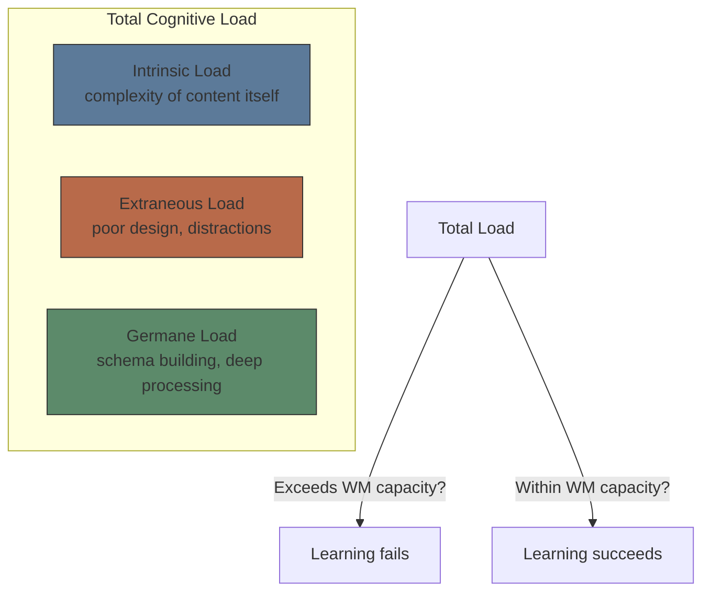

**Intrinsic Load** — determined by the number of interacting elements in the material. High element interactivity = high intrinsic load. You cannot reduce intrinsic load without removing content (but you can sequence it).

**Extraneous Load** — caused by how information is presented. Split attention, redundant text, distracting visuals, unclear navigation. You should **minimize** this.

**Germane Load** — the good kind. Mental effort directed at building schemas, connecting ideas, understanding deep structure. You should **maximize** this.

> **Think**: You're learning a piano chord. The chord has 4 notes (intrinsic load). The sheet music has the chord notation on page 3 and the fingering diagram on page 5 (extraneous load). You practice the chord until it feels automatic (germane load). Which load type can you change?
>
> *Answer: Extraneous load (fix notation layout). Intrinsic load is fixed by the chord itself. Germane load comes from practice effort.*

> **Cloze**: "Cognitive load theory distinguishes {intrinsic} load (content complexity), {extraneous} load (poor presentation), and {germane} load (schema construction)."
>
> *Answer: intrinsic, extraneous, germane*

### The Split-Attention Effect

When learners must split attention between multiple sources of information that refer to each other, extraneous load spikes.

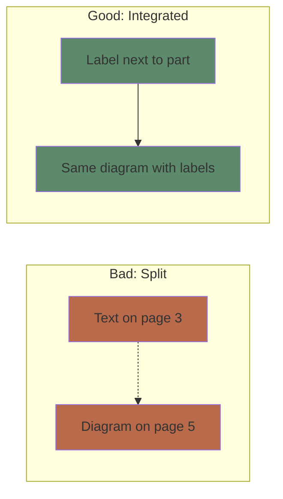

**Example**: A diagram of the heart with labels in a separate caption vs. labels directly on the diagram.

**Fix**: Integrate text and diagram. Label directly on the image. Put code and explanation side by side.

> **Spot the Mistake**: "My textbook has all the answers at the back. I like flipping back and forth to check."
>
> What's wrong?
>
> *Answer: Flipping pages creates split attention — WM wastes resources holding the question while searching for the answer. Integrated format (answer below question) eliminates the search cost.*

> **Predict**: A math worksheet has the formula at the top, example in the middle, and practice problems at the bottom. A second worksheet has the formula next to each problem. Which reduces extraneous load?
>
> *Answer: The second. Learners don't need to hold the formula in WM while solving each problem. Proximity reduces split attention.*

### The Redundancy Effect

Adding extra information that repeats or contradicts the primary content increases extraneous load — even if it seems helpful.

**Example**: A diagram is fully labeled. Adding a narrated description that reads the labels aloud is redundant. It forces WM to process the same information twice.

**Fix**: Remove redundant channels. If a diagram is self-explanatory, skip the paragraph explaining it.

> **Think**: A video shows an animation with both on-screen text AND a narrator reading the same text. Is this helpful or harmful?
>
> *Answer: Harmful. WM processes redundant info twice, wasting capacity. Redundancy effect: use narration OR text, not both for identical content.*

### The Worked Example Effect

Novice learners benefit more from studying worked examples than from solving problems. Problem-solving without adequate schemas overloads WM with unproductive search.

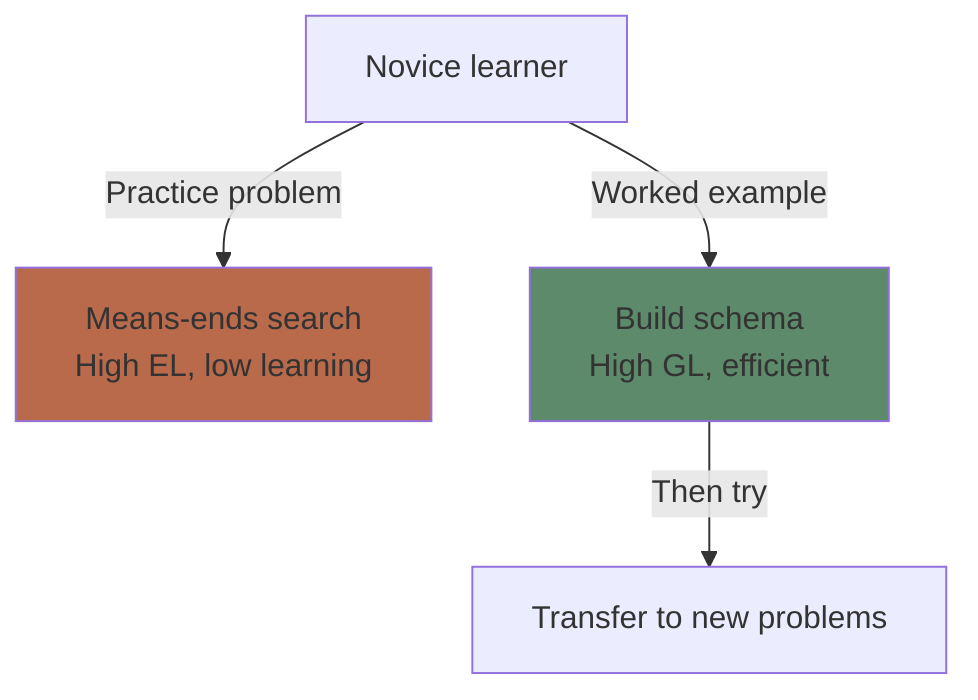

**Principle**: Replace some practice problems with fully worked solutions. Study the solution pattern → build schema → then attempt similar problems.

**Reversal**: As expertise grows, worked examples become redundant (expertise reversal effect). Experts benefit more from problem-solving.

> **Predict**: A beginner pianist studies a chord progression. Option A: explanation + 10 practice repetitions. Option B: explanation + 5 worked examples (annotated) + 5 practice repetitions. Which learns more?
>
> *Answer: Option B. Worked examples help build the schema before practice. Fewer repetitions with better schema = more efficient learning.*

> **Cloze**: "The {worked example} effect states that novices learn more from studying solved problems than from solving problems themselves."
>
> *Answer: worked example*

### Managing Cognitive Load in Practice

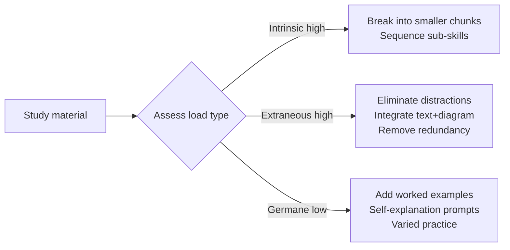

**Practical strategies:**
1. **Chunking**: Break complex topics into 2-4 sub-topics per session
2. **Fading worked examples**: Start with full worked example → partial (fill in blanks) → independent problem
3. **Self-explanation prompts**: "Why does this step work?" forces germane processing
4. **Pre-training**: Introduce key concepts/terms before diving into complex interactions

---

> **Think**: You must learn a complex 10-step procedure. Should you study all 10 steps at once or break into groups of 3?
>
> *Answer: Groups of 3. Intrinsic load is high (10 interacting elements). Sequencing reduces momentary intrinsic load, allowing schema construction for sub-routines before combining.*

---

## Why This Matters

Most "difficult" learning is actually poorly designed. CLT gives you a diagnostic lens:
- **Is the content genuinely complex?** → Sequence, pre-train, use worked examples
- **Is the presentation bad?** → Fix split attention, remove redundancy
- **Am I not processing deeply?** → Add self-explanation, variation

You can apply CLT as a learner AND as a content creator. It's the single most actionable theory for improving learning efficiency.

---

## Key Takeaways
- Total load must stay within WM capacity or learning fails
- Intrinsic load = content complexity (cannot reduce, can sequence)
- Extraneous load = poor design (must minimize)
- Germane load = schema building (must maximize)
- Split-attention: integrate related information spatially
- Redundancy: remove duplicate information across channels
- Worked examples: best for novices, fade as expertise grows
- Expertise reversal: what helps novices hurts experts

---

## Common Misconception

**Misconception**: "Making material harder (more text, more details, more complexity) produces better learning."

**Reality**: Adding unnecessary complexity increases extraneous load, reduces WM available for actual learning. The goal is **optimal difficulty** — challenging content (intrinsic load) presented clearly (low extraneous load) with active processing (high germane load).

**Correct framing**: More information ≠ more learning. Clear, integrated, focused material respects WM limits and produces better outcomes.

---

## Spot the Mistake

"A video lecture shows the professor's face in a corner box while slides with bullet points fill the screen. The professor reads each bullet aloud."

What's wrong?

*Answer: This hits two violations. (1) Redundancy: slides and narration say the same thing. (2) Split attention: face in corner adds visual noise. Better: use slides with diagrams (not text) while narration explains. Or use text slides with no narration (read silently).*

---

## Feynman Explain
(Explain three types of cognitive load to a child: the content difficulty (intrinsic), the messy worksheet (extraneous), and the brain power you put into understanding (germane).)

---

## Reframe
(Judge: when did a poorly designed tutorial kill your motivation? Could you diagnose which load type was the culprit? How would you redesign it?)

---

## Drill
Run: `learn.sh quiz learning-theories 2`

## Quiz: 02-cognitive-load-theory

<p class="quiz-question">Which type of cognitive load should instructional designers seek to minimize?</p>

<p class="quiz-difficulty">★☆☆</p>

<p class="quiz-option"><strong>A.</strong> Intrinsic load</p>

<p class="quiz-option"><strong>B.</strong> Extraneous load</p>

<p class="quiz-option"><strong>C.</strong> Germane load</p>

<p class="quiz-option"><strong>D.</strong> Total load</p>

<p class="quiz-answer"><strong>Answer:</strong> B</p>

<p class="quiz-explanation">Extraneous load is caused by poor presentation and serves no learning purpose. Minimize it.</p>

<hr/>

<p class="quiz-question">A textbook places a diagram on page 3 and its explanation on page 5. What cognitive load problem does this create?</p>

<p class="quiz-difficulty">★★☆</p>

<p class="quiz-option"><strong>A.</strong> Intrinsic overload</p>

<p class="quiz-option"><strong>B.</strong> Split-attention effect</p>

<p class="quiz-option"><strong>C.</strong> Redundancy effect</p>

<p class="quiz-option"><strong>D.</strong> Expertise reversal</p>

<p class="quiz-answer"><strong>Answer:</strong> B</p>

<p class="quiz-explanation">Split attention forces WM to hold diagram in memory while searching for explanation. Integrate them.</p>

<hr/>

<p class="quiz-question">Which load type is described as 'mental effort directed at building schemas and deep understanding'?</p>

<p class="quiz-difficulty">★☆☆</p>

<p class="quiz-option"><strong>A.</strong> Intrinsic load</p>

<p class="quiz-option"><strong>B.</strong> Extraneous load</p>

<p class="quiz-option"><strong>C.</strong> Germane load</p>

<p class="quiz-option"><strong>D.</strong> Cognitive load</p>

<p class="quiz-answer"><strong>Answer:</strong> C</p>

<p class="quiz-explanation">Germane load is the productive mental work of constructing and automating schemas.</p>

<hr/>

<p class="quiz-question">A beginner programmer is given a complex problem to solve without any examples. According to CLT, why is this ineffective?</p>

<p class="quiz-difficulty">★★☆</p>

<p class="quiz-option"><strong>A.</strong> The problem is too easy</p>

<p class="quiz-option"><strong>B.</strong> Means-ends search overloads WM with unproductive processing</p>

<p class="quiz-option"><strong>C.</strong> Germane load is too high</p>

<p class="quiz-option"><strong>D.</strong> Intrinsic load is too low</p>

<p class="quiz-answer"><strong>Answer:</strong> B</p>

<p class="quiz-explanation">Novices lack schemas. Problem-solving without guidance triggers means-ends search — high extraneous load, low learning. Worked examples build schemas first.</p>

<hr/>

<p class="quiz-question">A training video shows an animation with identical on-screen text and narration. This violates which principle?</p>

<p class="quiz-difficulty">★★☆</p>

<p class="quiz-option"><strong>A.</strong> Split-attention</p>

<p class="quiz-option"><strong>B.</strong> Worked example</p>

<p class="quiz-option"><strong>C.</strong> Redundancy</p>

<p class="quiz-option"><strong>D.</strong> Expertise reversal</p>

<p class="quiz-answer"><strong>Answer:</strong> C</p>

<p class="quiz-explanation">Redundancy effect: presenting the same information through two channels forces WM to process duplicate input.</p>

<hr/>

<p class="quiz-question">An experienced data scientist is given a worked example of a basic regression. Why might this hurt more than help?</p>

<p class="quiz-difficulty">★★★</p>

<p class="quiz-option"><strong>A.</strong> Intrinsic load is too high</p>

<p class="quiz-option"><strong>B.</strong> Expertise reversal effect — worked examples become redundant for experts</p>

<p class="quiz-option"><strong>C.</strong> Extraneous load is too low</p>

<p class="quiz-option"><strong>D.</strong> Germane load is excessive</p>

<p class="quiz-answer"><strong>Answer:</strong> B</p>

<p class="quiz-explanation">As expertise grows, worked examples become unnecessary and even interfere. Experts benefit from problem-solving.</p>

<hr/>

<p class="quiz-question">What is the correct way to reduce intrinsic cognitive load?</p>

<p class="quiz-difficulty">★★☆</p>

<p class="quiz-option"><strong>A.</strong> Remove content to simplify</p>

<p class="quiz-option"><strong>B.</strong> Sequence content into smaller sub-skills</p>

<p class="quiz-option"><strong>C.</strong> Add more worked examples</p>

<p class="quiz-option"><strong>D.</strong> Use larger font size</p>

<p class="quiz-answer"><strong>Answer:</strong> B</p>

<p class="quiz-explanation">Intrinsic load cannot be reduced without removing content, but it can be sequenced — break complex material into smaller, learnable chunks.</p>

<hr/>

<p class="quiz-question">Which study strategy MOST directly increases germane load?</p>

<p class="quiz-difficulty">★★☆</p>

<p class="quiz-option"><strong>A.</strong> Re-reading a textbook chapter</p>

<p class="quiz-option"><strong>B.</strong> Listening to a lecture while doodling</p>

<p class="quiz-option"><strong>C.</strong> Self-explaining why each step in a solution works</p>

<p class="quiz-option"><strong>D.</strong> Highlighting key sentences</p>

<p class="quiz-answer"><strong>Answer:</strong> C</p>

<p class="quiz-explanation">Self-explanation forces deep processing and schema construction — the essence of germane load.</p>

<hr/>

<p class="quiz-question">A calculus textbook shows fully worked solutions for the first 5 problems, partially worked for the next 5, and unsolved for the last 5. This technique is called:</p>

<p class="quiz-difficulty">★★★</p>

<p class="quiz-option"><strong>A.</strong> Blocked practice</p>

<p class="quiz-option"><strong>B.</strong> Fading worked examples</p>

<p class="quiz-option"><strong>C.</strong> Interleaving</p>

<p class="quiz-option"><strong>D.</strong> Distributed practice</p>

<p class="quiz-answer"><strong>Answer:</strong> B</p>

<p class="quiz-explanation">Fading gradually removes scaffolding: full example → partial → independent. Transitions from high support to autonomy.</p>

<hr/>

<p class="quiz-question">What must be true for learning to occur according to Cognitive Load Theory?</p>

<p class="quiz-difficulty">★☆☆</p>

<p class="quiz-option"><strong>A.</strong> Total load equals intrinsic load</p>

<p class="quiz-option"><strong>B.</strong> Extraneous load exceeds intrinsic load</p>

<p class="quiz-option"><strong>C.</strong> Total load stays within working memory capacity</p>

<p class="quiz-option"><strong>D.</strong> Germane load is zero</p>

<p class="quiz-answer"><strong>Answer:</strong> C</p>

<p class="quiz-explanation">If total load (intrinsic + extraneous + germane) exceeds WM capacity, learning fails regardless of effort.</p>


---

# Module 3: Memory Systems — Encoding, Storage, Retrieval

Est. study time: 2h
Language: en
Description: How information moves from experience to durable memory — and how to retrieve it when needed.

## Learning Objectives
- Describe the three phases of memory: encoding, storage, retrieval
- Apply encoding specificity principle to design better study contexts
- Distinguish recall, recognition, and relearning as retrieval measures
- Use elaborative encoding to strengthen initial learning

---

## Real-World Example

You meet someone at a conference. They tell you their name. Five minutes later, you've forgotten it. You meet again a year later at the same conference — you remember their face but not their name.

Three different memory failures happened: encoding (didn't register), storage (decayed), and retrieval (can't access despite storage).

> **Think**: Which failure is most fixable with better study habits? Which is least fixable?
>
> *Answer: Encoding is most fixable (pay attention, elaborate). Storage decay is fixable via repetition/consolidation. Retrieval failure is common even with good storage — need retrieval practice.*

---

## Core Content

### The Three Phases

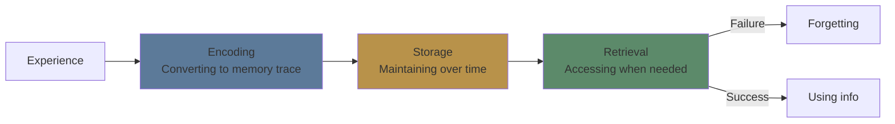

**Encoding** — transforming sensory input into a memory representation. Quality of encoding determines everything downstream.

**Storage** — maintaining the memory trace over time. Affected by consolidation (especially during sleep). Storage strength is persistent.

**Retrieval** — accessing stored information. Depends on cues, context, and practice. Retrieval failure ≠ memory loss.

> **Think**: You study for a test and blank during the exam. After the test, you look up the answer and it comes back. Which phase failed?
>
> *Answer: Retrieval. The info was stored (you recognized it after seeing the answer), but you couldn't access it under the test conditions.*

### Encoding: Quality Matters More Than Quantity

Not all encoding is equal. The depth and richness of encoding predicts later retrieval.

**Shallow encoding**: Repeating a phone number in your head (maintenance rehearsal)
**Deep encoding**: Connecting the number to patterns you know (elaborative rehearsal)

**Factors that strengthen encoding:**
- **Attention**: full focus beats divided
- **Elaboration**: connect to existing knowledge
- **Organization**: structure the material meaningfully
- **Visual imagery**: create mental pictures
- **Self-reference**: relate to your own experience

> **Cloze**: "Simply repeating information in working memory ({maintenance rehearsal}) produces weaker encoding than connecting it to existing knowledge ({elaborative rehearsal})."
>
> *Answer: maintenance rehearsal, elaborative rehearsal*

> **Think**: Which encodes better: reading a list of 20 items 5 times, or reading them once and creating a story linking each item?
>
> *Answer: The story. It forces elaboration, organization, and visual imagery — all deep encoding processes.*

### Encoding Specificity Principle (Tulving 1983)

Retrieval is most effective when the context at retrieval matches the context at encoding. The memory trace includes the information AND its context.

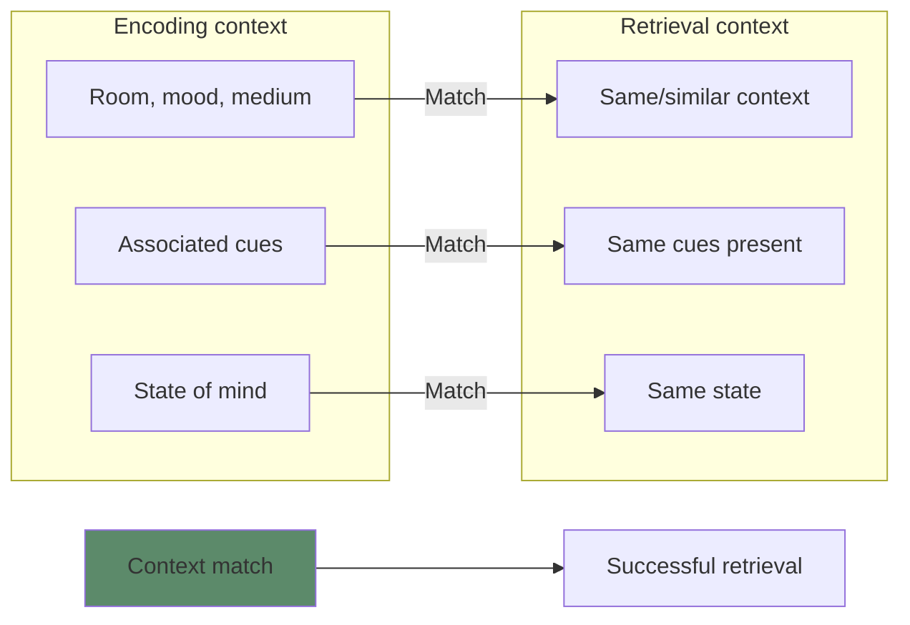

**Examples:**
- **Context-dependent memory**: divers recall more when tested underwater vs on land (Godden & Baddeley 1975)
- **State-dependent memory**: information learned while happy is better recalled when happy
- **Mood-congruent memory**: current mood primes recall of events with similar emotional tone

**Implication**: Vary your study contexts. Don't always study in the same room, same chair, same time of day. You want retrieval to work anywhere.

> **Predict**: You study vocabulary words on your phone in bed. On the test, you're at a desk under bright lights. What happens?
>
> *Answer: Encoding specificity mismatch. The bed/phone context cues are absent at test. Retrieval is harder. Solution: study in varied contexts, including test-like conditions.*

> **Cloze**: "The {encoding specificity} principle states that retrieval is best when context at test matches context at study."
>
> *Answer: encoding specificity*

### Storage: Consolidation Takes Time

Memory doesn't solidify instantly. **Consolidation** is the process of stabilizing a memory trace after initial encoding.

**Key facts:**
- Synaptic consolidation: occurs within hours
- Systems consolidation: occurs over weeks to years (hippocampus → neocortex)
- Sleep plays a critical role (more in Module 14)
- Emotionally arousing events consolidate faster (amygdala modulation)

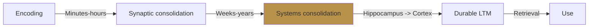

**Implication**: Spaced practice works because each repetition triggers reconsolidation, strengthening the trace. Massed practice (cramming) triggers initial consolidation but no reinforcement.

> **Think**: Why does cramming the night before produce brittle memories that fade quickly?
>
> *Answer: One consolidation cycle = weak trace. Spaced repetitions trigger reconsolidation each time, progressively strengthening storage.*

### Retrieval: The Real Test of Learning

Three ways to measure retrieval — from weakest to strongest signal:

| Measure         | What it means                 | Example                         |
| --------------- | ----------------------------- | ------------------------------- |
| **Recall**      | Retrieve without cues         | Essay question, blank page      |
| **Recognition** | Identify correct from options | Multiple choice                 |
| **Relearning**  | How fast you re-learn         | Same material, less time needed |

**Retrieval failure** is common. The information is stored but inaccessible. Common causes:
- **Interference**: similar memories compete (proactive/retroactive)
- **Decay**: retrieval strength declines without use
- **Cue mismatch**: wrong context triggers wrong memory

> **Spot the Mistake**: "I failed the oral exam but passed the written one. I clearly don't know the material."
>
> What's wrong?
>
> *Answer: Different retrieval modes test different access paths. Oral requires rapid recall under social pressure. Written allows more time and different cues. You may have storage strength but context-dependent retrieval failure.*

**Retrieval practice** (Module 7) directly trains the retrieval mechanism — it's not just assessment, it's a learning tool.

> **Predict**: Two students study the same material. Student A re-reads the chapter 5 times. Student B reads it once, then quizzes themselves 5 times. Who retrieves better a week later?
>
> *Answer: Student B. Retrieval practice strengthens the retrieval pathway itself. Re-reading improves encoding but doesn't train retrieval.*

---

## Why This Matters

Memory is not a tape recorder. It's constructed at encoding, consolidated over time, and reconstructed at retrieval. Each phase can be optimized:

- **Encoding**: pay attention, elaborate, organize, visualize
- **Storage**: space repetitions, sleep on it, avoid interference
- **Retrieval**: practice retrieval, vary context, use multiple formats

Most study strategies fail because they optimize only one phase (usually encoding via re-reading) while neglecting storage and retrieval.

---

## Key Takeaways
- Memory has three phases: encoding, storage, retrieval — optimize all three
- Encoding quality determines storage durability
- Encoding specificity: match context between study and test
- Storage requires consolidation over time — sleep is critical
- Retrieval failure ≠ memory loss — improve cues and practice
- Recognition (multiple choice) is easier than recall (blank page) — test yourself with recall

---

## Common Misconception

**Misconception**: "If I can recognize the answer when I see it, I know it well enough."

**Reality**: Recognition is the weakest retrieval measure. It doesn't predict recall. You may recognize a face but fail to recall a name under pressure. Self-test with recall (no cues) for strong learning.

**Correct framing**: True mastery means you can recall without cues. Test yourself the hardest way — blank page, no options.

---

## Spot the Mistake

"You should always study in the same quiet room. Consistency builds good habits."

What's wrong?

*Answer: Encoding specificity means you become dependent on that room's cues. Take the test in a different room and retrieval suffers. Vary study locations to build context-independent memories.*

---

## Feynman Explain
(Explain encoding, storage, and retrieval — three phases of memory. Use a library analogy: shelving a book (encoding), keeping it on the shelf (storage), finding it later (retrieval).)

---

## Reframe
(Judge: when did you fail to retrieve something you definitely knew? Was it encoding quality, insufficient consolidation, or retrieval context mismatch? What would you change?)

---

## Drill
Run: `learn.sh quiz learning-theories 3`

## Quiz: 03-memory-systems

<p class="quiz-question">What are the three phases of memory?</p>

<p class="quiz-difficulty">★☆☆</p>

<p class="quiz-option"><strong>A.</strong> Input, processing, output</p>

<p class="quiz-option"><strong>B.</strong> Encoding, storage, retrieval</p>

<p class="quiz-option"><strong>C.</strong> Attention, rehearsal, recall</p>

<p class="quiz-option"><strong>D.</strong> Sensory, working, long-term</p>

<p class="quiz-answer"><strong>Answer:</strong> B</p>

<p class="quiz-explanation">Memory operates in three sequential phases: encoding (input), storage (maintenance), and retrieval (access).</p>

<hr/>

<p class="quiz-question">The encoding specificity principle states that:</p>

<p class="quiz-difficulty">★☆☆</p>

<p class="quiz-option"><strong>A.</strong> More encoding always equals better memory</p>

<p class="quiz-option"><strong>B.</strong> Retrieval is best when context matches between study and test</p>

<p class="quiz-option"><strong>C.</strong> Encoding happens only during sleep</p>

<p class="quiz-option"><strong>D.</strong> All encoding is equally effective</p>

<p class="quiz-answer"><strong>Answer:</strong> B</p>

<p class="quiz-explanation">Tulving's principle: the memory trace includes context cues. Matching those cues at retrieval improves access.</p>

<hr/>

<p class="quiz-question">A student studies vocabulary in the library, then takes the test in a noisy cafeteria. They perform worse than expected. Most likely cause:</p>

<p class="quiz-difficulty">★★☆</p>

<p class="quiz-option"><strong>A.</strong> Interference from other students</p>

<p class="quiz-option"><strong>B.</strong> Context-dependent memory failure — mismatch between study and test environments</p>

<p class="quiz-option"><strong>C.</strong> The material was too difficult</p>

<p class="quiz-option"><strong>D.</strong> Retroactive interference</p>

<p class="quiz-answer"><strong>Answer:</strong> B</p>

<p class="quiz-explanation">Encoding specificity predicts context mismatch hurts retrieval. Library cues absent in cafeteria.</p>

<hr/>

<p class="quiz-question">Which retrieval measure provides the STRONGEST evidence that learning has occurred?</p>

<p class="quiz-difficulty">★★☆</p>

<p class="quiz-option"><strong>A.</strong> Recognition (multiple choice)</p>

<p class="quiz-option"><strong>B.</strong> Recall (essay/blank page)</p>

<p class="quiz-option"><strong>C.</strong> Relearning (faster second time)</p>

<p class="quiz-option"><strong>D.</strong> Familiarity rating</p>

<p class="quiz-answer"><strong>Answer:</strong> B</p>

<p class="quiz-explanation">Recall requires retrieval without cues — hardest test of memory. Recognition is easier (cues present).</p>

<hr/>

<p class="quiz-question">Repeating a phone number in your head until you dial it is an example of:</p>

<p class="quiz-difficulty">★☆☆</p>

<p class="quiz-option"><strong>A.</strong> Elaborative rehearsal</p>

<p class="quiz-option"><strong>B.</strong> Maintenance rehearsal</p>

<p class="quiz-option"><strong>C.</strong> Deep encoding</p>

<p class="quiz-option"><strong>D.</strong> Systems consolidation</p>

<p class="quiz-answer"><strong>Answer:</strong> B</p>

<p class="quiz-explanation">Maintenance rehearsal keeps info in WM without deeper encoding. It produces weak, brittle memories.</p>

<hr/>

<p class="quiz-question">Which study strategy produces the DEEPEST encoding?</p>

<p class="quiz-difficulty">★★☆</p>

<p class="quiz-option"><strong>A.</strong> Re-reading a chapter</p>

<p class="quiz-option"><strong>B.</strong> Highlighting key sentences</p>

<p class="quiz-option"><strong>C.</strong> Explaining how new concepts relate to your own experience</p>

<p class="quiz-option"><strong>D.</strong> Listening to a lecture recording</p>

<p class="quiz-answer"><strong>Answer:</strong> C</p>

<p class="quiz-explanation">Self-reference and elaboration force deep processing — connecting new info to existing knowledge structures.</p>

<hr/>

<p class="quiz-question">A student re-learns Spanish vocabulary in 2 hours that originally took 10 hours. This demonstrates:</p>

<p class="quiz-difficulty">★★☆</p>

<p class="quiz-option"><strong>A.</strong> Poor initial encoding</p>

<p class="quiz-option"><strong>B.</strong> Savings from relearning — storage strength persisted</p>

<p class="quiz-option"><strong>C.</strong> Encoding specificity</p>

<p class="quiz-option"><strong>D.</strong> Interference</p>

<p class="quiz-answer"><strong>Answer:</strong> B</p>

<p class="quiz-explanation">Faster relearning indicates storage strength survived even though retrieval strength was low.</p>

<hr/>

<p class="quiz-question">You study while happy. You take the test while sad. Your memory is worse than expected. This is:</p>

<p class="quiz-difficulty">★★☆</p>

<p class="quiz-option"><strong>A.</strong> Decay</p>

<p class="quiz-option"><strong>B.</strong> Interference</p>

<p class="quiz-option"><strong>C.</strong> State-dependent memory</p>

<p class="quiz-option"><strong>D.</strong> Retroactive interference</p>

<p class="quiz-answer"><strong>Answer:</strong> C</p>

<p class="quiz-explanation">State-dependent memory: internal state (mood) is part of the encoding context. Mismatch at retrieval impairs access.</p>

<hr/>

<p class="quiz-question">Which of the following would BEST strengthen encoding of a new concept?</p>

<p class="quiz-difficulty">★★★</p>

<p class="quiz-option"><strong>A.</strong> Writing it 10 times</p>

<p class="quiz-option"><strong>B.</strong> Reading it aloud 5 times</p>

<p class="quiz-option"><strong>C.</strong> Explaining it to someone and giving an example from your life</p>

<p class="quiz-option"><strong>D.</strong> Highlighting the definition in yellow</p>

<p class="quiz-answer"><strong>Answer:</strong> C</p>

<p class="quiz-explanation">Explaining + self-referencing forces elaboration and organization — deep processing.</p>

<hr/>

<p class="quiz-question">Consolidation of memories primarily occurs during:</p>

<p class="quiz-difficulty">★☆☆</p>

<p class="quiz-option"><strong>A.</strong> Studying</p>

<p class="quiz-option"><strong>B.</strong> Sleep</p>

<p class="quiz-option"><strong>C.</strong> Exercise</p>

<p class="quiz-option"><strong>D.</strong> Eating</p>

<p class="quiz-answer"><strong>Answer:</strong> B</p>

<p class="quiz-explanation">Sleep plays a critical role in consolidating memories — transferring from hippocampus to neocortex for long-term storage.</p>


---

# Module 4: The Forgetting Curve & Spacing Effect

Est. study time: 2h
Language: en
Description: Why forgetting is predictable — and how to time your reviews for maximum retention with minimum effort.

## Learning Objectives
- Describe the shape and cause of the forgetting curve
- Explain why spaced practice beats massed practice
- Apply expanding and fixed-interval review schedules
- Design a spaced repetition schedule for any topic

---

## Real-World Example

You attend a 2-hour workshop. You take notes. You feel like you learned a lot. One week later, you remember maybe 20%. One month later, almost nothing.

This isn't a personal failing. It's a mathematical certainty — the **forgetting curve** is as predictable as gravity.

> **Think**: If you reviewed the material for 5 minutes the next day, then 5 minutes the next week, then 5 minutes the next month, would you still forget almost everything?
>
> *Answer: No. Strategic reviews interrupt the forgetting curve and flatten it. The total time invested is ~15 minutes — less than 10% of the workshop.*

---

## Core Content

### The Forgetting Curve

Ebbinghaus (1885) memorized nonsense syllables and tested himself at various delays. The result:

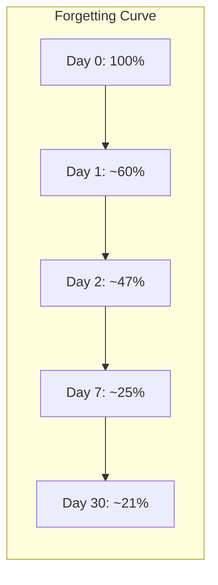

The curve is **logarithmic**: most forgetting happens within hours, then slows. The steepness depends on encoding quality.

**Key variables that affect forgetting rate:**
- **Encoding depth**: meaningful connections = slower forgetting
- **Prior knowledge**: more hooks = slower forgetting
- **Sleep**: consolidation after encoding = slower forgetting
- **Interference**: similar material learned after = faster forgetting

> **Cloze**: "The forgetting curve is {logarithmic} — most forgetting occurs {immediately after} learning, then the rate {decelerates}."
>
> *Answer: logarithmic, immediately after, decelerates*

> **Think**: Why do you forget more in the first hour than in the next week?
>
> *Answer: Initial memory trace is fragile. Without consolidation (sleep + time), it decays rapidly. Surviving traces are stronger and decay more slowly.*

### The Spacing Effect

Multiple study sessions spread over time produce better long-term retention than the same total time crammed into one session.

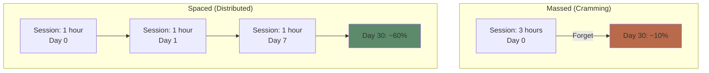

Same total time (3 hours). Different schedule. Vastly different outcome.

**Why spacing works:**
1. **Forgetting during intervals** forces harder retrieval → deeper re-encoding
2. **Context variation** across sessions → context-independent memory
3. **Consolidation time** — each session triggers reconsolidation

> **Predict**: Student A studies 2 hours daily for 5 days. Student B studies 10 hours on the day before the exam. Same total time. Who remembers more a week after the test?
>
> *Answer: Student A. Spaced practice produces durable storage. Student B's cramming produces temporary retrieval strength that collapses quickly.*

### Optimal Review Timing

When should you review? The **optimal gap** depends on when you'll next need the information.

**General principle**: Review at increasing intervals. Research suggests:

| Study type          | Typical interval                |
| ------------------- | ------------------------------- |
| First review        | 1-2 days after initial learning |
| Second review       | 7-10 days                       |
| Third review        | 16-30 days                      |
| Ongoing maintenance | 1-6 months                      |

**Formal systems:**
- **Leitner system**: physical flashcards sorted by box (review box 1 daily, box 2 every 2 days, box 3 weekly...)
- **SM-2 (SuperMemo)**: algorithm-based intervals
- **FSRS-5**: modern algorithm (used by Anki), adapts per card based on performance

> **Cloze**: "The {spacing effect} is the finding that {distributed} practice produces better long-term retention than {massed} practice."
>
> *Answer: spacing effect, distributed, massed*

### Expanding vs Fixed Intervals

Which interval pattern works better?

| Pattern       | Sequence                 | Pro                 |
| ------------- | ------------------------ | ------------------- |
| **Expanding** | 1d → 3d → 7d → 21d → 2mo | Intuitive, gradual  |
| **Fixed**     | 7d → 7d → 7d → 7d        | Simpler to schedule |

Research (Cepeda et al. 2006): expanding intervals may have slight edge, but the key factor is **spacing exists at all**, not the exact pattern. Fixed intervals at the right gap perform nearly as well.

**Pragmatic advice**: Use expanding intervals (most SRS systems do this). But don't over-optimize — the biggest win is moving from massed to any spaced schedule.

> **Think**: If spaced = good, is more spacing always better? What happens if you wait 1 year before reviewing?
>
> *Answer: Too-long intervals → complete retrieval failure → no learning benefit. The sweet spot is the longest interval that still allows partial retrieval (the "testable" moment).*

### The Sandvik Effect

A counterintuitive finding: **studying before sleep** produces better retention than studying in the morning (tested next day). Reason: sleep consolidates recent memories without interference from waking activity.

**Practical tip**: Learn new material in evening → sleep → review next morning. This leverages the forgetting curve and sleep consolidation synergistically.

> **Spot the Mistake**: "I should review immediately after learning to catch the information before I forget it."
>
> What's wrong?
>
> *Answer: Immediate review is too easy — it bypasses retrieval effort. The gap should be long enough that retrieval requires effort but not so long that it fails entirely. The desirable difficulty strengthens the memory.*

---

## Why This Matters

The forgetting curve is not destiny. Once you understand it:
- You stop feeling guilty about forgetting (it's normal)
- You design review schedules instead of cramming
- You get more retention per unit of study time
- You build durable knowledge instead of test-passing knowledge

Spaced repetition is the single highest-ROI learning strategy in cognitive science.

---

## Key Takeaways
- Forgetting follows a predictable logarithmic curve
- Spaced practice produces 2-3x better retention than massed practice
- Review at increasing intervals (1 day → 1 week → 1 month)
- The optimal gap is the longest one where retrieval still succeeds
- Any spaced schedule beats cramming — don't over-optimize
- Sleep soon after learning enhances consolidation

---

## Common Misconception

**Misconception**: "If I study something every day, I'll remember it forever."

**Reality**: Daily study of the same material is overkill after initial encoding. Once a memory is consolidated, longer intervals maintain it. Daily review wastes time that could be spent on new material.

**Correct framing**: Space reviews to the longest interval that still maintains retrieval. Trust the forgetting curve — you don't need to reset it to zero every time.

---

## Spot the Mistake

"I downloaded Anki and set all cards to 1-minute intervals. I drill them 50 times until perfect."

What's wrong?

*Answer: 1-minute intervals bypass the spacing effect — retrieval is too easy, no desirable difficulty. You're doing massed practice with extra steps. Set meaningful gaps (1 day+) and trust the algorithm.*

---

## Feynman Explain
(Explain the forgetting curve: memory drops fast then slows. If you review at the right moments, you flatten the curve. Like watering a plant — not every day, but when it needs it.)

---

## Reframe
(Judge: think of something you learned years ago that you still remember vs something you crammed and forgot. What made the difference in schedule? How would you redesign your current study routine?)

---

## Drill
Run: `learn.sh quiz learning-theories 4`

## Quiz: 04-forgetting-curve

<p class="quiz-question">The forgetting curve shows that memory loss is:</p>

<p class="quiz-difficulty">★☆☆</p>

<p class="quiz-option"><strong>A.</strong> Linear — constant rate of forgetting</p>

<p class="quiz-option"><strong>B.</strong> Logarithmic — rapid early loss, then slows</p>

<p class="quiz-option"><strong>C.</strong> Exponential — accelerates over time</p>

<p class="quiz-option"><strong>D.</strong> Random — unpredictable</p>

<p class="quiz-answer"><strong>Answer:</strong> B</p>

<p class="quiz-explanation">Ebbinghaus found rapid forgetting within hours, then deceleration. The curve is logarithmic.</p>

<hr/>

<p class="quiz-question">What is the spacing effect?</p>

<p class="quiz-difficulty">★☆☆</p>

<p class="quiz-option"><strong>A.</strong> Studying in larger chunks improves retention</p>

<p class="quiz-option"><strong>B.</strong> Distributed practice produces better long-term retention than massed practice</p>

<p class="quiz-option"><strong>C.</strong> Reviewing immediately after learning is most effective</p>

<p class="quiz-option"><strong>D.</strong> Spacing out topics within a session helps</p>

<p class="quiz-answer"><strong>Answer:</strong> B</p>

<p class="quiz-explanation">Spread study sessions over time (distributed) beats same total time in one session (massed).</p>

<hr/>

<p class="quiz-question">Student A studies 5 hours on Saturday. Student B studies 1 hour/day Mon-Fri. Who remembers more 3 weeks later?</p>

<p class="quiz-difficulty">★★☆</p>

<p class="quiz-option"><strong>A.</strong> Student A — more concentrated effort</p>

<p class="quiz-option"><strong>B.</strong> Student B — spaced practice builds durable memory</p>

<p class="quiz-option"><strong>C.</strong> Both equally — same total time</p>

<p class="quiz-option"><strong>D.</strong> Neither — both forgot by then</p>

<p class="quiz-answer"><strong>Answer:</strong> B</p>

<p class="quiz-explanation">Same total time, different schedule. Spaced practice triggers repeated consolidation cycles.</p>

<hr/>

<p class="quiz-question">Why does reviewing immediately after learning produce weaker long-term retention than reviewing after a delay?</p>

<p class="quiz-difficulty">★★☆</p>

<p class="quiz-option"><strong>A.</strong> Immediate review is boring</p>

<p class="quiz-option"><strong>B.</strong> Retrieval is too easy — no desirable difficulty</p>

<p class="quiz-option"><strong>C.</strong> The brain ignores close repetitions</p>

<p class="quiz-option"><strong>D.</strong> Fatigue from studying</p>

<p class="quiz-answer"><strong>Answer:</strong> B</p>

<p class="quiz-explanation">Immediate retrieval requires minimal effort. A gap forces harder retrieval, which strengthens the memory trace.</p>

<hr/>

<p class="quiz-question">Ebbinghaus used what kind of material in his memory experiments?</p>

<p class="quiz-difficulty">★☆☆</p>

<p class="quiz-option"><strong>A.</strong> Poetry</p>

<p class="quiz-option"><strong>B.</strong> Nonsense syllables</p>

<p class="quiz-option"><strong>C.</strong> Numbers</p>

<p class="quiz-option"><strong>D.</strong> Faces</p>

<p class="quiz-answer"><strong>Answer:</strong> B</p>

<p class="quiz-explanation">He used nonsense syllables (e.g., ZOK, QAP) to eliminate prior knowledge effects and measure pure memory.</p>

<hr/>

<p class="quiz-question">A student reviews vocabulary on Day 1, 3, 7, 21. This schedule is:</p>

<p class="quiz-difficulty">★★☆</p>

<p class="quiz-option"><strong>A.</strong> Fixed interval</p>

<p class="quiz-option"><strong>B.</strong> Expanding interval</p>

<p class="quiz-option"><strong>C.</strong> Massed practice</p>

<p class="quiz-option"><strong>D.</strong> Interleaved</p>

<p class="quiz-answer"><strong>Answer:</strong> B</p>

<p class="quiz-explanation">Gaps grow: 1 → 2 → 4 → 14 days. This is an expanding interval schedule.</p>

<hr/>

<p class="quiz-question">What is the primary benefit of studying new material in the evening before sleep?</p>

<p class="quiz-difficulty">★★☆</p>

<p class="quiz-option"><strong>A.</strong> Evening is when you're most alert</p>

<p class="quiz-option"><strong>B.</strong> Sleep consolidates recent memories without interference from waking activity</p>

<p class="quiz-option"><strong>C.</strong> The forgetting curve pauses during sleep</p>

<p class="quiz-option"><strong>D.</strong> There is no benefit — morning study is better</p>

<p class="quiz-answer"><strong>Answer:</strong> B</p>

<p class="quiz-explanation">Sleep consolidates recent traces. No waking interference between encoding and consolidation = stronger memory.</p>

<hr/>

<p class="quiz-question">Which factor does NOT affect the steepness of the forgetting curve?</p>

<p class="quiz-difficulty">★★★</p>

<p class="quiz-option"><strong>A.</strong> Encoding depth</p>

<p class="quiz-option"><strong>B.</strong> Prior knowledge</p>

<p class="quiz-option"><strong>C.</strong> Intelligence</p>

<p class="quiz-option"><strong>D.</strong> Sleep after learning</p>

<p class="quiz-answer"><strong>Answer:</strong> C</p>

<p class="quiz-explanation">Encoding depth, prior knowledge, and sleep all affect forgetting rate. Intelligence is not a direct factor.</p>

<hr/>

<p class="quiz-question">A student has a test in 7 days. Which schedule produces the best retention?</p>

<p class="quiz-difficulty">★★★</p>

<p class="quiz-option"><strong>A.</strong> Study 7 hours on day 6</p>

<p class="quiz-option"><strong>B.</strong> Study 1 hour each on days 1, 3, and 6</p>

<p class="quiz-option"><strong>C.</strong> Study 3.5 hours on day 1 and 3.5 on day 6</p>

<p class="quiz-option"><strong>D.</strong> Study 1 hour per day for all 7 days</p>

<p class="quiz-answer"><strong>Answer:</strong> B</p>

<p class="quiz-explanation">Spaced across the interval with gaps. Option D (daily) is overkill for a 7-day window. Option B optimizes spacing with meaningful gaps.</p>

<hr/>

<p class="quiz-question">The key mechanism explaining why spacing works includes all EXCEPT:</p>

<p class="quiz-difficulty">★★★</p>

<p class="quiz-option"><strong>A.</strong> Forgetting during intervals forces harder retrieval on re-study</p>

<p class="quiz-option"><strong>B.</strong> Context variation across sessions builds context-independent memory</p>

<p class="quiz-option"><strong>C.</strong> Massed practice triggers neural fatigue</p>

<p class="quiz-option"><strong>D.</strong> Reconsolidation after each session strengthens the trace</p>

<p class="quiz-answer"><strong>Answer:</strong> C</p>

<p class="quiz-explanation">Massed practice fatigue is not the mechanism. Spacing works via effortful retrieval, context variation, and reconsolidation.</p>


---

# Module 5: Deep Processing & Elaboration

Est. study time: 2h
Language: en
Description: Why connecting new information to what you already know is the most powerful encoding strategy.

## Learning Objectives
- Distinguish shallow, medium, and deep levels of processing
- Apply elaborative interrogation ("why is this true?") to any topic
- Use self-explanation to deepen understanding
- Organize knowledge to improve retrieval

---

## Real-World Example

You read a book chapter. Two hours later, you can summarize the main idea but not the supporting details. Your friend read the same chapter and can explain how each point connects to examples from their work.

Same input, different **processing depth**. Your friend was asking "why does this matter?" and "how does this connect?" while you were reading passively.

> **Think**: What's the difference between reading with a highlighter vs reading while constantly asking "why?"
>
> *Answer: Highlighting is shallow encoding (visual marking). Asking "why" forces elaboration — connecting new info to existing knowledge, which creates more retrieval pathways.*

---

## Core Content

### Levels of Processing (Craik & Lockhart 1972)

Processing depth determines retention — not time spent or intention to learn.

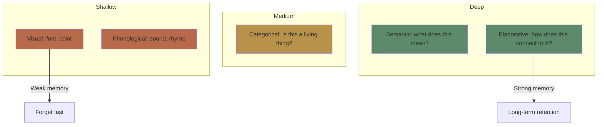

**Shallow processing**: Appearance (visual), sound (phonological). Produces fragile memories.

**Medium processing**: Categorization, basic meaning. Better than shallow.

**Deep processing**: Meaning, connections, implications. Produces durable memories.

**Key insight**: You can't force deep processing by "trying harder." You must engage in specific mental operations that create rich, connected representations.

> **Think**: Which of these encodes better — reading a definition 5 times or explaining it in your own words once?
>
> *Answer: Explaining once. Reading is shallow (visual/phonological repetition). Explaining forces semantic elaboration and organization.*

> **Cloze**: "The {levels of processing} framework states that memory durability depends on {depth of encoding}, not time spent or intention to learn."
>
> *Answer: levels of processing, depth of encoding*

### Elaborative Interrogation

The single most effective deep-processing technique: **ask "why is this true?"**

| Shallow study                        | Deep study                                                                              |
| ------------------------------------ | --------------------------------------------------------------------------------------- |
| "The Byzantine Empire fell in 1453." | "Why did the Byzantine Empire fall in 1453? What factors converged?"                    |
| "Cognitive load has three types."    | "Why does cognitive load theory distinguish three types? What problem does each solve?" |

Elaborative interrogation forces you to:
1. Activate prior knowledge (search for explanations)
2. Connect new info to existing schema
3. Identify gaps in your understanding
4. Generate inferences beyond the text

**Evidence**: Pressley et al. (1987) — students who asked "why" questions while reading remembered 50-100% more than control groups.

> **Predict**: You're studying the concept "desirable difficulties." You ask "why are desirable difficulties desirable?" What does this force your brain to do?
>
> *Answer: You must search for the causal mechanism (they create retrieval effort, which strengthens memory). This activates prior knowledge about memory and forces integration.*

> **Cloze**: "Elaborative interrogation — asking '{why}' a fact is true — is a powerful {deep encoding} technique because it forces you to {connect new information to existing knowledge}."
>
> *Answer: why, deep encoding, connect new information to existing knowledge*

### Self-Explanation

While elaborative interrogation focuses on the material, **self-explanation** focuses on your own understanding process.

**Self-explanation prompts:**
- "What does this mean in my own words?"
- "How does this relate to what I already know?"
- "Can I give a new example of this?"
- "Why does this step follow from the previous one?"

**Particularly effective for**: procedural skills, math, programming, problem-solving.

> **Think**: You're learning a math proof. Which is more effective: studying the proof 3 times, or studying it once then explaining each step to yourself?
>
> *Answer: Self-explaining each step. It reveals gaps in understanding that re-reading hides. The illusion of fluency (Module 10) makes re-reading feel productive when it isn't.*

### Organization & Structure

Organized knowledge is retrieved faster and more reliably than disorganized knowledge.

**Hierarchical organization**: Superordinate → subordinate categories
**Chunking**: Group related items into meaningful units
**Schema**: Mental framework that organizes related concepts

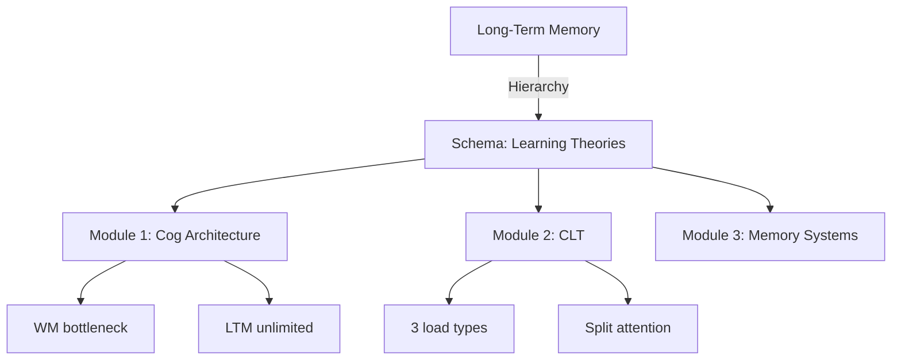

**Study strategy**: Create knowledge maps, hierarchies, and outlines. The act of organizing is itself a deep encoding activity.

> **Spot the Mistake**: "I just need to memorize these 50 facts. I'll use flashcards with the fact on one side and the answer on the other."
>
> What's wrong?
>
> *Answer: Isolated facts lack organization and connections. They form separate, fragile traces. Organizing facts into categories, hierarchies, and causal chains creates a rich network — retrieval of one fact activates others.*

### Practical Deep Processing Routine

For any concept you want to learn deeply:

1. **Read** the material once for basic understanding
2. **Elaborative interrogation**: ask "why is this true?" for each claim
3. **Self-explanation**: put each section in your own words
4. **Connect**: link to concepts from other modules (this course builds on itself!)
5. **Organize**: draw a concept map or outline

This routine takes about the same time as re-reading — but produces 2-3x better retention.

> **Think**: Why do you remember vivid stories better than lists of facts?
>
> *Answer: Stories trigger all deep processing automatically — causal links (why?), connections to experience, emotional engagement, and temporal organization. Lists don't.*

---

## Why This Matters

Deep processing is the **mechanism** behind most other learning strategies. Retrieval practice, spacing, and dual coding all work by forcing deeper processing. If you understand depth, you can evaluate any study strategy: "does this force deep encoding?"

---

## Key Takeaways
- Processing depth predicts retention — not time spent, not effort, not "trying hard"
- Shallow = visual/phonological → fragile memory
- Deep = semantic/elaborative/connected → durable memory
- Ask "why is this true?" (elaborative interrogation)
- Explain concepts to yourself (self-explanation)
- Organize knowledge hierarchically
- Deep processing can be trained — it's a skill, not a trait

---

## Common Misconception

**Misconception**: "Rereading is an effective study strategy. Most students do it."

**Reality**: Rereading is shallow processing. It feels productive because the material becomes familiar. But familiarity ≠ learning. You can read a paragraph 10 times and still fail to recall it 5 minutes later.

**Correct framing**: Rereading is maintenance rehearsal. To learn, you need elaborative rehearsal — connecting, questioning, organizing.

---

## Spot the Mistake

"I made beautiful highlighted notes with color-coded sections. Surely this is deep processing."

What's wrong?

*Answer: Highlighting and color-coding are shallow (visual processing). The brain processes the act of highlighting as "this is important" — but doesn't encode the content. Spend that time asking "why" instead.*

---

## Feynman Explain
(Explain deep processing: your brain has a shallow end (just looking at words) and a deep end (connecting ideas to what you already know). The deep end is where memories become permanent. To get there, ask "why?" like a curious child.)

---

## Reframe
(Judge: think of the last thing you studied. Were you processing deeply or just reading? Pick one concept and apply elaborative interrogation right now. Did it change your understanding?)

---

## Drill
Run: `learn.sh quiz learning-theories 5`

## Quiz: 05-deep-processing

<p class="quiz-question">According to the levels of processing framework, what determines memory durability?</p>

<p class="quiz-difficulty">★☆☆</p>

<p class="quiz-option"><strong>A.</strong> Time spent studying</p>

<p class="quiz-option"><strong>B.</strong> Intention to learn</p>

<p class="quiz-option"><strong>C.</strong> Depth of encoding</p>

<p class="quiz-option"><strong>D.</strong> Number of repetitions</p>

<p class="quiz-answer"><strong>Answer:</strong> C</p>

<p class="quiz-explanation">Craik &amp; Lockhart: depth of processing (how meaningfully you encode) predicts retention — not time, intention, or repetition count.</p>

<hr/>

<p class="quiz-question">Which is an example of shallow processing?</p>

<p class="quiz-difficulty">★☆☆</p>

<p class="quiz-option"><strong>A.</strong> Explaining a concept in your own words</p>

<p class="quiz-option"><strong>B.</strong> Noticing the font style of a textbook</p>

<p class="quiz-option"><strong>C.</strong> Connecting a fact to your personal experience</p>

<p class="quiz-option"><strong>D.</strong> Asking 'why is this true?'</p>

<p class="quiz-answer"><strong>Answer:</strong> B</p>

<p class="quiz-explanation">Noticing font is visual/shallow processing — it encodes appearance, not meaning.</p>

<hr/>

<p class="quiz-question">Elaborative interrogation involves asking:</p>

<p class="quiz-difficulty">★☆☆</p>

<p class="quiz-option"><strong>A.</strong> 'What is the definition?'</p>

<p class="quiz-option"><strong>B.</strong> 'Why is this true?'</p>

<p class="quiz-option"><strong>C.</strong> 'When was this discovered?'</p>

<p class="quiz-option"><strong>D.</strong> 'Who said this?'</p>

<p class="quiz-answer"><strong>Answer:</strong> B</p>

<p class="quiz-explanation">Asking 'why' forces you to connect new info to prior knowledge — the core of deep encoding.</p>

<hr/>

<p class="quiz-question">A student reads a history chapter and highlights key dates. Another student reads and writes a paragraph explaining why each event happened. Who retains more and why?</p>

<p class="quiz-difficulty">★★☆</p>

<p class="quiz-option"><strong>A.</strong> Highlighter — visual cues aid memory</p>

<p class="quiz-option"><strong>B.</strong> Explainer — explanation forces semantic elaboration and causal reasoning</p>

<p class="quiz-option"><strong>C.</strong> Both equally — same exposure time</p>

<p class="quiz-option"><strong>D.</strong> Highlighter — less cognitive load</p>

<p class="quiz-answer"><strong>Answer:</strong> B</p>

<p class="quiz-explanation">Explaining causes deep semantic processing. Highlighting is shallow visual marking.</p>

<hr/>

<p class="quiz-question">Why does self-explanation reveal gaps that re-reading hides?</p>

<p class="quiz-difficulty">★★☆</p>

<p class="quiz-option"><strong>A.</strong> Self-explanation takes longer</p>

<p class="quiz-option"><strong>B.</strong> Re-reading creates an illusion of fluency — it feels like understanding</p>

<p class="quiz-option"><strong>C.</strong> Self-explanation uses more energy</p>

<p class="quiz-option"><strong>D.</strong> Re-reading is inherently better</p>

<p class="quiz-answer"><strong>Answer:</strong> B</p>

<p class="quiz-explanation">Re-reading makes material feel familiar (fluent), but familiarity isn't understanding. Self-explanation forces you to articulate, which exposes gaps.</p>

<hr/>

<p class="quiz-question">Organizing knowledge hierarchically benefits retrieval because:</p>

<p class="quiz-difficulty">★★☆</p>

<p class="quiz-option"><strong>A.</strong> It takes less space in memory</p>

<p class="quiz-option"><strong>B.</strong> Activating one node in the hierarchy primes related nodes — retrieval cues are built-in</p>

<p class="quiz-option"><strong>C.</strong> Hierarchies are visually appealing</p>

<p class="quiz-option"><strong>D.</strong> It prevents forgetting entirely</p>

<p class="quiz-answer"><strong>Answer:</strong> B</p>

<p class="quiz-explanation">Hierarchical organization creates retrieval pathways. Activating one concept spreads to related concepts.</p>

<hr/>

<p class="quiz-question">Which study activity involves the DEEPEST level of processing?</p>

<p class="quiz-difficulty">★★★</p>

<p class="quiz-option"><strong>A.</strong> Copying notes verbatim</p>

<p class="quiz-option"><strong>B.</strong> Reading a summary</p>

<p class="quiz-option"><strong>C.</strong> Creating a new example that illustrates the concept</p>

<p class="quiz-option"><strong>D.</strong> Listening to a lecture recording</p>

<p class="quiz-answer"><strong>Answer:</strong> C</p>

<p class="quiz-explanation">Generating a novel example forces elaboration, application, and connection — the deepest processing.</p>

<hr/>

<p class="quiz-question">You study a biology chapter on cell division. Which technique would produce the deepest encoding?</p>

<p class="quiz-difficulty">★★★</p>

<p class="quiz-option"><strong>A.</strong> Read it 3 times</p>

<p class="quiz-option"><strong>B.</strong> Create a mnemonic for each phase name</p>

<p class="quiz-option"><strong>C.</strong> Explain why each phase must occur before the next</p>

<p class="quiz-option"><strong>D.</strong> Draw the cell diagram from memory once</p>

<p class="quiz-answer"><strong>Answer:</strong> C</p>

<p class="quiz-explanation">Explaining causal sequence forces elaborative processing (why does this follow?). Drawing from memory is retrieval practice, but explanation deepens encoding.</p>

<hr/>

<p class="quiz-question">The illusion that re-reading is effective arises because:</p>

<p class="quiz-difficulty">★★☆</p>

<p class="quiz-option"><strong>A.</strong> Re-reading always works</p>

<p class="quiz-option"><strong>B.</strong> Familiarity with the text is mistaken for understanding</p>

<p class="quiz-option"><strong>C.</strong> Deep processing is impossible while reading</p>

<p class="quiz-option"><strong>D.</strong> The brain prefers shallow processing</p>

<p class="quiz-answer"><strong>Answer:</strong> B</p>

<p class="quiz-explanation">Processing fluency (easy to read) creates a feeling of knowing. But you're recognizing the text, not recalling the content.</p>

<hr/>

<p class="quiz-question">What is the relationship between deep processing and other learning strategies (retrieval practice, spacing)?</p>

<p class="quiz-difficulty">★★★</p>

<p class="quiz-option"><strong>A.</strong> They are unrelated</p>

<p class="quiz-option"><strong>B.</strong> Deep processing is the underlying mechanism — other strategies work because they force deeper encoding</p>

<p class="quiz-option"><strong>C.</strong> Deep processing replaces other strategies</p>

<p class="quiz-option"><strong>D.</strong> Other strategies are better than deep processing</p>

<p class="quiz-answer"><strong>Answer:</strong> B</p>

<p class="quiz-explanation">Retrieval practice, spacing, and interleaving all force deeper processing. Deep processing is the common mechanism.</p>


---

# Module 6: Dual Coding & Multimedia Learning

Est. study time: 2h
Language: en
Description: Why combining words with visuals is more effective than either alone — and when it's not.

## Learning Objectives
- Explain Paivio's dual coding theory and its implications
- Apply Mayer's 12 principles of multimedia learning
- Design effective diagrams, not decorative ones
- Avoid common multimedia design mistakes

---

## Real-World Example

You search for a concept online. You find two explanations:

Option A: A wall of text describing how photosynthesis works — molecules, pathways, chemical reactions.

Option B: A labeled diagram showing the same process with arrows, plus a short caption explaining each step.

Option B takes 30 seconds to grasp. Option A takes 5 minutes and still feels fuzzy.

This isn't because Option A is wrong. It's because **dual coding** — combining verbal and visual — leverages two separate cognitive subsystems.

> **Think**: Why is a labeled diagram faster to understand than text alone?
>
> *Answer: Text uses phonological loop (verbal). Diagram uses visuospatial sketchpad (visual). Together they use more total WM bandwidth. Also, spatial layout conveys relationships directly.*

---

## Core Content

### Dual Coding Theory (Paivio 1971)

Two separate but interconnected systems process and represent information:

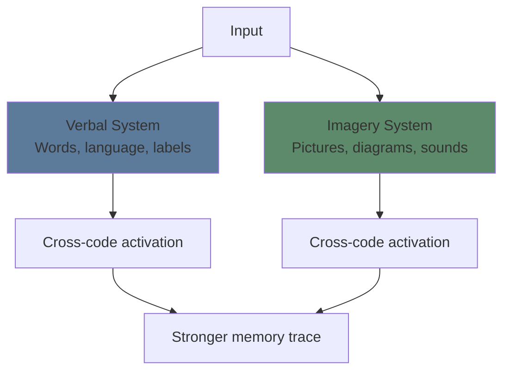

**Verbal system** — processes language: words, sentences, labels, narratives.
**Imagery system** — processes non-verbal: pictures, diagrams, sounds, tactile sensations.

**Key insight**: Information encoded in BOTH systems creates two memory traces. Two retrieval paths. Redundancy protects against forgetting.

> **Cloze**: "Paivio's dual coding theory proposes two separate cognitive subsystems: a {verbal} system for words and an {imagery} system for pictures."
>
> *Answer: verbal, imagery*

> **Think**: You studied a concept with both text and diagram. Later you forget the text but still remember the diagram. Can you reconstruct the concept?
>
> *Answer: Often yes — the visual trace can trigger cross-code activation, helping reconstruct the verbal information. That's exactly why dual coding is powerful.*

### The Picture Superiority Effect

Pictures are remembered better than words — across virtually all conditions.

**Why:**
- Pictures are more distinctive (less overlap with other stored images)
- Pictures automatically engage dual coding (the picture + the label you give it)
- Pictures encode holistically, not sequentially

**Example**: Show people 10,000 images over 5 days. Later, 83% recognition accuracy. Show 10,000 words — much lower.

> **Predict**: You study 100 vocabulary words. For 50 words, you see just the word + definition. For the other 50, you see the word + definition + an icon. Which set will you recall better a week later?
>
> *Answer: The set with icons. The visual component creates a second memory trace and retrieval path.*

### Mayer's 12 Principles of Multimedia Learning

Mayer (2001) synthesized decades of research into principles for designing effective multimedia instruction.

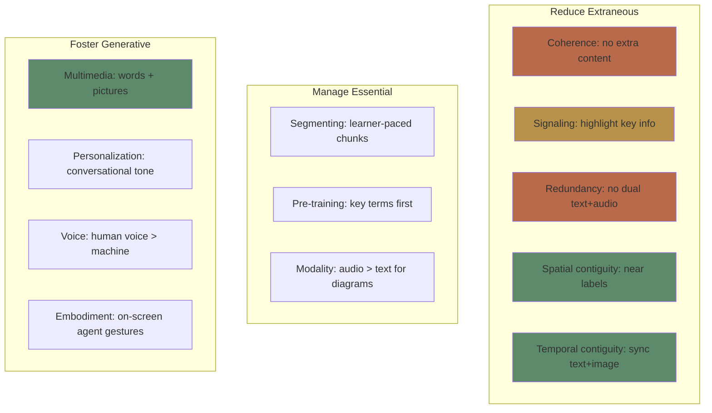

**Four most actionable principles for your own learning:**

| Principle              | Rule                                 | Example                             |
| ---------------------- | ------------------------------------ | ----------------------------------- |
| **Multimedia**         | Words + pictures > words alone       | Diagram + caption > text only       |
| **Coherence**          | Remove extraneous content            | No decorative clip art, no tangents |
| **Spatial contiguity** | Place labels next to what they label | Not on a separate legend            |
| **Signaling**          | Highlight what matters               | Bold, arrows, color cues            |

> **Think**: Why does coherence (removing extra content) improve learning? Doesn't more information always help?
>
> *Answer: Extra content increases extraneous load. Decorative graphics, interesting-but-irrelevant facts, and tangents drain WM capacity. Less is more.*

### When Diagrams Hurt (And How to Fix)

Diagrams aren't automatically better. Poor diagrams create confusion.

**Common diagram problems:**

| Problem               | Why it hurts                        | Fix                                        |
| --------------------- | ----------------------------------- | ------------------------------------------ |
| Too complex           | Visual overload — too many elements | Simplify, layer (show one level at a time) |
| Unlabeled             | Learner must search for meaning     | Label every element                        |
| Inconsistent notation | Re-learning required per diagram    | Standardize symbols, colors                |
| Decorative only       | Adds extraneous load                | Remove or replace with functional diagram  |
| Text-image split      | Split attention                     | Integrate labels into diagram              |

> **Spot the Mistake**: "I added a cool infographic to my notes. It has lots of icons, colors, and data. More visual = more learning."
>
> What's wrong?
>
> *Answer: Decorative complexity ≠ dual coding. Icons and colors that don't carry meaning add extraneous load. Effective diagrams minimize visual noise and maximize information per pixel.*

### Creating Better Diagrams for Your Own Study

When you study, don't just consume diagrams — **generate them**.

**Generation effect**: Creating your own diagram produces deeper processing than studying someone else's.

**Study routine:**
1. Read the text
2. Close the book
3. Draw a diagram from memory
4. Compare with original
5. Fill in gaps

This combines retrieval practice (step 3) with dual coding (step 3-4) — powerful combination.

> **Predict**: Two students study the same text about the water cycle. Student A re-reads 3 times. Student B reads once, then draws the cycle from memory, then checks. Who understands better?
>
> *Answer: Student B. Drawing from memory forces retrieval AND dual coding AND self-explanation of relationships.*

> **Cloze**: "The {generation effect} shows that creating your own {diagram} produces deeper processing than studying a pre-made one."
>
> *Answer: generation effect, diagram*

### Dual Coding for Abstract Concepts

Some concepts are hard to visualize (consciousness, justice, entropy). For abstract concepts:
- Use **metaphors** (attention is a spotlight)
- Use **hierarchies** (tree diagrams)
- Use **flowcharts** (process maps)
- Use **comparison tables** (structures with empty cells)

Even abstract ideas benefit from visual organization — the structure conveys relationships even when the content is conceptual.

> **Think**: How would you visually represent "long-term memory is unlimited but retrieval can fail"?
>
> *Answer: A huge warehouse (LTM) with a small, dim flashlight (retrieval). The warehouse has everything — but you can only see what the flashlight illuminates. The rest is "in storage" but inaccessible.*

---

## Why This Matters

You consume visual information constantly — videos, slides, diagrams, infographics. Dual coding principles help you:
- **As a learner**: choose materials with effective visuals, create your own
- **As a note-taker**: build diagrams, not just text dumps
- **As a content creator**: design presentations that actually teach

The difference between a good explanation and a great one is often visual design.

---

## Key Takeaways
- Dual coding uses two subsystems (verbal + imagery) → two memory traces
- Pictures are remembered better than words (picture superiority effect)
- Mayer's principles: multimedia, coherence, contiguity, signaling are most actionable
- Bad diagrams hurt learning — decorative visuals increase extraneous load
- Generating your own diagrams is more effective than studying pre-made ones
- Abstract concepts still benefit from visual organization (metaphors, flowcharts)

---

## Common Misconception

**Misconception**: "Adding pictures always makes learning better."

**Reality**: Pictures help when they convey meaning (functional diagrams). Decorative pictures, animations, and clip art increase extraneous load without adding information.

**Correct framing**: Add visuals that carry meaning — diagrams, graphs, flowcharts. Remove visuals that are just decoration.

---

## Spot the Mistake

"A presentation slide has a dense paragraph of text on the left and an unrelated stock photo of a handshake on the right."

What's wrong?

*Answer: Three violations. (1) The photo is decorative — adds extraneous load. (2) Dense text paragraph should be broken into bullet points or a diagram. (3) Text + unrelated image creates split attention and confusion.*

---

## Feynman Explain
(Explain dual coding: your brain has two filing systems — one for words, one for pictures. Filing the same info in both means you have two ways to find it later. It's like writing down a phone number AND saving it in your contacts.)

---

## Reframe
(Judge: think of the last presentation or video you watched. Did it follow dual coding principles? What would you change? Is there a concept you're studying now that would benefit from a diagram you create?)

---

## Drill
Run: `learn.sh quiz learning-theories 6`

## Quiz: 06-dual-coding

<p class="quiz-question">Dual coding theory proposes that information can be processed in two systems:</p>

<p class="quiz-difficulty">★☆☆</p>

<p class="quiz-option"><strong>A.</strong> Short-term and long-term</p>

<p class="quiz-option"><strong>B.</strong> Verbal and imagery</p>

<p class="quiz-option"><strong>C.</strong> Conscious and unconscious</p>

<p class="quiz-option"><strong>D.</strong> Semantic and episodic</p>

<p class="quiz-answer"><strong>Answer:</strong> B</p>

<p class="quiz-explanation">Paivio's theory: verbal system (words) and imagery system (pictures, sounds) are separate but interconnected.</p>

<hr/>

<p class="quiz-question">Why are pictures remembered better than words?</p>

<p class="quiz-difficulty">★★☆</p>

<p class="quiz-option"><strong>A.</strong> Pictures are larger in memory</p>

<p class="quiz-option"><strong>B.</strong> Pictures automatically engage dual coding — the image itself plus the label</p>

<p class="quiz-option"><strong>C.</strong> Words are processed in only one system</p>

<p class="quiz-option"><strong>D.</strong> Both B and C</p>

<p class="quiz-answer"><strong>Answer:</strong> D</p>

<p class="quiz-explanation">Pictures auto-trigger dual coding (image + verbal label). Words are primarily verbal only. Pictures are also more distinctive.</p>

<hr/>

<p class="quiz-question">A slide shows a complex diagram of a cell with 40 unlabeled parts. Which Mayer principle is violated?</p>

<p class="quiz-difficulty">★★☆</p>

<p class="quiz-option"><strong>A.</strong> Multimedia principle</p>

<p class="quiz-option"><strong>B.</strong> Spatial contiguity</p>

<p class="quiz-option"><strong>C.</strong> Signaling</p>

<p class="quiz-option"><strong>D.</strong> Both B and C</p>

<p class="quiz-answer"><strong>Answer:</strong> D</p>

<p class="quiz-explanation">Unlabeled parts violate spatial contiguity (labels not near elements) AND signaling (no highlighting of key elements).</p>

<hr/>

<p class="quiz-question">According to Mayer's coherence principle, what should be removed from instructional materials?</p>

<p class="quiz-difficulty">★☆☆</p>

<p class="quiz-option"><strong>A.</strong> All diagrams</p>

<p class="quiz-option"><strong>B.</strong> Extraneous words, pictures, and sounds</p>

<p class="quiz-option"><strong>C.</strong> All text</p>

<p class="quiz-option"><strong>D.</strong> Everything not in bullet points</p>

<p class="quiz-answer"><strong>Answer:</strong> B</p>

<p class="quiz-explanation">Coherence principle: remove material that doesn't support the learning goal. Extra content increases extraneous load.</p>

<hr/>

<p class="quiz-question">A student studies by drawing diagrams from memory, then checking accuracy. This technique combines:</p>

<p class="quiz-difficulty">★★☆</p>

<p class="quiz-option"><strong>A.</strong> Dual coding + retrieval practice</p>

<p class="quiz-option"><strong>B.</strong> Spacing + interleaving</p>

<p class="quiz-option"><strong>C.</strong> Elaboration + massed practice</p>

<p class="quiz-option"><strong>D.</strong> Highlighting + re-reading</p>

<p class="quiz-answer"><strong>Answer:</strong> A</p>

<p class="quiz-explanation">Drawing from memory forces retrieval (pulling info from LTM) AND dual coding (creating visual representation of verbal info).</p>

<hr/>

<p class="quiz-question">Which of the following is an example of the 'split-attention effect' in multimedia learning?</p>

<p class="quiz-difficulty">★★☆</p>

<p class="quiz-option"><strong>A.</strong> A diagram with labels embedded in the image</p>

<p class="quiz-option"><strong>B.</strong> A diagram on one page with its legend on another page</p>

<p class="quiz-option"><strong>C.</strong> A narrated animation</p>

<p class="quiz-option"><strong>D.</strong> A self-paced tutorial</p>

<p class="quiz-answer"><strong>Answer:</strong> B</p>

<p class="quiz-explanation">Split attention: learner must hold diagram in WM while searching for legend. Integrate labels into the diagram.</p>

<hr/>

<p class="quiz-question">For abstract concepts that are hard to visualize, the best dual coding approach is:</p>

<p class="quiz-difficulty">★★★</p>

<p class="quiz-option"><strong>A.</strong> Skip visuals — text only works better</p>

<p class="quiz-option"><strong>B.</strong> Use metaphors, hierarchies, or flowcharts to represent structure</p>

<p class="quiz-option"><strong>C.</strong> Add decorative images for visual interest</p>

<p class="quiz-option"><strong>D.</strong> Use only verbal explanations</p>

<p class="quiz-answer"><strong>Answer:</strong> B</p>

<p class="quiz-explanation">Even abstract ideas benefit from visual organization. Metaphors, tree diagrams, and flowcharts convey relationships structurally.</p>

<hr/>

<p class="quiz-question">A student creates a study guide with: (1) text summary, (2) labeled diagram, (3) table comparing related concepts. How many encoding systems are engaged?</p>

<p class="quiz-difficulty">★★★</p>

<p class="quiz-option"><strong>A.</strong> 1 — all are text</p>

<p class="quiz-option"><strong>B.</strong> 2 — verbal (text) and imagery (diagram, table structure)</p>

<p class="quiz-option"><strong>C.</strong> 3 — one per format</p>

<p class="quiz-option"><strong>D.</strong> 0 — study guides don't engage encoding</p>

<p class="quiz-answer"><strong>Answer:</strong> B</p>

<p class="quiz-explanation">Text = verbal. Diagram + table = imagery (structural/visual). Two systems engaged = dual coding benefit.</p>

<hr/>

<p class="quiz-question">Animated diagrams are often inferior to static diagrams because:</p>

<p class="quiz-difficulty">★★☆</p>

<p class="quiz-option"><strong>A.</strong> Animations are harder to create</p>

<p class="quiz-option"><strong>B.</strong> Animations can be too fast, and learners can't control pacing</p>

<p class="quiz-option"><strong>C.</strong> Static diagrams are always more colorful</p>

<p class="quiz-option"><strong>D.</strong> Animations use less WM</p>

<p class="quiz-answer"><strong>Answer:</strong> B</p>

<p class="quiz-explanation">Transient information (video/animation) disappears. Learners can't pause and reflect. Learner-paced static diagrams allow self-regulation.</p>

<hr/>

<p class="quiz-question">Which combination produces the strongest memory trace according to dual coding theory?</p>

<p class="quiz-difficulty">★★★</p>

<p class="quiz-option"><strong>A.</strong> Reading text silently</p>

<p class="quiz-option"><strong>B.</strong> Listening to an audio recording</p>

<p class="quiz-option"><strong>C.</strong> Seeing a labeled diagram AND explaining it in your own words</p>

<p class="quiz-option"><strong>D.</strong> Copying text by hand</p>

<p class="quiz-answer"><strong>Answer:</strong> C</p>

<p class="quiz-explanation">Labeled diagram = dual coding (visual + verbal label). Explaining in your own words = elaboration. Two powerful mechanisms combined.</p>


---

# Module 7: Retrieval Practice

Est. study time: 2h
Language: en
Description: Why quizzing yourself is the most powerful single learning strategy — not for assessment, but for memory formation.

## Learning Objectives
- Explain the testing effect and why retrieval strengthens memory
- Distinguish free recall, cued recall, and recognition
- Implement retrieval practice in any study routine
- Design effective self-quizzing strategies

---

## Real-World Example

Two students prepare for an exam. Student A reads the textbook chapter 4 times, highlights key passages, reviews notes. Student B reads the chapter once, closes the book, and tries to recall everything from memory.

Student B feels less confident during study. Student A feels more confident. But Student B scores higher on the exam.

This is the **testing effect** — the counterintuitive finding that retrieval practice produces better long-term learning than re-study, even though it feels harder.

> **Think**: Why did Student A feel more confident but perform worse?
>
> *Answer: Re-reading creates fluency (easy processing = feeling of knowing). Retrieval feels difficult because it IS difficult — that difficulty is the learning signal.*

---

## Core Content

### The Testing Effect

Retrieving information from memory changes the memory itself — strengthening it and making it more retrievable in the future.

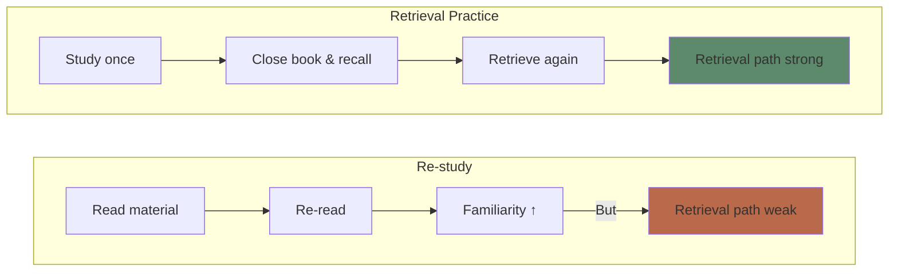

**Roediger & Karpicke (2006)**: Students studied prose passages. Some re-studied, others were tested. On a final test 1 week later:

| Group              | Recall after 5 min | Recall after 1 week |
| ------------------ | ------------------ | ------------------- |
| Study once         | 81%                | 40%                 |
| Re-study           | 84%                | 42%                 |
| Retrieval practice | 68%                | 61%                 |

Retrieval practice felt worse initially (68% vs 84%) but produced 50% better long-term retention.

> **Cloze**: "The {testing effect} is the finding that retrieving information from memory produces better {long-term retention} than re-studying, even though it {feels harder}."
>
> *Answer: testing effect, long-term retention, feels harder*

> **Predict**: You have 2 hours to study. Option A: read for 1h, then re-read for 1h. Option B: read for 1h, then self-test for 1h (closed book). Which produces better retention a week later?
>
> *Answer: Option B. The first hour of reading is enough for encoding. The second hour should be retrieval — not more encoding.*

### Why Retrieval Practice Works

Three mechanisms:

**1. Elaboration during retrieval**: Retrieving a memory triggers related information — you don't just recall the target, you recall its context, related concepts, and associations. This "spreading activation" elaborates the memory trace.

**2. Retrieval route strengthening**: Each successful retrieval strengthens the neural pathway used to access the information. Like walking a path through a field — each crossing makes the path clearer.

**3. Identification of gaps**: Retrieval reveals what you don't know. Re-reading hides gaps behind familiarity.

> **Think**: When you struggle to recall something during a self-test, what should you do?
>
> *Answer: Struggle is good — it means you're strengthening the retrieval path. Keep trying for a moment, then check. The effort itself improves learning even if you fail (unsuccessful retrieval still strengthens the trace).*

### Free Recall vs Cued Recall vs Recognition

| Type            | Cue                                   | Difficulty | Learning benefit |
| --------------- | ------------------------------------- | ---------- | ---------------- |
| **Free recall** | None: "tell me everything"            | Hardest    | Strongest        |
| **Cued recall** | Hint: "what's the capital of France?" | Medium     | Medium           |
| **Recognition** | Multiple choice                       | Easiest    | Weakest          |

**Rule of thumb**: Test yourself hardest. Use free recall (blank page, no hints). If you can free recall, you truly know it.

> **Spot the Mistake**: "I use flashcards with the term on the front and the definition on the back. I go through them until I can say every definition perfectly."
>
> What's wrong?
>
> *Answer: Recognition, not recall. You recognize the term, then read the definition on the back. Better: look at the term, recall definition aloud, THEN check. Or use free recall: "list all the terms from this module and their definitions."*

### The Ultimate Retrieval Practice Routine

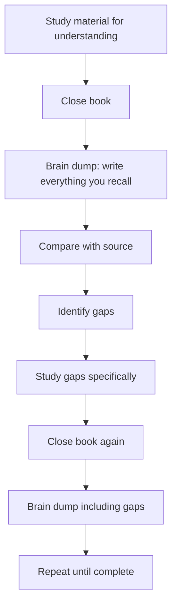

**Key rules:**
1. **Closed book always** — no peeking until you've exhausted recall
2. **Write or say aloud** — thinking "I know that" is NOT retrieval
3. **Check immediately** — feedback closes the gap
4. **Retry gaps** — don't just read the answer, retrieve it again

> **Cloze**: "For retrieval practice to work effectively, it must be done {closed-book} with {active production} (writing or speaking), followed by {immediate feedback}."
>
> *Answer: closed-book, active production, immediate feedback*

### When Retrieval Fails (And Why That's OK)

| Failure type   | What happened                | Is this useful?                                         |
| -------------- | ---------------------------- | ------------------------------------------------------- |
| Partial recall | Got some details but not all | Yes — strengthens partial trace                         |
| Tip-of-tongue  | Know it but can't access     | Yes — retrieval path being rebuilt                      |
| Complete blank | Nothing comes to mind        | Still useful — primes for encoding after feedback       |
| Wrong answer   | Retrieved incorrect info     | Very useful — error detection strengthens correct trace |

**Key finding**: Failed retrieval attempts still produce learning benefits compared to simply re-studying (Kornell et al. 2009).

> **Think**: You try to recall a fact and draw a complete blank. You check the answer. One hour later, you remember it perfectly. Did the blank help?
>
> *Answer: Yes. The failed attempt primed your brain for that information. When you saw the answer, it was encoded more deeply than if you had just read it passively.*

---

## Why This Matters

Retrieval practice is the single highest-impact strategy you can adopt. It:
- Produces 50-100% better long-term retention than re-reading
- Takes the same time (or less)
- Costs nothing
- Works for any subject
- Gets harder before it gets easier (but that's the point)

---

## Key Takeaways
- Retrieval practice beats re-reading for long-term retention
- The testing effect: retrieval strengthens the memory trace itself
- Free recall > cued recall > recognition
- Closed book, write/speak aloud, check immediately
- Failed retrieval still helps — effort is productive
- Feeling of difficulty is NOT a sign of poor learning — it's the signal

---

## Common Misconception

**Misconception**: "I should only test myself after I've mastered the material."

**Reality**: Test yourself BEFORE you feel ready. The retrieval attempt itself is the learning mechanism, not merely an assessment. You learn BY testing, not FOR testing.

**Correct framing**: Test early, test often. Difficulty during retrieval = learning in progress. If it feels easy, you're not retrieving — you're recognizing.

---

## Spot the Mistake

"I study with a friend. We take turns reading definitions aloud. That's retrieval practice."

What's wrong?

*Answer: Reading aloud is recognition, not recall. The information is right there in front of you. True retrieval practice: one person recites from memory, the other checks accuracy.*

---

## Feynman Explain
(Explain retrieval practice: your memory is like a path in the woods. Re-reading is looking at a map. Retrieval is actually walking the path. Each walk makes the path clearer. Even getting lost helps — you learn the landscape better than by staring at the map.)

---

## Reframe
(Judge: what proportion of your current study time is retrieval vs re-reading? If it's less than 50%, redesign your next session to be retrieval-heavy. How does it feel?)

---

## Drill
Run: `learn.sh quiz learning-theories 7`

## Quiz: 07-retrieval-practice

<p class="quiz-question">The testing effect refers to:</p>

<p class="quiz-difficulty">★☆☆</p>

<p class="quiz-option"><strong>A.</strong> Tests measuring what students have learned</p>

<p class="quiz-option"><strong>B.</strong> Retrieving information from memory strengthens it for future retrieval</p>

<p class="quiz-option"><strong>C.</strong> Students perform better on tests they study for</p>

<p class="quiz-option"><strong>D.</strong> Multiple-choice tests are harder than recall tests</p>

<p class="quiz-answer"><strong>Answer:</strong> B</p>

<p class="quiz-explanation">The testing effect: the act of retrieval changes the memory trace itself, making it stronger.</p>

<hr/>

<p class="quiz-question">After studying a chapter, which activity produces the BEST long-term retention?</p>

<p class="quiz-difficulty">★★☆</p>

<p class="quiz-option"><strong>A.</strong> Re-reading the chapter</p>

<p class="quiz-option"><strong>B.</strong> Highlighting key points</p>

<p class="quiz-option"><strong>C.</strong> Closing the book and writing everything you recall</p>

<p class="quiz-option"><strong>D.</strong> Listening to a summary recording</p>

<p class="quiz-answer"><strong>Answer:</strong> C</p>

<p class="quiz-explanation">Free recall (closed-book brain dump) is retrieval practice — the strongest learning strategy.</p>

<hr/>

<p class="quiz-question">In Roediger &amp; Karpicke's study, which group performed BEST on a 1-week delayed test?</p>

<p class="quiz-difficulty">★★☆</p>

<p class="quiz-option"><strong>A.</strong> Study once</p>

<p class="quiz-option"><strong>B.</strong> Re-study multiple times</p>

<p class="quiz-option"><strong>C.</strong> Retrieval practice (closed-book recall)</p>

<p class="quiz-option"><strong>D.</strong> All groups performed equally</p>

<p class="quiz-answer"><strong>Answer:</strong> C</p>

<p class="quiz-explanation">Retrieval practice group scored 61% vs ~40% for re-study groups — 50% better despite feeling worse during study.</p>

<hr/>

<p class="quiz-question">Why does retrieval practice feel harder than re-reading?</p>

<p class="quiz-difficulty">★★☆</p>

<p class="quiz-option"><strong>A.</strong> It uses more physical energy</p>

<p class="quiz-option"><strong>B.</strong> It requires active construction of memory traces, which is cognitively demanding</p>

<p class="quiz-option"><strong>C.</strong> Re-reading is also hard</p>

<p class="quiz-option"><strong>D.</strong> There is no difference in difficulty</p>

<p class="quiz-answer"><strong>Answer:</strong> B</p>

<p class="quiz-explanation">Retrieval requires effortful search and reconstruction. This difficulty IS the learning signal.</p>

<hr/>

<p class="quiz-question">A student tries to recall a fact but draws a complete blank. They check the answer. Was this attempt useful?</p>

<p class="quiz-difficulty">★★★</p>

<p class="quiz-option"><strong>A.</strong> No — wasted time</p>

<p class="quiz-option"><strong>B.</strong> Yes — failed retrieval still primes memory for deeper encoding when feedback arrives</p>

<p class="quiz-option"><strong>C.</strong> Yes — but only if they guessed</p>

<p class="quiz-option"><strong>D.</strong> No — they should have studied more first</p>

<p class="quiz-answer"><strong>Answer:</strong> B</p>

<p class="quiz-explanation">Even failed retrieval attempts produce learning benefits (Kornell et al. 2009). The effort strengthens the trace.</p>

<hr/>

<p class="quiz-question">Which provides the STRONGEST retrieval practice?</p>

<p class="quiz-difficulty">★☆☆</p>

<p class="quiz-option"><strong>A.</strong> Multiple-choice quiz</p>

<p class="quiz-option"><strong>B.</strong> Fill-in-the-blank with word bank</p>

<p class="quiz-option"><strong>C.</strong> Free recall — blank page, no cues</p>

<p class="quiz-option"><strong>D.</strong> True/false questions</p>

<p class="quiz-answer"><strong>Answer:</strong> C</p>

<p class="quiz-explanation">Free recall has no external cues — the hardest and most effective form of retrieval practice.</p>

<hr/>

<p class="quiz-question">A student reviews flashcards by looking at the term and reading the definition on the back. What's wrong?</p>

<p class="quiz-difficulty">★★☆</p>

<p class="quiz-option"><strong>A.</strong> Nothing — this is effective</p>

<p class="quiz-option"><strong>B.</strong> This is recognition, not recall. The student should recall the definition BEFORE flipping</p>

<p class="quiz-option"><strong>C.</strong> Flashcards are always ineffective</p>

<p class="quiz-option"><strong>D.</strong> Reading aloud is better than silent reading</p>

<p class="quiz-answer"><strong>Answer:</strong> B</p>

<p class="quiz-explanation">Reading the answer is recognition. The learning benefit comes from recalling it before checking.</p>

<hr/>

<p class="quiz-question">Which mechanism does NOT explain why retrieval practice works?</p>

<p class="quiz-difficulty">★★☆</p>

<p class="quiz-option"><strong>A.</strong> Elaboration during retrieval activates related information</p>

<p class="quiz-option"><strong>B.</strong> Retrieval strengthens the neural pathway used to access the memory</p>

<p class="quiz-option"><strong>C.</strong> Retrieval reveals gaps that re-reading hides</p>

<p class="quiz-option"><strong>D.</strong> Retrieval increases the total study time</p>

<p class="quiz-answer"><strong>Answer:</strong> D</p>

<p class="quiz-explanation">The benefit isn't from more time — it's from the specific cognitive operations during retrieval.</p>

<hr/>

<p class="quiz-question">Immediately after retrieval practice, a student feels they learned less than the re-reading group. This feeling is:</p>

<p class="quiz-difficulty">★★★</p>

<p class="quiz-option"><strong>A.</strong> Accurate — re-reading is better</p>

<p class="quiz-option"><strong>B.</strong> An illusion caused by the difficulty of retrieval — the opposite is true</p>

<p class="quiz-option"><strong>C.</strong> A sign to switch strategies</p>

<p class="quiz-option"><strong>D.</strong> Not relevant to learning</p>

<p class="quiz-answer"><strong>Answer:</strong> B</p>

<p class="quiz-explanation">Fluency from re-reading creates illusion of learning. Difficulty from retrieval creates actual learning. Trust the data, not the feeling.</p>

<hr/>

<p class="quiz-question">What is the recommended proportion of study time that should be retrieval practice?</p>

<p class="quiz-difficulty">★★☆</p>

<p class="quiz-option"><strong>A.</strong> 0% — retrieval is for assessment only</p>

<p class="quiz-option"><strong>B.</strong> At least 50% — study for encoding, then spend equal time retrieving</p>

<p class="quiz-option"><strong>C.</strong> 100% — never study, only test yourself</p>

<p class="quiz-option"><strong>D.</strong> 10% — retrieval is supplementary</p>

<p class="quiz-answer"><strong>Answer:</strong> B</p>

<p class="quiz-explanation">Read for initial encoding (50% of time), then spend the rest on retrieval. Never re-read when you could be retrieving.</p>


---

# Module 8: Interleaving vs Blocking

Est. study time: 2h
Language: en
Description: Why mixing topics during practice beats focusing on one — and when to do each.

## Learning Objectives
- Distinguish blocked vs interleaved practice
- Explain why interleaving improves discrimination and transfer
- Identify subjects where interleaving is most effective
- Design interleaved study sessions

---

## Real-World Example

A baseball player goes to batting practice. One day, they hit 50 fastballs, then 50 curveballs, then 50 sliders (blocked). Next day, they hit 50 pitches in random order — fastball, curve, slider, curve, fastball... (interleaved).

Blocked practice feels better — you get into a rhythm. Interleaved feels chaotic. But in a real game, pitches come in random order. Which practice prepares you for that?

> **Think**: Which practice schedule produces better game performance?
>
> *Answer: Interleaved. Blocked practice teaches you to hit fastballs when you know a fastball is coming. Interleaved teaches you to identify pitch TYPE first, then adjust — exactly what a real game requires.*

---

## Core Content

### Blocked vs Interleaved

**Blocked practice**: Practice one type of problem/topic at a time. AAAA BBBB CCCC.

**Interleaved practice**: Mix different types. ABCABC ABCABC.

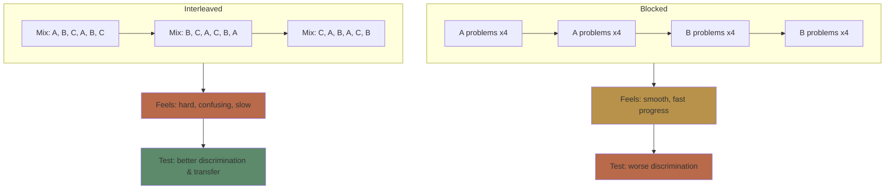

**Key finding (Rohrer 2012)**: Students who interleaved math problems scored 43% on a delayed test vs 20% for blocked — despite feeling they learned less.

> **Cloze**: "In blocked practice, all problems of one {type} are completed before moving to the next. In interleaved practice, different {types} are {mixed} together."
>
> *Answer: type, types, mixed*

### Why Interleaving Works

Three mechanisms:

**1. Discrimination learning**: When types are mixed, you must identify WHICH type of problem you're facing before solving it. Blocked practice removes this step — you already know the type.

**2. Attention to distinguishing features**: Interleaving forces you to notice what makes each type different. Blocked practice lets you focus on surface features.

**3. Spacing by default**: Mixed problems naturally create spacing between repetitions of each type.

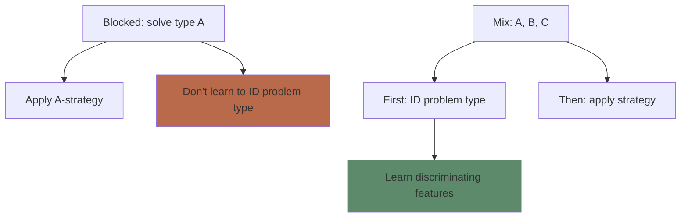

> **Think**: Why does blocked practice feel more effective than interleaved?
>
> *Answer: Blocked practice gives you the answer (the problem type) before you start. It's analogous to recognition vs recall — easier, less effective.*

### When Interleaving Works Best

| Subject      | Interleaving benefit | Example                                        |
| ------------ | -------------------- | ---------------------------------------------- |
| Math         | Very high            | Mix algebra, geometry, statistics              |
| Science      | High                 | Mix physics, chemistry, biology problems       |
| Art          | Very high            | Mix painting styles (learn to identify artist) |
| Sports       | High                 | Mix pitch types, shot types                    |
| Vocabulary   | Moderate             | Mix words from different units                 |
| Motor skills | Moderate             | Mix dance moves, guitar chords                 |

**When interleaving helps less:**
- Initial skill acquisition (learn the basics blocked first)
- Highly similar items that need distinct schema formation first
- Procedural sequences with a fixed order

> **Predict**: Which should be interleaved and which blocked: (a) learning the French alphabet, (b) practicing French verb conjugations across verb groups?
>
> *Answer: Alphabet = blocked (fixed sequence, basic encoding). Verb groups = interleaved (discrimination between group patterns is the key skill).*

### The Blocked-First Hybrid

Most effective approach for novices:

```mermaid
graph LR
    B1[Phase 1: Blocked<br/>Learn each type] --> B2[Phase 2: Blocked<br/>Build basic fluency]
    B2 --> I1[Phase 3: Interleaved<br/>Discrimination practice]
    I1 --> I2[Phase 4: Interleaved<br/>Timed, realistic conditions]
```

**Example for learning math:**
1. Study worked examples of quadratic equations (blocked)
2. Solve 3-5 quadratic equations (blocked)
3. Solve mixed problems: quadratics, linear equations, exponents (interleaved)
4. Mixed problems under time pressure

> **Think**: If interleaving is so effective, why do most textbooks and courses use blocked practice?
>
> *Answer: Blocked feels better for learners AND teachers. Textbooks organize by topic. Teachers want students to feel progress. Interleaving creates initial confusion — but better final performance.*

### Practical Interleaving Strategy

**For self-study:**
1. Study one topic at a time for initial encoding
2. Create mixed practice sets with 3-5 different topics
3. Randomize order within each session
4. For each problem: identify the type BEFORE solving

**Session design example (2 hours):**
- 30 min: Study topic A (blocked encoding)
- 30 min: Study topic B (blocked encoding)
- 60 min: Mixed practice (A and B problems randomized)

> **Spot the Mistake**: "I study math for 3 hours every Saturday — 1 hour algebra, 1 hour geometry, 1 hour statistics. That's interleaving."
>
> What's wrong?
>
> *Answer: That's blocked practice within each hour, not interleaving. True interleaving: 3 hours of mixed problems where each problem could be any type. You must identify the type each time.*

> **Cloze**: "Interleaving works by forcing the learner to {identify the problem type} before solving, which builds {discrimination skills} that transfer to real-world conditions."
>
> *Answer: identify the problem type, discrimination skills*

---

## Why This Matters

Most self-study and courses default to blocked practice. Adding interleaving:
- Improves discrimination (seeing differences between similar concepts)
- Builds transferable skill (works in messy real-world conditions)
- Requires NO extra time — just reorganization
- Combines naturally with spacing and retrieval practice

---

## Key Takeaways
- Blocked: all of type A, then B, then C — feels effective, less durable
- Interleaved: types mixed — feels harder, more durable
- Interleaving builds discrimination skills (identifying problem type)
- Blocked-first hybrid: encode basics blocked, then interleave for fluency
- Works across domains: math, science, art, sports, vocabulary
- Requires no extra time — just rearrange your practice

---

## Common Misconception

**Misconception**: "I should master one topic before moving to the next."

**Reality**: Mastery requires discrimination — knowing when to use which approach. You can't discriminate until you've seen similar cases side by side. Waiting for "mastery" before mixing is counterproductive.

**Correct framing**: Start mixing early — after initial encoding of each type. Perfection before mixing is a trap.

---

## Spot the Mistake

"A piano student practices scale C until perfect, then scale D until perfect, then scale E until perfect. Day 2: same sequence."

What's wrong?

*Answer: Blocked practice of scales doesn't train the real skill — transitioning between scales during a piece. Interleave: practice C→D, D→E, E→C transitions.*

---

## Feynman Explain
(Explain interleaving: imagine learning to identify birds. If you study 10 sparrows, then 10 robins, then 10 blue jays, you don't learn what makes each unique. Mix them — you learn to see the differences. The mixing IS the learning.)

---

## Reframe
(Judge: which of your current subjects would benefit most from interleaving? Design one interleaved practice session. How does it feel compared to blocked?)

---

## Drill
Run: `learn.sh quiz learning-theories 8`

## Quiz: 08-interleaving

<p class="quiz-question">In blocked practice, a student solves:</p>

<p class="quiz-difficulty">★☆☆</p>

<p class="quiz-option"><strong>A.</strong> Mixed problem types in random order</p>

<p class="quiz-option"><strong>B.</strong> All problems of one type, then the next type</p>

<p class="quiz-option"><strong>C.</strong> Only problems from one chapter</p>

<p class="quiz-option"><strong>D.</strong> Problems in order of difficulty</p>

<p class="quiz-answer"><strong>Answer:</strong> B</p>

<p class="quiz-explanation">Blocked = all A, then all B. Interleaved = types mixed.</p>

<hr/>

<p class="quiz-question">Why does interleaving improve learning compared to blocking?</p>

<p class="quiz-difficulty">★★☆</p>

<p class="quiz-option"><strong>A.</strong> It reduces cognitive load</p>

<p class="quiz-option"><strong>B.</strong> It forces learners to identify problem types before solving</p>

<p class="quiz-option"><strong>C.</strong> It allows more practice per type</p>

<p class="quiz-option"><strong>D.</strong> It requires less mental effort</p>

<p class="quiz-answer"><strong>Answer:</strong> B</p>

<p class="quiz-explanation">Interleaving removes the cue of 'what type is this?' — learners must discriminate, which builds transferable skill.</p>

<hr/>

<p class="quiz-question">In Rohrer's math study, interleaved practice produced what result on delayed tests?</p>

<p class="quiz-difficulty">★★☆</p>

<p class="quiz-option"><strong>A.</strong> Lower scores than blocked</p>

<p class="quiz-option"><strong>B.</strong> Similar scores to blocked</p>

<p class="quiz-option"><strong>C.</strong> 43% vs 20% — more than double blocked practice</p>

<p class="quiz-option"><strong>D.</strong> 100% recall</p>

<p class="quiz-answer"><strong>Answer:</strong> C</p>

<p class="quiz-explanation">Interleaved group scored 43% vs 20% blocked — despite feeling they learned less during practice.</p>

<hr/>

<p class="quiz-question">Which subject benefits LEAST from interleaving?</p>

<p class="quiz-difficulty">★★★</p>

<p class="quiz-option"><strong>A.</strong> Mathematics</p>

<p class="quiz-option"><strong>B.</strong> Art history (identifying artists)</p>

<p class="quiz-option"><strong>C.</strong> Learning the alphabet</p>

<p class="quiz-option"><strong>D.</strong> Sports (pitch types)</p>

<p class="quiz-answer"><strong>Answer:</strong> C</p>

<p class="quiz-explanation">Alphabet has fixed sequence and low discrimination requirements. Blocked is fine for basic sequential memorization.</p>

<hr/>

<p class="quiz-question">A student learns 3 statistical tests. They should interleave practice AFTER:</p>

<p class="quiz-difficulty">★★☆</p>

<p class="quiz-option"><strong>A.</strong> No encoding — just start interleaving</p>

<p class="quiz-option"><strong>B.</strong> Mastery of all 3 tests</p>

<p class="quiz-option"><strong>C.</strong> Initial encoding of each test's basic procedure</p>

<p class="quiz-option"><strong>D.</strong> The exam</p>

<p class="quiz-answer"><strong>Answer:</strong> C</p>

<p class="quiz-explanation">Blocked-first hybrid: encode basics first (worked examples, simple practice), then interleave for discrimination.</p>

<hr/>

<p class="quiz-question">A student says 'I study 2 hours of chemistry followed by 2 hours of physics every Saturday.' This is:</p>

<p class="quiz-difficulty">★★☆</p>

<p class="quiz-option"><strong>A.</strong> Interleaved practice</p>

<p class="quiz-option"><strong>B.</strong> Blocked practice with subject blocks</p>

<p class="quiz-option"><strong>C.</strong> Spaced practice</p>

<p class="quiz-option"><strong>D.</strong> Retrieval practice</p>

<p class="quiz-answer"><strong>Answer:</strong> B</p>

<p class="quiz-explanation">Large subject blocks are still blocked practice. True interleaving would mix chemistry and physics problems within each hour.</p>

<hr/>

<p class="quiz-question">Why does blocked practice feel more effective than interleaved during learning?</p>

<p class="quiz-difficulty">★★☆</p>

<p class="quiz-option"><strong>A.</strong> Blocked practice provides the problem type as a cue — reduces difficulty</p>

<p class="quiz-option"><strong>B.</strong> Blocked practice takes less time</p>

<p class="quiz-option"><strong>C.</strong> Interleaving causes confusion</p>

<p class="quiz-option"><strong>D.</strong> Learners prefer blocked because it's boring</p>

<p class="quiz-answer"><strong>Answer:</strong> A</p>

<p class="quiz-explanation">In blocked practice, you know the type before you start. This reduces perceived difficulty but also reduces learning.</p>

<hr/>

<p class="quiz-question">A music student wants to learn chord progressions. Which approach builds better transferable skill?</p>

<p class="quiz-difficulty">★★★</p>

<p class="quiz-option"><strong>A.</strong> Practice C-major progression 20 times, then G-major 20 times</p>

<p class="quiz-option"><strong>B.</strong> Practice C→G, G→D, D→Am transitions mixed randomly</p>

<p class="quiz-option"><strong>C.</strong> Only practice C-major</p>

<p class="quiz-option"><strong>D.</strong> Read about chord theory without practicing</p>

<p class="quiz-answer"><strong>Answer:</strong> B</p>

<p class="quiz-explanation">Real music requires transitioning between chords. Interleaving transitions = real-world skill.</p>

<hr/>

<p class="quiz-question">Interleaving naturally combines with which other evidence-based strategy?</p>

<p class="quiz-difficulty">★★☆</p>

<p class="quiz-option"><strong>A.</strong> Massed practice</p>

<p class="quiz-option"><strong>B.</strong> Re-reading</p>

<p class="quiz-option"><strong>C.</strong> Spacing (mixed types creates gaps between repetitions)</p>

<p class="quiz-option"><strong>D.</strong> Highlighting</p>

<p class="quiz-answer"><strong>Answer:</strong> C</p>

<p class="quiz-explanation">When you mix types, each type reappears with gaps — automatic spacing.</p>

<hr/>

<p class="quiz-question">The primary cognitive skill developed by interleaving is:</p>

<p class="quiz-difficulty">★☆☆</p>

<p class="quiz-option"><strong>A.</strong> Speed</p>

<p class="quiz-option"><strong>B.</strong> Discrimination — knowing which approach to use</p>

<p class="quiz-option"><strong>C.</strong> Memorization of facts</p>

<p class="quiz-option"><strong>D.</strong> Note-taking</p>

<p class="quiz-answer"><strong>Answer:</strong> B</p>

<p class="quiz-explanation">Interleaving builds the ability to distinguish between problem types and apply the correct strategy — the essence of transfer.</p>


---

# Module 9: Desirable Difficulties

Est. study time: 2.5h
Language: en
Description: Why making learning harder in the right ways makes it stick — Bjork's framework for productive struggle.

## Learning Objectives
- Distinguish desirable difficulties from undesirable obstacles
- Identify the 4 main desirable difficulties: spacing, retrieval, interleaving, variation
- Explain why learners consistently misjudge these strategies as ineffective
- Apply the framework to design productive challenge in study sessions

---

## Real-World Example

You have two study options for a new topic:

Option A: Clear, organized notes. Read twice. Highlight key points. Make a summary. Feels productive, clear, and satisfying.

Option B: Read once. Close the book. Try to recall. Get many wrong. Check answers. Try again. Feels frustrating, slow, and confusing.

Option A feels better. Option B produces 2x better learning. Option B's difficulty is **desirable**.

> **Think**: If Option B is better, why doesn't it feel better?
>
> *Answer: Humans are poor judges of learning. We mistake fluency (easy processing) for mastery. Desirable difficulties feel bad in the short term but produce durable learning.*

---

## Core Content

### Difficulty vs Difficulty (Bjork & Bjork 2011)

Not all difficulties are equal. The key distinction:

```mermaid
graph TD
    Input[Learning challenge] --> IsProd{Is difficulty productive?}
    IsProd -->|Yes| Desirable[Desirable difficulty<br/>Enhances long-term learning]
    IsProd -->|No| Undesirable[Undesirable obstacle<br/>Increases load without benefit]
    Desirable --> Examples1[Spacing, retrieval, interleaving, variation]
    Undesirable --> Examples2[Poor layout, distractions, unclear instructions]
    style Desirable fill:#5c8a6a
    style Undesirable fill:#b86a4a
```

**Desirable difficulties**: Induce encoding/retrieval challenges that enhance long-term retention and transfer. They feel harder during practice but produce better outcomes.

**Undesirable obstacles**: Add cognitive load without any learning benefit. They feel harder AND produce worse outcomes.

The skill is distinguishing between the two.

> **Cloze**: "A {desirable difficulty} is a challenge that feels hard during practice but enhances {long-term retention}. An {undesirable obstacle} adds difficulty without {learning benefit}."
>
> *Answer: desirable difficulty, long-term retention, undesirable obstacle, learning benefit*

> **Think**: Is having a slow internet connection while watching a lecture a desirable difficulty?
>
> *Answer: No. It adds frustration and interrupts flow without forcing any productive cognitive processing. It's an undesirable obstacle.*

### The Four Main Desirable Difficulties

```mermaid
graph LR
    S[Spacing] --> D1[Gaps between practice<br/>forces retrieval effort]
    R[Retrieval Practice] --> D2[Recalling instead of re-reading<br/>strengthens access paths]
    I[Interleaving] --> D3[Mixed types<br/>forces discrimination]
    V[Variation] --> D4[Different examples<br/>forces abstraction of underlying principle]

    style S fill:#5c7a99
    style R fill:#b8924a
    style I fill:#5c8a6a
    style V fill:#7a5a8a
```

You've already studied spacing (Module 4), retrieval practice (Module 7), and interleaving (Module 8) — they are ALL desirable difficulties.

**Variation**: Practicing with varied examples rather than identical ones. Forces abstraction of the general principle rather than memorizing a surface pattern.

### The Learner's Dilemma

Learners consistently judge desirable difficulties as LESS effective than easier alternatives. This is the **metacognitive illusion** at the heart of the framework.

**The pattern:**
1. Learner tries spacing/retrieval/interleaving
2. It feels harder → learner judges it ineffective
3. Learner switches to re-reading/highlighting/cramming
4. It feels easier → learner judges it effective
5. Learner performs worse on tests

This cycle explains why many students never adopt evidence-based strategies — they're tricked by their own feelings.

> **Predict**: Two students study the same material. One self-tests (retrieval practice), one re-reads. After 30 minutes, who feels more confident and who actually learned more?
>
> *Answer: Re-reader feels more confident (fluency illusion). Self-tester actually learned more (desirable difficulty). Confidence at time of study is inversely related to learning.*

### When Desirable Difficulties Backfire

Desirable difficulties are not always appropriate:

| Condition           | What happens                                  | Fix                                                     |
| ------------------- | --------------------------------------------- | ------------------------------------------------------- |
| Too difficult       | Complete retrieval failure → no learning      | Reduce gap, provide cues, use easier examples           |
| Too early           | No schema to build on                         | Pre-train basics first, then introduce difficulties     |
| Overwhelmed learner | High anxiety → cognitive shutdown             | Reduce difficulty, restore confidence, then reintroduce |
| Wrong type          | Difficulty doesn't target the right mechanism | Match difficulty type to learning goal                  |

**Rule**: A difficulty is desirable only if the learner CAN retrieve/process with effort. If it causes complete failure, it's undesirable.

> **Spot the Mistake**: "I threw my beginner student into mixed calculus problems on day 1. They need to learn to discriminate."
>
> What's wrong?
>
> *Answer: No foundational schema. Interleaving requires initial encoding of each type. Without that, the difficulty is overwhelming, not productive. Blocked-first hybrid: basics first, interleave later.*

### The Goldilocks Zone

```mermaid
graph LR
    E[Too easy] -->|No learning| Zone[Desirable difficulty zone]
    Zone -->|Optimal learning| H[Too hard]
    H -->|No learning| Zone
    subgraph Zone
        direction TB
        Z1[Retrievable with effort]
        Z2[Concepts partially encoded]
        Z3[Struggle but eventual success]
    end
    style E fill:#b86a4a
    style H fill:#b86a4a
    style Zone fill:#5c8a6a
```

The desirable difficulty zone: hard enough to trigger productive processing, easy enough that effortful retrieval succeeds.

**Signs you're in the zone:**
- You can answer but it takes effort
- You get some details wrong but the main idea is there
- You feel slightly frustrated but not hopeless
- You remember the answer after checking once

> **Think**: You're studying and you feel completely lost. Nothing makes sense. Is this a desirable difficulty?
>
> *Answer: No. Complete confusion is unproductive. Step back, review prerequisites, get scaffolding, then re-engage at a level where retrieval is effortful but possible.*

### The Storage Strength / Retrieval Strength Model

Bjork's model explains WHY desirable difficulties work:

| Condition                   | Effect on retrieval strength     | Effect on storage strength   |
| --------------------------- | -------------------------------- | ---------------------------- |
| Easy study (re-reading)     | Fast increase                    | Minimal increase             |
| Difficult study (retrieval) | Slow increase (feels bad)        | Large increase (durable)     |
| Spaced gap                  | Retrieval drops between sessions | Each re-study boosts storage |

**The learning principle**: Conditions that produce rapid gains in retrieval strength (cramming, blocked, massed) produce shallow storage. Conditions that produce slow, effortful gains produce deep storage.

> **Cloze**: "Bjork's model distinguishes {retrieval strength} (easy access, decays fast) from {storage strength} (deep encoding, persists). Desirable difficulties sacrifice short-term {retrieval} gains for long-term {storage} gains."
>
> *Answer: retrieval strength, storage strength, retrieval, storage*

### Practical Checklist

**Is this difficulty desirable?** Ask:
1. Does it force active processing (retrieval, elaboration, discrimination)?
2. Is the difficulty in the learning mechanism, not the presentation?
3. Can I eventually succeed with effort?
4. Does it feel harder in the moment but better long-term? (If you're unsure, the answer is probably yes — desirable difficulties always feel bad)

---

## Why This Matters

The desirable difficulties framework is the **meta-principle** behind every strategy in this course. Understanding it lets you:
- Evaluate any learning strategy: "Is this difficulty productive?"
- Trust the process when effective strategies feel bad
- Recognize when difficulty ISN'T productive and adjust
- Design your own study methods with confidence

---

## Key Takeaways
- Not all difficulty is good — distinguish desirable (productive) vs undesirable (obstacle)
- Four main desirable difficulties: spacing, retrieval practice, interleaving, variation
- Learners consistently misjudge desirable difficulties as ineffective — don't trust your feelings
- Difficulty is desirable only when effortful retrieval can succeed
- The Goldilocks zone: hard enough to trigger processing, easy enough to succeed
- Storage strength grows when retrieval is effortful

---

## Common Misconception

**Misconception**: "If it's hard, it must be working."

**Reality**: Hard is necessary but not sufficient. Confusion, poor instructions, and overwhelming complexity are hard but unproductive. The difficulty must target the right mechanism (retrieval, discrimination, elaboration).

**Correct framing**: Does this difficulty force productive cognitive processing? If yes, embrace it. If no, fix the obstacle.

---

## Spot the Mistake

"I'm struggling to understand this textbook. The writing is dense and disorganized. It must be a desirable difficulty — this is good for my learning."

What's wrong?

*Answer: Dense, disorganized writing is an undesirable obstacle (extraneous load). It doesn't force productive processing — it forces inefficient decoding. Find a clearer source.*

---

## Feynman Explain
(Explain desirable difficulties: exercise that hurts during but makes you stronger vs exercise that hurts because you're doing it wrong. Learning difficulty is the same — some challenges build you up, others just break you down. Learn to tell them apart.)

---

## Reframe
(Judge: think of a recent study session where you struggled. Was the difficulty desirable (productive effort) or undesirable (confusion)? How could you tell? What would you change for next time?)

---

## Drill
Run: `learn.sh quiz learning-theories 9`

## Quiz: 09-desirable-difficulties

<p class="quiz-question">Which of the following is a desirable difficulty?</p>

<p class="quiz-difficulty">★☆☆</p>

<p class="quiz-option"><strong>A.</strong> Poor font choice in a textbook</p>

<p class="quiz-option"><strong>B.</strong> Retrieving information from memory rather than re-reading</p>

<p class="quiz-option"><strong>C.</strong> Background noise during study</p>

<p class="quiz-option"><strong>D.</strong> Disorganized lecture slides</p>

<p class="quiz-answer"><strong>Answer:</strong> B</p>

<p class="quiz-explanation">Retrieval practice is a desirable difficulty — it feels harder but enhances long-term learning. The others are undesirable obstacles.</p>

<hr/>

<p class="quiz-question">Why do learners consistently judge desirable difficulties as ineffective?</p>

<p class="quiz-difficulty">★★☆</p>

<p class="quiz-option"><strong>A.</strong> They've never tried them</p>

<p class="quiz-option"><strong>B.</strong> Fluency illusion — easy processing feels like learning</p>

<p class="quiz-option"><strong>C.</strong> They are actually ineffective for most people</p>

<p class="quiz-option"><strong>D.</strong> Teachers recommend against them</p>

<p class="quiz-answer"><strong>Answer:</strong> B</p>

<p class="quiz-explanation">Learners mistake ease of processing (fluency) for mastery. Desirable difficulties feel hard = feel unproductive, even when they work.</p>

<hr/>

<p class="quiz-question">Which is NOT one of Bjork's four main desirable difficulties?</p>

<p class="quiz-difficulty">★☆☆</p>

<p class="quiz-option"><strong>A.</strong> Spacing</p>

<p class="quiz-option"><strong>B.</strong> Retrieval practice</p>

<p class="quiz-option"><strong>C.</strong> Highlighting</p>

<p class="quiz-option"><strong>D.</strong> Interleaving</p>

<p class="quiz-answer"><strong>Answer:</strong> C</p>

<p class="quiz-explanation">Highlighting is shallow processing, not a desirable difficulty. The four main types: spacing, retrieval, interleaving, variation.</p>

<hr/>

<p class="quiz-question">A difficulty is 'desirable' when:</p>

<p class="quiz-difficulty">★★☆</p>

<p class="quiz-option"><strong>A.</strong> It's extremely hard</p>

<p class="quiz-option"><strong>B.</strong> It feels frustrating</p>

<p class="quiz-option"><strong>C.</strong> It induces productive cognitive processing that enhances long-term retention</p>

<p class="quiz-option"><strong>D.</strong> It takes more time</p>

<p class="quiz-answer"><strong>Answer:</strong> C</p>

<p class="quiz-explanation">The key is productive processing — the difficulty must engage mechanisms like retrieval, elaboration, or discrimination.</p>

<hr/>

<p class="quiz-question">A student tries to learn calculus by jumping straight into complex integration problems. They get all answers wrong. This difficulty is:</p>

<p class="quiz-difficulty">★★★</p>

<p class="quiz-option"><strong>A.</strong> Desirable — struggle builds character</p>

<p class="quiz-option"><strong>B.</strong> Undesirable — retrieval fails completely, no productive processing occurs</p>

<p class="quiz-option"><strong>C.</strong> Desirable — integration is inherently hard</p>

<p class="quiz-option"><strong>D.</strong> Neither — difficulty is irrelevant</p>

<p class="quiz-answer"><strong>Answer:</strong> B</p>

<p class="quiz-explanation">When all attempts fail, no encoding occurs. The difficulty must be calibrated so that effortful retrieval can succeed.</p>

<hr/>

<p class="quiz-question">According to Bjork's model, what happens to storage strength over time?</p>

<p class="quiz-difficulty">★★☆</p>

<p class="quiz-option"><strong>A.</strong> It decays just like retrieval strength</p>

<p class="quiz-option"><strong>B.</strong> It never declines — once encoded, it persists</p>

<p class="quiz-option"><strong>C.</strong> It increases only during sleep</p>

<p class="quiz-option"><strong>D.</strong> It depends on the subject</p>

<p class="quiz-answer"><strong>Answer:</strong> B</p>

<p class="quiz-explanation">Storage strength (encoding depth) is permanent. Retrieval strength (accessibility) decays and needs maintenance.</p>

<hr/>

<p class="quiz-question">A student studies with varied examples of the same concept rather than identical repetitions. This desirable difficulty is called:</p>

<p class="quiz-difficulty">★★☆</p>

<p class="quiz-option"><strong>A.</strong> Spacing</p>

<p class="quiz-option"><strong>B.</strong> Retrieval practice</p>

<p class="quiz-option"><strong>C.</strong> Variation</p>

<p class="quiz-option"><strong>D.</strong> Interleaving</p>

<p class="quiz-answer"><strong>Answer:</strong> C</p>

<p class="quiz-explanation">Variation — practicing with different examples forces abstraction of the underlying principle rather than surface pattern matching.</p>

<hr/>

<p class="quiz-question">What signals that a difficulty has crossed from desirable to undesirable?</p>

<p class="quiz-difficulty">★★★</p>

<p class="quiz-option"><strong>A.</strong> The learner feels challenged</p>

<p class="quiz-option"><strong>B.</strong> The learner cannot retrieve or process at all</p>

<p class="quiz-option"><strong>C.</strong> The learner makes some errors</p>

<p class="quiz-option"><strong>D.</strong> The learner feels slightly frustrated</p>

<p class="quiz-answer"><strong>Answer:</strong> B</p>

<p class="quiz-explanation">Complete failure = no learning. The Goldilocks zone: effortful but achievable. If retrieval is impossible, the difficulty is too high.</p>

<hr/>

<p class="quiz-question">Why do cramming (massed practice) sessions produce rapid retrieval strength gains but poor long-term storage?</p>

<p class="quiz-difficulty">★★★</p>

<p class="quiz-option"><strong>A.</strong> Cramming triggers deeper encoding</p>

<p class="quiz-option"><strong>B.</strong> Rapid retrieval strength gains are shallow — they don't build storage strength</p>

<p class="quiz-option"><strong>C.</strong> Cramming requires less sleep</p>

<p class="quiz-option"><strong>D.</strong> Massed practice is always better</p>

<p class="quiz-answer"><strong>Answer:</strong> B</p>

<p class="quiz-explanation">Massed practice inflates retrieval strength quickly without building durable storage. Desirable difficulties sacrifice short-term gains for long-term durability.</p>

<hr/>

<p class="quiz-question">Which scenario involves a desirable difficulty?</p>

<p class="quiz-difficulty">★★☆</p>

<p class="quiz-option"><strong>A.</strong> A confusing textbook with no diagrams</p>

<p class="quiz-option"><strong>B.</strong> Mixed practice problems from 4 different chapters</p>

<p class="quiz-option"><strong>C.</strong> A flickering light during a lecture</p>

<p class="quiz-option"><strong>D.</strong> An instructor who speaks too fast</p>

<p class="quiz-answer"><strong>Answer:</strong> B</p>

<p class="quiz-explanation">Interleaving (mixed practice) is a desirable difficulty. The others are undesirable obstacles that add extraneous load.</p>


---

# Module 10: Metacognition

Est. study time: 2h
Language: en
Description: Knowing what you know — and knowing what you don't know. The skill that separates effective from ineffective learners.

## Learning Objectives
- Define metacognition and distinguish metacognitive knowledge from regulation
- Identify and overcome the illusion of fluency
- Calibrate self-assessment to match actual performance
- Apply strategies to improve metacognitive accuracy

---

## Real-World Example

Before a test, you feel confident. You know the material. You studied. You practiced.

After the test, you realize you didn't know as much as you thought. There were gaps you didn't see.

Your accuracy in judging your own knowledge was poor. That's a **metacognitive failure** — not a failure of knowledge, but a failure of knowing what you know.

> **Think**: If you could perfectly predict which questions you'd get wrong BEFORE the test, could you have fixed them?
>
> *Answer: Yes. Metacognition lets you target your study on what you DON'T know — the most efficient use of study time.*

---

## Core Content

### What Is Metacognition?

Metacognition = thinking about thinking. Two components:

```mermaid
graph TD
    Meta[Metacognition] --> MK[Metacognitive Knowledge<br/>What you know about learning]
    Meta --> MR[Metacognitive Regulation<br/>How you control your learning]
    MK --> K1[Knowledge of strategies]
    MK --> K2[Knowledge of tasks]
    MK --> K3[Self-knowledge: your strengths/weaknesses]
    MR --> R1[Planning]
    MR --> R2[Monitoring]
    MR --> R3[Evaluating]
    style MK fill:#5c7a99
    style MR fill:#5c8a6a
```

**Metacognitive knowledge**: Understanding what strategies exist, what tasks require, and how your own mind works.

**Metacognitive regulation**: Actually controlling your learning — planning what to study, monitoring comprehension, evaluating outcomes.

> **Cloze**: "Metacognition has two components: {knowledge} about cognition and {regulation} of cognition."
>
> *Answer: knowledge, regulation*

### The Illusion of Fluency

The single biggest metacognitive trap: **fluency feels like learning**.

When reading is easy, when highlighting is smooth, when the lecture is clear — it feels productive. But **processing fluency** (easy to process) is not the same as **learning** (durable memory change).

```mermaid
graph LR
    subgraph Illusion
        Read[Re-read text] --> Flow[Feels fluent]
        Flow --> Conf[Feeling of knowing]
        Conf --> Mis[Overconfident]
        Mis --> Fail[Test performance low]
    end
    subgraph Accurate
        Retrieve[Self-test] --> Hard[Feels effortful]
        Hard --> Gap[Sense of difficulty]
        Gap --> Cal[Calibrated assessment]
        Cal --> OK[Accurate prediction]
    end
    style Mis fill:#b86a4a
    style Cal fill:#5c8a6a
```

**Fluency traps:**
- Re-reading: text becomes familiar → feels like understanding
- Highlighting: visual marker → feels like encoding
- Listening to lectures: clear explanation → feels like comprehension
- Watching demonstrations: smooth execution → feels like skill acquisition

> **Think**: You read a paragraph 3 times. It starts to feel familiar. Does familiarity mean you can recall the content without looking?
>
> *Answer: No. Familiarity is recognition — the text feels familiar when you see it. Recall requires retrieving without the text present. These are different.*

### Judgments of Learning (JOL)

A Judgment of Learning is your prediction of whether you'll remember something later. Accuracy varies dramatically:

| Condition        | JOL accuracy | Why                              |
| ---------------- | ------------ | -------------------------------- |
| After re-reading | Low          | Fluency inflates predictions     |
| After retrieval  | High         | Retrieval reveals actual access  |
| Immediate test   | Low          | Short-term memory inflates       |
| Delayed test     | High         | Only strong traces survive delay |

**The delayed-JOL effect**: Judgments made after a delay are more accurate because they reflect retrieval strength rather than short-term familiarity.

> **Predict**: Two groups study the same material. Group A predicts their performance immediately after study. Group B predicts after a 24-hour delay. Whose prediction is more accurate?
>
> *Answer: Group B (delayed JOL). Immediate JOLs are inflated by WM familiarity. Delayed JOLs reflect what actually survived the forgetting curve.*

### Calibration

**Calibration** = alignment between predicted performance and actual performance.

| Type             | Pattern                   | Meaning                 |
| ---------------- | ------------------------- | ----------------------- |
| Good calibration | Predicted 70%, scored 70% | Accurate self-awareness |
| Overconfidence   | Predicted 80%, scored 50% | Illusion of knowing     |
| Underconfidence  | Predicted 40%, scored 70% | Harsh self-judgment     |

**Poor calibration is dangerous**: Overconfident learners stop studying too early. They miss gaps. They fail.

> **Spot the Mistake**: "I feel like I understand this. I'm ready for the test."
>
> What's wrong?
>
> *Answer: Feeling ≠ evidence. The only reliable way to assess readiness is retrieval — can you recall the material without cues? If you haven't tested yourself, your feeling is unreliable.*

### Improving Metacognition

**Techniques to calibrate your self-assessment:**

1. **Pre-test**: Before studying, try to recall what you know. Reveals baseline gaps.
2. **Retrieval as self-assessment**: Can you free recall the material? If not, you don't know it.
3. **Explain to someone else**: Gaps appear when you try to articulate.
4. **Delayed self-assessment**: Wait a day, then assess. Short-term memory inflates immediate judgment.
5. **Prediction logs**: Write predicted score, take test, compare. Track calibration over time.

```mermaid
graph TD
    S[Study session] --> P[Predict: what % will I recall?]
    P --> R[Retrieve: free recall]
    R --> C[Check accuracy]
    C --> Gap{Found gap?}
    Gap -->|Yes| Study[Study gap area]
    Gap -->|No| Pass[Move on]
    Study --> P2[Re-predict]
```

> **Think**: You predict 90% recall but actually recall 60%. What should you do?
>
> *Answer: Recognize overconfidence. Re-study the 40% you missed. Then re-test. Repeat until prediction matches performance.*

### The Dunning-Kruger Effect in Learning

Poor performers overestimate their ability; top performers underestimate. This isn't ego — it's metacognitive: poor performers lack the skill to recognize competence (in themselves or others).

**Relevance to learning**: Novices consistently overestimate how well they understand new topics. The cure is the same — test yourself, get feedback, recalibrate.

> **Cloze**: "The {Dunning-Kruger effect} occurs when low-performing individuals {overestimate} their ability because they lack the {metacognitive skill} to recognize their own gaps."
>
> *Answer: Dunning-Kruger effect, overestimate, metacognitive skill*

---

## Why This Matters

Metacognition is the **meta-skill** that controls all other learning strategies. Without it:
- You waste time on what you already know
- You think retrieval practice is ineffective (because it feels hard)
- You abandon spaced repetition (because it feels like forgetting)
- You cram because you don't realize you don't know

With it:
- You study what you don't know — the most efficient use of time
- You trust evidence over feelings
- You calibrate continuously and improve

---

## Key Takeaways
- Metacognition = knowledge + regulation of your own thinking
- Fluency illusion: easy processing feels like learning, but isn't
- Delayed JOLs are more accurate than immediate ones
- Poor calibration leads to overconfidence and wasted study time
- The best metacognitive tool is retrieval practice — test yourself
- Prediction logs train calibration over time

---

## Common Misconception

**Misconception**: "I know what I know. I don't need a test to tell me."

**Reality**: Humans are poor self-assessors without external calibration. Confidence correlates weakly with accuracy. The only reliable measure is performance on a retrieval test.

**Correct framing**: Don't trust your feelings about knowing. Trust your ability to recall without cues.

---

## Spot the Mistake

"I studied for 4 hours and I feel great. I'm confident I'll ace the test."

What's wrong?

*Answer: The feeling of "great" after studying is a red flag. It likely comes from fluency (re-reading, highlighting). If the study session felt easy, you probably weren't retrieving. Test yourself to confirm.*

---

## Feynman Explain
(Explain metacognition: it's like having a GPS for your brain. Most people drive without GPS — they think they know the way (overconfidence) or think they don't (underconfidence). Metacognition is the GPS that shows your actual position so you can correct the route.)

---

## Reframe
(Judge: when have you been overconfident in your learning? What was the cost? Design a one-week plan to track your calibration — predict, test, compare, adjust.)

---

## Drill
Run: `learn.sh quiz learning-theories 10`

## Quiz: 10-metacognition

<p class="quiz-question">Metacognition consists of:</p>

<p class="quiz-difficulty">★☆☆</p>

<p class="quiz-option"><strong>A.</strong> Memory and attention</p>

<p class="quiz-option"><strong>B.</strong> Knowledge about cognition and regulation of cognition</p>

<p class="quiz-option"><strong>C.</strong> Intelligence and motivation</p>

<p class="quiz-option"><strong>D.</strong> Reading and writing</p>

<p class="quiz-answer"><strong>Answer:</strong> B</p>

<p class="quiz-explanation">Metacognition = knowledge of cognitive processes + ability to regulate them.</p>

<hr/>

<p class="quiz-question">The illusion of fluency refers to:</p>

<p class="quiz-difficulty">★☆☆</p>

<p class="quiz-option"><strong>A.</strong> Speaking fluently about a topic</p>

<p class="quiz-option"><strong>B.</strong> Mistaking ease of processing for actual learning</p>

<p class="quiz-option"><strong>C.</strong> Fast reading speed</p>

<p class="quiz-option"><strong>D.</strong> Automatic retrieval</p>

<p class="quiz-answer"><strong>Answer:</strong> B</p>

<p class="quiz-explanation">When material is easy to process (fluent), learners mistake this for understanding. But fluency ≠ learning.</p>

<hr/>

<p class="quiz-question">Why are delayed Judgments of Learning (JOLs) more accurate than immediate ones?</p>

<p class="quiz-difficulty">★★☆</p>

<p class="quiz-option"><strong>A.</strong> Memory is stronger after delay</p>

<p class="quiz-option"><strong>B.</strong> Delay eliminates short-term familiarity, reflecting only what survived consolidation</p>

<p class="quiz-option"><strong>C.</strong> Learners are more motivated after a delay</p>

<p class="quiz-option"><strong>D.</strong> Immediate JOLs are always accurate</p>

<p class="quiz-answer"><strong>Answer:</strong> B</p>

<p class="quiz-explanation">Immediate JOLs are inflated by WM familiarity. Delayed JOLs reflect actual retrieval strength.</p>

<hr/>

<p class="quiz-question">A student predicts 90% recall but actually recalls 55%. This is:</p>

<p class="quiz-difficulty">★★☆</p>

<p class="quiz-option"><strong>A.</strong> Good calibration</p>

<p class="quiz-option"><strong>B.</strong> Overconfidence — prediction exceeds performance</p>

<p class="quiz-option"><strong>C.</strong> Underconfidence</p>

<p class="quiz-option"><strong>D.</strong> Normal variation</p>

<p class="quiz-answer"><strong>Answer:</strong> B</p>

<p class="quiz-explanation">Calibration = prediction accuracy. Large gap (90% vs 55%) = poor calibration, specifically overconfidence.</p>

<hr/>

<p class="quiz-question">Which study activity provides the MOST accurate self-assessment?</p>

<p class="quiz-difficulty">★★☆</p>

<p class="quiz-option"><strong>A.</strong> Re-reading the chapter</p>

<p class="quiz-option"><strong>B.</strong> Rating your confidence after re-reading</p>

<p class="quiz-option"><strong>C.</strong> Free recall — trying to write everything you remember</p>

<p class="quiz-option"><strong>D.</strong> Reviewing highlighted passages</p>

<p class="quiz-answer"><strong>Answer:</strong> C</p>

<p class="quiz-explanation">Free recall is both a learning strategy AND a diagnostic tool. Re-reading inflates confidence. Free recall reveals actual knowledge.</p>

<hr/>

<p class="quiz-question">The Dunning-Kruger effect in learning describes:</p>

<p class="quiz-difficulty">★★☆</p>

<p class="quiz-option"><strong>A.</strong> Experts overestimating beginners</p>

<p class="quiz-option"><strong>B.</strong> Novices overestimating their competence due to poor metacognition</p>

<p class="quiz-option"><strong>C.</strong> All learners underestimating their ability</p>

<p class="quiz-option"><strong>D.</strong> The benefit of group study</p>

<p class="quiz-answer"><strong>Answer:</strong> B</p>

<p class="quiz-explanation">Low performers lack the metacognitive skill to recognize their own gaps, leading to overconfidence.</p>

<hr/>

<p class="quiz-question">A student re-reads a chapter and feels confident. They then take a practice test and score 40%. What happened?</p>

<p class="quiz-difficulty">★★★</p>

<p class="quiz-option"><strong>A.</strong> The test was unfair</p>

<p class="quiz-option"><strong>B.</strong> Re-reading created fluency illusion, inflating confidence</p>

<p class="quiz-option"><strong>C.</strong> The student didn't try hard enough</p>

<p class="quiz-option"><strong>D.</strong> Re-reading is always ineffective</p>

<p class="quiz-answer"><strong>Answer:</strong> B</p>

<p class="quiz-explanation">Re-reading creates familiarity (fluency). Familiarity feels like understanding but doesn't enable recall.</p>

<hr/>

<p class="quiz-question">After studying, you should ask yourself: 'Can I _____ this without looking?' The best fill-in for metacognitive calibration is:</p>

<p class="quiz-difficulty">★☆☆</p>

<p class="quiz-option"><strong>A.</strong> recognize</p>

<p class="quiz-option"><strong>B.</strong> recall</p>

<p class="quiz-option"><strong>C.</strong> re-read</p>

<p class="quiz-option"><strong>D.</strong> highlight</p>

<p class="quiz-answer"><strong>Answer:</strong> B</p>

<p class="quiz-explanation">Recall is the only true test of knowledge. Recognition (seeing the answer) is easier and inflates confidence.</p>

<hr/>

<p class="quiz-question">Which technique best trains metacognitive calibration over time?</p>

<p class="quiz-difficulty">★★★</p>

<p class="quiz-option"><strong>A.</strong> Studying longer hours</p>

<p class="quiz-option"><strong>B.</strong> Tracking predictions vs actual test performance</p>

<p class="quiz-option"><strong>C.</strong> Reading study tips online</p>

<p class="quiz-option"><strong>D.</strong> Studying with a partner</p>

<p class="quiz-answer"><strong>Answer:</strong> B</p>

<p class="quiz-explanation">Prediction logs force you to compare confidence vs reality. Repeated comparison trains calibration.</p>

<hr/>

<p class="quiz-question">A student performs well on a test but felt anxious and underconfident beforehand. This student shows:</p>

<p class="quiz-difficulty">★★☆</p>

<p class="quiz-option"><strong>A.</strong> Overconfidence</p>

<p class="quiz-option"><strong>B.</strong> Good calibration</p>

<p class="quiz-option"><strong>C.</strong> Underconfidence — performance exceeds prediction</p>

<p class="quiz-option"><strong>D.</strong> No metacognitive issues</p>

<p class="quiz-answer"><strong>Answer:</strong> C</p>

<p class="quiz-explanation">Underconfidence: predicted &lt; actual. Anxiety often causes this. Calibration would mean prediction matches performance.</p>


---

# Module 11: Self-Regulated Learning

Est. study time: 2h
Language: en
Description: How to plan, monitor, and adjust your own learning — becoming your own teacher.

## Learning Objectives
- Describe Zimmerman's three-phase model of self-regulated learning
- Set effective learning goals using SMART criteria
- Monitor learning progress and adjust strategies in real time
- Diagnose and fix common self-regulation failures

---

## Real-World Example

Two students start a 3-month online course. Both are motivated, both have the same materials.

Student A: Sets weekly goals, reviews progress every Sunday, adjusts based on what's working, tracks time spent vs progress.

Student B: Studies when they feel like it, follows the course linearly, doesn't check progress, keeps going even when struggling.

By month 2, Student A is ahead of schedule. Student B is behind and frustrated. The difference isn't ability — it's **self-regulation**.

> **Think**: What specific actions does Student A take that Student B doesn't?
>
> *Answer: Student A plans (sets goals), monitors (reviews progress), and adjusts (changes strategy). Student B just executes without feedback loops.*

---

## Core Content

### Zimmerman's Three-Phase Model

```mermaid
graph TD
    subgraph Forethought
        F1[Goal setting]
        F2[Strategic planning]
        F3[Self-motivation beliefs]
    end
    subgraph Performance
        P1[Attention control]
        P2[Strategy use]
        P3[Self-observation]
    end
    subgraph Self-Reflection
        S1[Self-evaluation]
        S2[Causal attribution]
        S3[Adaptation]
    end
    F1 --> P1
    P3 --> S1
    S3 --> F1
    style F1 fill:#5c7a99
    style P1 fill:#b8924a
    style S1 fill:#5c8a6a
```

**Forethought Phase** (before learning): Set goals, plan strategies, cultivate motivation.

**Performance Phase** (during learning): Execute strategies, monitor attention, observe progress.

**Self-Reflection Phase** (after learning): Evaluate outcomes, attribute causes, adapt for next time.

The cycle repeats. Skilled self-regulators cycle through all three phases.

> **Cloze**: "Zimmerman's model of self-regulated learning has three phases: {forethought}, {performance}, and {self-reflection}."
>
> *Answer: forethought, performance, self-reflection*

### Phase 1: Forethought — Setting Up for Success

**Goal Setting**: Goals drive regulation. Research shows specific, challenging goals > vague "do your best" goals.

| Bad goal               | Good goal                                                 |
| ---------------------- | --------------------------------------------------------- |
| "Study more this week" | "Complete 3 retrieval practice sessions this week"        |
| "Learn Python"         | "Complete Module 1 exercises with 80% accuracy by Friday" |
| "Review notes"         | "Free recall 10 key concepts from Module 4 without notes" |

**Strategic planning**: Choose strategies deliberately, not habitually. Match strategy to task.

**Self-motivation**: Cultivate interest in the task, remind yourself why it matters, set up rewards.

> **Think**: Why does "study more" fail as a goal?
>
> *Answer: It's vague. You can't tell if you achieved it. Specific goals (what, when, how well) provide a clear target and feedback signal.*

### Phase 2: Performance — Executing and Monitoring

**Key skills during learning:**

| Skill             | What it looks like                                      | Common failure                  |
| ----------------- | ------------------------------------------------------- | ------------------------------- |
| Attention control | Stay on task, resist distractions                       | Phone checking, mind-wandering  |
| Strategy use      | Apply appropriate techniques (retrieval, spacing, etc.) | Defaulting to re-reading        |
| Self-observation  | Track time, comprehension, progress                     | No tracking, assuming it's fine |
| Help-seeking      | Ask for help when stuck                                 | Struggling alone too long       |

**Self-observation techniques:**
- Time logs: track how you actually spend study time
- Comprehension checks: pause every 15 min and summarize
- Progress tracking: % of goals completed

> **Spot the Mistake**: "I study for hours every day. I don't need to track time — I know I'm working hard."
>
> What's wrong?
>
> *Answer: Effort ≠ effectiveness. Without tracking, you can't distinguish productive study from time-wasting. Time logs reveal patterns you won't notice otherwise.*

### Phase 3: Self-Reflection — Learning from Experience

**Self-evaluation**: Compare performance against goals. Did I achieve what I planned? By how much?

**Causal attribution**: WHY did I succeed or fail?

| Attribution                                  | Effect on future motivation |
| -------------------------------------------- | --------------------------- |
| "I failed because I'm bad at this"           | Helplessness — gives up     |
| "I failed because I used the wrong strategy" | Adaptive — changes approach |
| "I succeeded because I tried hard"           | Motivates continued effort  |
| "I succeeded because I'm smart"              | Fragile — avoids challenge  |

**Adaptation**: Based on evaluation, change goals, strategies, or schedule for the next cycle.

> **Think**: A student fails a practice test. Which attribution helps them improve: (a) "I'm not good at this subject" or (b) "I need to use retrieval practice instead of re-reading"?
>
> *Answer: (b) is adaptive — identifies a changeable cause (strategy). (a) is maladaptive — attributes to fixed trait, no path to improvement.*

### Common Self-Regulation Failures

| Failure           | Phase           | Symptom                        | Fix                                           |
| ----------------- | --------------- | ------------------------------ | --------------------------------------------- |
| No goals          | Forethought     | Wanders through material       | Set specific weekly goals                     |
| Habitual strategy | Forethought     | Always re-reads                | Explicitly choose strategy per task           |
| Distraction       | Performance     | Phone while studying           | Environment design, Pomodoro                  |
| No monitoring     | Performance     | Surprised by poor test results | Schedule regular check-ins                    |
| Fixed mindset     | Self-reflection | "I'm just not good at this"    | Reframe: "I haven't found the right strategy" |
| No adaptation     | Self-reflection | Same mistakes every cycle      | Review, adjust, try new approach              |

### Building a Self-Regulation Habit

**The weekly SRL cycle:**

```mermaid
graph TD
    Sun[Sunday: Plan] --> Mon[Mon-Fri: Execute]
    Mon --> Sat[Saturday: Review]
    Sat --> Sun
    Sun --> G[Set 2-3 specific goals]
    Mon --> T[Track time & comprehension]
    Sat --> E[Evaluate: did I meet goals?]
    Sat --> A[Attribute: why? Adjust strategies]
    A --> G
```

**Daily check:**
- Start: "What will I learn today? How? For how long?"
- During: "Am I focused? Is this strategy working?"
- End: "What did I learn? What worked? What to change tomorrow?"

> **Predict**: Two students use the same course. One follows the weekly SRL cycle. One just goes through the material. After 1 month, who has learned more?
>
> *Answer: The SRL student. Same material, but planning + monitoring + reflection compounds. Each cycle teaches them how to learn better.*

---

## Why This Matters

Self-regulated learning is the difference between "studying a lot" and "studying effectively." Without regulation:
- You spend time on the wrong things
- You use ineffective strategies out of habit
- You don't notice problems until it's too late

With regulation:
- You allocate time to your biggest gaps
- You switch strategies when one isn't working
- You continuously improve your learning process

---

## Key Takeaways
- SRL has three phases: forethought (plan), performance (do), self-reflection (review)
- Set specific, challenging goals — "study more" is too vague
- Monitor your learning during study, not just at the end
- Attribution matters: attribute failures to strategy, not ability
- Build a weekly SRL cycle: plan → execute → review → adjust
- Self-regulation is a skill — it improves with practice

---

## Common Misconception

**Misconception**: "Good learners are naturally organized and disciplined."

**Reality**: Self-regulation is a learned skill, not a personality trait. Anyone can improve with deliberate practice. The difference between high and low achievers is often self-regulation, not intelligence.

**Correct framing**: Self-regulation is trainable. Start with one phase (planning) and build from there.

---

## Spot the Mistake

"I failed the test. I'm just not smart enough for this subject."

What's wrong?

*Answer: Fixed mindset attribution. The failure is attributed to an unchangeable trait. Instead: "What strategy didn't work? What could I try differently?" That's adaptive.*

---

## Feynman Explain
(Explain self-regulated learning: it's like being the pilot of your own learning plane. Forethought = filing a flight plan. Performance = flying and checking instruments. Self-reflection = reviewing the flight log. Bad learners are passengers — they just sit there. Good learners are pilots.)

---

## Reframe
(Judge: rate your own self-regulation on a 1-10 scale. Which phase is strongest (planning, executing, reviewing)? Which is weakest? Design one small change for the weakest phase.)

---

## Drill
Run: `learn.sh quiz learning-theories 11`

## Quiz: 11-self-regulated-learning

<p class="quiz-question">Zimmerman's three phases of self-regulated learning are:</p>

<p class="quiz-difficulty">★☆☆</p>

<p class="quiz-option"><strong>A.</strong> Study, test, repeat</p>

<p class="quiz-option"><strong>B.</strong> Forethought, performance, self-reflection</p>

<p class="quiz-option"><strong>C.</strong> Input, processing, output</p>

<p class="quiz-option"><strong>D.</strong> Plan, execute, forget</p>

<p class="quiz-answer"><strong>Answer:</strong> B</p>

<p class="quiz-explanation">Forethought (before), performance (during), self-reflection (after) — the complete SRL cycle.</p>

<hr/>

<p class="quiz-question">Which goal is most effective for self-regulated learning?</p>

<p class="quiz-difficulty">★★☆</p>

<p class="quiz-option"><strong>A.</strong> Do my best this week</p>

<p class="quiz-option"><strong>B.</strong> Complete 3 retrieval practice sessions with 80% accuracy by Friday</p>

<p class="quiz-option"><strong>C.</strong> Study more</p>

<p class="quiz-option"><strong>D.</strong> Read the textbook</p>

<p class="quiz-answer"><strong>Answer:</strong> B</p>

<p class="quiz-explanation">Specific, measurable, time-bound goals provide clear targets and feedback. Vague goals don't regulate behavior.</p>

<hr/>

<p class="quiz-question">A student fails a test and thinks 'I'm just not good at math.' This attribution is:</p>

<p class="quiz-difficulty">★★☆</p>

<p class="quiz-option"><strong>A.</strong> Adaptive — accepts reality</p>

<p class="quiz-option"><strong>B.</strong> Maladaptive — attributes failure to a fixed trait, reducing motivation to improve</p>

<p class="quiz-option"><strong>C.</strong> Accurate — math ability is innate</p>

<p class="quiz-option"><strong>D.</strong> Helpful — lowers expectations</p>

<p class="quiz-answer"><strong>Answer:</strong> B</p>

<p class="quiz-explanation">Attributing failure to ability (fixed trait) leads to helplessness. Attributing to strategy (changeable) leads to improvement.</p>

<hr/>

<p class="quiz-question">In the performance phase, which activity is most important?</p>

<p class="quiz-difficulty">★☆☆</p>

<p class="quiz-option"><strong>A.</strong> Setting goals for next week</p>

<p class="quiz-option"><strong>B.</strong> Monitoring attention and comprehension during study</p>

<p class="quiz-option"><strong>C.</strong> Reviewing last week's performance</p>

<p class="quiz-option"><strong>D.</strong> Choosing what color pen to use</p>

<p class="quiz-answer"><strong>Answer:</strong> B</p>

<p class="quiz-explanation">Performance phase is about execution AND monitoring. Without monitoring, you can't tell if strategies are working.</p>

<hr/>

<p class="quiz-question">A student always uses the same study strategy (re-reading) regardless of the subject. This is a failure of which phase?</p>

<p class="quiz-difficulty">★★☆</p>

<p class="quiz-option"><strong>A.</strong> Performance — poor execution</p>

<p class="quiz-option"><strong>B.</strong> Self-reflection — no evaluation</p>

<p class="quiz-option"><strong>C.</strong> Forethought — no strategic planning</p>

<p class="quiz-option"><strong>D.</strong> All phases equally</p>

<p class="quiz-answer"><strong>Answer:</strong> C</p>

<p class="quiz-explanation">Forethought includes strategic planning — choosing the right strategy for the task. Habitual strategy use skips this step.</p>

<hr/>

<p class="quiz-question">After a successful exam, which attribution produces the most adaptive motivation for future learning?</p>

<p class="quiz-difficulty">★★★</p>

<p class="quiz-option"><strong>A.</strong> I got lucky</p>

<p class="quiz-option"><strong>B.</strong> The test was easy</p>

<p class="quiz-option"><strong>C.</strong> I used effective study strategies and put in consistent effort</p>

<p class="quiz-option"><strong>D.</strong> I'm naturally smart</p>

<p class="quiz-answer"><strong>Answer:</strong> C</p>

<p class="quiz-explanation">Attributing success to controllable factors (effort, strategy) motivates continued use. Ability attributions are fragile.</p>

<hr/>

<p class="quiz-question">A student studies for 3 hours but can't say what they accomplished. What's missing?</p>

<p class="quiz-difficulty">★★☆</p>

<p class="quiz-option"><strong>A.</strong> Motivation</p>

<p class="quiz-option"><strong>B.</strong> Self-observation and progress tracking</p>

<p class="quiz-option"><strong>C.</strong> Intelligence</p>

<p class="quiz-option"><strong>D.</strong> Time</p>

<p class="quiz-answer"><strong>Answer:</strong> B</p>

<p class="quiz-explanation">Without self-observation (tracking comprehension, time use), you don't know if the 3 hours were productive.</p>

<hr/>

<p class="quiz-question">The weekly SRL cycle frequency should be:</p>

<p class="quiz-difficulty">★★☆</p>

<p class="quiz-option"><strong>A.</strong> Once at the start of the course</p>

<p class="quiz-option"><strong>B.</strong> Every 6 months</p>

<p class="quiz-option"><strong>C.</strong> Every week — plan, execute, review, adjust</p>

<p class="quiz-option"><strong>D.</strong> Only when failing</p>

<p class="quiz-answer"><strong>Answer:</strong> C</p>

<p class="quiz-explanation">Weekly cycles match the natural rhythm of courses and projects. Frequent enough to adjust, long enough to see progress.</p>

<hr/>

<p class="quiz-question">Which is NOT a component of the forethought phase?</p>

<p class="quiz-difficulty">★☆☆</p>

<p class="quiz-option"><strong>A.</strong> Goal setting</p>

<p class="quiz-option"><strong>B.</strong> Strategic planning</p>

<p class="quiz-option"><strong>C.</strong> Self-evaluation</p>

<p class="quiz-option"><strong>D.</strong> Self-motivation beliefs</p>

<p class="quiz-answer"><strong>Answer:</strong> C</p>

<p class="quiz-explanation">Self-evaluation belongs to the self-reflection phase (after learning). Forethought is before.</p>

<hr/>

<p class="quiz-question">A student consistently fails practice tests but keeps using the same study approach. Which phase needs attention?</p>

<p class="quiz-difficulty">★★★</p>

<p class="quiz-option"><strong>A.</strong> Forethought — set better goals</p>

<p class="quiz-option"><strong>B.</strong> Performance — execute better</p>

<p class="quiz-option"><strong>C.</strong> Self-reflection — evaluate outcomes and adapt strategies</p>

<p class="quiz-option"><strong>D.</strong> All are fine — just study more</p>

<p class="quiz-answer"><strong>Answer:</strong> C</p>

<p class="quiz-explanation">Repeated failure without strategy change indicates no adaptation. Self-reflection phase should identify failure cause and adjust.</p>


---

# Module 12: Feedback & Error-Driven Learning

Est. study time: 2.5h
Language: en
Description: Why errors are essential for learning — and how to give/receive feedback that actually improves performance.

## Learning Objectives
- Distinguish outcome feedback, corrective feedback, and elaborative feedback
- Explain how prediction errors drive learning
- Apply feedback principles to self-study (self-feedback)
- Avoid common feedback mistakes (sandwich, delayed too long)

---

## Real-World Example

You solve a practice problem. You check the answer. Wrong.

Three possible responses:
- "Wrong. Score: 0." (outcome only)
- "Wrong. The correct answer is X." (corrective)
- "Wrong. Here's why: you misinterpreted step 3. Step 3 should be Y because Z." (elaborative)

Each gives you different information. Each produces different learning. The third one is best — but even corrective beats outcome-only.

> **Think**: If you get a practice problem wrong but don't find out WHY until tomorrow, how much do you learn?
>
> *Answer: Less than if you got immediate explanation. The error trace fades. Immediate feedback links the error to its correction most strongly.*

---

## Core Content

### The Learning Function of Errors

Errors are not failures — they are **learning signals**.

```mermaid
graph LR
    Act[Action] --> Pred[Prediction]
    Pred --> Outcome[Actual Outcome]
    Outcome --> Match{Match?}
    Match -->|Yes| Nothing[No update]
    Match -->|No| Error[Prediction error signal]
    Error --> Update[Update mental model]
    Update --> Better[Better prediction next time]
    style Error fill:#b86a4a
    style Update fill:#5c8a6a
```

**Prediction error**: The gap between expected outcome and actual outcome. The brain uses this gap to update its model. Larger gap = stronger learning signal — IF you receive feedback.

**Without feedback**: No error signal. No update. Same mistake repeated.

> **Cloze**: "Learning occurs when there is a gap between {prediction} and {outcome}. This {prediction error} drives updates to the mental model."
>
> *Answer: prediction, outcome, prediction error*

### Types of Feedback

| Type              | Content                      | Learning effect                     |
| ----------------- | ---------------------------- | ----------------------------------- |
| **Outcome**       | Right/wrong only             | Weak — confirms but doesn't explain |
| **Corrective**    | Right/wrong + correct answer | Medium — provides target            |
| **Elaborative**   | + explanation of WHY         | Strong — fixes mental model         |
| **Metacognitive** | + strategy guidance          | Strongest — builds self-regulation  |

**Elaborative feedback is best**: It tells you not just what was wrong, but why, and how to fix it.

> **Think**: Why does outcome-only feedback (score, no explanation) produce weak learning?
>
> *Answer: It signals error but not the cause. Without knowing WHY you were wrong, you can't update the specific faulty reasoning. You might change the right thing or miss the real issue.*

### Timing: Immediate vs Delayed

| Timing         | Best for                          | Why                              |
| -------------- | --------------------------------- | -------------------------------- |
| **Immediate**  | Procedural skills, novices        | Prevents error reinforcement     |
| **Delayed**    | Conceptual understanding, experts | Allows error detection practice  |
| **Self-paced** | Most learning                     | Learner sees feedback when ready |

**The guidance hypothesis**: Immediate feedback helps initial skill acquisition (prevents practicing errors). Delayed feedback helps transfer (learner must detect their own errors).

> **Predict**: A student is learning to solve physics problems. Should they get immediate feedback after each step or delayed feedback after the full problem?
>
> *Answer: Immediate at first (builds correct procedure), then shift to delayed (forces self-checking). Novices benefit more from immediate feedback.*

### The Feedback Sandwich Myth

The "feedback sandwich" (positive → criticism → positive) is widely taught but empirically weak.

**Problems with the sandwich:**
1. Learner focuses on the positive (reinforcement) and misses the criticism
2. Positive framing dilutes the error signal
3. Feels patronizing
4. Doesn't improve learning outcomes compared to direct corrective feedback

**Better approach**: Direct, specific, actionable feedback about the error, separated from general encouragement.

> **Spot the Mistake**: "You did great on the first section! But the second section had errors. Overall, your effort is commendable!"
>
> What's wrong?
>
> *Answer: Feedback sandwich. The error signal is buried between compliments. Learner may not process the correction. Direct: "Section 2 had errors in steps 3-4. Here's why and how to fix."*

### Self-Feedback: How to Give Yourself Feedback When Studying Solo

You can't always get a teacher. But you can create your own feedback loops.

**Self-feedback techniques:**

| Technique                | How                                      | What it trains      |
| ------------------------ | ---------------------------------------- | ------------------- |
| **Answer-check**         | Solve → check → analyze error            | Detection           |
| **Self-explanation**     | Explain why answer is wrong              | Understanding       |
| **Error log**            | Track error types over time              | Pattern recognition |
| **Compare methods**      | Solve with method A, then method B       | Strategy selection  |
| **Generate distractors** | Create wrong answers + explain why wrong | Deep understanding  |

**Example error log:**

| Date  | Topic        | Error type    | Cause                | Fix                    |
| ----- | ------------ | ------------- | -------------------- | ---------------------- |
| Jan 5 | Quadratic eq | Wrong formula | Confused with linear | Write comparison table |
| Jan 6 | Quadratic eq | Sign error    | Rushed               | Slow down step 3       |

> **Think**: A student misses a problem but doesn't analyze why. They just move on. How much do they learn from the error?
>
> *Answer: Almost nothing. The error signal fired but wasn't processed. Analyzing the error converts the signal into a model update.*

### Error-Driven Learning in Action

The effective learning cycle:

```mermaid
graph TD
    A[Attempt task] --> B[Get outcome / feedback]
    B --> C{Correct?}
    C -->|Yes| D[Reinforce current model]
    C -->|No| E[Analyze error type & cause]
    E --> F[Identify specific gap]
    F --> G[Study gap]
    G --> H[Retry similar task]
    H --> A
    style E fill:#b86a4a
    style G fill:#5c8a6a
```

**Key insight**: The error analysis + targeted gap study is the engine of improvement. Without it, errors repeat.

> **Predict**: Two students each make 10 practice test errors. Student A notes "wrong" and moves on. Student B logs each error type, studies the gap, and retests. After 5 such sessions, who improves more?
>
> *Answer: Student B. Error analysis turns each mistake into a learning opportunity. Student A just accumulates errors without fixing root causes.*

### How to Receive Feedback

Receiving feedback is a skill. The best learners:

1. **Seek** feedback proactively (don't wait for tests)
2. **Separate** ego from information (error ≠ personal failure)
3. **Ask** for specifics ("What did I miss?")
4. **Apply** immediately (retry before the feedback fades)
5. **Track** error patterns (notice recurring types)

> **Think**: When someone gives you feedback, what's the most productive first reaction?
>
> *Answer: "What can I learn from this?" — not defense or shame. Feedback is data about your current model, not about your worth.*

---

## Why This Matters

Feedback is how you know if learning is happening. Without it, you're flying blind. Error-driven learning is the mechanism behind:
- Retrieval practice (feedback from correct answers)
- Worked examples (feedback from expert solution)
- Self-testing (feedback from answer key)
- Any practice with comparison (feedback from difference)

If you're not getting feedback on your learning, you're guessing.

---

## Key Takeaways
- Prediction errors drive learning — the gap between expected and actual outcome
- Elaborative feedback (why) is better than corrective (what) is better than outcome (score)
- Immediate feedback for novices, delayed for experts
- Feedback sandwich dilutes the error signal — be direct
- Self-feedback loops: solve → check → analyze → restudy → retry
- Error logs reveal patterns and root causes
- Receiving feedback is a skill: seek it, separate ego, apply immediately

---

## Common Misconception

**Misconception**: "Making errors means you're not learning."

**Reality**: Errors ARE learning signals. The question is whether you receive feedback to correct them. Error-free practice (re-reading) produces no prediction errors → no model updates.

**Correct framing**: Make errors early and often — with immediate feedback. Each error is an opportunity to update your mental model.

---

## Spot the Mistake

"I learn best by getting it right the first time. If I make mistakes, I feel like I'm failing."

What's wrong?

*Answer: Error-avoidance mindset. It leads to staying in your comfort zone, avoiding challenge, and missing learning opportunities. Productive error = prediction error signal = learning trigger.*

---

## Feynman Explain
(Explain error-driven learning: your brain is a prediction machine. When your prediction is wrong, your brain says "surprise!" and updates. Errors are like hitting a wrong note while playing piano — painful but the only way your brain knows to adjust your finger position.)

---

## Reframe
(Judge: think of a recent error you made while studying. Did you analyze it or just move on? Design an error log for your current study topic. Track 5 errors and their root causes.)

---

## Drill
Run: `learn.sh quiz learning-theories 12`

## Quiz: 12-feedback

<p class="quiz-question">What drives learning according to error-driven learning theory?</p>

<p class="quiz-difficulty">★☆☆</p>

<p class="quiz-option"><strong>A.</strong> Reinforcement of correct responses</p>

<p class="quiz-option"><strong>B.</strong> Prediction error — the gap between expected and actual outcome</p>

<p class="quiz-option"><strong>C.</strong> Negative reinforcement</p>

<p class="quiz-option"><strong>D.</strong> Punishment of errors</p>

<p class="quiz-answer"><strong>Answer:</strong> B</p>

<p class="quiz-explanation">Prediction error signals the brain to update its model. The gap between what you expected and what happened is the learning trigger.</p>

<hr/>

<p class="quiz-question">Which type of feedback produces the strongest learning?</p>

<p class="quiz-difficulty">★☆☆</p>

<p class="quiz-option"><strong>A.</strong> Outcome feedback (right/wrong)</p>

<p class="quiz-option"><strong>B.</strong> Corrective feedback (right/wrong + correct answer)</p>

<p class="quiz-option"><strong>C.</strong> Elaborative feedback (right/wrong + correct + explanation of why)</p>

<p class="quiz-option"><strong>D.</strong> No feedback</p>

<p class="quiz-answer"><strong>Answer:</strong> C</p>

<p class="quiz-explanation">Elaborative feedback explains the why — it fixes the underlying mental model, not just the specific answer.</p>

<hr/>

<p class="quiz-question">The 'feedback sandwich' approach is problematic because:</p>

<p class="quiz-difficulty">★★☆</p>

<p class="quiz-option"><strong>A.</strong> It takes too long</p>

<p class="quiz-option"><strong>B.</strong> The error signal is diluted between positive statements</p>

<p class="quiz-option"><strong>C.</strong> Learners hate criticism</p>

<p class="quiz-option"><strong>D.</strong> It only works for children</p>

<p class="quiz-answer"><strong>Answer:</strong> B</p>

<p class="quiz-explanation">Positive framing around criticism reduces the salience of the error signal. Direct, specific feedback is more effective.</p>

<hr/>

<p class="quiz-question">When learning a procedural skill (e.g., surgery, piano), which feedback timing is best for novices?</p>

<p class="quiz-difficulty">★★☆</p>

<p class="quiz-option"><strong>A.</strong> Delayed — let them figure it out</p>

<p class="quiz-option"><strong>B.</strong> Immediate — prevents practicing errors</p>

<p class="quiz-option"><strong>C.</strong> No feedback — best for creativity</p>

<p class="quiz-option"><strong>D.</strong> Random timing</p>

<p class="quiz-answer"><strong>Answer:</strong> B</p>

<p class="quiz-explanation">Novices need immediate feedback to prevent reinforcing incorrect procedures. Delay comes later for transfer.</p>

<hr/>

<p class="quiz-question">A student answers a practice question incorrectly, reads the correct answer, and moves on. What's missing?</p>

<p class="quiz-difficulty">★★☆</p>

<p class="quiz-option"><strong>A.</strong> Time spent studying</p>

<p class="quiz-option"><strong>B.</strong> Error analysis — understanding WHY the error occurred</p>

<p class="quiz-option"><strong>C.</strong> Motivation</p>

<p class="quiz-option"><strong>D.</strong> Nothing — this is effective</p>

<p class="quiz-answer"><strong>Answer:</strong> B</p>

<p class="quiz-explanation">Reading the correct answer provides corrective feedback but not elaborative. Without analyzing the error cause, the root gap persists.</p>

<hr/>

<p class="quiz-question">A brain's prediction error signal is strongest when:</p>

<p class="quiz-difficulty">★★☆</p>

<p class="quiz-option"><strong>A.</strong> The prediction is close to correct</p>

<p class="quiz-option"><strong>B.</strong> There is a large gap between prediction and outcome</p>

<p class="quiz-option"><strong>C.</strong> No prediction was made</p>

<p class="quiz-option"><strong>D.</strong> The outcome is expected</p>

<p class="quiz-answer"><strong>Answer:</strong> B</p>

<p class="quiz-explanation">Larger prediction errors = stronger learning signals (up to a point). Surprising outcomes produce the biggest model updates.</p>

<hr/>

<p class="quiz-question">A student tracks error types in a log over 2 weeks. This primarily helps with:</p>

<p class="quiz-difficulty">★★★</p>

<p class="quiz-option"><strong>A.</strong> Motivation</p>

<p class="quiz-option"><strong>B.</strong> Identifying recurring patterns and root causes</p>

<p class="quiz-option"><strong>C.</strong> Speeding up problem-solving</p>

<p class="quiz-option"><strong>D.</strong> Memory consolidation</p>

<p class="quiz-answer"><strong>Answer:</strong> B</p>

<p class="quiz-explanation">Error logs reveal patterns. A student might discover 70% of errors come from one specific concept — that's where to focus.</p>

<hr/>

<p class="quiz-question">Why should feedback be applied immediately after receiving it?</p>

<p class="quiz-difficulty">★★☆</p>

<p class="quiz-option"><strong>A.</strong> To save time</p>

<p class="quiz-option"><strong>B.</strong> To link the correction to the error trace while it's still active</p>

<p class="quiz-option"><strong>C.</strong> To avoid forgetting the feedback</p>

<p class="quiz-option"><strong>D.</strong> Both B and C</p>

<p class="quiz-answer"><strong>Answer:</strong> D</p>

<p class="quiz-explanation">Immediate application links the correction to the error context and prevents the feedback itself from being forgotten.</p>

<hr/>

<p class="quiz-question">A teacher tells a student: 'Your essay structure is weak. Here are 3 specific ways to improve thesis statements.' This is an example of:</p>

<p class="quiz-difficulty">★★☆</p>

<p class="quiz-option"><strong>A.</strong> Outcome feedback</p>

<p class="quiz-option"><strong>B.</strong> Corrective feedback</p>

<p class="quiz-option"><strong>C.</strong> Elaborative feedback</p>

<p class="quiz-option"><strong>D.</strong> Feedback sandwich</p>

<p class="quiz-answer"><strong>Answer:</strong> C</p>

<p class="quiz-explanation">It identifies the specific issue AND provides actionable improvement strategies — elaborative feedback.</p>

<hr/>

<p class="quiz-question">The guidance hypothesis states that:</p>

<p class="quiz-difficulty">★★★</p>

<p class="quiz-option"><strong>A.</strong> Teachers should always guide students</p>

<p class="quiz-option"><strong>B.</strong> Immediate feedback helps initial learning but may hinder transfer; delayed feedback helps transfer</p>

<p class="quiz-option"><strong>C.</strong> Feedback should only come from experts</p>

<p class="quiz-option"><strong>D.</strong> Self-feedback is always better than external feedback</p>

<p class="quiz-answer"><strong>Answer:</strong> B</p>

<p class="quiz-explanation">Immediate guidance prevents error practice early on. Delayed feedback forces self-detection of errors, which aids transfer.</p>


---

# Module 13: Attention & Focus

Est. study time: 2h
Language: en
Description: How to protect and direct your limited attention — the gatekeeper of all learning.

## Learning Objectives
- Explain why attention is necessary for encoding
- Describe the costs of task-switching and multitasking
- Apply strategies to sustain focus and recover from mind-wandering
- Design environments that support deep focus

---

## Real-World Example

You sit down to study. You open your laptop. You check email. A notification pops up — you read it. You return to your book. An interesting thought — you Google it. You check your phone. 30 minutes later, you've read 3 pages and remember nothing.

This isn't a willpower failure. It's an **attention management** failure — your attention was fragmented into pieces too small for encoding.

> **Think**: If those 30 minutes had been 30 minutes of uninterrupted focus, how much more would you have learned?
>
> *Answer: Possibly 5-10x more. Each interruption resets the encoding process. Deep encoding requires sustained attention of at least 10-15 continuous minutes.*

---

## Core Content

### Attention Is the Gatekeeper

Without attention, nothing enters WM. Without WM, nothing reaches LTM.

```mermaid
graph LR
    Stimulus[Incoming sensory data] --> Filter[Selective attention]
    Filter --> WM[Working memory]
    WM --> LTM[Long-term memory]
    Filter -.-> Ignored[Unattended: lost]
    style Filter fill:#b86a4a
    style Ignored fill:#888
```

Attention is limited, selective, and fragile. You can attend to only one stream of conscious processing at a time. Everything else is filtered out.

**Key implication**: Protecting attention is the highest-leverage learning skill. No amount of strategy compensates for fragmented attention.

> **Cloze**: "Attention is the {gatekeeper} of learning. Without it, information never reaches {working memory} and cannot be {encoded} into long-term memory."
>
> *Answer: gatekeeper, working memory, encoded*

### The Myth of Multitasking

Humans cannot multitask. We **task-switch** — rapidly shifting attention between tasks.

```mermaid
graph TD
    T1[Task A: study] --> Switch1[Switch cost: ~15 min to re-engage]
    Switch1 --> T2[Task B: phone]
    T2 --> Switch2[Switch cost: another ~15 min]
    Switch2 --> T3[Return to Task A]
    style Switch1 fill:#b86a4a
    style Switch2 fill:#b86a4a
```

**The switch cost**: Every time you switch tasks, your brain must:
1. Disengage from current task context
2. Load the new task context into WM
3. Inhibit the previous task's activation

This costs 15-30 minutes of productivity per switch (depending on task complexity). Answering one text message doesn't take 30 seconds — it takes 15 minutes because of the switch cost.

> **Think**: You study for 1 hour but check your phone 4 times. How much of that hour was actually productive study time?
>
> *Answer: Possibly 15-30 minutes. Each phone check costs ~10-15 min of re-engagement. The rest is switch cost.*

### Sustained Attention and Mind-Wandering

Sustained attention declines over time. After ~10-20 minutes of focused work, **mind-wandering** increases.

**Mind-wandering is normal** — the brain's default mode network activates when executive control relaxes. It's not a sign of failure. The skill is noticing and returning.

| Attentional state | What happens                            | % of study time (typical) |
| ----------------- | --------------------------------------- | ------------------------- |
| Focused           | Full engagement with material           | ~40%                      |
| Mind-wandering    | Thoughts drift to unrelated topics      | ~30%                      |
| Zoning out        | Low awareness of both task and thoughts | ~15%                      |
| Distracted        | External interruption pulls attention   | ~15%                      |

> **Predict**: A student notices their mind wandering and immediately feels frustrated. A second student notices and says "that's normal" and gently returns attention. Who maintains focus longer over the session?
>
> *Answer: The second student. Frustration activates emotional circuits, further draining WM. Acceptance → return is more efficient.*

### Designing for Focus

```mermaid
graph TD
    subgraph Environment
        EN1[Remove phone from room]
        EN2[Single window open]
        EN3[Silence notifications]
        EN4[Dedicated study space]
    end
    subgraph Session structure
        SS1[Pomodoro: 25/5 or 50/10]
        SS2[One task per block]
        SS3[Write down distractions: process later]
    end
    subgraph Cognitive
        C1[Start with why: set intention]
        C2[Return ritual: when distracted, take breath]
        C3[End with summary: consolidate]
    end
    style EN1 fill:#5c8a6a
    style SS1 fill:#5c7a99
    style C1 fill:#b8924a
```

**Environment design** (highest leverage):
- Phone in another room
- Single browser tab
- No notifications
- Clean desk

**Session structure:**
- Pomodoro: 25 min focus + 5 min break (or 50 + 10 for deep work)
- One task per block — no switching
- Write down intrusive thoughts to process later

**Cognitive techniques:**
- Set intention before starting: "I will learn X using Y strategy"
- When noticing distraction: pause, breathe, return — no judgment
- End with 2-min summary of what was learned

> **Spot the Mistake**: "I study better with background music or TV. It helps me focus."
>
> What's wrong?
>
> *Answer: Background media divides attention. It may feel better (reduces boredom) but impairs encoding. The exception: instrumental music with low variability for some people, but TV/dialogue always competes for phonological loop.*

### The Pomodoro Technique

25 minutes of focused work, 5 minutes break. After 4 cycles, take a longer break (15-30 min).

**Why it works:**
1. Short enough to sustain attention
2. Creates urgency (the timer is running)
3. Breaks restore WM capacity
4. Interruptions are contained to break periods

**Adaptation**: Some topics need longer focus periods. Adjust to 50/10 or 90/20 if 25 minutes feels too short (but start with 25 if you're new to focus).

> **Think**: What happens to learning efficiency after 90+ minutes of continuous study without a break?
>
> *Answer: Diminishing returns. Attention fatigues, encoding efficiency drops, mind-wandering increases. A 10-minute break restores WM capacity significantly.*

### Attention as a Depletable Resource

Attention is like a muscle — it fatigues with use and recovers with rest.

**Factors that deplete attention:**
- Prolonged focus (diminishes after ~90 min)
- Emotional stress
- Sleep deprivation
- Decision fatigue (too many choices)
- Task-switching (each switch burns glucose)

**Factors that restore attention:**
- Sleep (primary)
- Breaks (especially in nature: Attention Restoration Theory)
- Exercise
- Meditation training
- Single-tasking practice

> **Cloze**: "Attention is a {depletable} resource. It {fatigues} with sustained use and {recovers} with rest, especially sleep and nature exposure."
>
> *Answer: depletable, fatigues, recovers*

---

## Why This Matters

Attention is the foundation. All learning strategies (spacing, retrieval, elaboration) require focused attention to work. Without it:
- Retrieval practice becomes guessing
- Spaced repetition feels like new learning each time
- Elaboration stays shallow
- Dual coding becomes decoration

With focused attention, every strategy works better.

---

## Key Takeaways
- Attention is the gatekeeper: no attention, no learning
- Multitasking is task-switching — each switch costs 15+ min of productivity
- Mind-wandering is normal: skill is noticing and returning without frustration
- Environment design is the highest-leverage focus strategy
- Pomodoro technique structures attention and rest
- Attention depletes: protect it, restore it

---

## Common Misconception

**Misconception**: "I can train myself to multitask effectively."

**Reality**: No evidence supports this. Some people switch faster, but everyone pays a switch cost. The most productive people single-task.

**Correct framing**: Single-tasking is a superpower. One thing at a time. Full attention on what's in front of you.

---

## Spot the Mistake

"I keep my phone on my desk so I can see notifications. If it's important, I'll answer."

What's wrong?

*Answer: Phone presence alone divides attention — even without notifications. The anticipation of notifications creates a low-level attentional cost. Remove phone from the room entirely.*

---

## Feynman Explain
(Explain attention: your brain has one spotlight. You can point it at one thing. Multitasking is frantically swinging the spotlight between things — each swing takes energy and lights up nothing well. Protect your spotlight.)

---

## Reframe
(Judge: what's the biggest attention leak in your study environment right now? One change you can make today to protect it. Try it for one week and observe the difference.)

---

## Drill
Run: `learn.sh quiz learning-theories 13`

## Quiz: 13-attention

<p class="quiz-question">Why is attention called the 'gatekeeper' of learning?</p>

<p class="quiz-difficulty">★☆☆</p>

<p class="quiz-option"><strong>A.</strong> It controls the speed of reading</p>

<p class="quiz-option"><strong>B.</strong> Without attention, information cannot enter working memory for encoding</p>

<p class="quiz-option"><strong>C.</strong> It regulates sleep</p>

<p class="quiz-option"><strong>D.</strong> It determines intelligence</p>

<p class="quiz-answer"><strong>Answer:</strong> B</p>

<p class="quiz-explanation">Attention selects what enters WM from sensory input. Without it, nothing gets encoded.</p>

<hr/>

<p class="quiz-question">What is 'switch cost' in the context of attention?</p>

<p class="quiz-difficulty">★☆☆</p>

<p class="quiz-option"><strong>A.</strong> The cost of buying a new device</p>

<p class="quiz-option"><strong>B.</strong> The time and cognitive energy lost when shifting between tasks</p>

<p class="quiz-option"><strong>C.</strong> The price of focus apps</p>

<p class="quiz-option"><strong>D.</strong> The time to learn new software</p>

<p class="quiz-answer"><strong>Answer:</strong> B</p>

<p class="quiz-explanation">Each task switch requires disengagement, context loading, and inhibition — cognitive costs that reduce productivity.</p>

<hr/>

<p class="quiz-question">A student checks their phone for 30 seconds during study. What is the actual cost to learning?</p>

<p class="quiz-difficulty">★★☆</p>

<p class="quiz-option"><strong>A.</strong> 30 seconds</p>

<p class="quiz-option"><strong>B.</strong> Nothing — short breaks help</p>

<p class="quiz-option"><strong>C.</strong> 10-15+ minutes — the switch cost to re-engage with the study material</p>

<p class="quiz-option"><strong>D.</strong> Only if they replied to a message</p>

<p class="quiz-answer"><strong>Answer:</strong> C</p>

<p class="quiz-explanation">The switch cost (reloading task context, inhibiting prior task) far exceeds the interruption duration.</p>

<hr/>

<p class="quiz-question">Which factor restores depleted attention most effectively?</p>

<p class="quiz-difficulty">★☆☆</p>

<p class="quiz-option"><strong>A.</strong> Coffee</p>

<p class="quiz-option"><strong>B.</strong> Sleep</p>

<p class="quiz-option"><strong>C.</strong> More study</p>

<p class="quiz-option"><strong>D.</strong> Willpower</p>

<p class="quiz-answer"><strong>Answer:</strong> B</p>

<p class="quiz-explanation">Sleep is the primary restorative for attention. Naps and nature exposure also help. Willpower is not restorative.</p>

<hr/>

<p class="quiz-question">A student studies for 2 hours without breaks. After 90 minutes, they re-read the same paragraph several times. This is:</p>

<p class="quiz-difficulty">★★☆</p>

<p class="quiz-option"><strong>A.</strong> Deep work</p>

<p class="quiz-option"><strong>B.</strong> Attention fatigue — diminishing returns from sustained effort</p>

<p class="quiz-option"><strong>C.</strong> Effective study technique</p>

<p class="quiz-option"><strong>D.</strong> Flow state</p>

<p class="quiz-answer"><strong>Answer:</strong> B</p>

<p class="quiz-explanation">Attention depletes with use. After 60-90 minutes, encoding efficiency drops sharply. Breaks restore capacity.</p>

<hr/>

<p class="quiz-question">The most effective response when noticing your mind has wandered during study is:</p>

<p class="quiz-difficulty">★★☆</p>

<p class="quiz-option"><strong>A.</strong> Get frustrated and push harder</p>

<p class="quiz-option"><strong>B.</strong> Gently notice the wandering and return attention to the task</p>

<p class="quiz-option"><strong>C.</strong> Give up and take a long break</p>

<p class="quiz-option"><strong>D.</strong> Switch to a different subject</p>

<p class="quiz-answer"><strong>Answer:</strong> B</p>

<p class="quiz-explanation">Acceptance + return is most efficient. Frustration activates emotional circuits, consuming additional WM capacity.</p>

<hr/>

<p class="quiz-question">Research shows that the mere presence of a smartphone on a desk (even face-down, silenced):</p>

<p class="quiz-difficulty">★★★</p>

<p class="quiz-option"><strong>A.</strong> Has no effect on focus</p>

<p class="quiz-option"><strong>B.</strong> Reduces available cognitive capacity because brain allocates resources to inhibit checking</p>

<p class="quiz-option"><strong>C.</strong> Improves focus through accountability</p>

<p class="quiz-option"><strong>D.</strong> Only matters if the phone rings</p>

<p class="quiz-answer"><strong>Answer:</strong> B</p>

<p class="quiz-explanation">Smartphone presence alone creates an attentional cost — the brain suppresses the impulse to check, consuming WM resources.</p>

<hr/>

<p class="quiz-question">A student says 'I listed to podcasts while studying and I learn fine.' What's the most likely explanation?</p>

<p class="quiz-difficulty">★★★</p>

<p class="quiz-option"><strong>A.</strong> They are exceptional</p>

<p class="quiz-option"><strong>B.</strong> They are unaware of the learning cost because the podcast feels undemanding</p>

<p class="quiz-option"><strong>C.</strong> Podcasts always improve learning</p>

<p class="quiz-option"><strong>D.</strong> Podcasts don't compete with reading</p>

<p class="quiz-answer"><strong>Answer:</strong> B</p>

<p class="quiz-explanation">Learners are poor judges of encoding effectiveness. Background dialogue competes for phonological loop — learning is impaired even if it doesn't feel like it.</p>

<hr/>

<p class="quiz-question">The Pomodoro technique (25/5) supports attention by:</p>

<p class="quiz-difficulty">★★☆</p>

<p class="quiz-option"><strong>A.</strong> Eliminating distractions</p>

<p class="quiz-option"><strong>B.</strong> Creating urgency, containing interruptions, and restoring WM during breaks</p>

<p class="quiz-option"><strong>C.</strong> Increasing study time</p>

<p class="quiz-option"><strong>D.</strong> Training multitasking</p>

<p class="quiz-answer"><strong>Answer:</strong> B</p>

<p class="quiz-explanation">Timer creates focus urgency. Short interval is sustainable. Breaks restore WM. Interruptions postponed to break.</p>

<hr/>

<p class="quiz-question">A student keeps their phone in another room while studying. This is an example of:</p>

<p class="quiz-difficulty">★★☆</p>

<p class="quiz-option"><strong>A.</strong> Overkill — not necessary</p>

<p class="quiz-option"><strong>B.</strong> Environment design — the highest-leverage attention strategy</p>

<p class="quiz-option"><strong>C.</strong> Cognitive training</p>

<p class="quiz-option"><strong>D.</strong> Procrastination</p>

<p class="quiz-answer"><strong>Answer:</strong> B</p>

<p class="quiz-explanation">Environmental changes (remove phone) are more effective than willpower-based strategies (resist phone). Design &gt; willpower.</p>


---

# Module 14: Sleep & Memory Consolidation

Est. study time: 2h
Language: en
Description: Why sleep is not optional for learning — it's when memories are locked in.

## Learning Objectives
- Explain the role of NREM and REM sleep in different memory types
- Apply sleep strategies to enhance learning (timing, naps)
- Describe how sleep deprivation impairs encoding and consolidation

---

## Real-World Example

You study for an exam. You sleep 5 hours. You take the exam. You blank on some answers, especially the details.

Your friend studied the same material, slept 8 hours, and remembered everything.

The difference wasn't study time — it was **consolidation**. Sleep transforms fragile memories into durable ones.

> **Think**: If you had to choose between 1 extra hour of study or 1 extra hour of sleep before a test, which should you pick?
>
> *Answer: Sleep. The 1 extra study hour has diminishing returns. Missing sleep impairs both consolidation of what you studied AND retrieval during the test.*

---

## Core Content

### The Two Sleep Stages for Memory

```mermaid
graph LR
    Sleep[Sleep Cycle ~90 min] --> NREM[NREM Sleep<br/>Deep, slow-wave]
    Sleep --> REM[REM Sleep<br/>Rapid eye movement, dreaming]
    NREM --> Declarative[Strengthens: facts, events, concepts]
    REM --> Procedural[Strengthens: skills, patterns, insights]
    NREM --> Spindles[Sleep spindles: transfer hippocampus → cortex]
    style NREM fill:#5c7a99
    style REM fill:#5c8a6a
```

**NREM (deep sleep)**: Dominates early night. Strengthens declarative memory (facts, vocabulary, concepts). Hippocampus replays recent experiences → transfers to neocortex for long-term storage.

**REM (dream sleep)**: Dominates late night. Strengthens procedural memory (skills, patterns). Integrates new information with existing knowledge — facilitates insight and creative problem-solving.

> **Cloze**: "NREM sleep primarily strengthens {declarative} memory (facts, events), while REM sleep strengthens {procedural} memory (skills, patterns)."
>
> *Answer: declarative, procedural*

### The Consolidation Process

During NREM sleep, the hippocampus replays the day's learning — **reactivation**. This reactivation transfers memories from temporary hippocampal storage to permanent neocortical storage.

```mermaid
graph TD
    Day[Day: encode experiences] --> Night[Night: hippocampus replays]
    Night --> Transfer[Hippocampus → neocortex transfer]
    Transfer --> Integration[Integration with existing knowledge]
    Integration --> Strong[Stronger, more durable memory]
    Night --> Weak[Without replay: trace decays]
    style Night fill:#b8924a
    style Transfer fill:#5c8a6a
    style Weak fill:#b86a4a
```

**Sleep spindles**: Bursts of brain activity during NREM sleep. Higher spindle density = better memory consolidation.

**Implication**: If you don't sleep after learning, consolidation is impaired. The memory trace remains fragile and prone to interference.

> **Predict**: Two students learn the same material Monday. Student A sleeps 8 hours Monday night. Student B sleeps 4 hours. On Tuesday, both learn new material. Who remembers Monday's material better on Wednesday?
>
> *Answer: Student A. Consolidation happened during deep sleep. Student B's trace remained fragile and may have been overwritten by Tuesday's learning.*

### Napping for Learning

Naps as short as 6-10 minutes improve alertness. For memory consolidation, longer naps (60-90 min) that include NREM sleep provide significant consolidation benefit.

| Nap length | Benefits                             | Best for      |
| ---------- | ------------------------------------ | ------------- |
| 10-20 min  | Alertness, reaction time             | Quick refresh |
| 30 min     | May cause sleep inertia (grogginess) | Avoid         |
| 60-90 min  | NREM + REM → memory consolidation    | Learning days |

> **Think**: After a heavy study session, what's more effective — a 20-min nap or a 90-min nap?
>
> *Answer: 90-min nap if possible (includes NREM sleep for consolidation). 20-min nap improves alertness but doesn't trigger consolidation.*

### Sleep Deprivation and Learning

| Function affected     | Sleep deprivation effect                   |
| --------------------- | ------------------------------------------ |
| **Encoding**          | Impaired attention → poor initial encoding |
| **Consolidation**     | Suppressed replay → fragile traces         |
| **Retrieval**         | Reduced executive function → harder recall |
| **Next-day learning** | Cumulative deficit → each day worse        |

**Minimum recommendation**: 7-9 hours per night during intensive learning periods. Consistency matters more than total hours — regular sleep schedule > variable.

> **Spot the Mistake**: "I'll cram tonight and catch up on sleep after the exam."
>
> What's wrong?
>
> *Answer: Consolidation happens during sleep after learning, not after the test. If you don't sleep after studying, the trace doesn't solidify. By the time you sleep after the test, the material is gone.*

### Circadian Rhythms and Optimal Study Timing

Individual chronotypes vary:

| Chronotype   | Peak alertness             | Best for encoding              |
| ------------ | -------------------------- | ------------------------------ |
| Morning lark | 8 AM - 12 PM               | Complex new material           |
| Night owl    | 4 PM - 10 PM               | Complex new material           |
| Everyone     | Post-nap (early afternoon) | Encoding                       |
| Everyone     | Evening (before bed)       | Consolidation-reliant learning |

**Strategy**: Learn new encoding-heavy material during peak alertness. Review/consolidate in evening. Sleep. Test in morning.

> **Cloze**: "The optimal learning schedule: encode new material during {peak alertness}, review before {sleep} for consolidation, and {test} in the morning after consolidation."
>
> *Answer: peak alertness, sleep, test*

---

## Why This Matters

Sleep is not wasted time. It's when the brain locks in what you learned. Sacrificing sleep for study is counterproductive — it reduces encoding, blocks consolidation, and impairs retrieval. Sleep is a learning strategy.

---

## Key Takeaways
- NREM sleep consolidates facts (declarative memory)
- REM sleep consolidates skills (procedural memory)
- Sleep spindles during NREM transfer hippocampus → cortex
- 7-9 hours minimum during learning periods
- 60-90 min naps aid consolidation after study
- Sleep deprivation impairs encoding, consolidation, and retrieval
- Learn at peak alertness, review before bed, test after sleep

---

## Common Misconception

**Misconception**: "I can function fine on 5-6 hours of sleep."

**Reality**: Chronic sleep deprivation impairs cognitive function even if you feel adapted. You can't judge your own impairment — sleep-deprived people are poor judges of their own cognitive state.

**Correct framing**: If you're learning intensively, prioritize 7-9 hours. The extra sleep produces more learning than the extra study hour.

---

## Spot the Mistake

"I study until 2 AM, then wake up at 6 AM to review. Sleep is for the weak."

What's wrong?

*Answer: Multiple violations. (1) No consolidation window after late study. (2) Sleep deprivation impairs next-day encoding. (3) The 6 AM review happens in a sleep-deprived brain with reduced executive function.*

---

## Feynman Explain
(Explain sleep and memory: your brain is like a library. During the day, books pile up on the desk (hippocampus). At night, the librarian (sleep) puts them on the correct shelves (cortex). Without the librarian, the desk overflows and books get lost.)

---

## Reframe
(Judge: how much sleep do you get during intensive learning? What's one change you can make to protect sleep the night after studying important material?)

---

## Drill
Run: `learn.sh quiz learning-theories 14`

## Quiz: 14-sleep

<p class="quiz-question">Which sleep stage primarily consolidates declarative (fact-based) memories?</p>

<p class="quiz-difficulty">★☆☆</p>

<p class="quiz-option"><strong>A.</strong> REM sleep</p>

<p class="quiz-option"><strong>B.</strong> NREM sleep (deep sleep)</p>

<p class="quiz-option"><strong>C.</strong> Light sleep (Stage 1)</p>

<p class="quiz-option"><strong>D.</strong> All stages equally</p>

<p class="quiz-answer"><strong>Answer:</strong> B</p>

<p class="quiz-explanation">NREM/deep sleep strengthens declarative memory via hippocampal replay and transfer to neocortex.</p>

<hr/>

<p class="quiz-question">A student learns a new piano piece. Which sleep stage is most important for consolidating this procedural skill?</p>

<p class="quiz-difficulty">★★☆</p>

<p class="quiz-option"><strong>A.</strong> NREM sleep</p>

<p class="quiz-option"><strong>B.</strong> REM sleep</p>

<p class="quiz-option"><strong>C.</strong> Stage 1 sleep</p>

<p class="quiz-option"><strong>D.</strong> Waking rest</p>

<p class="quiz-answer"><strong>Answer:</strong> B</p>

<p class="quiz-explanation">REM sleep preferentially strengthens procedural memory — skills, patterns, and motor sequences.</p>

<hr/>

<p class="quiz-question">Sleep spindles during NREM sleep are associated with:</p>

<p class="quiz-difficulty">★★☆</p>

<p class="quiz-option"><strong>A.</strong> Dream recall</p>

<p class="quiz-option"><strong>B.</strong> Transfer of memories from hippocampus to neocortex</p>

<p class="quiz-option"><strong>C.</strong> Muscle relaxation</p>

<p class="quiz-option"><strong>D.</strong> Increased heart rate</p>

<p class="quiz-answer"><strong>Answer:</strong> B</p>

<p class="quiz-explanation">Sleep spindles facilitate systems consolidation — moving temporary hippocampal storage to permanent cortical storage.</p>

<hr/>

<p class="quiz-question">A student has 2 hours before a test. They can either review for 1 hour and nap for 1 hour, or review for 2 hours. Which is better?</p>

<p class="quiz-difficulty">★★★</p>

<p class="quiz-option"><strong>A.</strong> Review 2 hours — no time for sleep</p>

<p class="quiz-option"><strong>B.</strong> Review 1 hour + nap 1 hour — nap consolidates existing learning</p>

<p class="quiz-option"><strong>C.</strong> Neither — rest without review</p>

<p class="quiz-option"><strong>D.</strong> Only nap — skip review entirely</p>

<p class="quiz-answer"><strong>Answer:</strong> B</p>

<p class="quiz-explanation">A nap aids consolidation of material already studied. Diminishing returns on the second review hour make the nap more valuable.</p>

<hr/>

<p class="quiz-question">What is the minimum recommended sleep duration during intensive learning periods?</p>

<p class="quiz-difficulty">★☆☆</p>

<p class="quiz-option"><strong>A.</strong> 4-5 hours</p>

<p class="quiz-option"><strong>B.</strong> 7-9 hours</p>

<p class="quiz-option"><strong>C.</strong> 10-12 hours</p>

<p class="quiz-option"><strong>D.</strong> Sleep is not important for learning</p>

<p class="quiz-answer"><strong>Answer:</strong> B</p>

<p class="quiz-explanation">7-9 hours supports both NREM and REM cycles necessary for full consolidation.</p>

<hr/>

<p class="quiz-question">Why does sleep deprivation impair next-day learning beyond just feeling tired?</p>

<p class="quiz-difficulty">★★☆</p>

<p class="quiz-option"><strong>A.</strong> It causes permanent brain damage</p>

<p class="quiz-option"><strong>B.</strong> It impairs attention (encoding) AND previous material wasn't consolidated</p>

<p class="quiz-option"><strong>C.</strong> Only attention is affected</p>

<p class="quiz-option"><strong>D.</strong> No effect on learning</p>

<p class="quiz-answer"><strong>Answer:</strong> B</p>

<p class="quiz-explanation">Double impairment: poor encoding of new material + fragile consolidation of previous material.</p>

<hr/>

<p class="quiz-question">A student learns best in the evening and reviews before bed. This strategy leverages:</p>

<p class="quiz-difficulty">★★☆</p>

<p class="quiz-option"><strong>A.</strong> Only evening alertness</p>

<p class="quiz-option"><strong>B.</strong> Consolidation during sleep immediately after encoding</p>

<p class="quiz-option"><strong>C.</strong> Morning retrieval</p>

<p class="quiz-option"><strong>D.</strong> REM rebound</p>

<p class="quiz-answer"><strong>Answer:</strong> B</p>

<p class="quiz-explanation">Learning before bed means consolidation begins during sleep with minimal interference from waking activity.</p>

<hr/>

<p class="quiz-question">Which nap duration is most likely to aid memory consolidation?</p>

<p class="quiz-difficulty">★★☆</p>

<p class="quiz-option"><strong>A.</strong> 5 minutes</p>

<p class="quiz-option"><strong>B.</strong> 15 minutes</p>

<p class="quiz-option"><strong>C.</strong> 60-90 minutes (includes NREM sleep)</p>

<p class="quiz-option"><strong>D.</strong> 30 minutes</p>

<p class="quiz-answer"><strong>Answer:</strong> C</p>

<p class="quiz-explanation">60-90 min includes NREM sleep, enabling consolidation processes. Short naps improve alertness but not consolidation.</p>

<hr/>

<p class="quiz-question">A student studies until 3 AM and wakes at 7 AM for an exam. What's the primary learning problem?</p>

<p class="quiz-difficulty">★★★</p>

<p class="quiz-option"><strong>A.</strong> Too much study</p>

<p class="quiz-option"><strong>B.</strong> No consolidation window — traces never stabilized</p>

<p class="quiz-option"><strong>C.</strong> Study time was wasted</p>

<p class="quiz-option"><strong>D.</strong> The exam was too early</p>

<p class="quiz-answer"><strong>Answer:</strong> B</p>

<p class="quiz-explanation">Late-night study has no sleep window for consolidation. The traces remain fragile and may decay before or during the exam.</p>

<hr/>

<p class="quiz-question">The process where the hippocampus replays recent experiences during sleep is called:</p>

<p class="quiz-difficulty">★★☆</p>

<p class="quiz-option"><strong>A.</strong> Dreaming</p>

<p class="quiz-option"><strong>B.</strong> Reactivation</p>

<p class="quiz-option"><strong>C.</strong> Encoding</p>

<p class="quiz-option"><strong>D.</strong> Retrieval</p>

<p class="quiz-answer"><strong>Answer:</strong> B</p>

<p class="quiz-explanation">Hippocampal reactivation during NREM sleep replays recent experiences, enabling transfer to neocortical storage.</p>


---

# Module 15: Motivation & Emotion in Learning

Est. study time: 2h
Language: en
Description: Why we learn (or don't) — the role of motivation, anxiety, and curiosity.

## Learning Objectives
- Distinguish intrinsic and extrinsic motivation and their effects on learning
- Apply Self-Determination Theory (autonomy, competence, relatedness)
- Describe the Yerkes-Dodson law and optimal anxiety for performance
- Use curiosity to drive encoding

---

## Real-World Example

You've tried to learn a new language three times. Each time, you start excited, buy materials, then fizzle out after 3 weeks.

But the video game you play — you learned hundreds of terms, strategies, and systems without trying. You ENJOYED learning them.

The difference isn't your brain. It's **motivation**.

> **Think**: What made game learning easy and language learning hard — content, design, or motivation structure?
>
> *Answer: Motivation structure. Games provide autonomy (choose what to learn), competence (gradual challenge), and immediate feedback. Language apps often don't.*

---

## Core Content

### Intrinsic vs Extrinsic Motivation

| Type          | Source                       | Example                | Learning effect                              |
| ------------- | ---------------------------- | ---------------------- | -------------------------------------------- |
| **Intrinsic** | Internal interest, enjoyment | Learning for curiosity | Deep, durable, self-sustaining               |
| **Extrinsic** | External reward/punishment   | Learning for a grade   | Shallow, fragile, requires continued rewards |

**Intrinsic motivation** produces better learning outcomes — more persistence, deeper processing, better transfer. But not all subjects can be made intrinsically interesting.

**The hidden cost of rewards**: Tangible rewards for intrinsically interesting activities can reduce later intrinsic motivation (overjustification effect).

> **Think**: You pay a child \$5 for every book they read. They read more. When you stop paying, they read less than before. Why?
>
> *Answer: The reward shifted attribution: "I read for the money, not because I enjoy it." Intrinsic motivation was undermined.*

### Self-Determination Theory (Deci & Ryan)

Three basic psychological needs that drive intrinsic motivation:

```mermaid
graph TD
    SDT[Self-Determination Theory] --> A[Autonomy<br/>Choice and control]
    SDT --> C[Competence<br/>Mastery and progress]
    SDT --> R[Relatedness<br/>Connection to others]
    A --> I1[Choose what to study, when, how]
    C --> I2[Right level of challenge, see progress]
    R --> I3[Study group, mentor, shared goals]
    style A fill:#5c7a99
    style C fill:#5c8a6a
    style R fill:#b8924a
```

**Learning strategies that support each need:**
- **Autonomy**: Choose your topics, set your own goals, decide your schedule
- **Competence**: Start with achievable challenges, track progress, celebrate wins
- **Relatedness**: Join study groups, discuss with peers, share what you learn

> **Cloze**: "Self-Determination Theory identifies three basic needs for intrinsic motivation: {autonomy}, {competence}, and {relatedness}."
>
> *Answer: autonomy, competence, relatedness*

### Anxiety and Learning: The Yerkes-Dodson Law

```mermaid
graph TD
    subgraph Performance vs Arousal
        L[Low arousal → low performance<br/>Bored, unmotivated]
        M[Moderate arousal → peak performance<br/>Focused, alert]
        H[High arousal → low performance<br/>Anxious, overwhelmed]
    end
    L --> Curve
    M --> Curve
    H --> Curve
    style L fill:#b86a4a
    style M fill:#5c8a6a
    style H fill:#b86a4a
```

**Yerkes-Dodson law**: Performance peaks at moderate arousal. Too little (boredom) or too much (anxiety) impairs learning.

**Complex tasks** have a lower optimal arousal point (easier to overarouse). **Simple tasks** have a higher optimum.

**Test anxiety**: When arousal exceeds optimal for the task, retrieval fails. The knowledge is stored but inaccessible under high stress.

> **Think**: A student is so anxious about an exam that they blank on answers they knew. What happened?
>
> *Answer: Arousal exceeded optimal level for the task. Executive function impaired, retrieval blocked. Management strategy: deep breathing, practice tests under timed conditions.*

> **Predict**: Which task is more affected by high anxiety — reciting simple multiplication tables or solving a complex calculus problem?
>
> *Answer: Calculus. Complex tasks have a lower optimal arousal point. Simple multiplication is less affected.*

### Curiosity and Learning

Curiosity primes the brain for learning. When you're curious:
- Dopamine release enhances encoding
- Attention is naturally focused
- Effort feels like exploration, not work
- Memory for incidental information also improves

**Curiosity triggers:**
- Knowledge gaps (you know enough to know you don't know)
- Contradictions (something doesn't match your model)
- Novelty (new pattern or idea)
- Relevance (it matters to your goals)

> **Think**: Why do you remember random trivia from interesting conversations but not from a textbook?
>
> *Answer: Curiosity was triggered naturally in conversation (gap, relevance, social context). Textbook didn't activate the dopamine encoding boost.*

### Building Motivation When It's Not Interesting

Not every topic can spark curiosity. Strategies to build motivation:

| Strategy              | How                                    | Mechanism         |
| --------------------- | -------------------------------------- | ----------------- |
| **Connect to goals**  | "Learning X helps me achieve Y"        | Intrinsic framing |
| **Make it social**    | Study group, teach someone             | Relatedness       |
| **Track progress**    | Visible progress bars, completed items | Competence        |
| **Self-choice**       | Choose order, depth, or examples       | Autonomy          |
| **Small wins**        | Achievable daily goals                 | Competence        |
| **Curiosity priming** | Ask 3 questions before starting        | Knowledge gap     |

---

## Why This Matters

Motivation determines whether you start, persist, and engage deeply. All the strategies in this course require sustained effort. Without motivation management, the best strategy is useless.

---

## Key Takeaways
- Intrinsic motivation > extrinsic for deep learning
- SDT: autonomy, competence, relatedness drive motivation
- Optimal arousal: moderate anxiety helps, high anxiety hurts
- Curiosity primes the brain for encoding (dopamine boost)
- Motivation can be built — connect to goals, make it social, track progress

---

## Common Misconception

**Misconception**: "I need to be motivated before I can study."

**Reality**: Action often precedes motivation. Starting (even 5 minutes) creates momentum. Motivation follows behavior, not the reverse.

**Correct framing**: Start small. Motivation will catch up. Don't wait for the feeling — create it by starting.

---

## Spot the Mistake

"I'm just not motivated to learn this. I'll wait until I feel inspired."

What's wrong?

*Answer: Waiting for inspiration is passive. Motivation is a design problem — set autonomy (choose your approach), competence (small wins), and relatedness (study with someone). Design the conditions, and motivation follows.*

---

## Feynman Explain
(Explain motivation: your brain has two drivers — interest (I want to) and pressure (I have to). Interest-driven learning is a rocket. Pressure-driven learning is a car with the handbrake on. Both move, but one flies.)

---

## Reframe
(Judge: which subject are you least motivated to study right now? Apply SDT — how can you add autonomy, competence, or relatedness to make it more intrinsically motivating?)

---

## Drill
Run: `learn.sh quiz learning-theories 15`

## Quiz: 15-motivation

<p class="quiz-question">According to Self-Determination Theory, the three basic needs for intrinsic motivation are:</p>

<p class="quiz-difficulty">★☆☆</p>

<p class="quiz-option"><strong>A.</strong> Autonomy, competence, relatedness</p>

<p class="quiz-option"><strong>B.</strong> Rewards, punishment, feedback</p>

<p class="quiz-option"><strong>C.</strong> Speed, accuracy, efficiency</p>

<p class="quiz-option"><strong>D.</strong> Memory, attention, focus</p>

<p class="quiz-answer"><strong>Answer:</strong> A</p>

<p class="quiz-explanation">Autonomy (choice), competence (mastery), and relatedness (connection) drive intrinsic motivation.</p>

<hr/>

<p class="quiz-question">The overjustification effect occurs when:</p>

<p class="quiz-difficulty">★★☆</p>

<p class="quiz-option"><strong>A.</strong> Too much praise reduces motivation</p>

<p class="quiz-option"><strong>B.</strong> External rewards undermine existing intrinsic motivation</p>

<p class="quiz-option"><strong>C.</strong> All motivation is extrinsic</p>

<p class="quiz-option"><strong>D.</strong> Intrinsic motivation is stronger than extrinsic</p>

<p class="quiz-answer"><strong>Answer:</strong> B</p>

<p class="quiz-explanation">Rewarding an already-intrinsic activity can shift attribution from 'I do this because I enjoy it' to 'I do this for the reward.'</p>

<hr/>

<p class="quiz-question">According to the Yerkes-Dodson law, performance peaks at:</p>

<p class="quiz-difficulty">★☆☆</p>

<p class="quiz-option"><strong>A.</strong> Very low arousal</p>

<p class="quiz-option"><strong>B.</strong> Moderate arousal</p>

<p class="quiz-option"><strong>C.</strong> Very high arousal</p>

<p class="quiz-option"><strong>D.</strong> Arousal level doesn't matter</p>

<p class="quiz-answer"><strong>Answer:</strong> B</p>

<p class="quiz-explanation">Moderate arousal (focused, alert) produces peak performance. Too low = bored, too high = anxious.</p>

<hr/>

<p class="quiz-question">A student is highly anxious before a test and blanks on answers they studied. This is best explained by:</p>

<p class="quiz-difficulty">★★☆</p>

<p class="quiz-option"><strong>A.</strong> They didn't study enough</p>

<p class="quiz-option"><strong>B.</strong> Arousal exceeded optimal level, impairing retrieval</p>

<p class="quiz-option"><strong>C.</strong> Test anxiety is unrelated to performance</p>

<p class="quiz-option"><strong>D.</strong> They should study more</p>

<p class="quiz-answer"><strong>Answer:</strong> B</p>

<p class="quiz-explanation">High anxiety pushes arousal above optimal, impairing executive function and retrieval (Yerkes-Dodson).</p>

<hr/>

<p class="quiz-question">How does curiosity enhance learning at the neural level?</p>

<p class="quiz-difficulty">★★☆</p>

<p class="quiz-option"><strong>A.</strong> It increases blood flow</p>

<p class="quiz-option"><strong>B.</strong> Dopamine release during curiosity primes the hippocampus for encoding</p>

<p class="quiz-option"><strong>C.</strong> It reduces sleep need</p>

<p class="quiz-option"><strong>D.</strong> It only affects attention</p>

<p class="quiz-answer"><strong>Answer:</strong> B</p>

<p class="quiz-explanation">Curiosity triggers dopamine release, which enhances hippocampal encoding — including for incidental information.</p>

<hr/>

<p class="quiz-question">Which strategy can build motivation for a topic you find uninteresting?</p>

<p class="quiz-difficulty">★★☆</p>

<p class="quiz-option"><strong>A.</strong> Wait until you feel inspired</p>

<p class="quiz-option"><strong>B.</strong> Connect the topic to a personal goal that matters to you</p>

<p class="quiz-option"><strong>C.</strong> Force yourself to study longer</p>

<p class="quiz-option"><strong>D.</strong> Avoid the topic entirely</p>

<p class="quiz-answer"><strong>Answer:</strong> B</p>

<p class="quiz-explanation">Connecting to personal goals creates intrinsic relevance. Waiting for inspiration is passive and unreliable.</p>

<hr/>

<p class="quiz-question">Complex tasks have a ____ optimal arousal point compared to simple tasks.</p>

<p class="quiz-difficulty">★★☆</p>

<p class="quiz-option"><strong>A.</strong> Higher</p>

<p class="quiz-option"><strong>B.</strong> Lower</p>

<p class="quiz-option"><strong>C.</strong> Same</p>

<p class="quiz-option"><strong>D.</strong> Unrelated</p>

<p class="quiz-answer"><strong>Answer:</strong> B</p>

<p class="quiz-explanation">Complex cognitive tasks are more easily disrupted by high arousal. The optimal point is lower.</p>

<hr/>

<p class="quiz-question">A student wants to build a study habit. The most evidence-based first step is:</p>

<p class="quiz-difficulty">★★☆</p>

<p class="quiz-option"><strong>A.</strong> Wait for motivation to strike</p>

<p class="quiz-option"><strong>B.</strong> Start with 5 minutes and build momentum</p>

<p class="quiz-option"><strong>C.</strong> Plan a 4-hour study session</p>

<p class="quiz-option"><strong>D.</strong> Buy new study materials</p>

<p class="quiz-answer"><strong>Answer:</strong> B</p>

<p class="quiz-explanation">Action precedes motivation. Starting small creates momentum and builds the habit loop.</p>

<hr/>

<p class="quiz-question">Your study group provides accountability and shared goals. This supports which SDT need?</p>

<p class="quiz-difficulty">★☆☆</p>

<p class="quiz-option"><strong>A.</strong> Autonomy</p>

<p class="quiz-option"><strong>B.</strong> Competence</p>

<p class="quiz-option"><strong>C.</strong> Relatedness</p>

<p class="quiz-option"><strong>D.</strong> None</p>

<p class="quiz-answer"><strong>Answer:</strong> C</p>

<p class="quiz-explanation">Relatedness — connection to others, shared learning experience, social accountability.</p>

<hr/>

<p class="quiz-question">A student learns a dense history chapter better after watching a curiosity-provoking documentary that creates knowledge gaps. This works because:</p>

<p class="quiz-difficulty">★★★</p>

<p class="quiz-option"><strong>A.</strong> Documentaries are more interesting</p>

<p class="quiz-option"><strong>B.</strong> Knowledge gaps create curiosity, which primes the brain for encoding</p>

<p class="quiz-option"><strong>C.</strong> History is easier after visuals</p>

<p class="quiz-option"><strong>D.</strong> Any video format improves learning</p>

<p class="quiz-answer"><strong>Answer:</strong> B</p>

<p class="quiz-explanation">Curiosity from knowledge gaps triggers dopamine release, enhancing encoding of subsequent information.</p>


---

# Module 16: Transfer & Application

Est. study time: 2.5h
Language: en
Description: The ultimate goal of learning — using what you know in new situations.

## Learning Objectives
- Distinguish near transfer, far transfer, and zero transfer
- Explain why transfer often fails and how to design for it
- Apply analogical reasoning to solve novel problems
- Use transfer-appropriate processing to match study to test conditions

---

## Real-World Example

You learn statistics in a classroom: formulas, theory, textbook problems. Then your job requires analyzing real data — messy, incomplete, ambiguous.

The classroom material should help. Often it doesn't. You feel like you're starting from scratch.

This is the **transfer problem**: learning in one context doesn't automatically transfer to another.

> **Think**: The statistics knowledge IS in your brain. Why can't you use it on the job?
>
> *Answer: Transfer requires recognizing that the job situation IS a statistics problem. Classroom training teaches formulas but not situation recognition.*

---

## Core Content

### Types of Transfer

```mermaid
graph TD
    Transfer[Transfer of Learning] --> Near[Near Transfer<br/>Similar context]
    Transfer --> Far[Far Transfer<br/>Different context]
    Transfer --> Zero[Zero Transfer<br/>No application]
    Near --> Example1[Same concept, different problem type]
    Far --> Example2[Apply physics to dance]
    Zero --> Example3[Learned in school, can't use at work]
    style Near fill:#5c8a6a
    style Far fill:#b8924a
    style Zero fill:#b86a4a
```

**Near transfer**: Applying knowledge to a situation very similar to the learning context. (E.g., solving a math problem after studying worked examples.)

**Far transfer**: Applying knowledge to a situation that looks very different. (E.g., using logical reasoning from math to analyze a legal argument.)

**Zero transfer**: No application despite having relevant knowledge. (E.g., can solve textbook problems but not real-world problems.)

> **Cloze**: "Near transfer applies knowledge to {similar} contexts. Far transfer applies to {different} contexts. Zero transfer occurs when knowledge {doesn't apply} outside the learning context."
>
> *Answer: similar, different, doesn't apply*

### Why Transfer Fails

**1. Surface vs Structural Features**

```mermaid
graph LR
    subgraph Problem A
        SA[Surface: apples and oranges]
        StrucA[Structural: linear equation]
    end
    subgraph Problem B
        SB[Surface: cars and speed]
        StrucB[Structural: linear equation]
    end
    SA -->|Different| SB
    StrucA -->|Same| StrucB
```

Problems that LOOK different (different surface features) but ARE the same (same structure) — transfer requires ignoring surface and recognizing structure.

**2. Context-Dependent Learning**: Memory is tied to study context (encoding specificity). Different context = harder retrieval.

**3. Insufficient Practice**: Transfer requires fluent, overlearned skills. If the skill requires conscious effort, transfer is limited.

> **Think**: Why do students fail to apply math formulas to word problems even though they can solve symbolic equations?
>
> *Answer: Symbolic equations lack surface features. Word problems have surface features that hide the structural similarity. Students don't recognize the equation underneath the story.*

### Designing for Transfer

| Strategy                   | How it helps                      | Implementation                    |
| -------------------------- | --------------------------------- | --------------------------------- |
| **Varied practice**        | Separates structure from surface  | Practice with diverse examples    |
| **Multiple contexts**      | Breaks context dependence         | Study in different places/formats |
| **Compare cases**          | Highlights structural similarity  | Side-by-side comparison           |
| **Self-explanation**       | Abstract principles from examples | Explain why solutions work        |
| **Desirable difficulties** | Forces deeper encoding            | Spacing, retrieval, interleaving  |

**The most effective transfer strategy**: Solve problems in 3+ different surface contexts that share the same underlying structure. Compare and contrast.

> **Predict**: A math teacher shows 3 different types of problems for each concept. A second teacher shows 10 near-identical problems. Whose students transfer better?
>
> *Answer: The first teacher. Varied practice teaches the underlying principle by separating it from surface features.*

### Transfer-Appropriate Processing

Memory is better when the cognitive operations at test match those at encoding.

**Implication**: If you want to apply knowledge in a specific way, practice that way.

| If test is...           | Practice with...      |
| ----------------------- | --------------------- |
| Multiple choice         | Recognition questions |
| Open-ended recall       | Free recall           |
| Applied problem-solving | Applied problems      |
| Timed                   | Timed practice        |
| Verbal presentation     | Verbal explanation    |

**Mismatch example**: Studying by reading (recognition) → test by writing (recall). Different processing → poorer performance.

> **Spot the Mistake**: "I study for exams by reading my notes and highlighting key points. Then I'm surprised when essay questions are harder than multiple choice."
>
> What's wrong?
>
> *Answer: Transfer-appropriate processing mismatch. Reading/highlighting is recognition. Essay questions require recall. Study format should match test format.*

### Analogical Reasoning

Transfer often requires analogical thinking — seeing a structural similarity between two seemingly different domains.

**Analogy structure:**
- Source domain: something you understand
- Target domain: something new you want to understand
- Mapping: structural alignment between source and target

**Example**: Solar system (source) → atom structure (target). Both have a central body with orbiting elements. The structural relationship (central force, orbital motion) transfers even though the domains are completely different.

> **Think**: Why are analogies so effective for learning?
>
> *Answer: An analogy provides a ready-made structural framework from a familiar domain, mapped onto the new domain. It bypasses the need to build structure from scratch.*

---

## Why This Matters

Transfer is the ultimate test of learning. If you can only use knowledge in the study context, you haven't truly learned it — you've context-bound it. Everything in this course (spacing, retrieval, interleaving, variation, elaboration) ultimately serves transfer.

---

## Key Takeaways
- Near = similar context, far = different context, zero = no application
- Surface features hide structural similarity — this is why transfer fails
- Varied practice and multiple contexts build transfer
- Transfer-appropriate processing: practice how you'll use it
- Analogies transfer structure between domains
- If it only works in the study context, it's not real learning

---

## Common Misconception

**Misconception**: "If I understand the concept, I can apply it anywhere."

**Reality**: Understanding ≠ transfer. You can understand a concept deeply in one context and fail to recognize it in another. Transfer requires explicit practice across varied contexts.

**Correct framing**: Understanding is necessary but not sufficient. Practice transfer explicitly — use the concept in different situations.

---

## Spot the Mistake

"I know this concept cold. I just can't apply it to real problems."

What's wrong?

*Answer: You don't know it cold. You know it in one context. Transfer is a skill separate from understanding. Practice with diverse problems to build transfer.*

---

## Feynman Explain
(Explain transfer: knowing something is like having a tool in a toolbox. Most people have tools but don't know when to use them. Transfer is learning to see "this is a hammer situation" in any room you walk into — not just the workshop where you learned about hammers.)

---

## Reframe
(Judge: think of a skill you learned in one context but failed to transfer. What was missing — varied practice, surface vs structure recognition, or context dependence? Design one transfer exercise for a concept you're learning now.)

---

## Drill
Run: `learn.sh quiz learning-theories 16`

## Quiz: 16-transfer

<p class="quiz-question">Near transfer refers to applying knowledge to:</p>

<p class="quiz-difficulty">★☆☆</p>

<p class="quiz-option"><strong>A.</strong> A completely different domain</p>

<p class="quiz-option"><strong>B.</strong> A context very similar to the learning context</p>

<p class="quiz-option"><strong>C.</strong> No context at all</p>

<p class="quiz-option"><strong>D.</strong> Only theoretical problems</p>

<p class="quiz-answer"><strong>Answer:</strong> B</p>

<p class="quiz-explanation">Near transfer = similar context. Far transfer = different context. Zero transfer = no application.</p>

<hr/>

<p class="quiz-question">Why do students often fail to transfer math skills from symbolic equations to word problems?</p>

<p class="quiz-difficulty">★★☆</p>

<p class="quiz-option"><strong>A.</strong> Word problems are harder</p>

<p class="quiz-option"><strong>B.</strong> Surface features differ even though the structure is the same</p>

<p class="quiz-option"><strong>C.</strong> Symbolic equations are not math</p>

<p class="quiz-option"><strong>D.</strong> Word problems use different operations</p>

<p class="quiz-answer"><strong>Answer:</strong> B</p>

<p class="quiz-explanation">Surface features (apples, cars, money) hide the underlying structure (linear equation). Students don't recognize the equation.</p>

<hr/>

<p class="quiz-question">Which practice strategy produces the BEST transfer?</p>

<p class="quiz-difficulty">★★☆</p>

<p class="quiz-option"><strong>A.</strong> Same problem repeated 10 times</p>

<p class="quiz-option"><strong>B.</strong> 10 different surface contexts with the same underlying structure</p>

<p class="quiz-option"><strong>C.</strong> Studying the theory only</p>

<p class="quiz-option"><strong>D.</strong> 10 different structures in the same surface context</p>

<p class="quiz-answer"><strong>Answer:</strong> B</p>

<p class="quiz-explanation">Varied practice with diverse surface features teaches the learner to recognize the structure under different appearances.</p>

<hr/>

<p class="quiz-question">Transfer-appropriate processing means:</p>

<p class="quiz-difficulty">★★☆</p>

<p class="quiz-option"><strong>A.</strong> Transfer happens automatically</p>

<p class="quiz-option"><strong>B.</strong> Memory is better when cognitive operations at test match those at study</p>

<p class="quiz-option"><strong>C.</strong> Processing should be shallow</p>

<p class="quiz-option"><strong>D.</strong> Only near transfer is important</p>

<p class="quiz-answer"><strong>Answer:</strong> B</p>

<p class="quiz-explanation">Match between encoding and retrieval operations improves performance. Study format should match test format.</p>

<hr/>

<p class="quiz-question">A student studies for a multiple-choice test by practicing free recall. This is a:</p>

<p class="quiz-difficulty">★★★</p>

<p class="quiz-option"><strong>A.</strong> Good match — recall is harder than recognition</p>

<p class="quiz-option"><strong>B.</strong> Mismatch — free recall uses different cognitive operations than recognition</p>

<p class="quiz-option"><strong>C.</strong> Perfect strategy</p>

<p class="quiz-option"><strong>D.</strong> Both formats produce the same learning</p>

<p class="quiz-answer"><strong>Answer:</strong> B</p>

<p class="quiz-explanation">Transfer-appropriate processing: multiple-choice tests recognition, not recall. However, recall practice produces deeper learning overall — the tradeoff is worth it.</p>

<hr/>

<p class="quiz-question">Analogical reasoning transfers knowledge by:</p>

<p class="quiz-difficulty">★★☆</p>

<p class="quiz-option"><strong>A.</strong> Memorizing surface features</p>

<p class="quiz-option"><strong>B.</strong> Mapping structural relationships from a familiar domain to an unfamiliar one</p>

<p class="quiz-option"><strong>C.</strong> Ignoring structure entirely</p>

<p class="quiz-option"><strong>D.</strong> Repeating analogies without understanding</p>

<p class="quiz-answer"><strong>Answer:</strong> B</p>

<p class="quiz-explanation">Analogy finds structural alignment between source and target domains, transferring the relational framework.</p>

<hr/>

<p class="quiz-question">An artist learns color theory for painting and applies it to digital design. This is:</p>

<p class="quiz-difficulty">★★☆</p>

<p class="quiz-option"><strong>A.</strong> Zero transfer</p>

<p class="quiz-option"><strong>B.</strong> Far transfer — different medium, same underlying principles</p>

<p class="quiz-option"><strong>C.</strong> Near transfer</p>

<p class="quiz-option"><strong>D.</strong> Negative transfer</p>

<p class="quiz-answer"><strong>Answer:</strong> B</p>

<p class="quiz-explanation">Painting and digital design have different surface features but share the structural principles of color theory.</p>

<hr/>

<p class="quiz-question">Which mechanism does NOT explain why transfer often fails?</p>

<p class="quiz-difficulty">★★★</p>

<p class="quiz-option"><strong>A.</strong> Context-dependent encoding</p>

<p class="quiz-option"><strong>B.</strong> Surface features obscuring structure</p>

<p class="quiz-option"><strong>C.</strong> Overlearning</p>

<p class="quiz-option"><strong>D.</strong> Insufficient varied practice</p>

<p class="quiz-answer"><strong>Answer:</strong> C</p>

<p class="quiz-explanation">Overlearning (continued practice beyond mastery) actually helps transfer. The others all impair transfer.</p>

<hr/>

<p class="quiz-question">Comparing two problems side by side and identifying their structural similarity is called:</p>

<p class="quiz-difficulty">★★☆</p>

<p class="quiz-option"><strong>A.</strong> Blocked practice</p>

<p class="quiz-option"><strong>B.</strong> Analogical comparison</p>

<p class="quiz-option"><strong>C.</strong> Massed practice</p>

<p class="quiz-option"><strong>D.</strong> Highlighting</p>

<p class="quiz-answer"><strong>Answer:</strong> B</p>

<p class="quiz-explanation">Comparing cases highlights shared structure and separates it from surface features — key for transfer.</p>

<hr/>

<p class="quiz-question">The ultimate goal of all learning strategies taught in this course is:</p>

<p class="quiz-difficulty">★☆☆</p>

<p class="quiz-option"><strong>A.</strong> Higher test scores</p>

<p class="quiz-option"><strong>B.</strong> Transfer — using knowledge in new situations</p>

<p class="quiz-option"><strong>C.</strong> Faster reading</p>

<p class="quiz-option"><strong>D.</strong> Better note-taking</p>

<p class="quiz-answer"><strong>Answer:</strong> B</p>

<p class="quiz-explanation">Transfer is the practical goal of learning. Knowledge that can't be used outside the study context is incomplete.</p>


---

# Module 17: Content Design for Learning

Est. study time: 2h
Language: en
Description: How to apply everything in this course to design content that actually teaches — whether for yourself or others.

## Learning Objectives
- Apply cognitive science principles to writing, presentations, and exercises
- Design exercises that force retrieval, elaboration, and transfer
- Create content that respects WM limits and desirable difficulties
- Evaluate existing content for learning effectiveness

---

## Real-World Example

You're writing documentation, a presentation, a tutorial, or study notes. Should you write:

A: "First, understand the architecture. The system has three components..."
B: "Here's a problem you've faced. Here's how the architecture solves it. Let's walk through the data flow."

Version A is clear. Version B teaches. The difference is **content design for learning**.

> **Think**: What makes version B more teachable than version A?
>
> *Answer: Version B starts with concrete problem (engages attention), uses narrative (elaboration hooks), and walks through process (cognitive apprenticeship).*

---

## Core Content

### The Content Design Principles

```mermaid
graph TD
    CD[Content Design] --> P1[1. Concrete first]
    CD --> P2[2. One concept per section]
    CD --> P3[3. Active engagement]
    CD --> P4[4. Feedback built-in]
    CD --> P5[5. Structure reveals]
    P1 --> N1["Example before definition"]
    P2 --> N2["Limit to 1-2 new ideas per ~15 min"]
    P3 --> N3["Cloze, predict, error-spotting"]
    P4 --> N4["Answers, explanations after exercises"]
    P5 --> N5["Hierarchy, diagrams, comparison tables"]
    style P1 fill:#5c7a99
    style P2 fill:#b8924a
    style P3 fill:#5c8a6a
    style P4 fill:#7a5a8a
    style P5 fill:#5c8a6a
```

### Principle 1: Concrete First

Bad: "A bond is a debt security issued by..." (abstract definition first)
Good: "Your company needs $10M. Bank says 8%. Bond market says 6%. You issue bonds." (concrete scenario first)

**Rule**: Start with a problem the learner has faced. Then explain the concept that solves it.

### Principle 2: One Concept at a Time

WM capacity is ~4 chunks. A content section that introduces 5 new concepts simultaneously guarantees overload.

**Rule**: 1-2 new concepts per ~15 minutes of content. Use subheadings to create conceptual boundaries.

### Principle 3: Active Engagement

Passive content (read, watch, listen) produces weak encoding. Build engagement mechanisms:

```mermaid
graph LR
    Passive[Passive: read] --> Weak[Weak encoding]
    Active[Active: cloze, predict, error-spot] --> Strong[Strong encoding]
    style Passive fill:#b86a4a
    style Active fill:#5c8a6a
```

**Engagement mechanisms (from strongest to weakest):**
1. **Generate**: Learner produces answer before seeing it (retrieval)
2. **Predict**: Learner commits to outcome before reveal (prediction error)
3. **Error-spot**: Learner identifies a mistake (error detection)
4. **Cloze**: Learner fills in a blank (cued recall)
5. **Think**: Learner answers a question in their head (elaboration)

> **Think**: This course includes cloze, predict, error-spot, and think prompts after every section. Have you been doing them?
>
> *Answer: If yes, you're getting the benefit. If no, you're reading passively — the content is designed for engagement, but only works if you engage.*

### Principle 4: Feedback Built-In

Content should provide immediate answers after every exercise. Learner attempts → checks → learns.

**Bad design**: Exercises at the end of the chapter, answers in the back.
**Good design**: Exercise followed immediately by explanation and correct answer.

### Principle 5: Structure Reveals

Use visual structure to communicate relationships:
- **Hierarchies**: Show level of generality (tree diagrams)
- **Comparison tables**: Show similarities and differences
- **Flowcharts**: Show sequences and decisions
- **Cause-effect chains**: Show causal relationships

### Exercise Design Patterns

| Pattern        | How                         | Learning mechanism              |
| -------------- | --------------------------- | ------------------------------- |
| **Cloze**      | Blank key terms             | Forced retrieval during reading |
| **Predict**    | Ask what happens next       | Prediction error → attention    |
| **Error-spot** | Show plausible mistake      | Error detection → model update  |
| **Compare**    | Side-by-side cases          | Structural alignment            |
| **Generate**   | Create own example          | Elaboration + transfer          |
| **Apply**      | Use concept in new scenario | Transfer practice               |
| **Debug**      | Find and fix the bug        | Error-driven learning           |

### The Evaluation Checklist

Use this to evaluate any content you consume or create:

- [ ] Starts with concrete example or problem?
- [ ] One concept per section?
- [ ] Includes active engagement (cloze, predict, error-spot)?
- [ ] Provides immediate feedback?
- [ ] Uses diagrams, tables, or flowcharts for structure?
- [ ] Respects WM limits (no extraneous fluff)?
- [ ] Builds on previous knowledge?
- [ ] Ends with retrieval opportunity?

> **Spot the Mistake**: "I wrote a comprehensive tutorial. It covers everything. 5,000 words, all the details, no interruptions."
>
> What's wrong?
>
> *Answer: No active engagement, no structure, likely WM overload. A wall of text with no interaction produces shallow processing. Break it up, add engagement prompts, provide structure.*

---

## Why This Matters

Whether you're writing notes, creating presentations, or designing tutorials, content design determines whether readers learn or just read. You now have the science to design content that works with the brain, not against it.

---

## Key Takeaways
- Concrete first: problem → concept → abstraction
- One concept per section — respect WM limits
- Build active engagement: cloze, predict, error-spot, generate
- Provide immediate feedback after every exercise
- Use visual structure (hierarchy, table, flowchart)
- Every content piece should pass the evaluation checklist

---

## Common Misconception

**Misconception**: "Good content is clear, comprehensive, and well-organized."

**Reality**: Clarity is necessary but not sufficient. Content must also force active processing. The best-written passive text is less effective than a so-so text that makes the reader retrieve, predict, and generate.

**Correct framing**: Design for engagement, not just clarity. The reader must DO something with each concept.

---

## Spot the Mistake

"I created a training course. Each module has 20 slides of bullet points followed by a quiz at the end."

What's wrong?

*Answer: 20 slides of passive viewing → minimal encoding. Quiz at end is too late — no feedback during learning. Redesign: 3-4 slides → engagement prompt → immediate feedback → repeat.*

---

## Feynman Explain
(Explain content design: don't give someone a fish (tell them the answer). Don't just teach them to fish (give them information). Build a fishing simulator (interactive content where they try, fail, learn, and try again with feedback).)

---

## Reframe
(Judge: pick one piece of content you've created or use regularly. Run it through the evaluation checklist. What would you change to make it more learnable?)

---

## Drill
Run: `learn.sh quiz learning-theories 17`

## Quiz: 17-content-design

<p class="quiz-question">The 'concrete first' principle means content should start with:</p>

<p class="quiz-difficulty">★☆☆</p>

<p class="quiz-option"><strong>A.</strong> The formal definition</p>

<p class="quiz-option"><strong>B.</strong> A real-world problem the learner has likely faced</p>

<p class="quiz-option"><strong>C.</strong> The history of the concept</p>

<p class="quiz-option"><strong>D.</strong> A list of key terms</p>

<p class="quiz-answer"><strong>Answer:</strong> B</p>

<p class="quiz-explanation">Concrete scenario before abstract definition. Problem → motivation → concept.</p>

<hr/>

<p class="quiz-question">Why should content introduce only 1-2 new concepts per ~15 minutes?</p>

<p class="quiz-difficulty">★★☆</p>

<p class="quiz-option"><strong>A.</strong> It makes writing easier</p>

<p class="quiz-option"><strong>B.</strong> Working memory capacity is limited to ~4 chunks</p>

<p class="quiz-option"><strong>C.</strong> Learners get bored with more</p>

<p class="quiz-option"><strong>D.</strong> It's a tradition</p>

<p class="quiz-answer"><strong>Answer:</strong> B</p>

<p class="quiz-explanation">WM capacity limits how much new information can be processed simultaneously. More concepts = overload = no encoding.</p>

<hr/>

<p class="quiz-question">According to the module, the STRONGEST engagement mechanism is:</p>

<p class="quiz-difficulty">★★☆</p>

<p class="quiz-option"><strong>A.</strong> Think question</p>

<p class="quiz-option"><strong>B.</strong> Cloze (fill-in-the-blank)</p>

<p class="quiz-option"><strong>C.</strong> Generate (produce answer before seeing it)</p>

<p class="quiz-option"><strong>D.</strong> Highlighting</p>

<p class="quiz-answer"><strong>Answer:</strong> C</p>

<p class="quiz-explanation">Generation forces full retrieval with no cues — the strongest encoding mechanism.</p>

<hr/>

<p class="quiz-question">Content should provide immediate feedback after exercises because:</p>

<p class="quiz-difficulty">★★☆</p>

<p class="quiz-option"><strong>A.</strong> It makes the content longer</p>

<p class="quiz-option"><strong>B.</strong> Immediate feedback links the error to the correction while the trace is active</p>

<p class="quiz-option"><strong>C.</strong> Learners prefer immediate answers</p>

<p class="quiz-option"><strong>D.</strong> It's easier to write</p>

<p class="quiz-answer"><strong>Answer:</strong> B</p>

<p class="quiz-explanation">Error-driven learning: immediate feedback strengthens the error-correction link.</p>

<hr/>

<p class="quiz-question">Which evaluation checklist item is MOST commonly missing in typical educational content?</p>

<p class="quiz-difficulty">★★★</p>

<p class="quiz-option"><strong>A.</strong> Uses correct grammar</p>

<p class="quiz-option"><strong>B.</strong> Includes active engagement (not just passive reading)</p>

<p class="quiz-option"><strong>C.</strong> Has a cover page</p>

<p class="quiz-option"><strong>D.</strong> Uses professional formatting</p>

<p class="quiz-answer"><strong>Answer:</strong> B</p>

<p class="quiz-explanation">Most content is passive (text to read). Active engagement (cloze, predict, generate) is rare but critical for learning.</p>

<hr/>

<p class="quiz-question">A tutorial on databases starts with 'A database is a structured collection of data.' This violates which principle?</p>

<p class="quiz-difficulty">★★☆</p>

<p class="quiz-option"><strong>A.</strong> Feedback built-in</p>

<p class="quiz-option"><strong>B.</strong> Concrete first</p>

<p class="quiz-option"><strong>C.</strong> Structure reveals</p>

<p class="quiz-option"><strong>D.</strong> No principles violated</p>

<p class="quiz-answer"><strong>Answer:</strong> B</p>

<p class="quiz-explanation">Starts with abstract definition. Better: 'You run an online store. Customer orders arrive every minute. You need to store and query them...'</p>

<hr/>

<p class="quiz-question">A comparison table is an example of which content design principle?</p>

<p class="quiz-difficulty">★☆☆</p>

<p class="quiz-option"><strong>A.</strong> Concrete first</p>

<p class="quiz-option"><strong>B.</strong> One concept at a time</p>

<p class="quiz-option"><strong>C.</strong> Structure reveals</p>

<p class="quiz-option"><strong>D.</strong> Feedback built-in</p>

<p class="quiz-answer"><strong>Answer:</strong> C</p>

<p class="quiz-explanation">Tables reveal structural relationships (similarities and differences) visually.</p>

<hr/>

<p class="quiz-question">The 'predict' exercise pattern works by:</p>

<p class="quiz-difficulty">★★☆</p>

<p class="quiz-option"><strong>A.</strong> Adding more text</p>

<p class="quiz-option"><strong>B.</strong> Creating a prediction error signal when the outcome is revealed</p>

<p class="quiz-option"><strong>C.</strong> Testing prior knowledge</p>

<p class="quiz-option"><strong>D.</strong> Encouraging discussion</p>

<p class="quiz-answer"><strong>Answer:</strong> B</p>

<p class="quiz-explanation">Prediction → outcome → gap (or match) = prediction error signal, which drives learning.</p>

<hr/>

<p class="quiz-question">A student creates study notes by copying the textbook into a notebook. This content design issue is:</p>

<p class="quiz-difficulty">★★☆</p>

<p class="quiz-option"><strong>A.</strong> Too long</p>

<p class="quiz-option"><strong>B.</strong> No active engagement — copying is shallow processing</p>

<p class="quiz-option"><strong>C.</strong> Too detailed</p>

<p class="quiz-option"><strong>D.</strong> Good — rewriting helps</p>

<p class="quiz-answer"><strong>Answer:</strong> B</p>

<p class="quiz-explanation">Copying is shallow encoding. Better: close book, recall from memory, check, fill gaps.</p>

<hr/>

<p class="quiz-question">Which engagement mechanism relies on error detection and correction?</p>

<p class="quiz-difficulty">★☆☆</p>

<p class="quiz-option"><strong>A.</strong> Cloze</p>

<p class="quiz-option"><strong>B.</strong> Predict</p>

<p class="quiz-option"><strong>C.</strong> Error-spot</p>

<p class="quiz-option"><strong>D.</strong> Think</p>

<p class="quiz-answer"><strong>Answer:</strong> C</p>

<p class="quiz-explanation">Error-spotting presents a plausible wrong solution — learner detects the error, which forces model comparison and update.</p>


---

# Module 18: Building Your Personal Learning System

Est. study time: 2h
Language: en
Description: Synthesize everything into a daily/weekly learning system that runs on autopilot.

## Learning Objectives
- Design a personal learning system integrating all 17 prior modules
- Configure FSRS-5 for optimal spaced repetition scheduling
- Build daily, weekly, and monthly learning rhythms
- Create habit loops that sustain learning without willpower

---

## Real-World Example

You've completed 17 modules of learning science. You understand spacing, retrieval, dual coding, interleaving, metacognition — the works.

But knowing is not doing. The real test is whether you build a SYSTEM that makes these strategies automatic.

> **Think**: What's the difference between knowing learning strategies and having a learning system?
>
> *Answer: Strategies are tools. A system is a routine that forces you to use the tools. Systems don't require motivation or decisions — they run on habit.*

---

## Core Content

### The Learning System Architecture

```mermaid
graph TD
    subgraph Weekly Cycle
        Plan[Sunday: Plan goals] --> Execute[Mon-Fri: Execute sessions]
        Execute --> Review[Saturday: Review & adjust]
        Review --> Plan
    end
    subgraph Daily Session
        Warmup[5 min: Review due cards] --> Main[25-50 min: Learn new material]
        Main --> Cooldown[5 min: Summarize & log]
    end
    subgraph Tools
        SRS[SRS: FSRS Anki]
        Notes[Notes: Active recall format]
        Log[Learning log]
    end
    style Plan fill:#5c7a99
    style Execute fill:#5c8a6a
    style Review fill:#b8924a
```

### The Daily Learning Loop

| Phase        | Time      | Activity                  | Principles used                   |
| ------------ | --------- | ------------------------- | --------------------------------- |
| **Warmup**   | 5 min     | Review SRS due cards      | Retrieval practice, spacing       |
| **Main**     | 25-50 min | Study new material        | One technique per session         |
| **Cooldown** | 5 min     | Free recall summary + log | Retrieval practice, metacognition |

**Warmup (5 min)**: Open your SRS (Anki with FSRS). Review due cards. This primes your brain for the learning session.

**Main (25-50 min)**: One focused block. Each session picks ONE primary strategy:

| Session type | Primary strategy              | Structure                        |
| ------------ | ----------------------------- | -------------------------------- |
| Encoding     | Read/listen + cloze + diagram | Concrete first, elaboration      |
| Retrieval    | Closed-book recall            | Read once → recall → check       |
| Interleaving | Mixed practice                | Mix 3+ topics randomly           |
| Application  | Transfer practice             | Apply concept to new context     |
| Feedback     | Test + error analysis         | Attempt → get feedback → analyze |

**Cooldown (5 min)**: Close everything. Write a free-recall summary. Log what worked. This consolidates and builds metacognition.

### The Weekly Rhythm

| Day       | Session focus               | Duration |
| --------- | --------------------------- | -------- |
| Monday    | Encoding (new material)     | 50 min   |
| Tuesday   | Retrieval practice + SRS    | 30 min   |
| Wednesday | Encoding + interleaving     | 50 min   |
| Thursday  | Retrieval practice + SRS    | 30 min   |
| Friday    | Application/transfer        | 50 min   |
| Saturday  | Review week, error analysis | 30 min   |
| Sunday    | Plan next week              | 15 min   |

### FSRS Configuration

FSRS-5 (Free Spaced Repetition Scheduler) is the latest algorithm. Key parameters:

| Parameter         | Default   | What it controls                           |
| ----------------- | --------- | ------------------------------------------ |
| Desired retention | 0.80-0.90 | How much you want to recall at review time |
| Max interval      | 365 days  | Maximum days between reviews               |
| Easy bonus        | 1.3       | How much easier cards get after "Easy"     |
| Hard penalty      | 1.2       | How much harder cards get after "Hard"     |

**Setup**:
1. Use Anki with FSRS-5 enabled
2. Set desired retention to 0.85 (balance of reviews vs retention)
3. Add cards with the Cloze format for facts, Basic format for concepts
4. Review daily (even 5 min keeps the system alive)

**Card design rules:**
- One concept per card (WM limit)
- Use images (dual coding)
- Use cloze deletions for terms (retrieval)
- Add context hints (encoding specificity)
- Tag by module for interleaving

### The Habit Loop

```mermaid
graph LR
    Trigger[Fixed time & place] --> Routine[Do the 5-min warmup]
    Routine --> Reward[Check off daily log]
    Reward --> Trigger
```

**Trigger**: Same time, same place every day. Attach learning to an existing habit ("after morning coffee").

**Routine**: Start with the minimum viable system — 5 minutes of SRS review. That's it. Scale up when the habit is solid.

**Reward**: Check a box, log a streak, review progress. Visible progress feeds competence (SDT).

**Minimum viable system:**
1. Same time daily
2. Open SRS, review due cards
3. Log one thing you learned
4. That's it

Everything else is optional until the habit is automatic.

### The Self-Experiment Mindset

Your learning system should evolve. Run experiments:

| Question                             | Experiment                               | Measure             |
| ------------------------------------ | ---------------------------------------- | ------------------- |
| Is 25 or 50 min better?              | 2 weeks of each                          | Recall after 1 week |
| Does morning or evening work better? | Compare retention                        | SRS stats           |
| Is interleaving helping?             | Switch between blocked/interleaved weeks | Test scores         |

**Rule**: Change one variable at a time. Track data. Keep what works.

> **Predict**: A student spends 2 weeks designing the perfect system but doesn't actually study. What went wrong?
>
> *Answer: System design ≠ learning. The minimum viable system (5 min SRS daily) should start TODAY. Optimization comes after the habit is established.*

### The Complete System Summary

```mermaid
graph TD
    Daily[Daily: 5-min SRS + 25-50 min session + 5-min log] --> Weekly[Weekly: Plan + Execute + Review]
    Weekly --> Monthly[Monthly: Experiment & adjust]
    Monthly --> Principles[Principles: spacing, retrieval, interleaving, dual coding, elaboration, metacognition, feedback, attention, sleep, motivation]
    Principles --> Daily
```

---

## Why This Matters

This is the final synthesis. All 17 modules lead here. Knowledge without system = unused potential. System without knowledge = blind routine. Together, they compound.

You now have:
- The science (modules 1-16)
- The design principles (module 17)
- The system (module 18)

The only remaining step: **start today with 5 minutes**.

---

## Key Takeaways
- Build a minimum viable system first (5 min SRS + daily log)
- Daily loop: warmup (SRS) → main (focused technique) → cooldown (recall + log)
- Weekly rhythm: encoding, retrieval, interleaving, application, review, plan
- FSRS-5: desired retention 0.85, daily reviews, one card per concept
- Habits over motivation: fixed trigger → minimum routine → visible reward
- Run self-experiments: change one variable, track data
- Start today. 5 minutes. That's all it takes.

---

## Common Misconception

**Misconception**: "I need the perfect system before I start."

**Reality**: Perfection is the enemy of action. Start with the minimum viable system. Improve it gradually. The perfect system doesn't exist — but the system you actually USE does.

**Correct framing**: Start with 5 minutes. Today. Optimize later.

---

## Spot the Mistake

"I spent 3 weeks researching the best note-taking app, the best SRS settings, and the best study schedule. I'll start next week."

What's wrong?

*Answer: Research is not learning. The best system is the one you start today. Pick a simple setup, start, and iterate.*

---

## Feynman Explain
(Explain the learning system: it's like fitness. You don't need the perfect gym, perfect routine, and perfect diet to start. You need to put on your shoes and walk for 5 minutes. The system grows from momentum.)

---

## Reframe
(Judge: what's your minimum viable learning habit starting today? Write it down. One trigger, one tiny routine, one simple reward. Start tomorrow.)

---

## Drill
Run: `learn.sh quiz learning-theories 18`

## Quiz: 18-personal-system

<p class="quiz-question">What is the 'minimum viable system' for learning?</p>

<p class="quiz-difficulty">★☆☆</p>

<p class="quiz-option"><strong>A.</strong> A complete study plan with every detail</p>

<p class="quiz-option"><strong>B.</strong> 5 minutes of SRS review daily + log one thing learned</p>

<p class="quiz-option"><strong>C.</strong> 4 hours of study daily</p>

<p class="quiz-option"><strong>D.</strong> A detailed schedule</p>

<p class="quiz-answer"><strong>Answer:</strong> B</p>

<p class="quiz-explanation">Start tiny (5 min SRS + log). The habit must be sustainable before optimization.</p>

<hr/>

<p class="quiz-question">The recommended daily learning loop consists of:</p>

<p class="quiz-difficulty">★☆☆</p>

<p class="quiz-option"><strong>A.</strong> Study, rest, study</p>

<p class="quiz-option"><strong>B.</strong> Warmup (SRS) → Main session → Cooldown (recall + log)</p>

<p class="quiz-option"><strong>C.</strong> Read, highlight, review</p>

<p class="quiz-option"><strong>D.</strong> Watch videos, take notes, test</p>

<p class="quiz-answer"><strong>Answer:</strong> B</p>

<p class="quiz-explanation">Daily loop: priming (SRS) → focused technique → consolidation (recall + log).</p>

<hr/>

<p class="quiz-question">FSRS-5's 'desired retention' parameter set to 0.85 means:</p>

<p class="quiz-difficulty">★★☆</p>

<p class="quiz-option"><strong>A.</strong> You aim to recall 85% of cards at review time</p>

<p class="quiz-option"><strong>B.</strong> You study 85% of the time</p>

<p class="quiz-option"><strong>C.</strong> You retain 85% of what you learn forever</p>

<p class="quiz-option"><strong>D.</strong> 85% of cards are easy</p>

<p class="quiz-answer"><strong>Answer:</strong> A</p>

<p class="quiz-explanation">Desired retention = target probability of recalling a card when it's due. 0.85 balances review load vs retention.</p>

<hr/>

<p class="quiz-question">What should come FIRST when building a learning system?</p>

<p class="quiz-difficulty">★★☆</p>

<p class="quiz-option"><strong>A.</strong> Perfect tool stack</p>

<p class="quiz-option"><strong>B.</strong> Habit (same time, same place, 5 min minimum)</p>

<p class="quiz-option"><strong>C.</strong> Research all methods</p>

<p class="quiz-option"><strong>D.</strong> Design the ideal schedule</p>

<p class="quiz-answer"><strong>Answer:</strong> B</p>

<p class="quiz-explanation">Habit is the foundation. Tools and optimization come after the habit is automatic.</p>

<hr/>

<p class="quiz-question">A student studies daily but varies time, place, and duration randomly. The missing element is:</p>

<p class="quiz-difficulty">★★☆</p>

<p class="quiz-option"><strong>A.</strong> Motivation</p>

<p class="quiz-option"><strong>B.</strong> Consistent trigger-routine-reward habit loop</p>

<p class="quiz-option"><strong>C.</strong> Intelligence</p>

<p class="quiz-option"><strong>D.</strong> Content</p>

<p class="quiz-answer"><strong>Answer:</strong> B</p>

<p class="quiz-explanation">Inconsistent schedule never builds automatic habit. Fixed trigger (time/place) → routine → reward makes it stick.</p>

<hr/>

<p class="quiz-question">The weekly rhythm allocates which day for planning?</p>

<p class="quiz-difficulty">★☆☆</p>

<p class="quiz-option"><strong>A.</strong> Monday</p>

<p class="quiz-option"><strong>B.</strong> Wednesday</p>

<p class="quiz-option"><strong>C.</strong> Sunday</p>

<p class="quiz-option"><strong>D.</strong> Friday</p>

<p class="quiz-answer"><strong>Answer:</strong> C</p>

<p class="quiz-explanation">Sunday: plan goals for the week. Saturday: review. The cycle prepares you before execution.</p>

<hr/>

<p class="quiz-question">A student wants to know whether 25-min or 50-min sessions work better for them. What should they do?</p>

<p class="quiz-difficulty">★★★</p>

<p class="quiz-option"><strong>A.</strong> Ask an expert</p>

<p class="quiz-option"><strong>B.</strong> Run a self-experiment: 2 weeks of each, track recall</p>

<p class="quiz-option"><strong>C.</strong> Pick the longer one</p>

<p class="quiz-option"><strong>D.</strong> Use whatever feels right</p>

<p class="quiz-answer"><strong>Answer:</strong> B</p>

<p class="quiz-explanation">Self-experiments change one variable and measure outcomes. Your optimal duration depends on your context.</p>

<hr/>

<p class="quiz-question">The daily cooldown (5-min free recall summary) primarily serves:</p>

<p class="quiz-difficulty">★★☆</p>

<p class="quiz-option"><strong>A.</strong> Note-taking for future reference</p>

<p class="quiz-option"><strong>B.</strong> Consolidation + metacognitive calibration</p>

<p class="quiz-option"><strong>C.</strong> Filling time</p>

<p class="quiz-option"><strong>D.</strong> Teacher assessment</p>

<p class="quiz-answer"><strong>Answer:</strong> B</p>

<p class="quiz-explanation">Free recall consolidates the session's learning AND provides a metacognitive check (did I really learn this?).</p>

<hr/>

<p class="quiz-question">Which statement reflects the correct approach to building a learning system?</p>

<p class="quiz-difficulty">★★☆</p>

<p class="quiz-option"><strong>A.</strong> Design the perfect system first, then execute</p>

<p class="quiz-option"><strong>B.</strong> Start with minimum viable habit, iterate based on data</p>

<p class="quiz-option"><strong>C.</strong> Copy someone else's system exactly</p>

<p class="quiz-option"><strong>D.</strong> Systems don't matter — only effort</p>

<p class="quiz-answer"><strong>Answer:</strong> B</p>

<p class="quiz-explanation">Start simple, build the habit, then improve. Perfection before action is paralysis.</p>

<hr/>

<p class="quiz-question">The ultimate measure of a successful learning system is:</p>

<p class="quiz-difficulty">★★☆</p>

<p class="quiz-option"><strong>A.</strong> How many tools you use</p>

<p class="quiz-option"><strong>B.</strong> How many hours you study</p>

<p class="quiz-option"><strong>C.</strong> Whether you use it consistently and it produces learning</p>

<p class="quiz-option"><strong>D.</strong> How complex the schedule is</p>

<p class="quiz-answer"><strong>Answer:</strong> C</p>

<p class="quiz-explanation">Consistency &gt; intensity. A simple system used daily beats a complex system used occasionally.</p>
