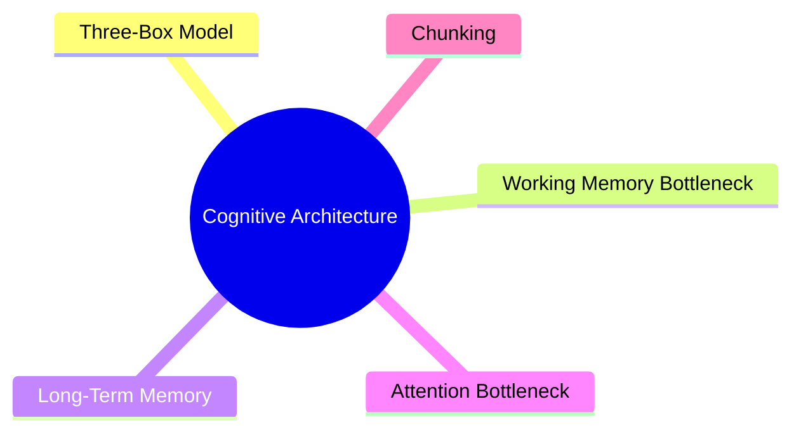
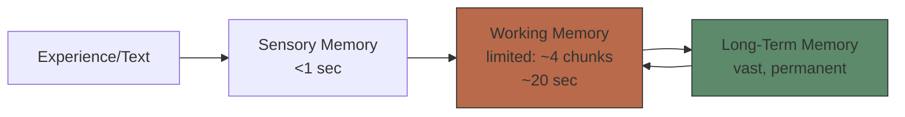
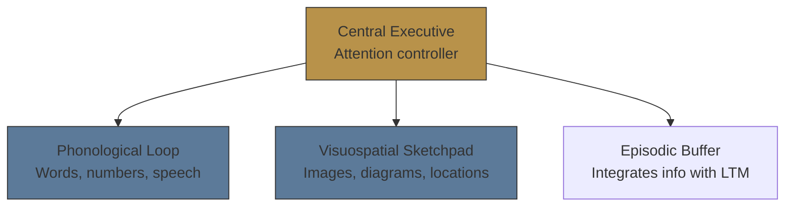
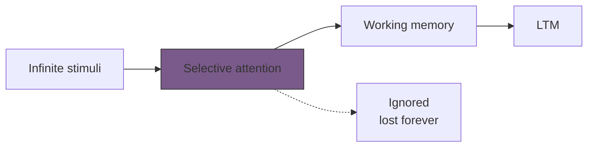

# Module 1: Cognitive Architecture — Working Memory & Long-Term Memory

Est. study time: 2h
Language: en
Description: Foundation module — how your brain processes and stores information. Everything else builds on this.

## Learning Objectives
- Describe the three-part cognitive architecture (sensory → working → long-term memory)
- Explain why working memory capacity limits learning
- Identify causes of cognitive overload and strategies to reduce it
- Apply chunking and attention management to own study sessions

---

## Real-World Example

You sit down to study a dense textbook chapter. Three pages in, you feel foggy. You re-read the same paragraph three times. Nothing sticks. You check your phone. You close the book frustrated.

Why? Not because you're lazy. Because your brain's processing system has a hard bottleneck — and you hit it.

> **Think**: What part of your brain got overwhelmed — storage space or processing speed?
>
> *Answer: Processing speed and temporary holding space. Your {working memory} filled up faster than your brain could transfer information to permanent storage.*

---

## Core Content

### The Three-Box Model

Human memory has three stages. Information flows through them sequentially:

**Sensory Memory** — holds raw sensory input for <1 second. Most of it decays immediately. Only what you *attend to* enters working memory.

**Working Memory** — your mental workspace. Holds ~4 chunks of information for ~20 seconds unless you actively rehearse or manipulate it. This is the bottleneck.

**Long-Term Memory** — effectively unlimited storage. Once information is consolidated here, it persists for years. The goal of learning is to move knowledge from WM into LTM reliably.

> **Think**: You read a phone number, walk to the other room, and forget it. Which memory system failed?
>
> *Answer: Working memory. The number never made it past ~20 seconds into LTM because you didn't rehearse or encode it.*

> **Cloze**: "Information enters through {sensory memory}, but only what we {attend to} passes into {working memory}."
>
> *Answer: sensory memory, attend to, working memory*

### Working Memory: The Bottleneck

Working memory is the gatekeeper of learning. If WM is overloaded, nothing passes through to LTM.

**Key properties:**
- **Capacity**: ~4 chunks (Miller 1956 proposed 7±2; Cowan 2010 revised to 4±1)
- **Duration**: ~20 seconds without active maintenance (rehearsal, manipulation)
- **Dual subsystems**: verbal (phonological loop) + visual-spatial (visuospatial sketchpad), coordinated by central executive

**Implication**: Reading text uses the phonological loop. Looking at a diagram uses the visuospatial sketchpad. Using both simultaneously = more total capacity → dual coding advantage.

> **Think**: Why does listening to music with lyrics while reading hurt comprehension?
>
> *Answer: Both compete for the phonological loop. Instrumental music uses visuospatial (no lyrics), so it interferes less.*

> **Predict**: You're studying anatomy. You read a text description of the heart (verbal) while looking at a labeled diagram (visual). Will this overload WM more or less than reading the description alone?
>
> *Answer: Less. Text uses phonological loop, diagram uses visuospatial sketchpad — different subsystems, more total bandwidth.*

### Long-Term Memory: The Destination

LTM has no known capacity limit. The challenge is not storage space — it's **retrieval**. Can you find what you stored when you need it?

**LTM types:**
- **Explicit (declarative)**: facts, events, concepts — "knowing that"
  - Semantic: general knowledge (Paris is capital of France)
  - Episodic: personal experiences (yesterday's lunch)
- **Implicit (procedural)**: skills, habits — "knowing how"
  - Riding a bike, typing, playing an instrument

**Retrieval strength vs Storage strength** (Bjork & Bjork 1992):
- **Storage strength**: how deeply information is embedded in LTM (grows with study, never declines)
- **Retrieval strength**: how easily you can access it right now (declines with disuse, spikes with practice)

You can have high storage strength but low retrieval strength — it's "in there" but you can't pull it out. This is the tip-of-the-tongue feeling.

> **Think**: You haven't played piano in 10 years. You sit down and struggle. After 15 minutes, muscle memory returns. Which changed — storage strength or retrieval strength?
>
> *Answer: Storage strength was intact (never declined). Retrieval strength was low from disuse and rose with practice.*

> **Cloze**: "A fact you learned years ago but can't recall right now has high {storage strength} but low {retrieval strength}."
>
> *Answer: storage strength, retrieval strength*

### The Attention Bottleneck

Before any of the above works, you must **pay attention**. Attention selects what enters WM from the firehose of sensory input.

Key finding: **humans cannot multitask**. Task-switching creates a "switch cost" — every context switch drains cognitive resources.

> **Spot the Mistake**: "I'm great at multitasking — I listen to podcasts while studying and it works fine."
>
> What's wrong?
>
> *Answer: You're not multitasking; you're task-switching. Your attention bounces between podcast and study material. Each switch costs mental energy, reduces comprehension, and slows encoding into LTM. What you learn is shallower.*

**Implication for study**: Single-task. Protect your attention. Block 25-50min focused intervals.

---

> **Think**: What's more effective: 3 hours of distracted studying with phone by your side, or 1 hour of focused deep work?
>
> *Answer: 1 hour of focused work. Distracted study fragments attention, increases switch costs, and prevents elaboration — information never moves from WM to LTM reliably.*

---

## Why This Matters

Every learning strategy in this course — spaced repetition, retrieval practice, dual coding, elaboration, interleaving — works *because of* cognitive architecture. They don't bypass the bottleneck; they work *within* its constraints.

If you ignore cognitive architecture:
- You re-read instead of retrieving (WM stays full, LTM stays empty)
- You multitask, hit the attention bottleneck, retain nothing
- You cram (single exposure, no consolidation → storage strength stays low)

If you respect it:
- You chunk information to fit WM's 4-slot limit
- You use dual coding to engage both WM subsystems
- You space practice to build retrieval strength over time
- You eliminate distractions to protect attention

---

## Key Takeaways
- Working memory holds ~4 chunks for ~20 seconds — it's the bottleneck
- LTM has unlimited storage; the real problem is retrieval, not space
- Storage strength and retrieval strength are different — you can know something but not access it
- Attention is the gatekeeper: no attention, no learning
- Dual coding (text + image) uses two WM subsystems = more bandwidth
- Multitasking is task-switching — each switch costs cognitive resources

---

## Common Misconception

**Misconception**: "I have a bad memory. I can't learn this."

**Reality**: Memory is not fixed. Learning is about *skills*, not *traits*. Retrieval strength builds with practice. Storage strength is permanent — once encoded, it never degrades. The feeling of "bad memory" is often low retrieval strength because of poor encoding strategies, not a fixed limit.

**Correct framing**: Memory responds to training. Use the right strategies, and retrieval improves.

---

## Spot the Mistake

"You should study 4 hours straight to really get into deep learning. Marathon sessions build mastery."

What's wrong?

*Answer: Working memory fatigues. After ~45-60 minutes of focused work, the central executive depletes and encoding efficiency drops. Short breaks restore WM capacity. The Pomodoro Technique (25min work + 5min break) or 50min + 10min aligns with cognitive limits. Marathon sessions = diminishing returns.*

---

## Feynman Explain

Imagine your brain has three parts. There's a small **bucket** on your desk that can only hold about four things at once — that's *working memory*, where you think. There's a giant **storage room** in the back that can hold everything you've ever learned — that's *long-term memory*. And there's a **doorman** at the door between them who decides what gets copied into storage — that's *attention*. Most learning problems come from the bucket overflowing or the doorman being distracted.

---

## Reframe

Cognitive architecture is, at heart, a constraint statement: the bottleneck is real and physical, not a matter of willpower. The same model shows up in computer science as RAM vs disk, and in manufacturing as WIP (work-in-progress) limits on a production line. The fix in every domain is the same: don't push more into the bottleneck at once; instead, increase chunk size (what you can hold per unit) and reduce interruptions (what the doorman has to process). If you've ever felt "smart on paper but slow at the desk," that's the architecture, not you.

---

## Drill
Take the quiz. MCQs test recall, application, and scenario analysis.

Run: `learn.sh quiz learning-theories 1`
