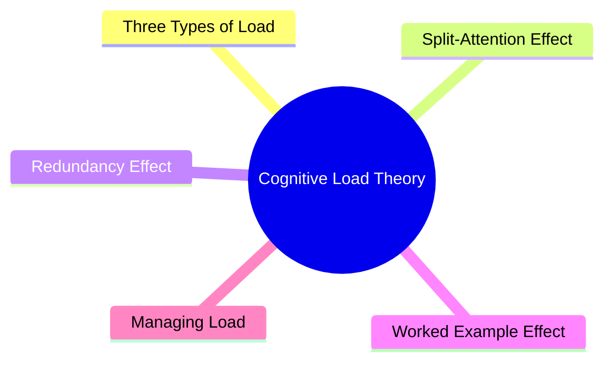
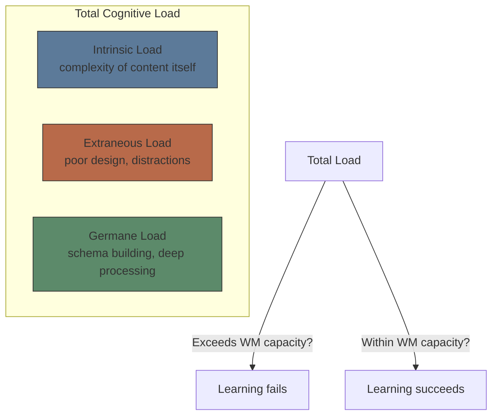
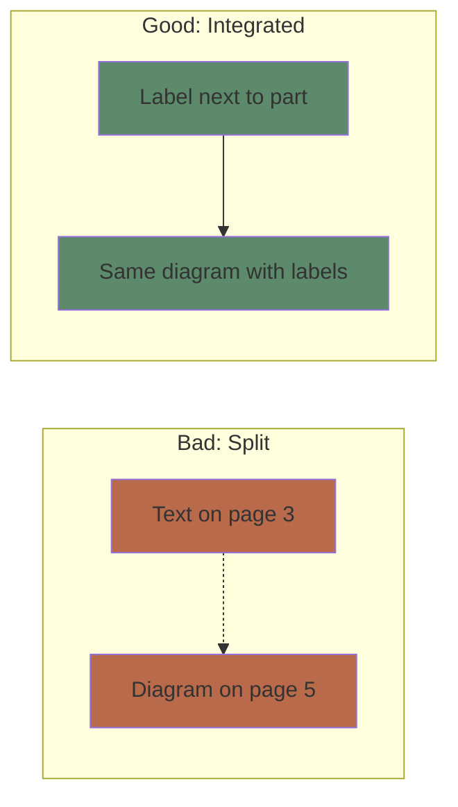
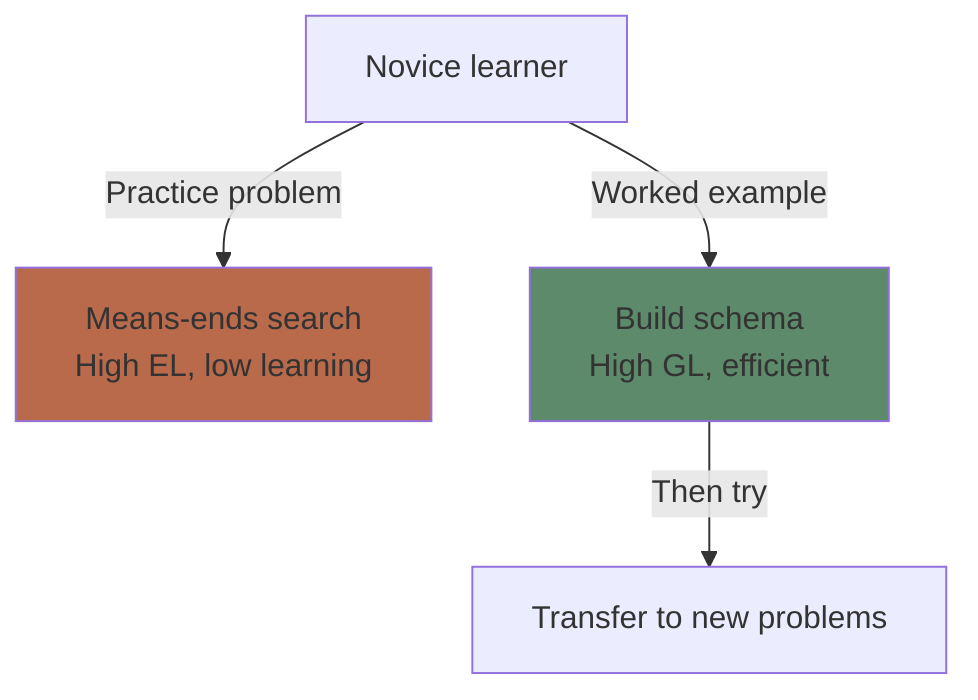
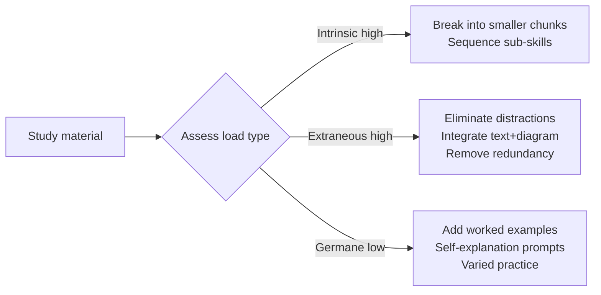

# Module 2: Cognitive Load Theory

Est. study time: 2h
Language: en
Description: Why some learning materials feel impossible — and how to design/choose materials that respect WM limits.

## Learning Objectives
- Distinguish intrinsic, extraneous, and germane cognitive load
- Identify and eliminate extraneous load in study materials
- Apply worked example principle and split-attention principle
- Design study sessions that maximize germane load

---

## Real-World Example

You're learning a new programming language. Tutorial A shows:
- Giant wall of text
- Code snippet on page 3, explanation on page 5
- Ad popups, inconsistent terminology, colorful sidebar animations

Tutorial B shows:
- One concept per section
- Code + explanation side by side
- Minimal decoration, consistent notation

Tutorial A leaves you exhausted after 10 minutes. Tutorial B clicks.

Both teach the same topic. The difference isn't complexity — it's **cognitive load design**.

> **Think**: What made Tutorial A harder despite same content?
>
> *Answer: Tutorial A created extraneous load — split attention between code and explanation, irrelevant visual noise. Tutorial B reduced extraneous load and let WM focus on actual learning.*

---

## Core Content

### The Three Types of Load

Cognitive Load Theory (Sweller 1988) divides mental effort into three categories:

**Intrinsic Load** — determined by the number of interacting elements in the material. High element interactivity = high intrinsic load. You cannot reduce intrinsic load without removing content (but you can sequence it).

**Extraneous Load** — caused by how information is presented. Split attention, redundant text, distracting visuals, unclear navigation. You should **minimize** this.

**Germane Load** — the good kind. Mental effort directed at building schemas, connecting ideas, understanding deep structure. You should **maximize** this.

> **Think**: You're learning a piano chord. The chord has 4 notes (intrinsic load). The sheet music has the chord notation on page 3 and the fingering diagram on page 5 (extraneous load). You practice the chord until it feels automatic (germane load). Which load type can you change?
>
> *Answer: Extraneous load (fix notation layout). Intrinsic load is fixed by the chord itself. Germane load comes from practice effort.*

> **Cloze**: "Cognitive load theory distinguishes {intrinsic} load (content complexity), {extraneous} load (poor presentation), and {germane} load (schema construction)."
>
> *Answer: intrinsic, extraneous, germane*

### The Split-Attention Effect

When learners must split attention between multiple sources of information that refer to each other, extraneous load spikes.

**Example**: A diagram of the heart with labels in a separate caption vs. labels directly on the diagram.

**Fix**: Integrate text and diagram. Label directly on the image. Put code and explanation side by side.

> **Spot the Mistake**: "My textbook has all the answers at the back. I like flipping back and forth to check."
>
> What's wrong?
>
> *Answer: Flipping pages creates split attention — WM wastes resources holding the question while searching for the answer. Integrated format (answer below question) eliminates the search cost.*

> **Predict**: A math worksheet has the formula at the top, example in the middle, and practice problems at the bottom. A second worksheet has the formula next to each problem. Which reduces extraneous load?
>
> *Answer: The second. Learners don't need to hold the formula in WM while solving each problem. Proximity reduces split attention.*

### The Redundancy Effect

Adding extra information that repeats or contradicts the primary content increases extraneous load — even if it seems helpful.

**Example**: A diagram is fully labeled. Adding a narrated description that reads the labels aloud is redundant. It forces WM to process the same information twice.

**Fix**: Remove redundant channels. If a diagram is self-explanatory, skip the paragraph explaining it.

> **Think**: A video shows an animation with both on-screen text AND a narrator reading the same text. Is this helpful or harmful?
>
> *Answer: Harmful. WM processes redundant info twice, wasting capacity. Redundancy effect: use narration OR text, not both for identical content.*

### The Worked Example Effect

Novice learners benefit more from studying worked examples than from solving problems. Problem-solving without adequate schemas overloads WM with unproductive search.

**Principle**: Replace some practice problems with fully worked solutions. Study the solution pattern → build schema → then attempt similar problems.

**Reversal**: As expertise grows, worked examples become redundant (expertise reversal effect). Experts benefit more from problem-solving.

> **Predict**: A beginner pianist studies a chord progression. Option A: explanation + 10 practice repetitions. Option B: explanation + 5 worked examples (annotated) + 5 practice repetitions. Which learns more?
>
> *Answer: Option B. Worked examples help build the schema before practice. Fewer repetitions with better schema = more efficient learning.*

> **Cloze**: "The {worked example} effect states that novices learn more from studying solved problems than from solving problems themselves."
>
> *Answer: worked example*

### Managing Cognitive Load in Practice

**Practical strategies:**
1. **Chunking**: Break complex topics into 2-4 sub-topics per session
2. **Fading worked examples**: Start with full worked example → partial (fill in blanks) → independent problem
3. **Self-explanation prompts**: "Why does this step work?" forces germane processing
4. **Pre-training**: Introduce key concepts/terms before diving into complex interactions

---

> **Think**: You must learn a complex 10-step procedure. Should you study all 10 steps at once or break into groups of 3?
>
> *Answer: Groups of 3. Intrinsic load is high (10 interacting elements). Sequencing reduces momentary intrinsic load, allowing schema construction for sub-routines before combining.*

---

## Why This Matters

Most "difficult" learning is actually poorly designed. CLT gives you a diagnostic lens:
- **Is the content genuinely complex?** → Sequence, pre-train, use worked examples
- **Is the presentation bad?** → Fix split attention, remove redundancy
- **Am I not processing deeply?** → Add self-explanation, variation

You can apply CLT as a learner AND as a content creator. It's the single most actionable theory for improving learning efficiency.

---

## Key Takeaways
- Total load must stay within WM capacity or learning fails
- Intrinsic load = content complexity (cannot reduce, can sequence)
- Extraneous load = poor design (must minimize)
- Germane load = schema building (must maximize)
- Split-attention: integrate related information spatially
- Redundancy: remove duplicate information across channels
- Worked examples: best for novices, fade as expertise grows
- Expertise reversal: what helps novices hurts experts

---

## Common Misconception

**Misconception**: "Making material harder (more text, more details, more complexity) produces better learning."

**Reality**: Adding unnecessary complexity increases extraneous load, reduces WM available for actual learning. The goal is **optimal difficulty** — challenging content (intrinsic load) presented clearly (low extraneous load) with active processing (high germane load).

**Correct framing**: More information ≠ more learning. Clear, integrated, focused material respects WM limits and produces better outcomes.

---

## Spot the Mistake

"A video lecture shows the professor's face in a corner box while slides with bullet points fill the screen. The professor reads each bullet aloud."

What's wrong?

*Answer: This hits two violations. (1) Redundancy: slides and narration say the same thing. (2) Split attention: face in corner adds visual noise. Better: use slides with diagrams (not text) while narration explains. Or use text slides with no narration (read silently).*

---
## Feynman Explain

Three things fill your brain's "thinking space." **Intrinsic load** is the topic itself — algebra is harder than addition, no matter how you teach it. **Extraneous load** is the mess around the topic — bad fonts, split diagrams, distracting colors, rambling videos. **Germane load** is the *good* effort you put into actually building understanding. Bad teaching maximizes the first two and starves the third. Good teaching minimizes extraneous, accepts intrinsic, and frees germane.

---

## Reframe

Cognitive Load Theory is essentially a UX principle for the mind: the user's working memory is the screen real estate, and any visual or procedural noise is dead pixels. The same logic drives progressive disclosure in software (don't show every option at once), level design in games (don't throw every enemy at you in minute one), and onboarding in any complex tool. If you've rage-quit a tutorial, you were almost certainly overloaded extraneously, not intrinsically.

---

## Drill
Run: `learn.sh quiz learning-theories 2`
