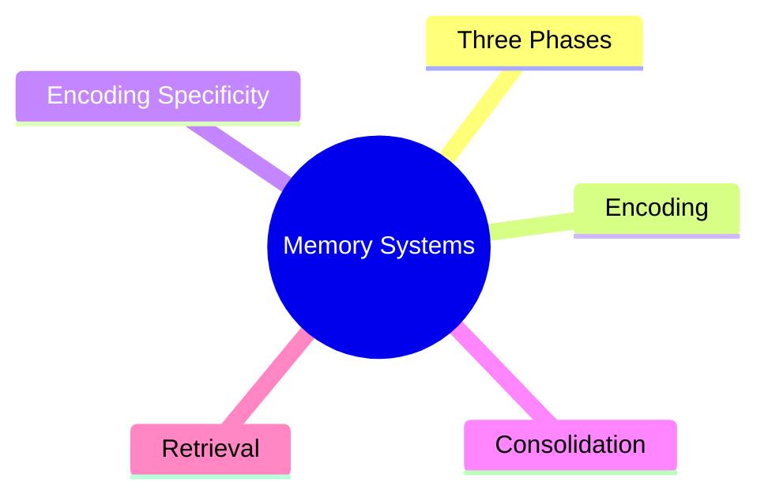
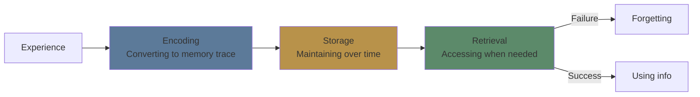
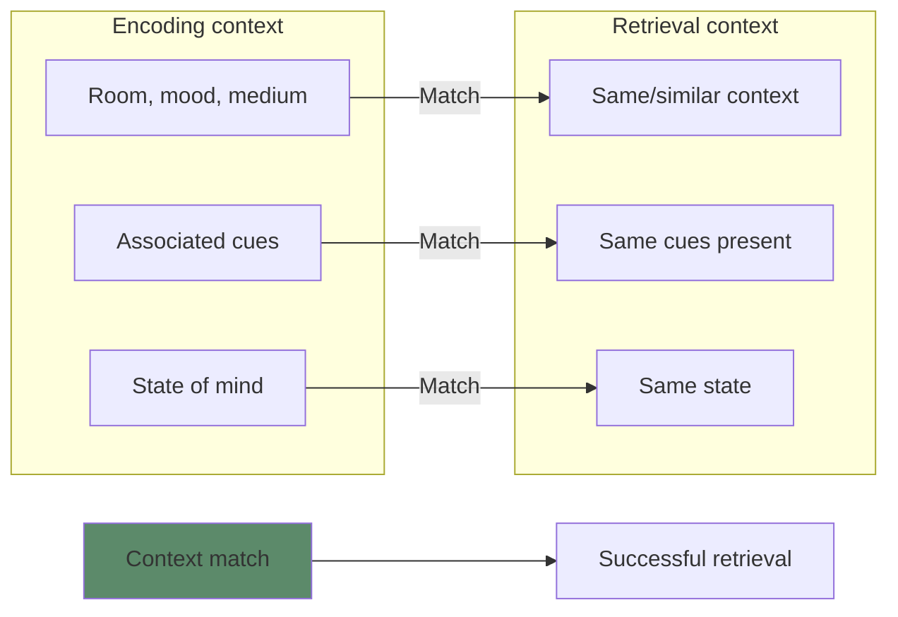
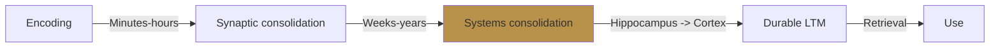

# Module 3: Memory Systems — Encoding, Storage, Retrieval

Est. study time: 2h
Language: en
Description: How information moves from experience to durable memory — and how to retrieve it when needed.

## Learning Objectives
- Describe the three phases of memory: encoding, storage, retrieval
- Apply encoding specificity principle to design better study contexts
- Distinguish recall, recognition, and relearning as retrieval measures
- Use elaborative encoding to strengthen initial learning

---

## Real-World Example

You meet someone at a conference. They tell you their name. Five minutes later, you've forgotten it. You meet again a year later at the same conference — you remember their face but not their name.

Three different memory failures happened: encoding (didn't register), storage (decayed), and retrieval (can't access despite storage).

> **Think**: Which failure is most fixable with better study habits? Which is least fixable?
>
> *Answer: Encoding is most fixable (pay attention, elaborate). Storage decay is fixable via repetition/consolidation. Retrieval failure is common even with good storage — need retrieval practice.*

---

## Core Content

### The Three Phases

**Encoding** — transforming sensory input into a memory representation. Quality of encoding determines everything downstream.

**Storage** — maintaining the memory trace over time. Affected by consolidation (especially during sleep). Storage strength is persistent.

**Retrieval** — accessing stored information. Depends on cues, context, and practice. Retrieval failure ≠ memory loss.

> **Think**: You study for a test and blank during the exam. After the test, you look up the answer and it comes back. Which phase failed?
>
> *Answer: Retrieval. The info was stored (you recognized it after seeing the answer), but you couldn't access it under the test conditions.*

### Encoding: Quality Matters More Than Quantity

Not all encoding is equal. The depth and richness of encoding predicts later retrieval.

**Shallow encoding**: Repeating a phone number in your head (maintenance rehearsal)
**Deep encoding**: Connecting the number to patterns you know (elaborative rehearsal)

**Factors that strengthen encoding:**
- **Attention**: full focus beats divided
- **Elaboration**: connect to existing knowledge
- **Organization**: structure the material meaningfully
- **Visual imagery**: create mental pictures
- **Self-reference**: relate to your own experience

> **Cloze**: "Simply repeating information in working memory ({maintenance rehearsal}) produces weaker encoding than connecting it to existing knowledge ({elaborative rehearsal})."
>
> *Answer: maintenance rehearsal, elaborative rehearsal*

> **Think**: Which encodes better: reading a list of 20 items 5 times, or reading them once and creating a story linking each item?
>
> *Answer: The story. It forces elaboration, organization, and visual imagery — all deep encoding processes.*

### Encoding Specificity Principle (Tulving 1983)

Retrieval is most effective when the context at retrieval matches the context at encoding. The memory trace includes the information AND its context.

**Examples:**
- **Context-dependent memory**: divers recall more when tested underwater vs on land (Godden & Baddeley 1975)
- **State-dependent memory**: information learned while happy is better recalled when happy
- **Mood-congruent memory**: current mood primes recall of events with similar emotional tone

**Implication**: Vary your study contexts. Don't always study in the same room, same chair, same time of day. You want retrieval to work anywhere.

> **Predict**: You study vocabulary words on your phone in bed. On the test, you're at a desk under bright lights. What happens?
>
> *Answer: Encoding specificity mismatch. The bed/phone context cues are absent at test. Retrieval is harder. Solution: study in varied contexts, including test-like conditions.*

> **Cloze**: "The {encoding specificity} principle states that retrieval is best when context at test matches context at study."
>
> *Answer: encoding specificity*

### Storage: Consolidation Takes Time

Memory doesn't solidify instantly. **Consolidation** is the process of stabilizing a memory trace after initial encoding.

**Key facts:**
- Synaptic consolidation: occurs within hours
- Systems consolidation: occurs over weeks to years (hippocampus → neocortex)
- Sleep plays a critical role (more in Module 14)
- Emotionally arousing events consolidate faster (amygdala modulation)

**Implication**: Spaced practice works because each repetition triggers reconsolidation, strengthening the trace. Massed practice (cramming) triggers initial consolidation but no reinforcement.

> **Think**: Why does cramming the night before produce brittle memories that fade quickly?
>
> *Answer: One consolidation cycle = weak trace. Spaced repetitions trigger reconsolidation each time, progressively strengthening storage.*

### Retrieval: The Real Test of Learning

Three ways to measure retrieval — from weakest to strongest signal:

| Measure | What it means | Example |
|---------|--------------|---------|
| **Recall** | Retrieve without cues | Essay question, blank page |
| **Recognition** | Identify correct from options | Multiple choice |
| **Relearning** | How fast you re-learn | Same material, less time needed |

**Retrieval failure** is common. The information is stored but inaccessible. Common causes:
- **Interference**: similar memories compete (proactive/retroactive)
- **Decay**: retrieval strength declines without use
- **Cue mismatch**: wrong context triggers wrong memory

> **Spot the Mistake**: "I failed the oral exam but passed the written one. I clearly don't know the material."
>
> What's wrong?
>
> *Answer: Different retrieval modes test different access paths. Oral requires rapid recall under social pressure. Written allows more time and different cues. You may have storage strength but context-dependent retrieval failure.*

**Retrieval practice** (Module 7) directly trains the retrieval mechanism — it's not just assessment, it's a learning tool.

> **Predict**: Two students study the same material. Student A re-reads the chapter 5 times. Student B reads it once, then quizzes themselves 5 times. Who retrieves better a week later?
>
> *Answer: Student B. Retrieval practice strengthens the retrieval pathway itself. Re-reading improves encoding but doesn't train retrieval.*

---

## Why This Matters

Memory is not a tape recorder. It's constructed at encoding, consolidated over time, and reconstructed at retrieval. Each phase can be optimized:

- **Encoding**: pay attention, elaborate, organize, visualize
- **Storage**: space repetitions, sleep on it, avoid interference
- **Retrieval**: practice retrieval, vary context, use multiple formats

Most study strategies fail because they optimize only one phase (usually encoding via re-reading) while neglecting storage and retrieval.

---

## Key Takeaways
- Memory has three phases: encoding, storage, retrieval — optimize all three
- Encoding quality determines storage durability
- Encoding specificity: match context between study and test
- Storage requires consolidation over time — sleep is critical
- Retrieval failure ≠ memory loss — improve cues and practice
- Recognition (multiple choice) is easier than recall (blank page) — test yourself with recall

---

## Common Misconception

**Misconception**: "If I can recognize the answer when I see it, I know it well enough."

**Reality**: Recognition is the weakest retrieval measure. It doesn't predict recall. You may recognize a face but fail to recall a name under pressure. Self-test with recall (no cues) for strong learning.

**Correct framing**: True mastery means you can recall without cues. Test yourself the hardest way — blank page, no options.

---

## Spot the Mistake

"You should always study in the same quiet room. Consistency builds good habits."

What's wrong?

*Answer: Encoding specificity means you become dependent on that room's cues. Take the test in a different room and retrieval suffers. Vary study locations to build context-independent memories.*

---
## Feynman Explain

Memory has three jobs. **Encoding** = writing it down (or letting the brain write it). **Storage** = keeping it. **Retrieval** = finding it later. Most people only think about encoding. But storage fails because you never consolidated, and retrieval fails because the cue doesn't match — like looking for a book in the wrong library. Three problems, three fixes: better encoding (deep processing), sleep + spacing (consolidation), and matching study context to test context (retrieval cues).

---

## Reframe

The three-phase model is the same shape as any information pipeline: input, persistence, output. It's how compilers work (parse → store bytecode → load on call), how databases work (write → index → query), and how a kitchen works (prep → fridge → plate). The non-obvious lesson: you can fail at any of the three stages and never know which one. That's why "I studied it" is a meaningless claim — it doesn't specify which phase broke.

---

## Drill
Run: `learn.sh quiz learning-theories 3`
