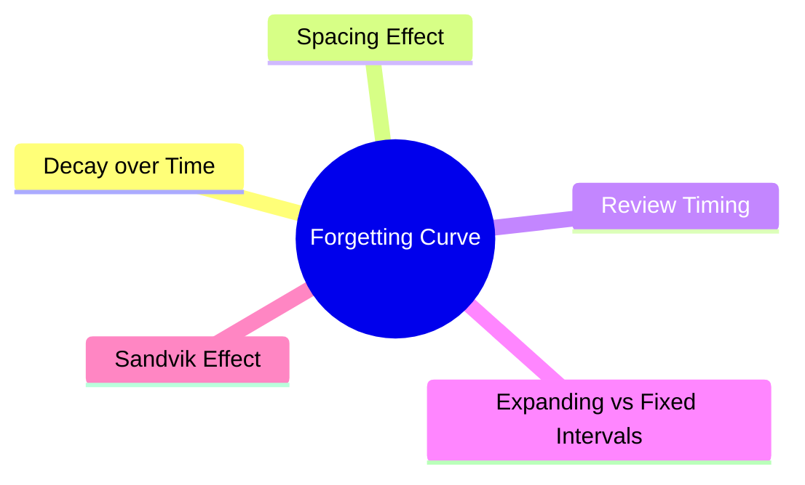
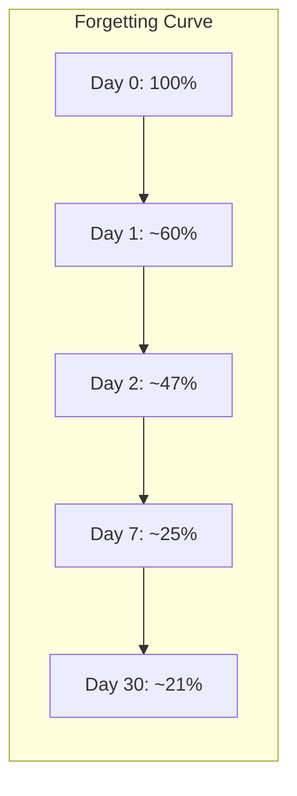
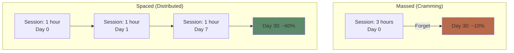

# Module 4: The Forgetting Curve & Spacing Effect

Est. study time: 2h
Language: en
Description: Why forgetting is predictable — and how to time your reviews for maximum retention with minimum effort.

## Learning Objectives
- Describe the shape and cause of the forgetting curve
- Explain why spaced practice beats massed practice
- Apply expanding and fixed-interval review schedules
- Design a spaced repetition schedule for any topic

---

## Real-World Example

You attend a 2-hour workshop. You take notes. You feel like you learned a lot. One week later, you remember maybe 20%. One month later, almost nothing.

This isn't a personal failing. It's a mathematical certainty — the **forgetting curve** is as predictable as gravity.

> **Think**: If you reviewed the material for 5 minutes the next day, then 5 minutes the next week, then 5 minutes the next month, would you still forget almost everything?
>
> *Answer: No. Strategic reviews interrupt the forgetting curve and flatten it. The total time invested is ~15 minutes — less than 10% of the workshop.*

---

## Core Content

### The Forgetting Curve

Ebbinghaus (1885) memorized nonsense syllables and tested himself at various delays. The result:

The curve is **logarithmic**: most forgetting happens within hours, then slows. The steepness depends on encoding quality.

**Key variables that affect forgetting rate:**
- **Encoding depth**: meaningful connections = slower forgetting
- **Prior knowledge**: more hooks = slower forgetting
- **Sleep**: consolidation after encoding = slower forgetting
- **Interference**: similar material learned after = faster forgetting

> **Cloze**: "The forgetting curve is {logarithmic} — most forgetting occurs {immediately after} learning, then the rate {decelerates}."
>
> *Answer: logarithmic, immediately after, decelerates*

> **Think**: Why do you forget more in the first hour than in the next week?
>
> *Answer: Initial memory trace is fragile. Without consolidation (sleep + time), it decays rapidly. Surviving traces are stronger and decay more slowly.*

### The Spacing Effect

Multiple study sessions spread over time produce better long-term retention than the same total time crammed into one session.

Same total time (3 hours). Different schedule. Vastly different outcome.

**Why spacing works:**
1. **Forgetting during intervals** forces harder retrieval → deeper re-encoding
2. **Context variation** across sessions → context-independent memory
3. **Consolidation time** — each session triggers reconsolidation

> **Predict**: Student A studies 2 hours daily for 5 days. Student B studies 10 hours on the day before the exam. Same total time. Who remembers more a week after the test?
>
> *Answer: Student A. Spaced practice produces durable storage. Student B's cramming produces temporary retrieval strength that collapses quickly.*

### Optimal Review Timing

When should you review? The **optimal gap** depends on when you'll next need the information.

**General principle**: Review at increasing intervals. Research suggests:

| Study type | Typical interval |
|------------|-----------------|
| First review | 1-2 days after initial learning |
| Second review | 7-10 days |
| Third review | 16-30 days |
| Ongoing maintenance | 1-6 months |

**Formal systems:**
- **Leitner system**: physical flashcards sorted by box (review box 1 daily, box 2 every 2 days, box 3 weekly...)
- **SM-2 (SuperMemo)**: algorithm-based intervals
- **FSRS-5**: modern algorithm (used by Anki), adapts per card based on performance

> **Cloze**: "The {spacing effect} is the finding that {distributed} practice produces better long-term retention than {massed} practice."
>
> *Answer: spacing effect, distributed, massed*

### Expanding vs Fixed Intervals

Which interval pattern works better?

| Pattern | Sequence | Pro |
|---------|----------|-----|
| **Expanding** | 1d → 3d → 7d → 21d → 2mo | Intuitive, gradual |
| **Fixed** | 7d → 7d → 7d → 7d | Simpler to schedule |

Research (Cepeda et al. 2006): expanding intervals may have slight edge, but the key factor is **spacing exists at all**, not the exact pattern. Fixed intervals at the right gap perform nearly as well.

**Pragmatic advice**: Use expanding intervals (most SRS systems do this). But don't over-optimize — the biggest win is moving from massed to any spaced schedule.

> **Think**: If spaced = good, is more spacing always better? What happens if you wait 1 year before reviewing?
>
> *Answer: Too-long intervals → complete retrieval failure → no learning benefit. The sweet spot is the longest interval that still allows partial retrieval (the "testable" moment).*

### The Sandvik Effect

A counterintuitive finding: **studying before sleep** produces better retention than studying in the morning (tested next day). Reason: sleep consolidates recent memories without interference from waking activity.

**Practical tip**: Learn new material in evening → sleep → review next morning. This leverages the forgetting curve and sleep consolidation synergistically.

> **Spot the Mistake**: "I should review immediately after learning to catch the information before I forget it."
>
> What's wrong?
>
> *Answer: Immediate review is too easy — it bypasses retrieval effort. The gap should be long enough that retrieval requires effort but not so long that it fails entirely. The desirable difficulty strengthens the memory.*

---

## Why This Matters

The forgetting curve is not destiny. Once you understand it:
- You stop feeling guilty about forgetting (it's normal)
- You design review schedules instead of cramming
- You get more retention per unit of study time
- You build durable knowledge instead of test-passing knowledge

Spaced repetition is the single highest-ROI learning strategy in cognitive science.

---

## Key Takeaways
- Forgetting follows a predictable logarithmic curve
- Spaced practice produces 2-3x better retention than massed practice
- Review at increasing intervals (1 day → 1 week → 1 month)
- The optimal gap is the longest one where retrieval still succeeds
- Any spaced schedule beats cramming — don't over-optimize
- Sleep soon after learning enhances consolidation

---

## Common Misconception

**Misconception**: "If I study something every day, I'll remember it forever."

**Reality**: Daily study of the same material is overkill after initial encoding. Once a memory is consolidated, longer intervals maintain it. Daily review wastes time that could be spent on new material.

**Correct framing**: Space reviews to the longest interval that still maintains retrieval. Trust the forgetting curve — you don't need to reset it to zero every time.

---

## Spot the Mistake

"I downloaded Anki and set all cards to 1-minute intervals. I drill them 50 times until perfect."

What's wrong?

*Answer: 1-minute intervals bypass the spacing effect — retrieval is too easy, no desirable difficulty. You're doing massed practice with extra steps. Set meaningful gaps (1 day+) and trust the algorithm.*

---

## Feynman Explain
(Explain the forgetting curve: memory drops fast then slows. If you review at the right moments, you flatten the curve. Like watering a plant — not every day, but when it needs it.)

---

## Reframe
(Judge: think of something you learned years ago that you still remember vs something you crammed and forgot. What made the difference in schedule? How would you redesign your current study routine?)

---

## Drill
Run: `learn.sh quiz learning-theories 4`
