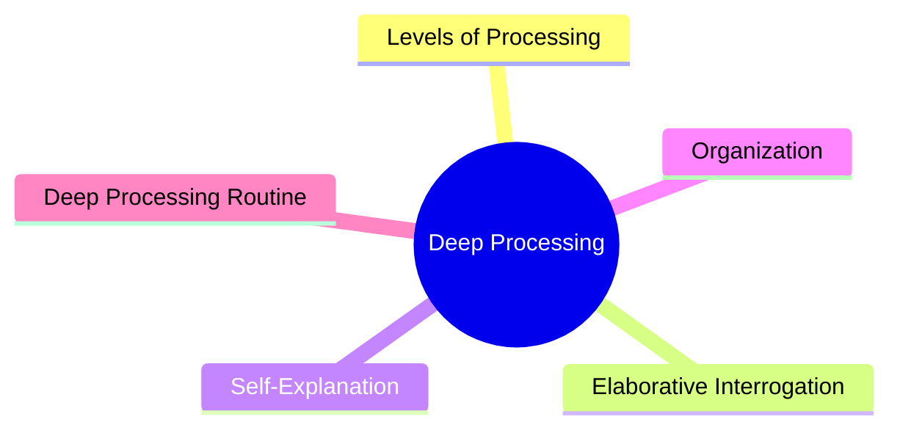
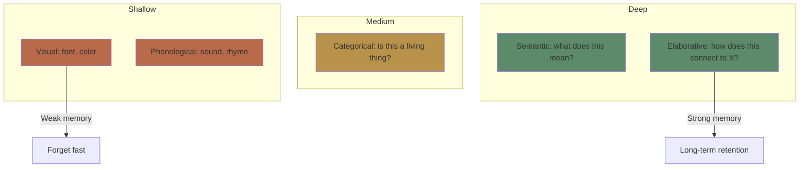
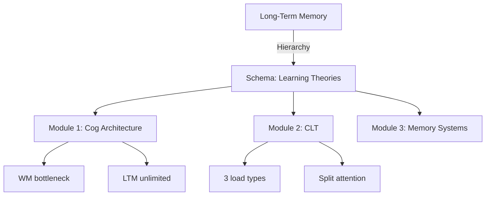

# Module 5: Deep Processing & Elaboration

Est. study time: 2h
Language: en
Description: Why connecting new information to what you already know is the most powerful encoding strategy.

## Learning Objectives
- Distinguish shallow, medium, and deep levels of processing
- Apply elaborative interrogation ("why is this true?") to any topic
- Use self-explanation to deepen understanding
- Organize knowledge to improve retrieval

---

## Real-World Example

You read a book chapter. Two hours later, you can summarize the main idea but not the supporting details. Your friend read the same chapter and can explain how each point connects to examples from their work.

Same input, different **processing depth**. Your friend was asking "why does this matter?" and "how does this connect?" while you were reading passively.

> **Think**: What's the difference between reading with a highlighter vs reading while constantly asking "why?"
>
> *Answer: Highlighting is shallow encoding (visual marking). Asking "why" forces elaboration — connecting new info to existing knowledge, which creates more retrieval pathways.*

---

## Core Content

### Levels of Processing (Craik & Lockhart 1972)

Processing depth determines retention — not time spent or intention to learn.

**Shallow processing**: Appearance (visual), sound (phonological). Produces fragile memories.

**Medium processing**: Categorization, basic meaning. Better than shallow.

**Deep processing**: Meaning, connections, implications. Produces durable memories.

**Key insight**: You can't force deep processing by "trying harder." You must engage in specific mental operations that create rich, connected representations.

> **Think**: Which of these encodes better — reading a definition 5 times or explaining it in your own words once?
>
> *Answer: Explaining once. Reading is shallow (visual/phonological repetition). Explaining forces semantic elaboration and organization.*

> **Cloze**: "The {levels of processing} framework states that memory durability depends on {depth of encoding}, not time spent or intention to learn."
>
> *Answer: levels of processing, depth of encoding*

### Elaborative Interrogation

The single most effective deep-processing technique: **ask "why is this true?"**

| Shallow study | Deep study |
|--------------|------------|
| "The Byzantine Empire fell in 1453." | "Why did the Byzantine Empire fall in 1453? What factors converged?" |
| "Cognitive load has three types." | "Why does cognitive load theory distinguish three types? What problem does each solve?" |

Elaborative interrogation forces you to:
1. Activate prior knowledge (search for explanations)
2. Connect new info to existing schema
3. Identify gaps in your understanding
4. Generate inferences beyond the text

**Evidence**: Pressley et al. (1987) — students who asked "why" questions while reading remembered 50-100% more than control groups.

> **Predict**: You're studying the concept "desirable difficulties." You ask "why are desirable difficulties desirable?" What does this force your brain to do?
>
> *Answer: You must search for the causal mechanism (they create retrieval effort, which strengthens memory). This activates prior knowledge about memory and forces integration.*

> **Cloze**: "Elaborative interrogation — asking '{why}' a fact is true — is a powerful {deep encoding} technique because it forces you to {connect new information to existing knowledge}."
>
> *Answer: why, deep encoding, connect new information to existing knowledge*

### Self-Explanation

While elaborative interrogation focuses on the material, **self-explanation** focuses on your own understanding process.

**Self-explanation prompts:**
- "What does this mean in my own words?"
- "How does this relate to what I already know?"
- "Can I give a new example of this?"
- "Why does this step follow from the previous one?"

**Particularly effective for**: procedural skills, math, programming, problem-solving.

> **Think**: You're learning a math proof. Which is more effective: studying the proof 3 times, or studying it once then explaining each step to yourself?
>
> *Answer: Self-explaining each step. It reveals gaps in understanding that re-reading hides. The illusion of fluency (Module 10) makes re-reading feel productive when it isn't.*

### Organization & Structure

Organized knowledge is retrieved faster and more reliably than disorganized knowledge.

**Hierarchical organization**: Superordinate → subordinate categories
**Chunking**: Group related items into meaningful units
**Schema**: Mental framework that organizes related concepts

**Study strategy**: Create knowledge maps, hierarchies, and outlines. The act of organizing is itself a deep encoding activity.

> **Spot the Mistake**: "I just need to memorize these 50 facts. I'll use flashcards with the fact on one side and the answer on the other."
>
> What's wrong?
>
> *Answer: Isolated facts lack organization and connections. They form separate, fragile traces. Organizing facts into categories, hierarchies, and causal chains creates a rich network — retrieval of one fact activates others.*

### Practical Deep Processing Routine

For any concept you want to learn deeply:

1. **Read** the material once for basic understanding
2. **Elaborative interrogation**: ask "why is this true?" for each claim
3. **Self-explanation**: put each section in your own words
4. **Connect**: link to concepts from other modules (this course builds on itself!)
5. **Organize**: draw a concept map or outline

This routine takes about the same time as re-reading — but produces 2-3x better retention.

> **Think**: Why do you remember vivid stories better than lists of facts?
>
> *Answer: Stories trigger all deep processing automatically — causal links (why?), connections to experience, emotional engagement, and temporal organization. Lists don't.*

---

## Why This Matters

Deep processing is the **mechanism** behind most other learning strategies. Retrieval practice, spacing, and dual coding all work by forcing deeper processing. If you understand depth, you can evaluate any study strategy: "does this force deep encoding?"

---

## Key Takeaways
- Processing depth predicts retention — not time spent, not effort, not "trying hard"
- Shallow = visual/phonological → fragile memory
- Deep = semantic/elaborative/connected → durable memory
- Ask "why is this true?" (elaborative interrogation)
- Explain concepts to yourself (self-explanation)
- Organize knowledge hierarchically
- Deep processing can be trained — it's a skill, not a trait

---

## Common Misconception

**Misconception**: "Rereading is an effective study strategy. Most students do it."

**Reality**: Rereading is shallow processing. It feels productive because the material becomes familiar. But familiarity ≠ learning. You can read a paragraph 10 times and still fail to recall it 5 minutes later.

**Correct framing**: Rereading is maintenance rehearsal. To learn, you need elaborative rehearsal — connecting, questioning, organizing.

---

## Spot the Mistake

"I made beautiful highlighted notes with color-coded sections. Surely this is deep processing."

What's wrong?

*Answer: Highlighting and color-coding are shallow (visual processing). The brain processes the act of highlighting as "this is important" — but doesn't encode the content. Spend that time asking "why" instead.*

---

## Feynman Explain
(Explain deep processing: your brain has a shallow end (just looking at words) and a deep end (connecting ideas to what you already know). The deep end is where memories become permanent. To get there, ask "why?" like a curious child.)

---

## Reframe
(Judge: think of the last thing you studied. Were you processing deeply or just reading? Pick one concept and apply elaborative interrogation right now. Did it change your understanding?)

---

## Drill
Run: `learn.sh quiz learning-theories 5`
