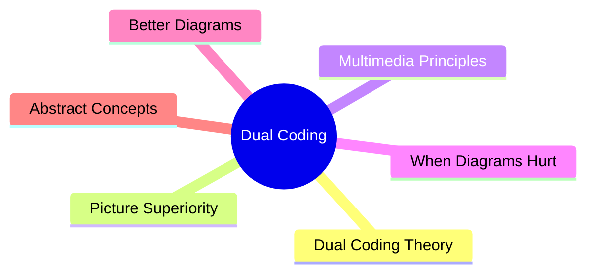
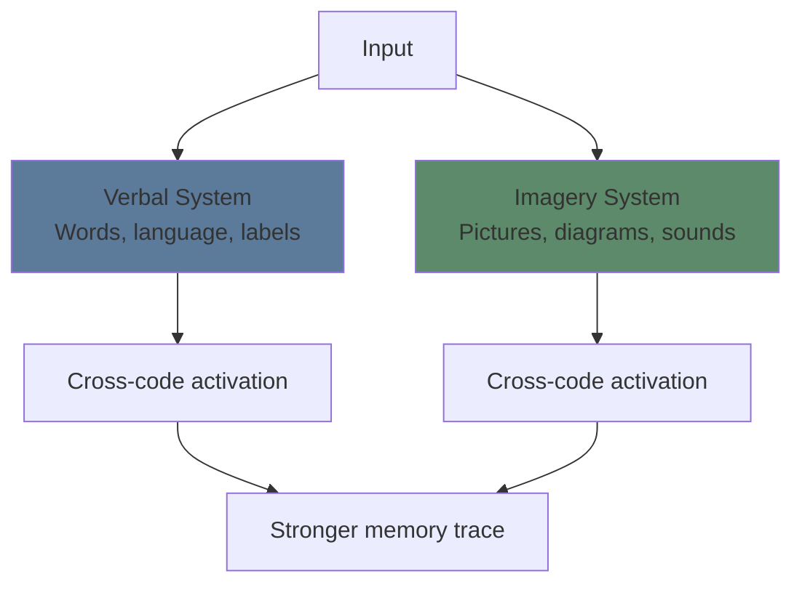
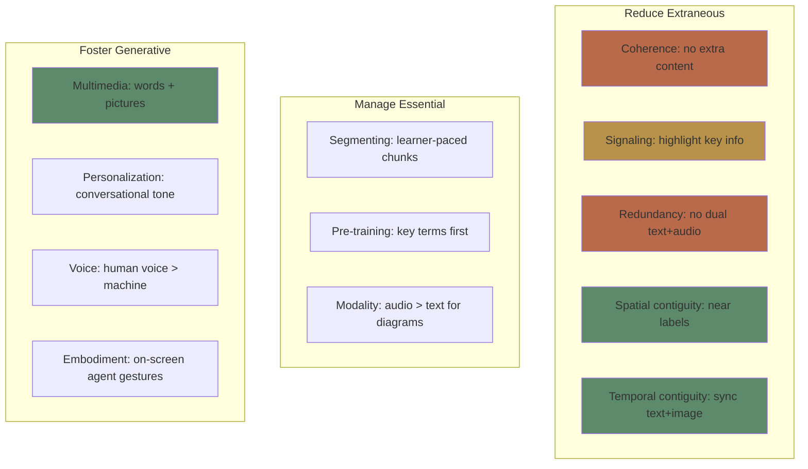

# Module 6: Dual Coding & Multimedia Learning

Est. study time: 2h
Language: en
Description: Why combining words with visuals is more effective than either alone — and when it's not.

## Learning Objectives
- Explain Paivio's dual coding theory and its implications
- Apply Mayer's 12 principles of multimedia learning
- Design effective diagrams, not decorative ones
- Avoid common multimedia design mistakes

---

## Real-World Example

You search for a concept online. You find two explanations:

Option A: A wall of text describing how photosynthesis works — molecules, pathways, chemical reactions.

Option B: A labeled diagram showing the same process with arrows, plus a short caption explaining each step.

Option B takes 30 seconds to grasp. Option A takes 5 minutes and still feels fuzzy.

This isn't because Option A is wrong. It's because **dual coding** — combining verbal and visual — leverages two separate cognitive subsystems.

> **Think**: Why is a labeled diagram faster to understand than text alone?
>
> *Answer: Text uses phonological loop (verbal). Diagram uses visuospatial sketchpad (visual). Together they use more total WM bandwidth. Also, spatial layout conveys relationships directly.*

---

## Core Content

### Dual Coding Theory (Paivio 1971)

Two separate but interconnected systems process and represent information:

**Verbal system** — processes language: words, sentences, labels, narratives.
**Imagery system** — processes non-verbal: pictures, diagrams, sounds, tactile sensations.

**Key insight**: Information encoded in BOTH systems creates two memory traces. Two retrieval paths. Redundancy protects against forgetting.

> **Cloze**: "Paivio's dual coding theory proposes two separate cognitive subsystems: a {verbal} system for words and an {imagery} system for pictures."
>
> *Answer: verbal, imagery*

> **Think**: You studied a concept with both text and diagram. Later you forget the text but still remember the diagram. Can you reconstruct the concept?
>
> *Answer: Often yes — the visual trace can trigger cross-code activation, helping reconstruct the verbal information. That's exactly why dual coding is powerful.*

### The Picture Superiority Effect

Pictures are remembered better than words — across virtually all conditions.

**Why:**
- Pictures are more distinctive (less overlap with other stored images)
- Pictures automatically engage dual coding (the picture + the label you give it)
- Pictures encode holistically, not sequentially

**Example**: Show people 10,000 images over 5 days. Later, 83% recognition accuracy. Show 10,000 words — much lower.

> **Predict**: You study 100 vocabulary words. For 50 words, you see just the word + definition. For the other 50, you see the word + definition + an icon. Which set will you recall better a week later?
>
> *Answer: The set with icons. The visual component creates a second memory trace and retrieval path.*

### Mayer's 12 Principles of Multimedia Learning

Mayer (2001) synthesized decades of research into principles for designing effective multimedia instruction.

**Four most actionable principles for your own learning:**

| Principle | Rule | Example |
|-----------|------|---------|
| **Multimedia** | Words + pictures > words alone | Diagram + caption > text only |
| **Coherence** | Remove extraneous content | No decorative clip art, no tangents |
| **Spatial contiguity** | Place labels next to what they label | Not on a separate legend |
| **Signaling** | Highlight what matters | Bold, arrows, color cues |

> **Think**: Why does coherence (removing extra content) improve learning? Doesn't more information always help?
>
> *Answer: Extra content increases extraneous load. Decorative graphics, interesting-but-irrelevant facts, and tangents drain WM capacity. Less is more.*

### When Diagrams Hurt (And How to Fix)

Diagrams aren't automatically better. Poor diagrams create confusion.

**Common diagram problems:**

| Problem | Why it hurts | Fix |
|---------|-------------|-----|
| Too complex | Visual overload — too many elements | Simplify, layer (show one level at a time) |
| Unlabeled | Learner must search for meaning | Label every element |
| Inconsistent notation | Re-learning required per diagram | Standardize symbols, colors |
| Decorative only | Adds extraneous load | Remove or replace with functional diagram |
| Text-image split | Split attention | Integrate labels into diagram |

> **Spot the Mistake**: "I added a cool infographic to my notes. It has lots of icons, colors, and data. More visual = more learning."
>
> What's wrong?
>
> *Answer: Decorative complexity ≠ dual coding. Icons and colors that don't carry meaning add extraneous load. Effective diagrams minimize visual noise and maximize information per pixel.*

### Creating Better Diagrams for Your Own Study

When you study, don't just consume diagrams — **generate them**.

**Generation effect**: Creating your own diagram produces deeper processing than studying someone else's.

**Study routine:**
1. Read the text
2. Close the book
3. Draw a diagram from memory
4. Compare with original
5. Fill in gaps

This combines retrieval practice (step 3) with dual coding (step 3-4) — powerful combination.

> **Predict**: Two students study the same text about the water cycle. Student A re-reads 3 times. Student B reads once, then draws the cycle from memory, then checks. Who understands better?
>
> *Answer: Student B. Drawing from memory forces retrieval AND dual coding AND self-explanation of relationships.*

> **Cloze**: "The {generation effect} shows that creating your own {diagram} produces deeper processing than studying a pre-made one."
>
> *Answer: generation effect, diagram*

### Dual Coding for Abstract Concepts

Some concepts are hard to visualize (consciousness, justice, entropy). For abstract concepts:
- Use **metaphors** (attention is a spotlight)
- Use **hierarchies** (tree diagrams)
- Use **flowcharts** (process maps)
- Use **comparison tables** (structures with empty cells)

Even abstract ideas benefit from visual organization — the structure conveys relationships even when the content is conceptual.

> **Think**: How would you visually represent "long-term memory is unlimited but retrieval can fail"?
>
> *Answer: A huge warehouse (LTM) with a small, dim flashlight (retrieval). The warehouse has everything — but you can only see what the flashlight illuminates. The rest is "in storage" but inaccessible.*

---

## Why This Matters

You consume visual information constantly — videos, slides, diagrams, infographics. Dual coding principles help you:
- **As a learner**: choose materials with effective visuals, create your own
- **As a note-taker**: build diagrams, not just text dumps
- **As a content creator**: design presentations that actually teach

The difference between a good explanation and a great one is often visual design.

---

## Key Takeaways
- Dual coding uses two subsystems (verbal + imagery) → two memory traces
- Pictures are remembered better than words (picture superiority effect)
- Mayer's principles: multimedia, coherence, contiguity, signaling are most actionable
- Bad diagrams hurt learning — decorative visuals increase extraneous load
- Generating your own diagrams is more effective than studying pre-made ones
- Abstract concepts still benefit from visual organization (metaphors, flowcharts)

---

## Common Misconception

**Misconception**: "Adding pictures always makes learning better."

**Reality**: Pictures help when they convey meaning (functional diagrams). Decorative pictures, animations, and clip art increase extraneous load without adding information.

**Correct framing**: Add visuals that carry meaning — diagrams, graphs, flowcharts. Remove visuals that are just decoration.

---

## Spot the Mistake

"A presentation slide has a dense paragraph of text on the left and an unrelated stock photo of a handshake on the right."

What's wrong?

*Answer: Three violations. (1) The photo is decorative — adds extraneous load. (2) Dense text paragraph should be broken into bullet points or a diagram. (3) Text + unrelated image creates split attention and confusion.*

---
## Feynman Explain

Your brain has two separate channels for information: one for words/language and one for images. When you learn something *both* ways, you store it twice, in two different places. Later, you have two ways to find it — either by remembering the words or by remembering the picture. That's why a labelled diagram beats a paragraph. And it's why drawing a concept (even badly) often cements it more than re-reading about it. You're literally writing it into a different memory system.

---

## Reframe

Dual coding is the principle behind why most great explainers (3Blue1Brown, Bret Victor, Hans Rosling) succeed: they don't just talk, they *show*. The same logic is why good UI designers mock up screens before coding and why chess players visualize positions rather than reading notation. The narrow version — "study with images" — is a useful study hack. The wide version: anything you want to be retrievable should be encoded in at least two modalities, not one.

---

## Drill
Run: `learn.sh quiz learning-theories 6`
