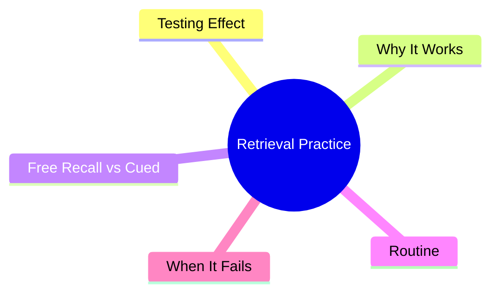
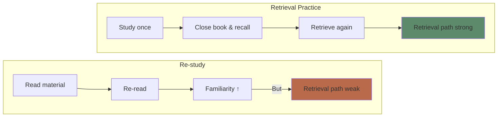
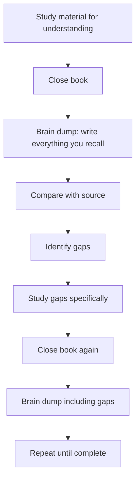

# Module 7: Retrieval Practice

Est. study time: 2h
Language: en
Description: Why quizzing yourself is the most powerful single learning strategy — not for assessment, but for memory formation.

## Learning Objectives
- Explain the testing effect and why retrieval strengthens memory
- Distinguish free recall, cued recall, and recognition
- Implement retrieval practice in any study routine
- Design effective self-quizzing strategies

---

## Real-World Example

Two students prepare for an exam. Student A reads the textbook chapter 4 times, highlights key passages, reviews notes. Student B reads the chapter once, closes the book, and tries to recall everything from memory.

Student B feels less confident during study. Student A feels more confident. But Student B scores higher on the exam.

This is the **testing effect** — the counterintuitive finding that retrieval practice produces better long-term learning than re-study, even though it feels harder.

> **Think**: Why did Student A feel more confident but perform worse?
>
> *Answer: Re-reading creates fluency (easy processing = feeling of knowing). Retrieval feels difficult because it IS difficult — that difficulty is the learning signal.*

---

## Core Content

### The Testing Effect

Retrieving information from memory changes the memory itself — strengthening it and making it more retrievable in the future.

**Roediger & Karpicke (2006)**: Students studied prose passages. Some re-studied, others were tested. On a final test 1 week later:

| Group              | Recall after 5 min | Recall after 1 week |
| ------------------ | ------------------ | ------------------- |
| Study once         | 81%                | 40%                 |
| Re-study           | 84%                | 42%                 |
| Retrieval practice | 68%                | 61%                 |

Retrieval practice felt worse initially (68% vs 84%) but produced ~45% better long-term retention (61% vs 42%).

> **Cloze**: "The {testing effect} is the finding that retrieving information from memory produces better {long-term retention} than re-studying, even though it {feels harder}."
>
> *Answer: testing effect, long-term retention, feels harder*

> **Predict**: You have 2 hours to study. Option A: read for 1h, then re-read for 1h. Option B: read for 1h, then self-test for 1h (closed book). Which produces better retention a week later?
>
> *Answer: Option B. The first hour of reading is enough for encoding. The second hour should be retrieval — not more encoding.*

### Why Retrieval Practice Works

Three mechanisms:

**1. Elaboration during retrieval**: Retrieving a memory triggers related information — you don't just recall the target, you recall its context, related concepts, and associations. This "spreading activation" elaborates the memory trace.

**2. Retrieval route strengthening**: Each successful retrieval strengthens the neural pathway used to access the information. Like walking a path through a field — each crossing makes the path clearer.

**3. Identification of gaps**: Retrieval reveals what you don't know. Re-reading hides gaps behind familiarity.

> **Think**: When you struggle to recall something during a self-test, what should you do?
>
> *Answer: Struggle is good — it means you're strengthening the retrieval path. Keep trying for a moment, then check. The effort itself improves learning even if you fail (unsuccessful retrieval still strengthens the trace).*

### Free Recall vs Cued Recall vs Recognition

| Type            | Cue                                   | Difficulty | Learning benefit |
| --------------- | ------------------------------------- | ---------- | ---------------- |
| **Free recall** | None: "tell me everything"            | Hardest    | Strongest        |
| **Cued recall** | Hint: "what's the capital of France?" | Medium     | Medium           |
| **Recognition** | Multiple choice                       | Easiest    | Weakest          |

**Rule of thumb**: Test yourself hardest. Use free recall (blank page, no hints). If you can free recall, you truly know it.

> **Spot the Mistake**: "I use flashcards with the term on the front and the definition on the back. I go through them until I can say every definition perfectly."
>
> What's wrong?
>
> *Answer: Recognition, not recall. You recognize the term, then read the definition on the back. Better: look at the term, recall definition aloud, THEN check. Or use free recall: "list all the terms from this module and their definitions."*

### The Ultimate Retrieval Practice Routine

**Key rules:**
1. **Closed book always** — no peeking until you've exhausted recall
2. **Write or say aloud** — thinking "I know that" is NOT retrieval
3. **Check immediately** — feedback closes the gap
4. **Retry gaps** — don't just read the answer, retrieve it again

> **Cloze**: "For retrieval practice to work effectively, it must be done {closed-book} with {active production} (writing or speaking), followed by {immediate feedback}."
>
> *Answer: closed-book, active production, immediate feedback*

### When Retrieval Fails (And Why That's OK)

| Failure type   | What happened                | Is this useful?                                         |
| -------------- | ---------------------------- | ------------------------------------------------------- |
| Partial recall | Got some details but not all | Yes — strengthens partial trace                         |
| Tip-of-tongue  | Know it but can't access     | Yes — retrieval path being rebuilt                      |
| Complete blank | Nothing comes to mind        | Still useful — primes for encoding after feedback       |
| Wrong answer   | Retrieved incorrect info     | Very useful — error detection strengthens correct trace |

**Key finding**: Failed retrieval attempts still produce learning benefits compared to simply re-studying (Kornell et al. 2009).

> **Think**: You try to recall a fact and draw a complete blank. You check the answer. One hour later, you remember it perfectly. Did the blank help?
>
> *Answer: Yes. The failed attempt primed your brain for that information. When you saw the answer, it was encoded more deeply than if you had just read it passively.*

---

## Why This Matters

Retrieval practice is the single highest-impact strategy you can adopt. It:
- Produces 50-100% better long-term retention than re-reading
- Takes the same time (or less)
- Costs nothing
- Works for any subject
- Gets harder before it gets easier (but that's the point)

---

## Key Takeaways
- Retrieval practice beats re-reading for long-term retention
- The testing effect: retrieval strengthens the memory trace itself
- Free recall > cued recall > recognition
- Closed book, write/speak aloud, check immediately
- Failed retrieval still helps — effort is productive
- Feeling of difficulty is NOT a sign of poor learning — it's the signal

---

## Common Misconception

**Misconception**: "I should only test myself after I've mastered the material."

**Reality**: Test yourself BEFORE you feel ready. The retrieval attempt itself is the learning mechanism, not merely an assessment. You learn BY testing, not FOR testing.

**Correct framing**: Test early, test often. Difficulty during retrieval = learning in progress. If it feels easy, you're not retrieving — you're recognizing.

---

## Spot the Mistake

"I study with a friend. We take turns reading definitions aloud. That's retrieval practice."

What's wrong?

*Answer: Reading aloud is recognition, not recall. The information is right there in front of you. True retrieval practice: one person recites from memory, the other checks accuracy.*

---
## Feynman Explain

Reading about something feels like you know it. Testing yourself on it tells you whether you actually do. And the test itself is the strongest learning event. This is the **testing effect** (or *retrieval practice*): pulling something out of memory strengthens the memory far more than pushing it in. So the recipe is: read once, then close the book and try to recall. Repeat. The recall is the workout; the reading was just the setup.

---

## Reframe

Retrieval practice is the cognitive equivalent of writing a test in school: you forget what you crammed, you remember what you practiced retrieving. The same logic shows up in spaced-repetition software (Anki), in spaced interview practice, in code katas. The key insight: the *effort of recall* — not the act of being told — is what builds the trace. Any learning system that lets you skip the effort (highlighting, re-reading, watching solutions) is selling you the feeling of competence in exchange for actual forgetting.

---

## Drill
Run: `learn.sh quiz learning-theories 7`
