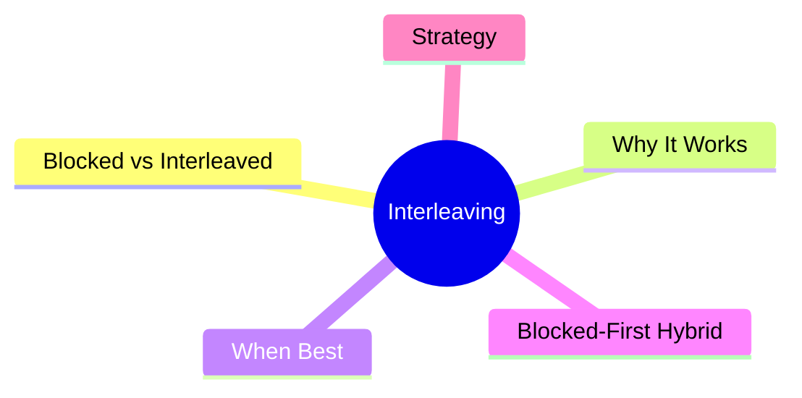
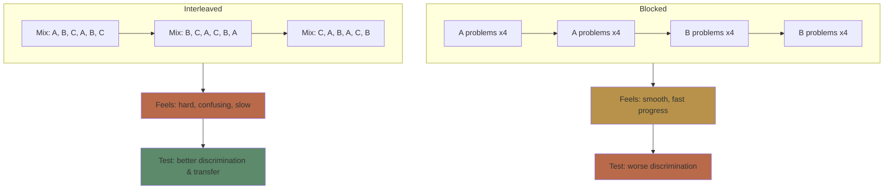
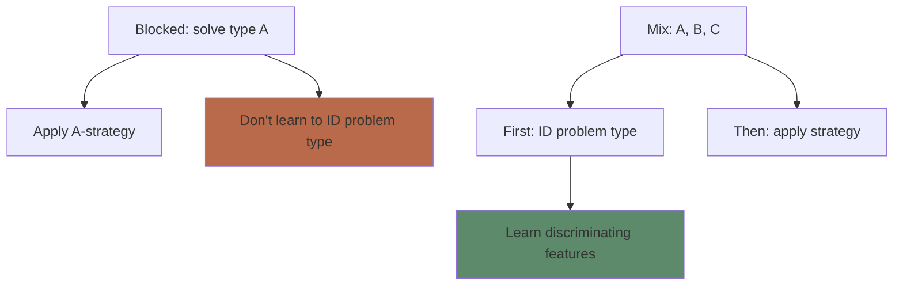
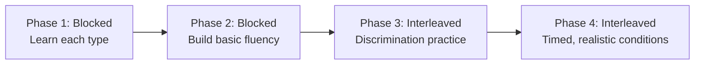

# Module 8: Interleaving vs Blocking

Est. study time: 2h
Language: en
Description: Why mixing topics during practice beats focusing on one — and when to do each.

## Learning Objectives
- Distinguish blocked vs interleaved practice
- Explain why interleaving improves discrimination and transfer
- Identify subjects where interleaving is most effective
- Design interleaved study sessions

---

## Real-World Example

A baseball player goes to batting practice. One day, they hit 50 fastballs, then 50 curveballs, then 50 sliders (blocked). Next day, they hit 50 pitches in random order — fastball, curve, slider, curve, fastball... (interleaved).

Blocked practice feels better — you get into a rhythm. Interleaved feels chaotic. But in a real game, pitches come in random order. Which practice prepares you for that?

> **Think**: Which practice schedule produces better game performance?
>
> *Answer: Interleaved. Blocked practice teaches you to hit fastballs when you know a fastball is coming. Interleaved teaches you to identify pitch TYPE first, then adjust — exactly what a real game requires.*

---

## Core Content

### Blocked vs Interleaved

**Blocked practice**: Practice one type of problem/topic at a time. AAAA BBBB CCCC.

**Interleaved practice**: Mix different types. ABCABC ABCABC.

**Key finding (Rohrer 2012)**: Students who interleaved math problems scored 43% on a delayed test vs 20% for blocked — despite feeling they learned less.

> **Cloze**: "In blocked practice, all problems of one {type} are completed before moving to the next. In interleaved practice, different {types} are {mixed} together."
>
> *Answer: type, types, mixed*

### Why Interleaving Works

Three mechanisms:

**1. Discrimination learning**: When types are mixed, you must identify WHICH type of problem you're facing before solving it. Blocked practice removes this step — you already know the type.

**2. Attention to distinguishing features**: Interleaving forces you to notice what makes each type different. Blocked practice lets you focus on surface features.

**3. Spacing by default**: Mixed problems naturally create spacing between repetitions of each type.

> **Think**: Why does blocked practice feel more effective than interleaved?
>
> *Answer: Blocked practice gives you the answer (the problem type) before you start. It's analogous to recognition vs recall — easier, less effective.*

### When Interleaving Works Best

| Subject | Interleaving benefit | Example |
|---------|---------------------|---------|
| Math | Very high | Mix algebra, geometry, statistics |
| Science | High | Mix physics, chemistry, biology problems |
| Art | Very high | Mix painting styles (learn to identify artist) |
| Sports | High | Mix pitch types, shot types |
| Vocabulary | Moderate | Mix words from different units |
| Motor skills | Moderate | Mix dance moves, guitar chords |

**When interleaving helps less:**
- Initial skill acquisition (learn the basics blocked first)
- Highly similar items that need distinct schema formation first
- Procedural sequences with a fixed order

> **Predict**: Which should be interleaved and which blocked: (a) learning the French alphabet, (b) practicing French verb conjugations across verb groups?
>
> *Answer: Alphabet = blocked (fixed sequence, basic encoding). Verb groups = interleaved (discrimination between group patterns is the key skill).*

### The Blocked-First Hybrid

Most effective approach for novices:

**Example for learning math:**
1. Study worked examples of quadratic equations (blocked)
2. Solve 3-5 quadratic equations (blocked)
3. Solve mixed problems: quadratics, linear equations, exponents (interleaved)
4. Mixed problems under time pressure

> **Think**: If interleaving is so effective, why do most textbooks and courses use blocked practice?
>
> *Answer: Blocked feels better for learners AND teachers. Textbooks organize by topic. Teachers want students to feel progress. Interleaving creates initial confusion — but better final performance.*

### Practical Interleaving Strategy

**For self-study:**
1. Study one topic at a time for initial encoding
2. Create mixed practice sets with 3-5 different topics
3. Randomize order within each session
4. For each problem: identify the type BEFORE solving

**Session design example (2 hours):**
- 30 min: Study topic A (blocked encoding)
- 30 min: Study topic B (blocked encoding)
- 60 min: Mixed practice (A and B problems randomized)

> **Spot the Mistake**: "I study math for 3 hours every Saturday — 1 hour algebra, 1 hour geometry, 1 hour statistics. That's interleaving."
>
> What's wrong?
>
> *Answer: That's blocked practice within each hour, not interleaving. True interleaving: 3 hours of mixed problems where each problem could be any type. You must identify the type each time.*

> **Cloze**: "Interleaving works by forcing the learner to {identify the problem type} before solving, which builds {discrimination skills} that transfer to real-world conditions."
>
> *Answer: identify the problem type, discrimination skills*

---

## Why This Matters

Most self-study and courses default to blocked practice. Adding interleaving:
- Improves discrimination (seeing differences between similar concepts)
- Builds transferable skill (works in messy real-world conditions)
- Requires NO extra time — just reorganization
- Combines naturally with spacing and retrieval practice

---

## Key Takeaways
- Blocked: all of type A, then B, then C — feels effective, less durable
- Interleaved: types mixed — feels harder, more durable
- Interleaving builds discrimination skills (identifying problem type)
- Blocked-first hybrid: encode basics blocked, then interleave for fluency
- Works across domains: math, science, art, sports, vocabulary
- Requires no extra time — just rearrange your practice

---

## Common Misconception

**Misconception**: "I should master one topic before moving to the next."

**Reality**: Mastery requires discrimination — knowing when to use which approach. You can't discriminate until you've seen similar cases side by side. Waiting for "mastery" before mixing is counterproductive.

**Correct framing**: Start mixing early — after initial encoding of each type. Perfection before mixing is a trap.

---

## Spot the Mistake

"A piano student practices scale C until perfect, then scale D until perfect, then scale E until perfect. Day 2: same sequence."

What's wrong?

*Answer: Blocked practice of scales doesn't train the real skill — transitioning between scales during a piece. Interleave: practice C→D, D→E, E→C transitions.*

---

## Feynman Explain
(Explain interleaving: imagine learning to identify birds. If you study 10 sparrows, then 10 robins, then 10 blue jays, you don't learn what makes each unique. Mix them — you learn to see the differences. The mixing IS the learning.)

---

## Reframe
(Judge: which of your current subjects would benefit most from interleaving? Design one interleaved practice session. How does it feel compared to blocked?)

---

## Drill
Run: `learn.sh quiz learning-theories 8`
