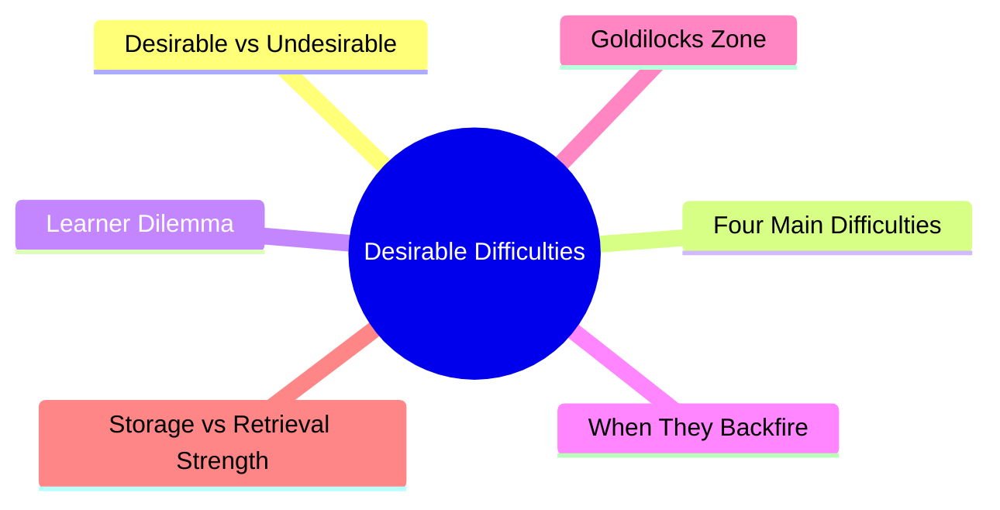
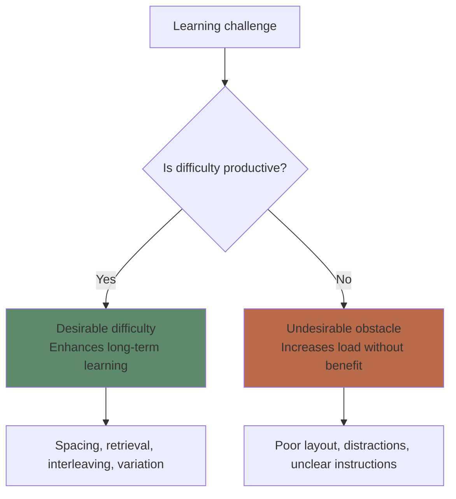
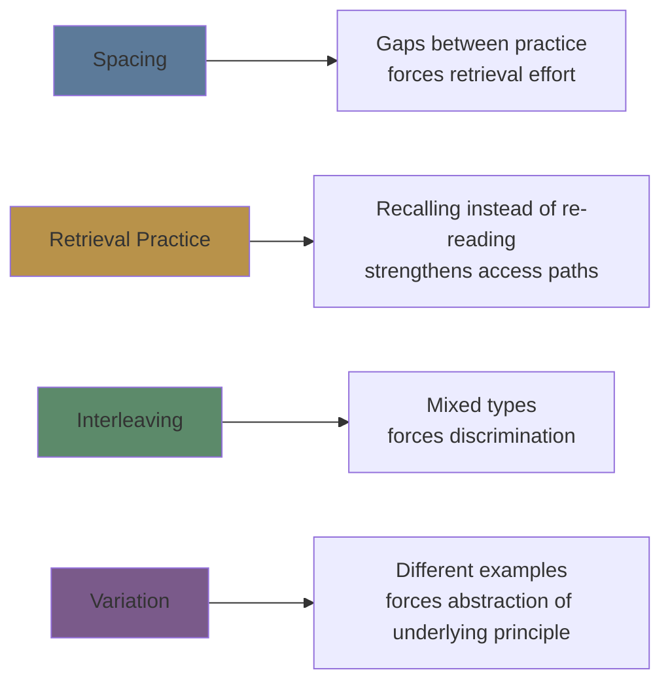
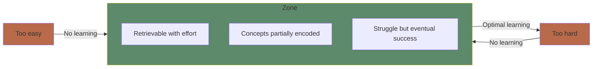

# Module 9: Desirable Difficulties

Est. study time: 2.5h
Language: en
Description: Why making learning harder in the right ways makes it stick — Bjork's framework for productive struggle.

## Learning Objectives
- Distinguish desirable difficulties from undesirable obstacles
- Identify the 4 main desirable difficulties: spacing, retrieval, interleaving, variation
- Explain why learners consistently misjudge these strategies as ineffective
- Apply the framework to design productive challenge in study sessions

---

## Real-World Example

You have two study options for a new topic:

Option A: Clear, organized notes. Read twice. Highlight key points. Make a summary. Feels productive, clear, and satisfying.

Option B: Read once. Close the book. Try to recall. Get many wrong. Check answers. Try again. Feels frustrating, slow, and confusing.

Option A feels better. Option B produces 2x better learning. Option B's difficulty is **desirable**.

> **Think**: If Option B is better, why doesn't it feel better?
>
> *Answer: Humans are poor judges of learning. We mistake fluency (easy processing) for mastery. Desirable difficulties feel bad in the short term but produce durable learning.*

---

## Core Content

### Difficulty vs Difficulty (Bjork & Bjork 2011)

Not all difficulties are equal. The key distinction:

**Desirable difficulties**: Induce encoding/retrieval challenges that enhance long-term retention and transfer. They feel harder during practice but produce better outcomes.

**Undesirable obstacles**: Add cognitive load without any learning benefit. They feel harder AND produce worse outcomes.

The skill is distinguishing between the two.

> **Cloze**: "A {desirable difficulty} is a challenge that feels hard during practice but enhances {long-term retention}. An {undesirable obstacle} adds difficulty without {learning benefit}."
>
> *Answer: desirable difficulty, long-term retention, undesirable obstacle, learning benefit*

> **Think**: Is having a slow internet connection while watching a lecture a desirable difficulty?
>
> *Answer: No. It adds frustration and interrupts flow without forcing any productive cognitive processing. It's an undesirable obstacle.*

### The Four Main Desirable Difficulties

You've already studied spacing (Module 4), retrieval practice (Module 7), and interleaving (Module 8) — they are ALL desirable difficulties.

**Variation**: Practicing with varied examples rather than identical ones. Forces abstraction of the general principle rather than memorizing a surface pattern.

### The Learner's Dilemma

Learners consistently judge desirable difficulties as LESS effective than easier alternatives. This is the **metacognitive illusion** at the heart of the framework.

**The pattern:**
1. Learner tries spacing/retrieval/interleaving
2. It feels harder → learner judges it ineffective
3. Learner switches to re-reading/highlighting/cramming
4. It feels easier → learner judges it effective
5. Learner performs worse on tests

This cycle explains why many students never adopt evidence-based strategies — they're tricked by their own feelings.

> **Predict**: Two students study the same material. One self-tests (retrieval practice), one re-reads. After 30 minutes, who feels more confident and who actually learned more?
>
> *Answer: Re-reader feels more confident (fluency illusion). Self-tester actually learned more (desirable difficulty). Confidence at time of study is inversely related to learning.*

### When Desirable Difficulties Backfire

Desirable difficulties are not always appropriate:

| Condition | What happens | Fix |
|-----------|-------------|-----|
| Too difficult | Complete retrieval failure → no learning | Reduce gap, provide cues, use easier examples |
| Too early | No schema to build on | Pre-train basics first, then introduce difficulties |
| Overwhelmed learner | High anxiety → cognitive shutdown | Reduce difficulty, restore confidence, then reintroduce |
| Wrong type | Difficulty doesn't target the right mechanism | Match difficulty type to learning goal |

**Rule**: A difficulty is desirable only if the learner CAN retrieve/process with effort. If it causes complete failure, it's undesirable.

> **Spot the Mistake**: "I threw my beginner student into mixed calculus problems on day 1. They need to learn to discriminate."
>
> What's wrong?
>
> *Answer: No foundational schema. Interleaving requires initial encoding of each type. Without that, the difficulty is overwhelming, not productive. Blocked-first hybrid: basics first, interleave later.*

### The Goldilocks Zone

The desirable difficulty zone: hard enough to trigger productive processing, easy enough that effortful retrieval succeeds.

**Signs you're in the zone:**
- You can answer but it takes effort
- You get some details wrong but the main idea is there
- You feel slightly frustrated but not hopeless
- You remember the answer after checking once

> **Think**: You're studying and you feel completely lost. Nothing makes sense. Is this a desirable difficulty?
>
> *Answer: No. Complete confusion is unproductive. Step back, review prerequisites, get scaffolding, then re-engage at a level where retrieval is effortful but possible.*

### The Storage Strength / Retrieval Strength Model

Bjork's model explains WHY desirable difficulties work:

| Condition | Effect on retrieval strength | Effect on storage strength |
|-----------|------------------------------|---------------------------|
| Easy study (re-reading) | Fast increase | Minimal increase |
| Difficult study (retrieval) | Slow increase (feels bad) | Large increase (durable) |
| Spaced gap | Retrieval drops between sessions | Each re-study boosts storage |

**The learning principle**: Conditions that produce rapid gains in retrieval strength (cramming, blocked, massed) produce shallow storage. Conditions that produce slow, effortful gains produce deep storage.

> **Cloze**: "Bjork's model distinguishes {retrieval strength} (easy access, decays fast) from {storage strength} (deep encoding, persists). Desirable difficulties sacrifice short-term {retrieval} gains for long-term {storage} gains."
>
> *Answer: retrieval strength, storage strength, retrieval, storage*

### Practical Checklist

**Is this difficulty desirable?** Ask:
1. Does it force active processing (retrieval, elaboration, discrimination)?
2. Is the difficulty in the learning mechanism, not the presentation?
3. Can I eventually succeed with effort?
4. Does it feel harder in the moment but better long-term? (If you're unsure, the answer is probably yes — desirable difficulties always feel bad)

---

## Why This Matters

The desirable difficulties framework is the **meta-principle** behind every strategy in this course. Understanding it lets you:
- Evaluate any learning strategy: "Is this difficulty productive?"
- Trust the process when effective strategies feel bad
- Recognize when difficulty ISN'T productive and adjust
- Design your own study methods with confidence

---

## Key Takeaways
- Not all difficulty is good — distinguish desirable (productive) vs undesirable (obstacle)
- Four main desirable difficulties: spacing, retrieval practice, interleaving, variation
- Learners consistently misjudge desirable difficulties as ineffective — don't trust your feelings
- Difficulty is desirable only when effortful retrieval can succeed
- The Goldilocks zone: hard enough to trigger processing, easy enough to succeed
- Storage strength grows when retrieval is effortful

---

## Common Misconception

**Misconception**: "If it's hard, it must be working."

**Reality**: Hard is necessary but not sufficient. Confusion, poor instructions, and overwhelming complexity are hard but unproductive. The difficulty must target the right mechanism (retrieval, discrimination, elaboration).

**Correct framing**: Does this difficulty force productive cognitive processing? If yes, embrace it. If no, fix the obstacle.

---

## Spot the Mistake

"I'm struggling to understand this textbook. The writing is dense and disorganized. It must be a desirable difficulty — this is good for my learning."

What's wrong?

*Answer: Dense, disorganized writing is an undesirable obstacle (extraneous load). It doesn't force productive processing — it forces inefficient decoding. Find a clearer source.*

---
## Feynman Explain

Some difficulty **helps** learning (spacing, retrieval, interleaving) — these are *desirable*. Other difficulty **hurts** learning (bad instructions, distracting environment, unclear notation) — these are *undesirable*. The trick: both feel bad in the moment. You can't tell them apart by feel alone. The difference shows up later — desirable difficulties make the test easier, undesirable difficulties just made the study harder. Bjork's rule: if the difficulty is coming from *the learner doing more cognitive work*, it's probably desirable. If it's coming from *the material blocking comprehension*, it's probably not.

---

## Reframe

"Desirable difficulties" is the same idea as the distinction between *stress* and *distress* in psychology, or *eustress* vs *distress*. The body can't tell them apart by heart rate alone; the difference is whether the load produces growth or damage. In learning, the test for desirability is post-hoc: did retention improve, or just the in-the-moment experience? Many "study techniques" are in fact undesirable difficulties in disguise — they feel productive (color-coded notes, hours of highlighting) but produce no measurable retention gain. The audit is whether you could pass a test tomorrow.

---

## Drill
Run: `learn.sh quiz learning-theories 9`
