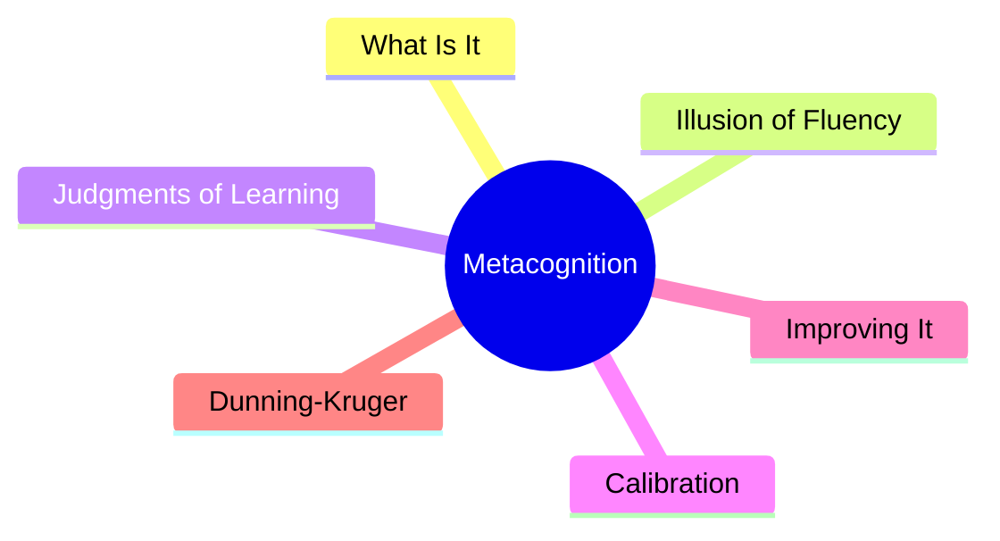
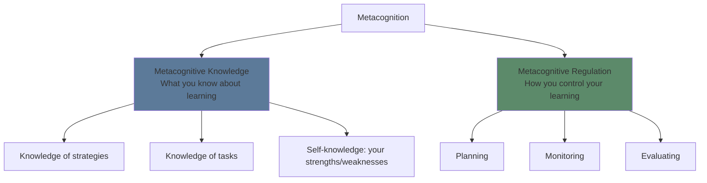
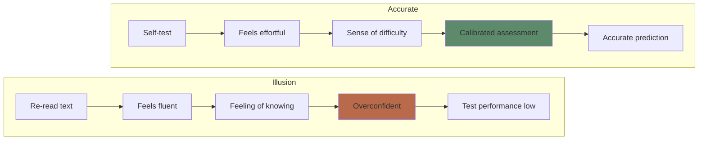
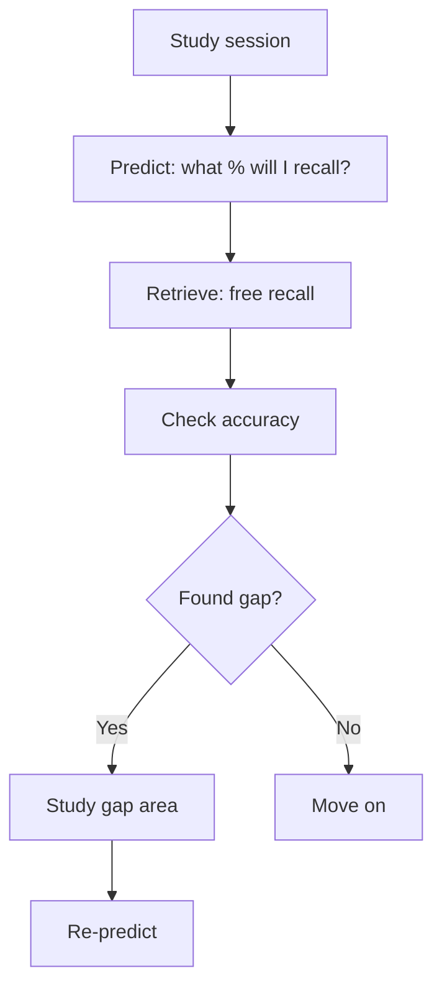

# Module 10: Metacognition

Est. study time: 2h
Language: en
Description: Knowing what you know — and knowing what you don't know. The skill that separates effective from ineffective learners.

## Learning Objectives
- Define metacognition and distinguish metacognitive knowledge from regulation
- Identify and overcome the illusion of fluency
- Calibrate self-assessment to match actual performance
- Apply strategies to improve metacognitive accuracy

---

## Real-World Example

Before a test, you feel confident. You know the material. You studied. You practiced.

After the test, you realize you didn't know as much as you thought. There were gaps you didn't see.

Your accuracy in judging your own knowledge was poor. That's a **metacognitive failure** — not a failure of knowledge, but a failure of knowing what you know.

> **Think**: If you could perfectly predict which questions you'd get wrong BEFORE the test, could you have fixed them?
>
> *Answer: Yes. Metacognition lets you target your study on what you DON'T know — the most efficient use of study time.*

---

## Core Content

### What Is Metacognition?

Metacognition = thinking about thinking. Two components:

**Metacognitive knowledge**: Understanding what strategies exist, what tasks require, and how your own mind works.

**Metacognitive regulation**: Actually controlling your learning — planning what to study, monitoring comprehension, evaluating outcomes.

> **Cloze**: "Metacognition has two components: {knowledge} about cognition and {regulation} of cognition."
>
> *Answer: knowledge, regulation*

### The Illusion of Fluency

The single biggest metacognitive trap: **fluency feels like learning**.

When reading is easy, when highlighting is smooth, when the lecture is clear — it feels productive. But **processing fluency** (easy to process) is not the same as **learning** (durable memory change).

**Fluency traps:**
- Re-reading: text becomes familiar → feels like understanding
- Highlighting: visual marker → feels like encoding
- Listening to lectures: clear explanation → feels like comprehension
- Watching demonstrations: smooth execution → feels like skill acquisition

> **Think**: You read a paragraph 3 times. It starts to feel familiar. Does familiarity mean you can recall the content without looking?
>
> *Answer: No. Familiarity is recognition — the text feels familiar when you see it. Recall requires retrieving without the text present. These are different.*

### Judgments of Learning (JOL)

A Judgment of Learning is your prediction of whether you'll remember something later. Accuracy varies dramatically:

| Condition        | JOL accuracy | Why                              |
| ---------------- | ------------ | -------------------------------- |
| After re-reading | Low          | Fluency inflates predictions     |
| After retrieval  | High         | Retrieval reveals actual access  |
| Immediate test   | Low          | Short-term memory inflates       |
| Delayed test     | High         | Only strong traces survive delay |

**The delayed-JOL effect**: Judgments made after a delay are more accurate because they reflect retrieval strength rather than short-term familiarity.

> **Predict**: Two groups study the same material. Group A predicts their performance immediately after study. Group B predicts after a 24-hour delay. Whose prediction is more accurate?
>
> *Answer: Group B (delayed JOL). Immediate JOLs are inflated by WM familiarity. Delayed JOLs reflect what actually survived the forgetting curve.*

### Calibration

**Calibration** = alignment between predicted performance and actual performance.

| Type             | Pattern                   | Meaning                 |
| ---------------- | ------------------------- | ----------------------- |
| Good calibration | Predicted 70%, scored 70% | Accurate self-awareness |
| Overconfidence   | Predicted 80%, scored 50% | Illusion of knowing     |
| Underconfidence  | Predicted 40%, scored 70% | Harsh self-judgment     |

**Poor calibration is dangerous**: Overconfident learners stop studying too early. They miss gaps. They fail.

> **Spot the Mistake**: "I feel like I understand this. I'm ready for the test."
>
> What's wrong?
>
> *Answer: Feeling ≠ evidence. The only reliable way to assess readiness is retrieval — can you recall the material without cues? If you haven't tested yourself, your feeling is unreliable.*

### Improving Metacognition

**Techniques to calibrate your self-assessment:**

1. **Pre-test**: Before studying, try to recall what you know. Reveals baseline gaps.
2. **Retrieval as self-assessment**: Can you free recall the material? If not, you don't know it.
3. **Explain to someone else**: Gaps appear when you try to articulate.
4. **Delayed self-assessment**: Wait a day, then assess. Short-term memory inflates immediate judgment.
5. **Prediction logs**: Write predicted score, take test, compare. Track calibration over time.

> **Think**: You predict 90% recall but actually recall 60%. What should you do?
>
> *Answer: Recognize overconfidence. Re-study the 40% you missed. Then re-test. Repeat until prediction matches performance.*

### The Dunning-Kruger Effect in Learning

Poor performers overestimate their ability; top performers underestimate. This isn't ego — it's metacognitive: poor performers lack the skill to recognize competence (in themselves or others).

**Relevance to learning**: Novices consistently overestimate how well they understand new topics. The cure is the same — test yourself, get feedback, recalibrate.

> **Cloze**: "The {Dunning-Kruger effect} occurs when low-performing individuals {overestimate} their ability because they lack the {metacognitive skill} to recognize their own gaps."
>
> *Answer: Dunning-Kruger effect, overestimate, metacognitive skill*

---

## Why This Matters

Metacognition is the **meta-skill** that controls all other learning strategies. Without it:
- You waste time on what you already know
- You think retrieval practice is ineffective (because it feels hard)
- You abandon spaced repetition (because it feels like forgetting)
- You cram because you don't realize you don't know

With it:
- You study what you don't know — the most efficient use of time
- You trust evidence over feelings
- You calibrate continuously and improve

---

## Key Takeaways
- Metacognition = knowledge + regulation of your own thinking
- Fluency illusion: easy processing feels like learning, but isn't
- Delayed JOLs are more accurate than immediate ones
- Poor calibration leads to overconfidence and wasted study time
- The best metacognitive tool is retrieval practice — test yourself
- Prediction logs train calibration over time

---

## Common Misconception

**Misconception**: "I know what I know. I don't need a test to tell me."

**Reality**: Humans are poor self-assessors without external calibration. Confidence correlates weakly with accuracy. The only reliable measure is performance on a retrieval test.

**Correct framing**: Don't trust your feelings about knowing. Trust your ability to recall without cues.

---

## Spot the Mistake

"I studied for 4 hours and I feel great. I'm confident I'll ace the test."

What's wrong?

*Answer: The feeling of "great" after studying is a red flag. It likely comes from fluency (re-reading, highlighting). If the study session felt easy, you probably weren't retrieving. Test yourself to confirm.*

---

## Feynman Explain
(Explain metacognition: it's like having a GPS for your brain. Most people drive without GPS — they think they know the way (overconfidence) or think they don't (underconfidence). Metacognition is the GPS that shows your actual position so you can correct the route.)

---

## Reframe
(Judge: when have you been overconfident in your learning? What was the cost? Design a one-week plan to track your calibration — predict, test, compare, adjust.)

---

## Drill
Run: `learn.sh quiz learning-theories 10`
