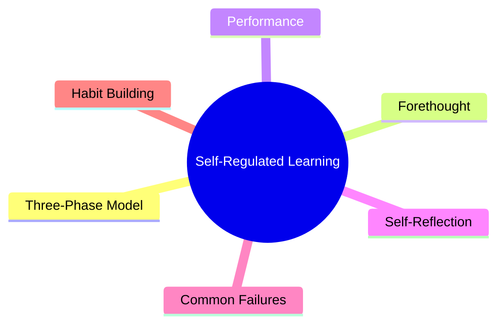
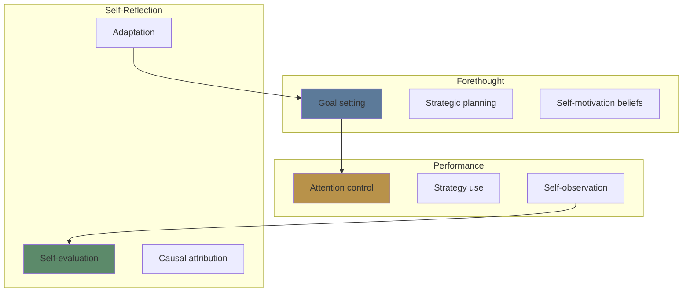
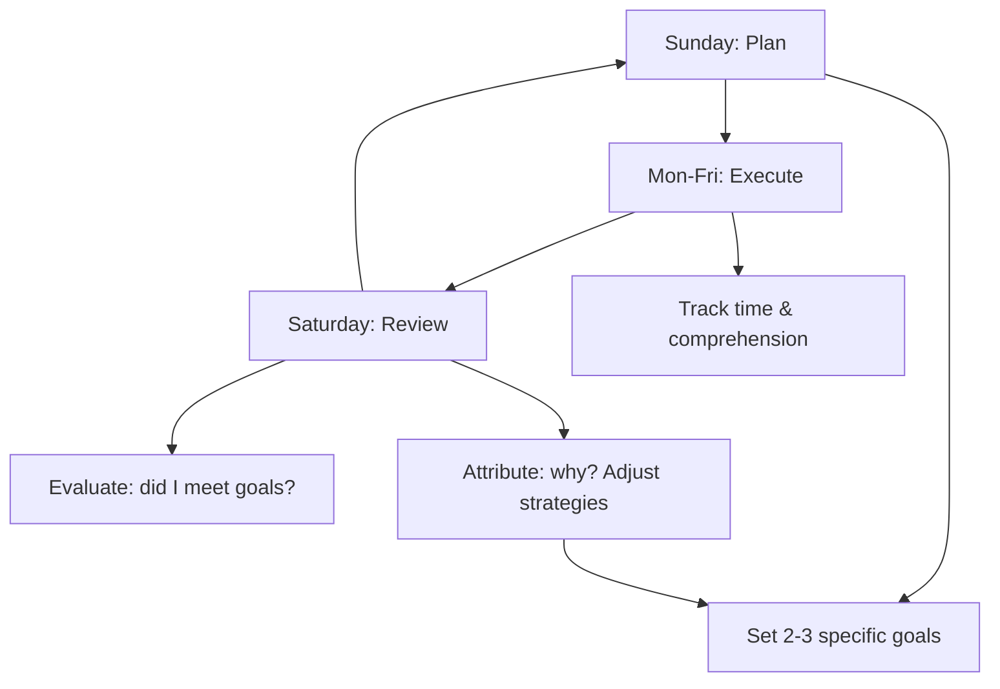

# Module 11: Self-Regulated Learning

Est. study time: 2h
Language: en
Description: How to plan, monitor, and adjust your own learning — becoming your own teacher.

## Learning Objectives
- Describe Zimmerman's three-phase model of self-regulated learning
- Set effective learning goals using SMART criteria
- Monitor learning progress and adjust strategies in real time
- Diagnose and fix common self-regulation failures

---

## Real-World Example

Two students start a 3-month online course. Both are motivated, both have the same materials.

Student A: Sets weekly goals, reviews progress every Sunday, adjusts based on what's working, tracks time spent vs progress.

Student B: Studies when they feel like it, follows the course linearly, doesn't check progress, keeps going even when struggling.

By month 2, Student A is ahead of schedule. Student B is behind and frustrated. The difference isn't ability — it's **self-regulation**.

> **Think**: What specific actions does Student A take that Student B doesn't?
>
> *Answer: Student A plans (sets goals), monitors (reviews progress), and adjusts (changes strategy). Student B just executes without feedback loops.*

---

## Core Content

### Zimmerman's Three-Phase Model

**Forethought Phase** (before learning): Set goals, plan strategies, cultivate motivation.

**Performance Phase** (during learning): Execute strategies, monitor attention, observe progress.

**Self-Reflection Phase** (after learning): Evaluate outcomes, attribute causes, adapt for next time.

The cycle repeats. Skilled self-regulators cycle through all three phases.

> **Cloze**: "Zimmerman's model of self-regulated learning has three phases: {forethought}, {performance}, and {self-reflection}."
>
> *Answer: forethought, performance, self-reflection*

### Phase 1: Forethought — Setting Up for Success

**Goal Setting**: Goals drive regulation. Research shows specific, challenging goals > vague "do your best" goals.

| Bad goal | Good goal |
|----------|-----------|
| "Study more this week" | "Complete 3 retrieval practice sessions this week" |
| "Learn Python" | "Complete Module 1 exercises with 80% accuracy by Friday" |
| "Review notes" | "Free recall 10 key concepts from Module 4 without notes" |

**Strategic planning**: Choose strategies deliberately, not habitually. Match strategy to task.

**Self-motivation**: Cultivate interest in the task, remind yourself why it matters, set up rewards.

> **Think**: Why does "study more" fail as a goal?
>
> *Answer: It's vague. You can't tell if you achieved it. Specific goals (what, when, how well) provide a clear target and feedback signal.*

### Phase 2: Performance — Executing and Monitoring

**Key skills during learning:**

| Skill | What it looks like | Common failure |
|-------|-------------------|----------------|
| Attention control | Stay on task, resist distractions | Phone checking, mind-wandering |
| Strategy use | Apply appropriate techniques (retrieval, spacing, etc.) | Defaulting to re-reading |
| Self-observation | Track time, comprehension, progress | No tracking, assuming it's fine |
| Help-seeking | Ask for help when stuck | Struggling alone too long |

**Self-observation techniques:**
- Time logs: track how you actually spend study time
- Comprehension checks: pause every 15 min and summarize
- Progress tracking: % of goals completed

> **Spot the Mistake**: "I study for hours every day. I don't need to track time — I know I'm working hard."
>
> What's wrong?
>
> *Answer: Effort ≠ effectiveness. Without tracking, you can't distinguish productive study from time-wasting. Time logs reveal patterns you won't notice otherwise.*

### Phase 3: Self-Reflection — Learning from Experience

**Self-evaluation**: Compare performance against goals. Did I achieve what I planned? By how much?

**Causal attribution**: WHY did I succeed or fail?

| Attribution | Effect on future motivation |
|-------------|---------------------------|
| "I failed because I'm bad at this" | Helplessness — gives up |
| "I failed because I used the wrong strategy" | Adaptive — changes approach |
| "I succeeded because I tried hard" | Motivates continued effort |
| "I succeeded because I'm smart" | Fragile — avoids challenge |

**Adaptation**: Based on evaluation, change goals, strategies, or schedule for the next cycle.

> **Think**: A student fails a practice test. Which attribution helps them improve: (a) "I'm not good at this subject" or (b) "I need to use retrieval practice instead of re-reading"?
>
> *Answer: (b) is adaptive — identifies a changeable cause (strategy). (a) is maladaptive — attributes to fixed trait, no path to improvement.*

### Common Self-Regulation Failures

| Failure | Phase | Symptom | Fix |
|---------|-------|---------|-----|
| No goals | Forethought | Wanders through material | Set specific weekly goals |
| Habitual strategy | Forethought | Always re-reads | Explicitly choose strategy per task |
| Distraction | Performance | Phone while studying | Environment design, Pomodoro |
| No monitoring | Performance | Surprised by poor test results | Schedule regular check-ins |
| Fixed mindset | Self-reflection | "I'm just not good at this" | Reframe: "I haven't found the right strategy" |
| No adaptation | Self-reflection | Same mistakes every cycle | Review, adjust, try new approach |

### Building a Self-Regulation Habit

**The weekly SRL cycle:**

**Daily check:**
- Start: "What will I learn today? How? For how long?"
- During: "Am I focused? Is this strategy working?"
- End: "What did I learn? What worked? What to change tomorrow?"

> **Predict**: Two students use the same course. One follows the weekly SRL cycle. One just goes through the material. After 1 month, who has learned more?
>
> *Answer: The SRL student. Same material, but planning + monitoring + reflection compounds. Each cycle teaches them how to learn better.*

---

## Why This Matters

Self-regulated learning is the difference between "studying a lot" and "studying effectively." Without regulation:
- You spend time on the wrong things
- You use ineffective strategies out of habit
- You don't notice problems until it's too late

With regulation:
- You allocate time to your biggest gaps
- You switch strategies when one isn't working
- You continuously improve your learning process

---

## Key Takeaways
- SRL has three phases: forethought (plan), performance (do), self-reflection (review)
- Set specific, challenging goals — "study more" is too vague
- Monitor your learning during study, not just at the end
- Attribution matters: attribute failures to strategy, not ability
- Build a weekly SRL cycle: plan → execute → review → adjust
- Self-regulation is a skill — it improves with practice

---

## Common Misconception

**Misconception**: "Good learners are naturally organized and disciplined."

**Reality**: Self-regulation is a learned skill, not a personality trait. Anyone can improve with deliberate practice. The difference between high and low achievers is often self-regulation, not intelligence.

**Correct framing**: Self-regulation is trainable. Start with one phase (planning) and build from there.

---

## Spot the Mistake

"I failed the test. I'm just not smart enough for this subject."

What's wrong?

*Answer: Fixed mindset attribution. The failure is attributed to an unchangeable trait. Instead: "What strategy didn't work? What could I try differently?" That's adaptive.*

---
## Feynman Explain

**Self-regulated learning** = the whole loop, not just one piece. Three phases: **Forethought** (set a goal, pick a strategy, motivate yourself), **Performance** (actually do the work, monitor your attention and comprehension), **Self-Reflection** (after: what worked, what didn't, what to try next). Most learners are heavy on Performance and light on the other two. They study hard but never plan or review. The result is effortful busywork, not improvement. The fix: spend small amounts of time on the cheap-but-pivotal phases.

---

## Reframe

Self-regulated learning is the same structure as the **PDCA cycle** (Plan-Do-Check-Act) in manufacturing or the **retrospectives** in agile teams. The science just calls it by a different name. The recurring finding across domains: most people skip the Check/Reflect phase because it feels unproductive ("I just finished, why think about it more?"). But the reflection is where the next cycle gets cheaper — same lesson, just retrieved as institutional memory. Skipping reflection is the organizational equivalent of re-solving yesterday's problem every morning.

---

## Drill
Run: `learn.sh quiz learning-theories 11`
