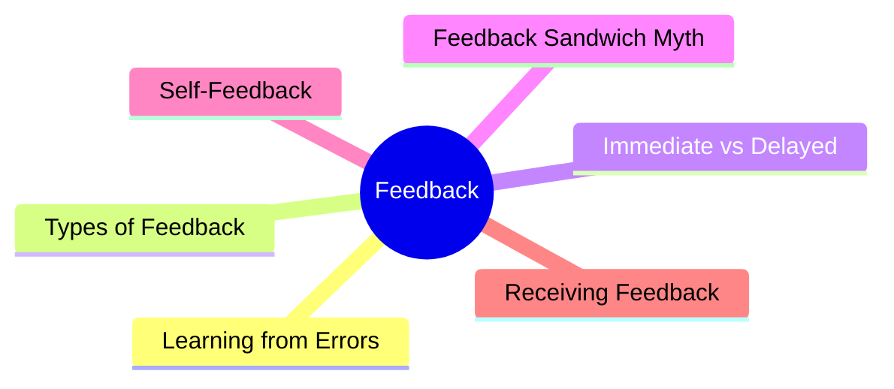
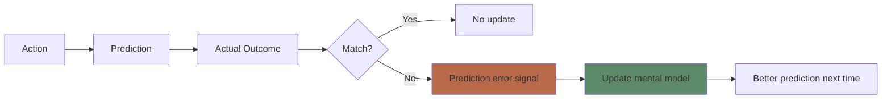
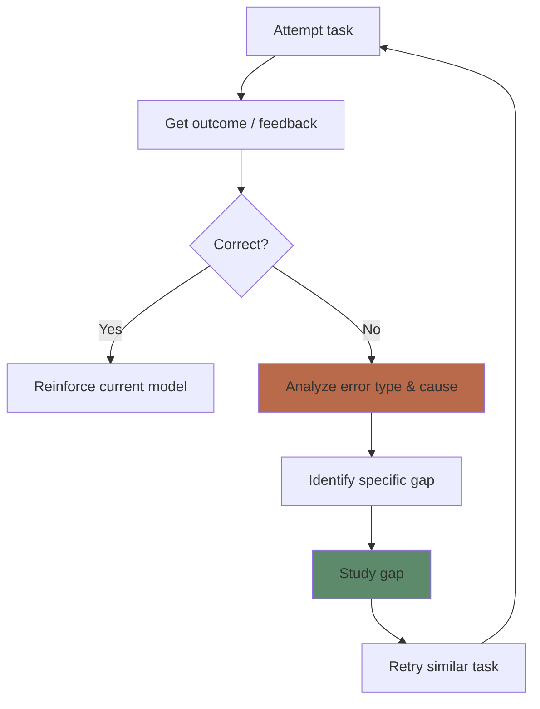

# Module 12: Feedback & Error-Driven Learning

Est. study time: 2.5h
Language: en
Description: Why errors are essential for learning — and how to give/receive feedback that actually improves performance.

## Learning Objectives
- Distinguish outcome feedback, corrective feedback, and elaborative feedback
- Explain how prediction errors drive learning
- Apply feedback principles to self-study (self-feedback)
- Avoid common feedback mistakes (sandwich, delayed too long)

---

## Real-World Example

You solve a practice problem. You check the answer. Wrong.

Three possible responses:
- "Wrong. Score: 0." (outcome only)
- "Wrong. The correct answer is X." (corrective)
- "Wrong. Here's why: you misinterpreted step 3. Step 3 should be Y because Z." (elaborative)

Each gives you different information. Each produces different learning. The third one is best — but even corrective beats outcome-only.

> **Think**: If you get a practice problem wrong but don't find out WHY until tomorrow, how much do you learn?
>
> *Answer: It depends. For low-complexity factual tasks, immediate explanation links the error to its correction most strongly. For complex or transfer-oriented tasks, a delay can be just as effective or even better — the wait forces you to attempt the error yourself before getting corrected, which strengthens the mental model. (Kulik & Kulik 1988 meta-analysis.)*

---

## Core Content

### The Learning Function of Errors

Errors are not failures — they are **learning signals**.

**Prediction error**: The gap between expected outcome and actual outcome. The brain uses this gap to update its model. Larger gap = stronger learning signal — IF you receive feedback.

**Without feedback**: No error signal. No update. Same mistake repeated.

> **Cloze**: "Learning occurs when there is a gap between {prediction} and {outcome}. This {prediction error} drives updates to the mental model."
>
> *Answer: prediction, outcome, prediction error*

### Types of Feedback

| Type | Content | Learning effect |
|------|---------|----------------|
| **Outcome** | Right/wrong only | Weak — confirms but doesn't explain |
| **Corrective** | Right/wrong + correct answer | Medium — provides target |
| **Elaborative** | + explanation of WHY | Strong — fixes mental model |
| **Metacognitive** | + strategy guidance | Strongest — builds self-regulation |

**Elaborative feedback is best**: It tells you not just what was wrong, but why, and how to fix it.

> **Think**: Why does outcome-only feedback (score, no explanation) produce weak learning?
>
> *Answer: It signals error but not the cause. Without knowing WHY you were wrong, you can't update the specific faulty reasoning. You might change the right thing or miss the real issue.*

### Timing: Immediate vs Delayed

| Timing | Best for | Why |
|--------|----------|-----|
| **Immediate** | Procedural skills, novices | Prevents error reinforcement |
| **Delayed** | Conceptual understanding, experts | Allows error detection practice |
| **Self-paced** | Most learning | Learner sees feedback when ready |

**The guidance hypothesis**: Immediate feedback helps initial skill acquisition (prevents practicing errors). Delayed feedback helps transfer (learner must detect their own errors).

> **Predict**: A student is learning to solve physics problems. Should they get immediate feedback after each step or delayed feedback after the full problem?
>
> *Answer: Immediate at first (builds correct procedure), then shift to delayed (forces self-checking). Novices benefit more from immediate feedback.*

### The Feedback Sandwich Myth

The "feedback sandwich" (positive → criticism → positive) is widely taught but empirically weak.

**Problems with the sandwich:**
1. Learner focuses on the positive (reinforcement) and misses the criticism
2. Positive framing dilutes the error signal
3. Feels patronizing
4. Doesn't improve learning outcomes compared to direct corrective feedback

**Better approach**: Direct, specific, actionable feedback about the error, separated from general encouragement.

> **Spot the Mistake**: "You did great on the first section! But the second section had errors. Overall, your effort is commendable!"
>
> What's wrong?
>
> *Answer: Feedback sandwich. The error signal is buried between compliments. Learner may not process the correction. Direct: "Section 2 had errors in steps 3-4. Here's why and how to fix."*

### Self-Feedback: How to Give Yourself Feedback When Studying Solo

You can't always get a teacher. But you can create your own feedback loops.

**Self-feedback techniques:**

| Technique | How | What it trains |
|-----------|-----|----------------|
| **Answer-check** | Solve → check → analyze error | Detection |
| **Self-explanation** | Explain why answer is wrong | Understanding |
| **Error log** | Track error types over time | Pattern recognition |
| **Compare methods** | Solve with method A, then method B | Strategy selection |
| **Generate distractors** | Create wrong answers + explain why wrong | Deep understanding |

**Example error log:**

| Date | Topic | Error type | Cause | Fix |
|------|-------|-----------|-------|-----|
| Jan 5 | Quadratic eq | Wrong formula | Confused with linear | Write comparison table |
| Jan 6 | Quadratic eq | Sign error | Rushed | Slow down step 3 |

> **Think**: A student misses a problem but doesn't analyze why. They just move on. How much do they learn from the error?
>
> *Answer: Almost nothing. The error signal fired but wasn't processed. Analyzing the error converts the signal into a model update.*

### Error-Driven Learning in Action

The effective learning cycle:

**Key insight**: The error analysis + targeted gap study is the engine of improvement. Without it, errors repeat.

> **Predict**: Two students each make 10 practice test errors. Student A notes "wrong" and moves on. Student B logs each error type, studies the gap, and retests. After 5 such sessions, who improves more?
>
> *Answer: Student B. Error analysis turns each mistake into a learning opportunity. Student A just accumulates errors without fixing root causes.*

### How to Receive Feedback

Receiving feedback is a skill. The best learners:

1. **Seek** feedback proactively (don't wait for tests)
2. **Separate** ego from information (error ≠ personal failure)
3. **Ask** for specifics ("What did I miss?")
4. **Apply** immediately (retry before the feedback fades)
5. **Track** error patterns (notice recurring types)

> **Think**: When someone gives you feedback, what's the most productive first reaction?
>
> *Answer: "What can I learn from this?" — not defense or shame. Feedback is data about your current model, not about your worth.*

---

## Why This Matters

Feedback is how you know if learning is happening. Without it, you're flying blind. Error-driven learning is the mechanism behind:
- Retrieval practice (feedback from correct answers)
- Worked examples (feedback from expert solution)
- Self-testing (feedback from answer key)
- Any practice with comparison (feedback from difference)

If you're not getting feedback on your learning, you're guessing.

---

## Key Takeaways
- Prediction errors drive learning — the gap between expected and actual outcome
- Elaborative feedback (why) is better than corrective (what) is better than outcome (score)
- Immediate feedback for novices, delayed for experts
- Feedback sandwich dilutes the error signal — be direct
- Self-feedback loops: solve → check → analyze → restudy → retry
- Error logs reveal patterns and root causes
- Receiving feedback is a skill: seek it, separate ego, apply immediately

---

## Common Misconception

**Misconception**: "Making errors means you're not learning."

**Reality**: Errors ARE learning signals. The question is whether you receive feedback to correct them. Error-free practice (re-reading) produces no prediction errors → no model updates.

**Correct framing**: Make errors early and often — with immediate feedback. Each error is an opportunity to update your mental model.

---

## Spot the Mistake

"I learn best by getting it right the first time. If I make mistakes, I feel like I'm failing."

What's wrong?

*Answer: Error-avoidance mindset. It leads to staying in your comfort zone, avoiding challenge, and missing learning opportunities. Productive error = prediction error signal = learning trigger.*

---
## Feynman Explain

Your brain is a prediction engine. It constantly guesses what comes next. When the guess is *right*, nothing changes. When the guess is *wrong*, your brain registers a prediction error and updates its model. So errors are not failures — they are the *signal that drives learning*. The most useful feedback is one that tells you *why* you were wrong (elaborative), not just *that* you were wrong (outcome). The reason: a "why" gives your model something concrete to update against. A bare "wrong" leaves the gap unanalyzed.

---

## Reframe

Error-driven learning is the same mechanism behind gradient descent in machine learning: compute the gap between predicted and actual, take a step to reduce it, repeat. The brain does this with neurons; ML does it with weights. The corollary is identical: if the error signal is noisy, sparse, or delayed, learning is slow. This is why good teachers (and good loss functions) give clear, fast, specific feedback — they make the gradient legible. The "feedback sandwich" fails for the same reason a noisy loss function fails: the signal gets buried.

---

## Drill
Run: `learn.sh quiz learning-theories 12`
