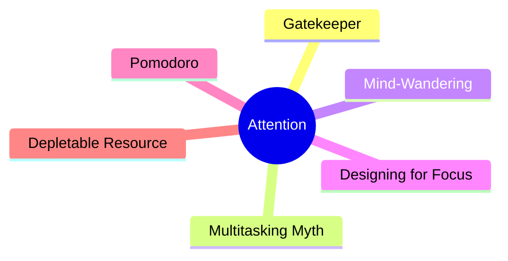
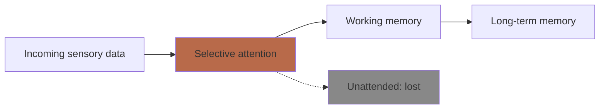
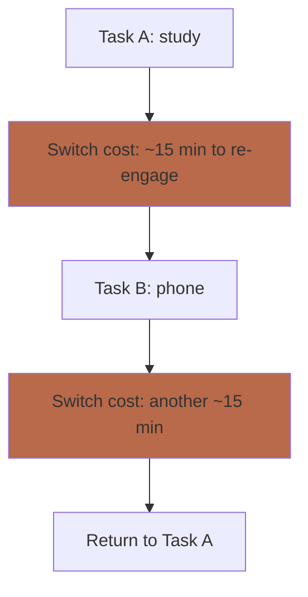
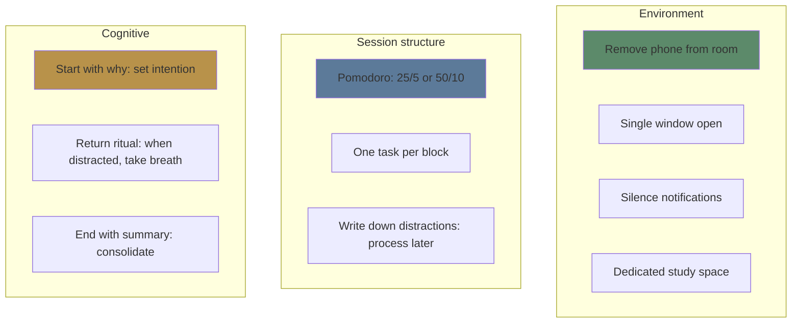

# Module 13: Attention & Focus

Est. study time: 2h
Language: en
Description: How to protect and direct your limited attention — the gatekeeper of all learning.

## Learning Objectives
- Explain why attention is necessary for encoding
- Describe the costs of task-switching and multitasking
- Apply strategies to sustain focus and recover from mind-wandering
- Design environments that support deep focus

---

## Real-World Example

You sit down to study. You open your laptop. You check email. A notification pops up — you read it. You return to your book. An interesting thought — you Google it. You check your phone. 30 minutes later, you've read 3 pages and remember nothing.

This isn't a willpower failure. It's an **attention management** failure — your attention was fragmented into pieces too small for encoding.

> **Think**: If those 30 minutes had been 30 minutes of uninterrupted focus, how much more would you have learned?
>
> *Answer: Possibly 5-10x more. Each interruption resets the encoding process. Deep encoding requires sustained attention of at least 10-15 continuous minutes.*

---

## Core Content

### Attention Is the Gatekeeper

Without attention, nothing enters WM. Without WM, nothing reaches LTM.

Attention is limited, selective, and fragile. You can attend to only one stream of conscious processing at a time. Everything else is filtered out.

**Key implication**: Protecting attention is the highest-leverage learning skill. No amount of strategy compensates for fragmented attention.

> **Cloze**: "Attention is the {gatekeeper} of learning. Without it, information never reaches {working memory} and cannot be {encoded} into long-term memory."
>
> *Answer: gatekeeper, working memory, encoded*

### The Myth of Multitasking

Humans cannot multitask. We **task-switch** — rapidly shifting attention between tasks.

**The switch cost**: Every time you switch tasks, your brain must:
1. Disengage from current task context
2. Load the new task context into WM
3. Inhibit the previous task's activation

This costs 15-30 minutes of productivity per switch (depending on task complexity) — and this is the cost to the **interrupted** task, not the interrupting one. Answering the text itself takes seconds. Resuming your study session afterwards is what takes 15+ minutes. (Mark et al. 2008: average resumption time ~23 minutes.)

> **Think**: You study for 1 hour but check your phone 4 times. How much of that hour was actually productive study time?
>
> *Answer: Possibly 15-30 minutes. Each phone check costs ~10-15 min of re-engagement. The rest is switch cost.*

### Sustained Attention and Mind-Wandering

Sustained attention declines over time. After ~10-20 minutes of focused work, **mind-wandering** increases.

**Mind-wandering is normal** — the brain's default mode network activates when executive control relaxes. It's not a sign of failure. The skill is noticing and returning.

| Attentional state | What happens | % of study time (typical) |
|------------------|-------------|---------------------------|
| Focused | Full engagement with material | ~40% |
| Mind-wandering | Thoughts drift to unrelated topics | ~30% |
| Zoning out | Low awareness of both task and thoughts | ~15% |
| Distracted | External interruption pulls attention | ~15% |

> **Predict**: A student notices their mind wandering and immediately feels frustrated. A second student notices and says "that's normal" and gently returns attention. Who maintains focus longer over the session?
>
> *Answer: The second student. Frustration activates emotional circuits, further draining WM. Acceptance → return is more efficient.*

### Designing for Focus

**Environment design** (highest leverage):
- Phone in another room
- Single browser tab
- No notifications
- Clean desk

**Session structure:**
- Pomodoro: 25 min focus + 5 min break (or 50 + 10 for deep work)
- One task per block — no switching
- Write down intrusive thoughts to process later

**Cognitive techniques:**
- Set intention before starting: "I will learn X using Y strategy"
- When noticing distraction: pause, breathe, return — no judgment
- End with 2-min summary of what was learned

> **Spot the Mistake**: "I study better with background music or TV. It helps me focus."
>
> What's wrong?
>
> *Answer: Background media divides attention. It may feel better (reduces boredom) but impairs encoding. The exception: instrumental music with low variability for some people, but TV/dialogue always competes for phonological loop.*

### The Pomodoro Technique

25 minutes of focused work, 5 minutes break. After 4 cycles, take a longer break (15-30 min).

**Why it works:**
1. Short enough to sustain attention
2. Creates urgency (the timer is running)
3. Breaks restore WM capacity
4. Interruptions are contained to break periods

**Adaptation**: Some topics need longer focus periods. Adjust to 50/10 or 90/20 if 25 minutes feels too short (but start with 25 if you're new to focus).

> **Think**: What happens to learning efficiency after 90+ minutes of continuous study without a break?
>
> *Answer: Diminishing returns. Attention fatigues, encoding efficiency drops, mind-wandering increases. A 10-minute break restores WM capacity significantly.*

### Attention as a Depletable Resource

Attention is like a muscle — it fatigues with use and recovers with rest.

**Factors that deplete attention:**
- Prolonged focus (diminishes after ~90 min)
- Emotional stress
- Sleep deprivation
- Decision fatigue (too many choices)
- Task-switching (each switch burns glucose)

**Factors that restore attention:**
- Sleep (primary)
- Breaks (especially in nature: Attention Restoration Theory)
- Exercise
- Meditation training
- Single-tasking practice

> **Cloze**: "Attention is a {depletable} resource. It {fatigues} with sustained use and {recovers} with rest, especially sleep and nature exposure."
>
> *Answer: depletable, fatigues, recovers*

---

## Why This Matters

Attention is the foundation. All learning strategies (spacing, retrieval, elaboration) require focused attention to work. Without it:
- Retrieval practice becomes guessing
- Spaced repetition feels like new learning each time
- Elaboration stays shallow
- Dual coding becomes decoration

With focused attention, every strategy works better.

---

## Key Takeaways
- Attention is the gatekeeper: no attention, no learning
- Multitasking is task-switching — each switch costs 15+ min of productivity
- Mind-wandering is normal: skill is noticing and returning without frustration
- Environment design is the highest-leverage focus strategy
- Pomodoro technique structures attention and rest
- Attention depletes: protect it, restore it

---

## Common Misconception

**Misconception**: "I can train myself to multitask effectively."

**Reality**: No evidence supports this. Some people switch faster, but everyone pays a switch cost. The most productive people single-task.

**Correct framing**: Single-tasking is a superpower. One thing at a time. Full attention on what's in front of you.

---

## Spot the Mistake

"I keep my phone on my desk so I can see notifications. If it's important, I'll answer."

What's wrong?

*Answer: Phone presence alone divides attention — even without notifications. The anticipation of notifications creates a low-level attentional cost. Remove phone from the room entirely.*

---
## Feynman Explain

Your brain has one spotlight. It can shine brightly on one thing, or dimly on many things — but it cannot shine brightly on two things at once. What people call "multitasking" is actually **task-switching**: you move the spotlight, lose the previous scene, load the new scene, lose the next interruption's worth, etc. Each switch costs 15-30 minutes of recovery time. The lesson: protect the spotlight. Single-task. Make the environment quiet. Block the interruptions before they arrive.

---

## Reframe

The attention spotlight is the same idea as **CPU single-threading with context switches** in old-school operating systems: one core, many processes, expensive context switches. Modern OSes fixed this with multiple cores; your brain didn't get the upgrade. The cost shows up identically: thrashing. When context switches consume more time than actual work, throughput collapses. Most "I worked for 3 hours and got nothing done" episodes are thrashing. The fix is the same in both cases: batch, serialize, and remove interrupts at the source.

---

## Drill
Run: `learn.sh quiz learning-theories 13`
