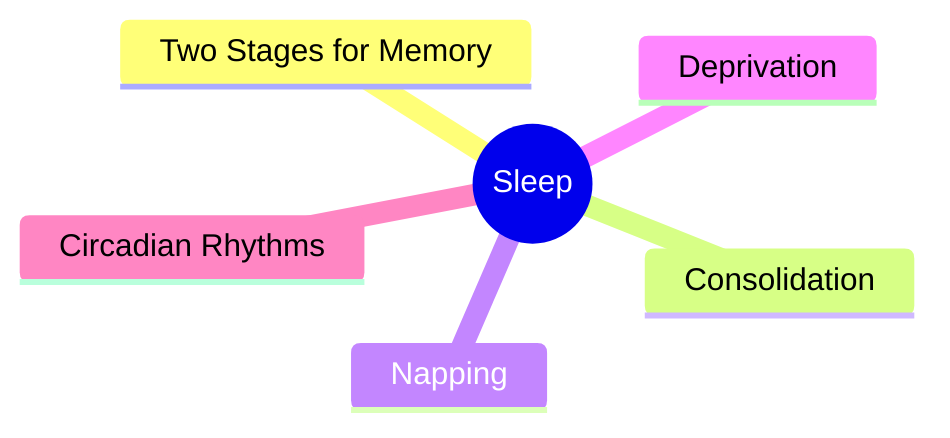
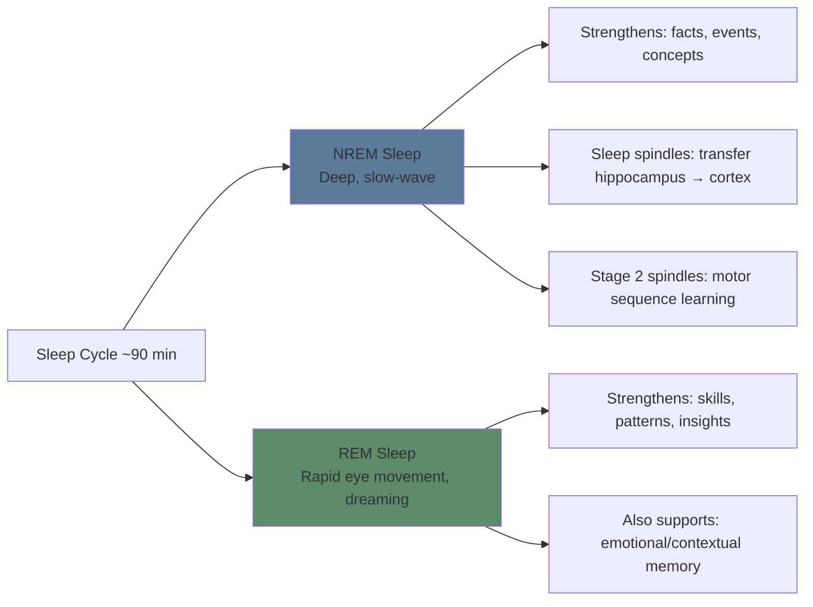
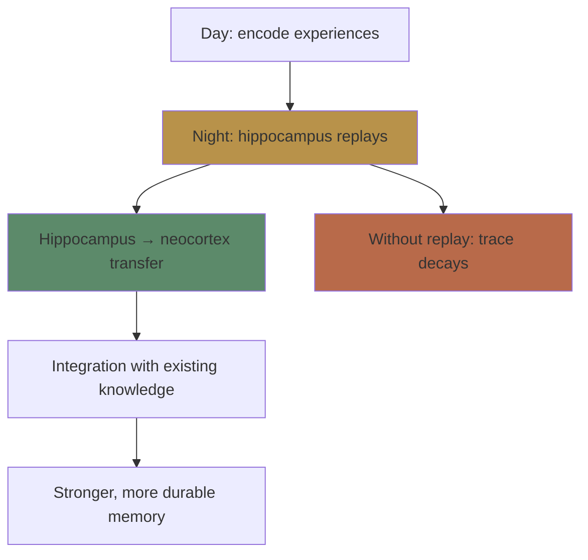

# Module 14: Sleep & Memory Consolidation

Est. study time: 2h
Language: en
Description: Why sleep is not optional for learning — it's when memories are locked in.

## Learning Objectives
- Explain the role of NREM and REM sleep in different memory types
- Apply sleep strategies to enhance learning (timing, naps)
- Describe how sleep deprivation impairs encoding and consolidation

---

## Real-World Example

You study for an exam. You sleep 5 hours. You take the exam. You blank on some answers, especially the details.

Your friend studied the same material, slept 8 hours, and remembered everything.

The difference wasn't study time — it was **consolidation**. Sleep transforms fragile memories into durable ones.

> **Think**: If you had to choose between 1 extra hour of study or 1 extra hour of sleep before a test, which should you pick?
>
> *Answer: Sleep. The 1 extra study hour has diminishing returns. Missing sleep impairs both consolidation of what you studied AND retrieval during the test.*

---

## Core Content

### The Two Sleep Stages for Memory

**NREM (deep sleep)**: Dominates early night. Primarily strengthens declarative memory (facts, vocabulary, concepts) — hippocampus replays recent experiences and transfers them to neocortex for long-term storage. NREM Stage 2 sleep spindles also support motor sequence and procedural learning.

**REM (dream sleep)**: Dominates late night. Primarily strengthens procedural memory (skills, patterns) and supports integration of new material with existing knowledge — insight and creative problem-solving. REM also contributes to emotional and contextual aspects of declarative memory, not only procedural.

> **Cloze**: "NREM sleep predominantly strengthens {declarative} memory (facts, events), while REM sleep predominantly strengthens {procedural} memory (skills, patterns) — though the boundary is not absolute."
>
> *Answer: declarative, procedural*

### The Consolidation Process

During NREM sleep, the hippocampus replays the day's learning — **reactivation**. This reactivation transfers memories from temporary hippocampal storage to permanent neocortical storage.

**Sleep spindles**: Bursts of brain activity during NREM sleep. Higher spindle density = better memory consolidation.

**Implication**: If you don't sleep after learning, consolidation is impaired. The memory trace remains fragile and prone to interference.

> **Predict**: Two students learn the same material Monday. Student A sleeps 8 hours Monday night. Student B sleeps 4 hours. On Tuesday, both learn new material. Who remembers Monday's material better on Wednesday?
>
> *Answer: Student A. Consolidation happened during deep sleep. Student B's trace remained fragile and may have been overwritten by Tuesday's learning.*

### Napping for Learning

Naps as short as 6-10 minutes improve alertness. For memory consolidation, longer naps (60-90 min) that include NREM sleep provide significant consolidation benefit.

| Nap length | Benefits | Best for |
|-----------|----------|----------|
| 10-20 min | Alertness, reaction time | Quick refresh |
| 30 min | May cause sleep inertia (grogginess) | Avoid |
| 60-90 min | NREM + REM → memory consolidation | Learning days |

> **Think**: After a heavy study session, what's more effective — a 20-min nap or a 90-min nap?
>
> *Answer: 90-min nap if possible (includes NREM sleep for consolidation). 20-min nap improves alertness but doesn't trigger consolidation.*

### Sleep Deprivation and Learning

| Function affected | Sleep deprivation effect |
|------------------|------------------------|
| **Encoding** | Impaired attention → poor initial encoding |
| **Consolidation** | Suppressed replay → fragile traces |
| **Retrieval** | Reduced executive function → harder recall |
| **Next-day learning** | Cumulative deficit → each day worse |

**Minimum recommendation**: 7-9 hours per night during intensive learning periods. Consistency matters more than total hours — regular sleep schedule > variable.

> **Spot the Mistake**: "I'll cram tonight and catch up on sleep after the exam."
>
> What's wrong?
>
> *Answer: Consolidation happens during sleep after learning, not after the test. If you don't sleep after studying, the trace doesn't solidify. By the time you sleep after the test, the material is gone.*

### Circadian Rhythms and Optimal Study Timing

Individual chronotypes vary:

| Chronotype | Peak alertness | Best for encoding |
|-----------|----------------|-------------------|
| Morning lark | 8 AM - 12 PM | Complex new material |
| Night owl | 4 PM - 10 PM | Complex new material |
| Everyone | Post-nap (early afternoon) | Encoding |
| Everyone | Evening (before bed) | Consolidation-reliant learning |

**Strategy**: Learn new encoding-heavy material during peak alertness. Review/consolidate in evening. Sleep. Test in morning.

> **Cloze**: "The optimal learning schedule: encode new material during {peak alertness}, review before {sleep} for consolidation, and {test} in the morning after consolidation."
>
> *Answer: peak alertness, sleep, test*

---

## Why This Matters

Sleep is not wasted time. It's when the brain locks in what you learned. Sacrificing sleep for study is counterproductive — it reduces encoding, blocks consolidation, and impairs retrieval. Sleep is a learning strategy.

---

## Key Takeaways
- NREM sleep consolidates facts (declarative memory)
- REM sleep consolidates skills (procedural memory)
- Sleep spindles during NREM transfer hippocampus → cortex
- 7-9 hours minimum during learning periods
- 60-90 min naps aid consolidation after study
- Sleep deprivation impairs encoding, consolidation, and retrieval
- Learn at peak alertness, review before bed, test after sleep

---

## Common Misconception

**Misconception**: "I can function fine on 5-6 hours of sleep."

**Reality**: Chronic sleep deprivation impairs cognitive function even if you feel adapted. You can't judge your own impairment — sleep-deprived people are poor judges of their own cognitive state.

**Correct framing**: If you're learning intensively, prioritize 7-9 hours. The extra sleep produces more learning than the extra study hour.

---

## Spot the Mistake

"I study until 2 AM, then wake up at 6 AM to review. Sleep is for the weak."

What's wrong?

*Answer: Multiple violations. (1) No consolidation window after late study. (2) Sleep deprivation impairs next-day encoding. (3) The 6 AM review happens in a sleep-deprived brain with reduced executive function.*

---
## Feynman Explain

When you learn during the day, memories are stored temporarily in the **hippocampus** — fast to write, slow to access, fragile. At night, during sleep, your brain *replays* the day's memories and gradually transfers them to the **cortex** for long-term storage. Different sleep stages do different jobs: deep NREM sleep is especially important for facts and concepts; REM sleep is especially important for skills, patterns, and integrating new info with old. No sleep, no transfer. No transfer, no long-term learning — no matter how many hours you "studied."

---

## Reframe

Sleep is the **offline batch job** of the brain: the same pattern shows up in computing (write to memory, flush to disk, run nightly compaction), in biology (cellular repair, immune system maintenance), and in journalism (the morning-after rewrite, where understanding forms). The shared logic: consolidation requires *separation in time* from acquisition. Trying to learn while simultaneously consolidating is like trying to write to a file while the disk is being defragged. Sleep enforces the separation. Skipping it is the equivalent of running the system 24/7 with no maintenance window — it works for a while, then performance degrades silently until it doesn't.

---

## Drill
Run: `learn.sh quiz learning-theories 14`
