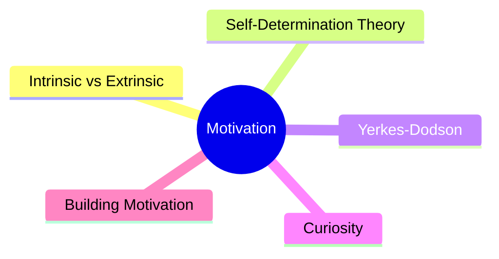
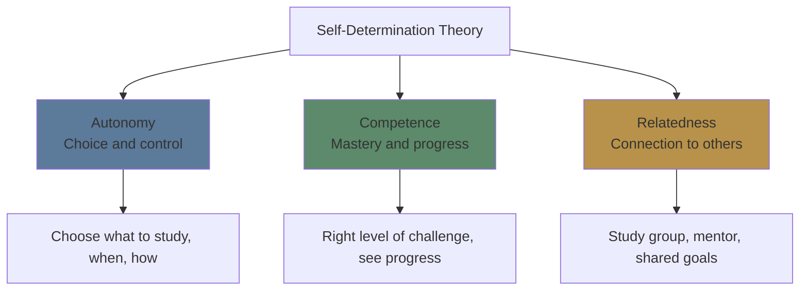
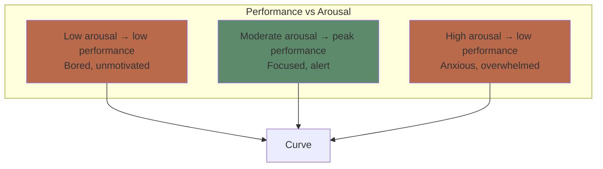

# Module 15: Motivation & Emotion in Learning

Est. study time: 2h
Language: en
Description: Why we learn (or don't) — the role of motivation, anxiety, and curiosity.

## Learning Objectives
- Distinguish intrinsic and extrinsic motivation and their effects on learning
- Apply Self-Determination Theory (autonomy, competence, relatedness)
- Describe the Yerkes-Dodson law and optimal anxiety for performance
- Use curiosity to drive encoding

---

## Real-World Example

You've tried to learn a new language three times. Each time, you start excited, buy materials, then fizzle out after 3 weeks.

But the video game you play — you learned hundreds of terms, strategies, and systems without trying. You ENJOYED learning them.

The difference isn't your brain. It's **motivation**.

> **Think**: What made game learning easy and language learning hard — content, design, or motivation structure?
>
> *Answer: Motivation structure. Games provide autonomy (choose what to learn), competence (gradual challenge), and immediate feedback. Language apps often don't.*

---

## Core Content

### Intrinsic vs Extrinsic Motivation

| Type | Source | Example | Learning effect |
|------|--------|---------|----------------|
| **Intrinsic** | Internal interest, enjoyment | Learning for curiosity | Deep, durable, self-sustaining |
| **Extrinsic** | External reward/punishment | Learning for a grade | Shallow, fragile, requires continued rewards |

**Intrinsic motivation** produces better learning outcomes — more persistence, deeper processing, better transfer. But not all subjects can be made intrinsically interesting.

**The hidden cost of rewards**: Tangible rewards for intrinsically interesting activities can reduce later intrinsic motivation (overjustification effect).

> **Think**: You pay a child \$5 for every book they read. They read more. When you stop paying, they read less than before. Why?
>
> *Answer: The reward shifted attribution: "I read for the money, not because I enjoy it." Intrinsic motivation was undermined.*

### Self-Determination Theory (Deci & Ryan)

Three basic psychological needs that drive intrinsic motivation:

**Learning strategies that support each need:**
- **Autonomy**: Choose your topics, set your own goals, decide your schedule
- **Competence**: Start with achievable challenges, track progress, celebrate wins
- **Relatedness**: Join study groups, discuss with peers, share what you learn

> **Cloze**: "Self-Determination Theory identifies three basic needs for intrinsic motivation: {autonomy}, {competence}, and {relatedness}."
>
> *Answer: autonomy, competence, relatedness*

### Anxiety and Learning: The Yerkes-Dodson Law

**Yerkes-Dodson law**: Performance peaks at moderate arousal. Too little (boredom) or too much (anxiety) impairs learning.

**Complex tasks** have a lower optimal arousal point (easier to overarouse). **Simple tasks** have a higher optimum.

**Test anxiety**: When arousal exceeds optimal for the task, retrieval fails. The knowledge is stored but inaccessible under high stress.

> **Think**: A student is so anxious about an exam that they blank on answers they knew. What happened?
>
> *Answer: Arousal exceeded optimal level for the task. Executive function impaired, retrieval blocked. Management strategy: deep breathing, practice tests under timed conditions.*

> **Predict**: Which task is more affected by high anxiety — reciting simple multiplication tables or solving a complex calculus problem?
>
> *Answer: Calculus. Complex tasks have a lower optimal arousal point. Simple multiplication is less affected.*

### Curiosity and Learning

Curiosity primes the brain for learning. When you're curious:
- Dopamine release enhances encoding
- Attention is naturally focused
- Effort feels like exploration, not work
- Memory for incidental information also improves

**Curiosity triggers:**
- Knowledge gaps (you know enough to know you don't know)
- Contradictions (something doesn't match your model)
- Novelty (new pattern or idea)
- Relevance (it matters to your goals)

> **Think**: Why do you remember random trivia from interesting conversations but not from a textbook?
>
> *Answer: Curiosity was triggered naturally in conversation (gap, relevance, social context). Textbook didn't activate the dopamine encoding boost.*

### Building Motivation When It's Not Interesting

Not every topic can spark curiosity. Strategies to build motivation:

| Strategy | How | Mechanism |
|----------|-----|-----------|
| **Connect to goals** | "Learning X helps me achieve Y" | Intrinsic framing |
| **Make it social** | Study group, teach someone | Relatedness |
| **Track progress** | Visible progress bars, completed items | Competence |
| **Self-choice** | Choose order, depth, or examples | Autonomy |
| **Small wins** | Achievable daily goals | Competence |
| **Curiosity priming** | Ask 3 questions before starting | Knowledge gap |

---

## Why This Matters

Motivation determines whether you start, persist, and engage deeply. All the strategies in this course require sustained effort. Without motivation management, the best strategy is useless.

---

## Key Takeaways
- Intrinsic motivation > extrinsic for deep learning
- SDT: autonomy, competence, relatedness drive motivation
- Optimal arousal: moderate anxiety helps, high anxiety hurts
- Curiosity primes the brain for encoding (dopamine boost)
- Motivation can be built — connect to goals, make it social, track progress

---

## Common Misconception

**Misconception**: "I need to be motivated before I can study."

**Reality**: Action often precedes motivation. Starting (even 5 minutes) creates momentum. Motivation follows behavior, not the reverse.

**Correct framing**: Start small. Motivation will catch up. Don't wait for the feeling — create it by starting.

---

## Spot the Mistake

"I'm just not motivated to learn this. I'll wait until I feel inspired."

What's wrong?

*Answer: Waiting for inspiration is passive. Motivation is a design problem — set autonomy (choose your approach), competence (small wins), and relatedness (study with someone). Design the conditions, and motivation follows.*

---
## Feynman Explain

Two kinds of motivation push you. **Intrinsic**: "I want to learn this" (curiosity, interest, mastery). **Extrinsic**: "I have to learn this" (grades, deadlines, money, fear). Intrinsic motivation is far more durable and produces deeper learning. Self-Determination Theory says intrinsic motivation is strongest when three needs are met: **autonomy** (I'm choosing), **competence** (I'm getting better), and **relatedness** (I'm connected to others). The takeaway: motivation is not willpower. It's a function of design — of the activity and the environment.

---

## Reframe

The autonomy/competence/relatedness framework is the same logic as good game design (player choice, skill progression, social connection) and good management (delegation, mastery, team). The failure modes are also identical: take away autonomy and you get compliance without engagement. Take away competence signals and you get learned helplessness. Take away relatedness and you get burnout. The same lever that makes a game addictive makes a class energizing and a job sustainable. Strip those three, and no amount of "try harder" recovers it.

---

## Drill
Run: `learn.sh quiz learning-theories 15`
