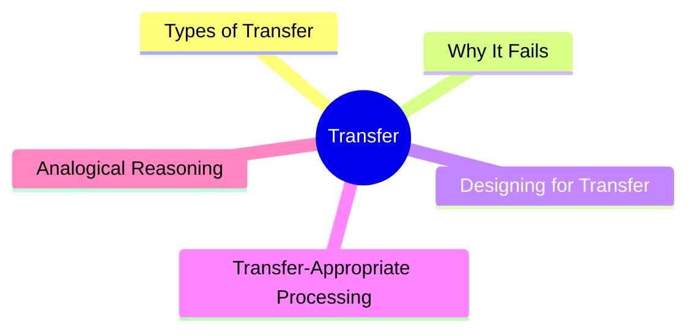
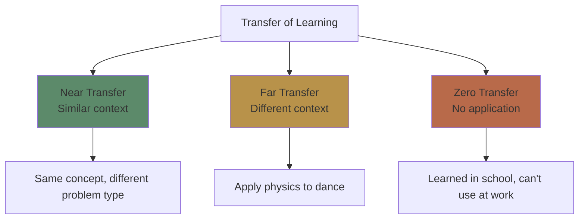
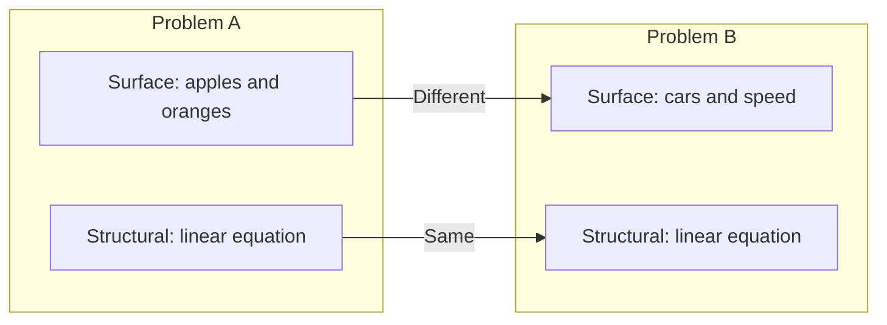

# Module 16: Transfer & Application

Est. study time: 2.5h
Language: en
Description: The ultimate goal of learning — using what you know in new situations.

## Learning Objectives
- Distinguish near transfer, far transfer, and zero transfer
- Explain why transfer often fails and how to design for it
- Apply analogical reasoning to solve novel problems
- Use transfer-appropriate processing to match study to test conditions

---

## Real-World Example

You learn statistics in a classroom: formulas, theory, textbook problems. Then your job requires analyzing real data — messy, incomplete, ambiguous.

The classroom material should help. Often it doesn't. You feel like you're starting from scratch.

This is the **transfer problem**: learning in one context doesn't automatically transfer to another.

> **Think**: The statistics knowledge IS in your brain. Why can't you use it on the job?
>
> *Answer: Transfer requires recognizing that the job situation IS a statistics problem. Classroom training teaches formulas but not situation recognition.*

---

## Core Content

### Types of Transfer

**Near transfer**: Applying knowledge to a situation very similar to the learning context. (E.g., solving a math problem after studying worked examples.)

**Far transfer**: Applying knowledge to a situation that looks very different. (E.g., using logical reasoning from math to analyze a legal argument.)

**Zero transfer**: No application despite having relevant knowledge. (E.g., can solve textbook problems but not real-world problems.)

> **Cloze**: "Near transfer applies knowledge to {similar} contexts. Far transfer applies to {different} contexts. Zero transfer occurs when knowledge {doesn't apply} outside the learning context."
>
> *Answer: similar, different, doesn't apply*

### Why Transfer Fails

**1. Surface vs Structural Features**

Problems that LOOK different (different surface features) but ARE the same (same structure) — transfer requires ignoring surface and recognizing structure.

**2. Context-Dependent Learning**: Memory is tied to study context (encoding specificity). Different context = harder retrieval.

**3. Insufficient Practice**: Transfer requires fluent, overlearned skills. If the skill requires conscious effort, transfer is limited.

> **Think**: Why do students fail to apply math formulas to word problems even though they can solve symbolic equations?
>
> *Answer: Symbolic equations lack surface features. Word problems have surface features that hide the structural similarity. Students don't recognize the equation underneath the story.*

### Designing for Transfer

| Strategy | How it helps | Implementation |
|----------|-------------|----------------|
| **Varied practice** | Separates structure from surface | Practice with diverse examples |
| **Multiple contexts** | Breaks context dependence | Study in different places/formats |
| **Compare cases** | Highlights structural similarity | Side-by-side comparison |
| **Self-explanation** | Abstract principles from examples | Explain why solutions work |
| **Desirable difficulties** | Forces deeper encoding | Spacing, retrieval, interleaving |

**The most effective transfer strategy**: Solve problems in 3+ different surface contexts that share the same underlying structure. Compare and contrast.

> **Predict**: A math teacher shows 3 different types of problems for each concept. A second teacher shows 10 near-identical problems. Whose students transfer better?
>
> *Answer: The first teacher. Varied practice teaches the underlying principle by separating it from surface features.*

### Transfer-Appropriate Processing

Memory is better when the cognitive operations at test match those at encoding.

**Implication**: If you want to apply knowledge in a specific way, practice that way.

| If test is... | Practice with... |
|--------------|-----------------|
| Multiple choice | Recognition questions |
| Open-ended recall | Free recall |
| Applied problem-solving | Applied problems |
| Timed | Timed practice |
| Verbal presentation | Verbal explanation |

**Mismatch example**: Studying by reading (recognition) → test by writing (recall). Different processing → poorer performance.

> **Spot the Mistake**: "I study for exams by reading my notes and highlighting key points. Then I'm surprised when essay questions are harder than multiple choice."
>
> What's wrong?
>
> *Answer: Transfer-appropriate processing mismatch. Reading/highlighting is recognition. Essay questions require recall. Study format should match test format.*

### Analogical Reasoning

Transfer often requires analogical thinking — seeing a structural similarity between two seemingly different domains.

**Analogy structure:**
- Source domain: something you understand
- Target domain: something new you want to understand
- Mapping: structural alignment between source and target

**Example**: Solar system (source) → atom structure (target). Both have a central body with orbiting elements. The structural relationship (central force, orbital motion) transfers even though the domains are completely different.

> **Think**: Why are analogies so effective for learning?
>
> *Answer: An analogy provides a ready-made structural framework from a familiar domain, mapped onto the new domain. It bypasses the need to build structure from scratch.*

---

## Why This Matters

Transfer is the ultimate test of learning. If you can only use knowledge in the study context, you haven't truly learned it — you've context-bound it. Everything in this course (spacing, retrieval, interleaving, variation, elaboration) ultimately serves transfer.

---

## Key Takeaways
- Near = similar context, far = different context, zero = no application
- Surface features hide structural similarity — this is why transfer fails
- Varied practice and multiple contexts build transfer
- Transfer-appropriate processing: practice how you'll use it
- Analogies transfer structure between domains
- If it only works in the study context, it's not real learning

---

## Common Misconception

**Misconception**: "If I understand the concept, I can apply it anywhere."

**Reality**: Understanding ≠ transfer. You can understand a concept deeply in one context and fail to recognize it in another. Transfer requires explicit practice across varied contexts.

**Correct framing**: Understanding is necessary but not sufficient. Practice transfer explicitly — use the concept in different situations.

---

## Spot the Mistake

"I know this concept cold. I just can't apply it to real problems."

What's wrong?

*Answer: You don't know it cold. You know it in one context. Transfer is a skill separate from understanding. Practice with diverse problems to build transfer.*

---

## Feynman Explain
(Explain transfer: knowing something is like having a tool in a toolbox. Most people have tools but don't know when to use them. Transfer is learning to see "this is a hammer situation" in any room you walk into — not just the workshop where you learned about hammers.)

---

## Reframe
(Judge: think of a skill you learned in one context but failed to transfer. What was missing — varied practice, surface vs structure recognition, or context dependence? Design one transfer exercise for a concept you're learning now.)

---

## Drill
Run: `learn.sh quiz learning-theories 16`
