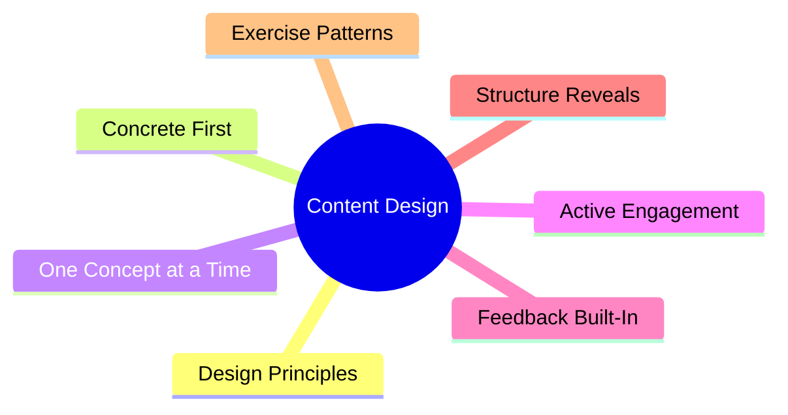
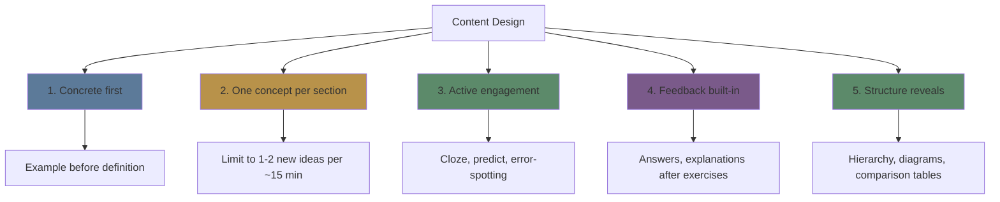
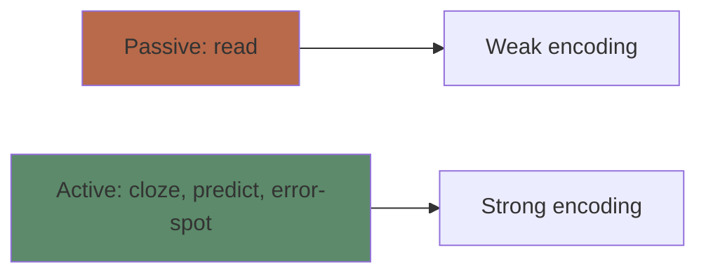

# Module 17: Content Design for Learning

Est. study time: 2h
Language: en
Description: How to apply everything in this course to design content that actually teaches — whether for yourself or others.

## Learning Objectives
- Apply cognitive science principles to writing, presentations, and exercises
- Design exercises that force retrieval, elaboration, and transfer
- Create content that respects WM limits and desirable difficulties
- Evaluate existing content for learning effectiveness

---

## Real-World Example

You're writing documentation, a presentation, a tutorial, or study notes. Should you write:

A: "First, understand the architecture. The system has three components..."
B: "Here's a problem you've faced. Here's how the architecture solves it. Let's walk through the data flow."

Version A is clear. Version B teaches. The difference is **content design for learning**.

> **Think**: What makes version B more teachable than version A?
>
> *Answer: Version B starts with concrete problem (engages attention), uses narrative (elaboration hooks), and walks through process (cognitive apprenticeship).*

---

## Core Content

### The Content Design Principles

### Principle 1: Concrete First

Bad: "A bond is a debt security issued by..." (abstract definition first)
Good: "Your company needs $10M. Bank says 8%. Bond market says 6%. You issue bonds." (concrete scenario first)

**Rule**: Start with a problem the learner has faced. Then explain the concept that solves it.

### Principle 2: One Concept at a Time

WM capacity is ~4 chunks. A content section that introduces 5 new concepts simultaneously guarantees overload.

**Rule**: 1-2 new concepts per ~15 minutes of content. Use subheadings to create conceptual boundaries.

### Principle 3: Active Engagement

Passive content (read, watch, listen) produces weak encoding. Build engagement mechanisms:

**Engagement mechanisms (from strongest to weakest):**
1. **Generate**: Learner produces answer before seeing it (retrieval)
2. **Predict**: Learner commits to outcome before reveal (prediction error)
3. **Error-spot**: Learner identifies a mistake (error detection)
4. **Cloze**: Learner fills in a blank (cued recall)
5. **Think**: Learner answers a question in their head (elaboration)

> **Think**: This course includes cloze, predict, error-spot, and think prompts after every section. Have you been doing them?
>
> *Answer: If yes, you're getting the benefit. If no, you're reading passively — the content is designed for engagement, but only works if you engage.*

### Principle 4: Feedback Built-In

Content should provide immediate answers after every exercise. Learner attempts → checks → learns.

**Bad design**: Exercises at the end of the chapter, answers in the back.
**Good design**: Exercise followed immediately by explanation and correct answer.

### Principle 5: Structure Reveals

Use visual structure to communicate relationships:
- **Hierarchies**: Show level of generality (tree diagrams)
- **Comparison tables**: Show similarities and differences
- **Flowcharts**: Show sequences and decisions
- **Cause-effect chains**: Show causal relationships

> **Predict**: A training team writes a 3,000-word manual starting with formal definitions, no exercises inside, and answers at the back of the book. Which design principles will it violate?
>
> *Answer: Concrete first (no problem up front), one concept at a time (many new terms dumped together), active engagement (no cloze/predict/error prompts), and feedback built-in (answers at the back, not immediate). Only structure may survive if headings are clear.*

### Exercise Design Patterns

| Pattern | How | Learning mechanism |
|---------|-----|-------------------|
| **Cloze** | Blank key terms | Forced retrieval during reading |
| **Predict** | Ask what happens next | Prediction error → attention |
| **Error-spot** | Show plausible mistake | Error detection → model update |
| **Compare** | Side-by-side cases | Structural alignment |
| **Generate** | Create own example | Elaboration + transfer |
| **Apply** | Use concept in new scenario | Transfer practice |
| **Debug** | Find and fix the bug | Error-driven learning |

### The Evaluation Checklist

Use this to evaluate any content you consume or create:

- [ ] Starts with concrete example or problem?
- [ ] One concept per section?
- [ ] Includes active engagement (cloze, predict, error-spot)?
- [ ] Provides immediate feedback?
- [ ] Uses diagrams, tables, or flowcharts for structure?
- [ ] Respects WM limits (no extraneous fluff)?
- [ ] Builds on previous knowledge?
- [ ] Ends with retrieval opportunity?

> **Spot the Mistake**: "I wrote a comprehensive tutorial. It covers everything. 5,000 words, all the details, no interruptions."
>
> What's wrong?
>
> *Answer: No active engagement, no structure, likely WM overload. A wall of text with no interaction produces shallow processing. Break it up, add engagement prompts, provide structure.*

---

## Why This Matters

Whether you're writing notes, creating presentations, or designing tutorials, content design determines whether readers learn or just read. You now have the science to design content that works with the brain, not against it.

---

## Key Takeaways
- Concrete first: problem → concept → abstraction
- One concept per section — respect WM limits
- Build active engagement: cloze, predict, error-spot, generate
- Provide immediate feedback after every exercise
- Use visual structure (hierarchy, table, flowchart)
- Every content piece should pass the evaluation checklist

---

## Common Misconception

**Misconception**: "Good content is clear, comprehensive, and well-organized."

**Reality**: Clarity is necessary but not sufficient. Content must also force active processing. The best-written passive text is less effective than a so-so text that makes the reader retrieve, predict, and generate.

**Correct framing**: Design for engagement, not just clarity. The reader must DO something with each concept.

---

## Spot the Mistake

"I created a training course. Each module has 20 slides of bullet points followed by a quiz at the end."

What's wrong?

*Answer: 20 slides of passive viewing → minimal encoding. Quiz at end is too late — no feedback during learning. Redesign: 3-4 slides → engagement prompt → immediate feedback → repeat.*

---

## Feynman Explain
(Explain content design: don't give someone a fish (tell them the answer). Don't just teach them to fish (give them information). Build a fishing simulator (interactive content where they try, fail, learn, and try again with feedback).)

---

## Reframe
(Judge: pick one piece of content you've created or use regularly. Run it through the evaluation checklist. What would you change to make it more learnable?)

---

## Drill
Run: `learn.sh quiz learning-theories 17`
