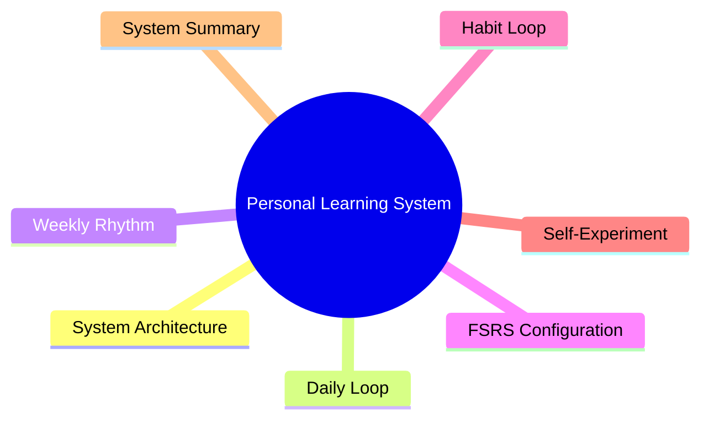
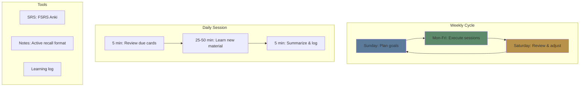
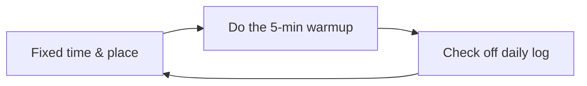
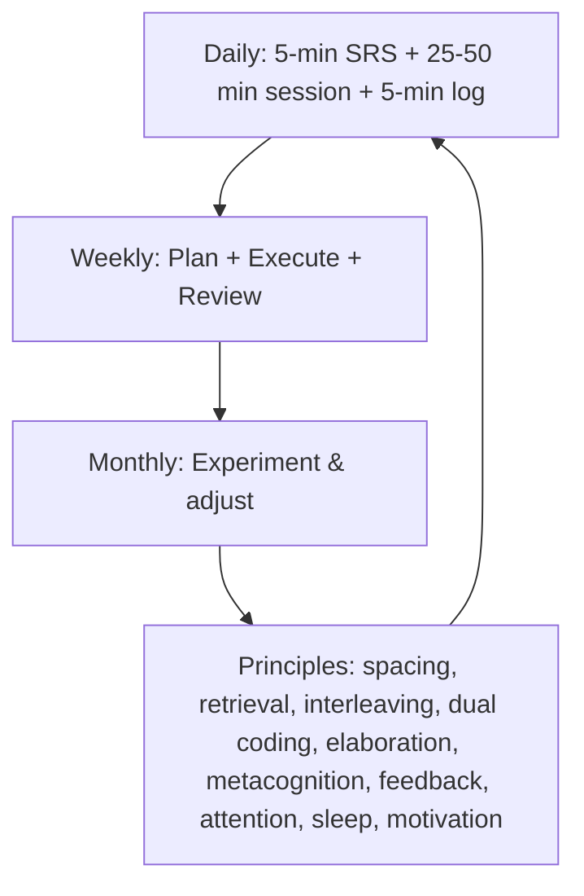

# Module 18: Building Your Personal Learning System

Est. study time: 2h
Language: en
Description: Synthesize everything into a daily/weekly learning system that runs on autopilot.

## Learning Objectives
- Design a personal learning system integrating all 17 prior modules
- Configure FSRS-5 for optimal spaced repetition scheduling
- Build daily, weekly, and monthly learning rhythms
- Create habit loops that sustain learning without willpower

---

## Real-World Example

You've completed 17 modules of learning science. You understand spacing, retrieval, dual coding, interleaving, metacognition — the works.

But knowing is not doing. The real test is whether you build a SYSTEM that makes these strategies automatic.

> **Think**: What's the difference between knowing learning strategies and having a learning system?
>
> *Answer: Strategies are tools. A system is a routine that forces you to use the tools. Systems don't require motivation or decisions — they run on habit.*

---

## Core Content

### The Learning System Architecture

### The Daily Learning Loop

| Phase | Time | Activity | Principles used |
|-------|------|----------|-----------------|
| **Warmup** | 5 min | Review SRS due cards | Retrieval practice, spacing |
| **Main** | 25-50 min | Study new material | One technique per session |
| **Cooldown** | 5 min | Free recall summary + log | Retrieval practice, metacognition |

**Warmup (5 min)**: Open your SRS (Anki with FSRS). Review due cards. This primes your brain for the learning session.

**Main (25-50 min)**: One focused block. Each session picks ONE primary strategy:

| Session type | Primary strategy | Structure |
|-------------|-----------------|-----------|
| Encoding | Read/listen + cloze + diagram | Concrete first, elaboration |
| Retrieval | Closed-book recall | Read once → recall → check |
| Interleaving | Mixed practice | Mix 3+ topics randomly |
| Application | Transfer practice | Apply concept to new context |
| Feedback | Test + error analysis | Attempt → get feedback → analyze |

**Cooldown (5 min)**: Close everything. Write a free-recall summary. Log what worked. This consolidates and builds metacognition.

### The Weekly Rhythm

| Day | Session focus | Duration |
|-----|--------------|----------|
| Monday | Encoding (new material) | 50 min |
| Tuesday | Retrieval practice + SRS | 30 min |
| Wednesday | Encoding + interleaving | 50 min |
| Thursday | Retrieval practice + SRS | 30 min |
| Friday | Application/transfer | 50 min |
| Saturday | Review week, error analysis | 30 min |
| Sunday | Plan next week | 15 min |

### FSRS Configuration

FSRS-5 (Free Spaced Repetition Scheduler) is the latest algorithm. Key parameters:

| Parameter | Default | What it controls |
|-----------|---------|------------------|
| Desired retention | 0.80-0.90 | How much you want to recall at review time |
| Max interval | 365 days | Maximum days between reviews |
| Easy bonus | 1.3 | How much easier cards get after "Easy" |
| Hard penalty | 1.2 | How much harder cards get after "Hard" |

**Setup**:
1. Use Anki with FSRS-5 enabled
2. Set desired retention to 0.85 (balance of reviews vs retention)
3. Add cards with the Cloze format for facts, Basic format for concepts
4. Review daily (even 5 min keeps the system alive)

> **Cloze**: The daily loop has three phases — a {5-minute} warmup that reviews due SRS cards, a {main} block that applies one primary strategy, and a {cooldown} where you free-recall a summary and log. In FSRS-5, desired {retention} is usually set to 0.85 to balance review load against forgetting.

**Card design rules:**
- One concept per card (WM limit)
- Use images (dual coding)
- Use cloze deletions for terms (retrieval)
- Add context hints (encoding specificity)
- Tag by module for interleaving

### The Habit Loop

**Trigger**: Same time, same place every day. Attach learning to an existing habit ("after morning coffee").

**Routine**: Start with the minimum viable system — 5 minutes of SRS review. That's it. Scale up when the habit is solid.

**Reward**: Check a box, log a streak, review progress. Visible progress feeds competence (SDT).

**Minimum viable system:**
1. Same time daily
2. Open SRS, review due cards
3. Log one thing you learned
4. That's it

Everything else is optional until the habit is automatic.

### The Self-Experiment Mindset

Your learning system should evolve. Run experiments:

| Question | Experiment | Measure |
|----------|------------|---------|
| Is 25 or 50 min better? | 2 weeks of each | Recall after 1 week |
| Does morning or evening work better? | Compare retention | SRS stats |
| Is interleaving helping? | Switch between blocked/interleaved weeks | Test scores |

**Rule**: Change one variable at a time. Track data. Keep what works.

> **Predict**: A student spends 2 weeks designing the perfect system but doesn't actually study. What went wrong?
>
> *Answer: System design ≠ learning. The minimum viable system (5 min SRS daily) should start TODAY. Optimization comes after the habit is established.*

### The Complete System Summary

---

## Why This Matters

This is the final synthesis. All 17 modules lead here. Knowledge without system = unused potential. System without knowledge = blind routine. Together, they compound.

You now have:
- The science (modules 1-16)
- The design principles (module 17)
- The system (module 18)

The only remaining step: **start today with 5 minutes**.

---

## Key Takeaways
- Build a minimum viable system first (5 min SRS + daily log)
- Daily loop: warmup (SRS) → main (focused technique) → cooldown (recall + log)
- Weekly rhythm: encoding, retrieval, interleaving, application, review, plan
- FSRS-5: desired retention 0.85, daily reviews, one card per concept
- Habits over motivation: fixed trigger → minimum routine → visible reward
- Run self-experiments: change one variable, track data
- Start today. 5 minutes. That's all it takes.

---

## Common Misconception

**Misconception**: "I need the perfect system before I start."

**Reality**: Perfection is the enemy of action. Start with the minimum viable system. Improve it gradually. The perfect system doesn't exist — but the system you actually USE does.

**Correct framing**: Start with 5 minutes. Today. Optimize later.

---

## Spot the Mistake

"I spent 3 weeks researching the best note-taking app, the best SRS settings, and the best study schedule. I'll start next week."

What's wrong?

*Answer: Research is not learning. The best system is the one you start today. Pick a simple setup, start, and iterate.*

---

## Feynman Explain
(Explain the learning system: it's like fitness. You don't need the perfect gym, perfect routine, and perfect diet to start. You need to put on your shoes and walk for 5 minutes. The system grows from momentum.)

---

## Reframe
(Judge: what's your minimum viable learning habit starting today? Write it down. One trigger, one tiny routine, one simple reward. Start tomorrow.)

---

## Drill
Run: `learn.sh quiz learning-theories 18`
