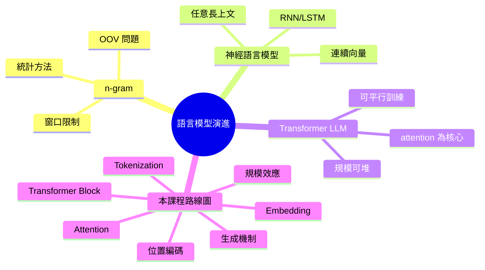

# Module 01: 語言模型入門回顧

Est. study time: 1.5h
Language: yue
Description: 快速回顧語言模型由 n-gram 到現代 LLM 嘅演進，定立本課程嘅座標

## Knowledge Map

---

## Learning Objectives
- 說明 n-gram 嘅兩大限制（窗口短 + OOV）點樣推動神經 LM 出現
- 解釋點解神經 LM 比起 n-gram 可以處理任意長上文
- 描述 Transformer 出現後 LLM 點解可以堆到咁大規模
- 列出本課程 8 個 module 嘅學習路線同邏輯次序

---

## Real-World Example

> 假設你做咗一個 n-gram 模型，用「我哋去」做上文。
> 佢可以根據 corpus 統計出下一個字嘅概率：「食飯」可能 12%，「睇戲」可能 5%，「行街」可能 8%。
> 呢個機制簡單直接，但有兩個致命限制。

## 1. n-gram 嘅兩大死穴

**死穴一：窗口太短**

n-gram 只睇頭 n−1 個字。如果 n=3，「我琴日同阿明去咗一間好有名嘅餐廳食」嘅尾部已經冇辦法記住「餐廳」呢個 context，對「食飯」嘅概率影響完全消失。

**死穴二：OOV（Out-of-Vocabulary）**

如果 corpus 從未出現過「粵語」呢個詞，n-gram 完全冇辦法處理。模型要嘛直接當 0 概率，要嘛 fallback 到 UNK（一個垃圾桶 token）。

呢兩個限制加埋，n-gram 永遠做唔到真正嘅 long-context modelling。

## 2. 神經語言模型：連續表示救咗我哋

神經 LM 嘅突破：將每個 token 用**連續向量**表示，唔再係離散嘅詞 ID。

呢個轉變帶來三個好處：

| 維度 | n-gram | 神經 LM |
|---|---|---|
| 詞表示 | 離散 ID | 連續向量 |
| 上文長度 | 固定窗口 | 理論任意長 |
| 未見過詞 | OOV | 通過 subword 拆字避開 |
| 相似詞關係 | 統計關聯 | 向量幾何 |

例如「貓」同「狗」喺 embedding 空間會接近（因為訓練語境相似），呢個類比關係 n-gram 完全 capture 唔到。

## 3. Transformer LLM：規模可以堆嘅原因

RNN / LSTM 仍然有 sequential dependency（要一個個 token 順序計），難以平行訓練。

Transformer 用 attention 完全平行化，呢個工程突破令：

- 訓練 data 可以去到 TB 級
- 模型參數可以堆到百億 / 千億
- 訓練時間由「幾日」變「幾個月」（GPU cluster）

呢個係**規模可堆（scalable）**嘅真正基礎 — 唔係算法突然變勁，而係 engineering 條件成熟。

## 4. 本課程路線圖

| Module | 主題 | 解決咩問題 |
|---|---|---|
| 02 | Tokenization | 文字點入電腦 |
| 03 | Embedding | token 變成乜 |
| 04 | Attention | token 點互相睇 |
| 05 | Transformer Block | 一層做緊乜 |
| 06 | 位置編碼 | 點解有順序感 |
| 07 | 自回歸 + KV Cache | 點樣逐個字生成 |
| 08 | 規模 + 湧現 | 大咗之後點解變勁 |

每個 module 都建立上一個嘅基礎。最後你會明白：LLM 唔係魔法，而係**一系列清晰可解釋嘅工程決策疊起嚟**。

## 5. 你帶走嘅三個 insight

1. **連續表示 > 離散表示** — 神經 LM 嘅根本突破
2. **平行化 > 順序化** — Transformer 規模化嘅 engineering 基礎
3. **本課程 = 拆解每一步嘅具體做法** — 唔係抽象理解，係睇到入面運作

---

## 自我檢測

- 你可以用一句話解釋 n-gram 嘅最大限制嗎？
- 神經 LM 點樣用「連續表示」解決 OOV 問題？
- Transformer 點解比 RNN 更容易堆規模？

完成 quiz 同 cloze，確認你 ready 進入 module 02。
