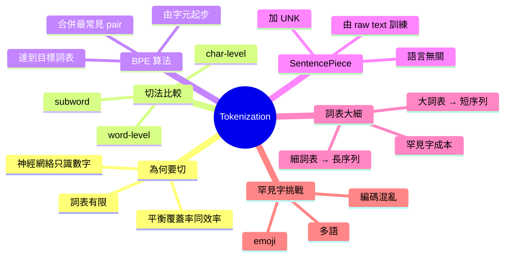

# Module 02: Tokenization 同詞表拆解

Est. study time: 1.5h
Language: yue
Description: 拆解文字點變成 token，BPE 同 SentencePiece 點運作，詞表大細對模型嘅影響

## Knowledge Map



---

## Learning Objectives
- 解釋點解 LLM 唔直接用字或字符，而係用 subword token
- 描述 BPE（Byte Pair Encoding）算法由字元合併到詞表嘅過程
- 說明 SentencePiece 點樣做到語言無關
- 分析詞表大細對 sequence 長度、訓練成本、罕見字處理嘅 trade-off
- 辨認常見 tokenization 失敗模式（罕見 emoji、編碼混亂、多語混合）

---

## Real-World Example

> 你打一句「我哋去食 sushi 🍣」入 GPT，佢唔會逐隻字處理，
> 而係切成類似：`["我", "哋", "去", "食", " s", "ushi", " 🍣"]`
> 英文「sushi」切成 2-3 個 subword，日文「🍣」可能切成 4-6 個 byte。
> 切法對模型表現、計算成本、罕見字處理影響極大。

## 1. 點解要切 token

神經網絡只識數字。所以第一步：將文字變成**整數序列**。

直覺做法有兩種極端：
- **word-level**（每個詞一個 ID）：「我哋去食飯」→ `[我哋=1234, 去=567, 食飯=8901]`
- **char-level**（每個字符一個 ID）：「飯」→ `[米=87, 反=54]`

兩個都有問題：
- word-level 詞表爆大，OOV 一堆（「sushiii」冇見過）
- char-level 序列太長，計算成本倍增，而且粒度太細學唔到語義

**Subword**（介乎中間）就係 trade-off 嘅答案。

## 2. BPE — Byte Pair Encoding（直覺版）

BPE 係而家最主流嘅 subword 算法，概念極簡：

**步驟**：
1. 由 char-level 起步，每個字元都係獨立 token
2. 統計 corpus 中最常見嘅相鄰 token pair
3. 合併嗰對，產生新 token
4. 重複 2-3 直到詞表達到目標大小（例如 50,000）

**例子**（極簡 corpus）：
```
corpus: "low low low lower lower newest newest newest newest newest wider"
step 1: 合併最常見 pair ("e", "r") → 出現 5 次
step 2: 合併 ("er", " ") → 出現 5 次
step 3: 合併 ("n", "e") → 出現 5 次
...
最終: low → ["low"], lowest → ["low", "est"]
```

**關鍵 insight**：BPE 用**頻率**決定邊 pair 值得合併。高頻 subword 通常係有意義嘅詞綴（-ing、-ed、un-），罕見詞就拆細啲。

## 3. SentencePiece — 語言無關版 BPE

BPE 原始算法需要 pre-tokenize（先用空格分詞），呢個對中文 / 日文唔 work（冇空格）。

**SentencePiece** 嘅突破：直接喺 raw text（包括空格字符）上面跑 BPE，唔需要預先分詞。

呢個帶嚟兩個好處：
1. 訓練時語言無關 — 中文、日文、emoji 同等處理
2. 可以逆向重建 — 因為包含空格 token，decode 出嚟可以還原

主流 LLM（Llama、Qwen、Mistral）都用 SentencePiece 或類似方案。

## 4. 詞表大細嘅 trade-off

詞表大細係關鍵超參數：

| 詞表大小 | 序列長度 | 罕見字處理 | 訓練成本 |
|---|---|---|---|
| 細（8K-16K） | 長 | 拆到好細 | 序列運算貴 |
| 中（32K-64K） | 中 | 一般 | 平衡 |
| 大（100K+） | 短 | 多粒保留 | embedding 參數爆 |

Llama 3 用 128K token 詞表，GPT-4 估計 100K+。

**Token 成本現實**：API 收費按 token 數計。同一句中文，日文詞表細可能要 30 tokens，詞表大可能 20 tokens，成本差 50%。

## 5. 罕見字挑戰

常見 tokenization 失敗模式：

- **罕見 emoji**：「🫠」可能切成 6-8 個 byte token
- **多語混合**：「Hello 你好」喺英文詞表主導嘅 tokenizer 下成本高
- **編碼混亂**：中英混合標點（全形 vs 半形）
- **罕見姓氏**：人名「尉遲」可能完全拆散

呢啲都係**工程上**可以量化嘅問題 — 而唔係 LLM 「理解」嘅問題。

## 6. 你帶走嘅四個 insight

1. **Subword = word 同 char 嘅平衡** — 解決 OOV 同序列長度
2. **BPE 用頻率合併** — 高頻 pair 變成有意義 token
3. **SentencePiece 語言無關** — 唔需要預先分詞
4. **詞表大細係 trade-off** — 影響長度、成本、罕見字

---

## 自我檢測

- 你可以解釋 BPE 嘅三個步驟嗎？
- SentencePiece 同 BPE 嘅最大分別係乜？
- 詞表大細同序列長度嘅關係係點？

完成 quiz 同 cloze，準備好就進入 module 03 — 探討 token 變成嘅連續向量。
