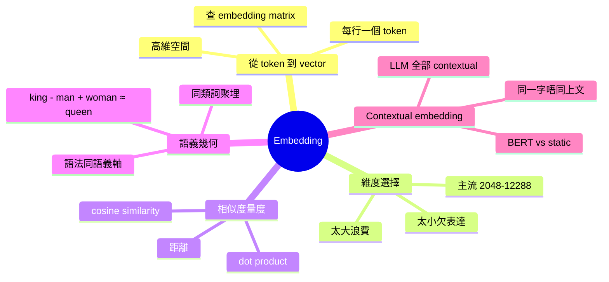

# Module 03: Embedding 同向量空間

Est. study time: 1.5h
Language: yue
Description: token 變成嘅連續向量有咩幾何結構，維度同相似度點運作

## Knowledge Map



---

## Learning Objectives
- 解釋 token ID 點樣通過查 embedding matrix 變成連續向量
- 描述 embedding 維度選擇嘅 trade-off
- 用 cosine similarity 量度詞義相近程度
- 展示詞向量空間嘅類比結構（例如 king - man + woman ≈ queen）
- 分辨 static embedding 同 contextual embedding 嘅分別

---

## Real-World Example

> 訓練好嘅 LLM，「國王」同「皇帝」嘅 embedding 會喺向量空間接近，
> 因為佢哋喺訓練語料中常出現喺相似 context。
> 更加有趣：「國王 − 男 + 女」嘅向量結果會接近「女王」。
> 呢個唔係魔法，而係向量空間嘅線性結構。

## 1. 從 ID 到 vector — 點樣查

Embedding matrix 係一個查詢表：
- 詞表大小 V（50,000+）
- 每個 token 一個 D 維向量（D = 2048 ~ 12288）
- 總參數：V × D

輸入 token ID（例如 1234）→ 直接攞 matrix 第 1234 行出嚟。

呢個 step 冇運算，只係 lookup table。所以 embedding 嘅質量完全取決於**訓練時學到嘅嘢**。

## 2. 維度選擇嘅 trade-off

維度 D 影響表達能力同成本：

| 維度 | 表達能力 | 訓練成本 | 典型模型 |
|---|---|---|---|
| 256-512 | 弱 | 低 | 小模型 / 早期詞向量 |
| 768-1024 | 中 | 中 | BERT-base |
| 2048-4096 | 強 | 高 | GPT-3 / Llama |
| 8192-12288 | 極強 | 極高 | GPT-4 級 |

直覺：D 越大，可以 encode 嘅「軸」越多。想像 2D 平面只能分「上下」+「左右」；3D 可以加「前後」；高維空間可以分更多抽象維度（例如「性別」、「時態」、「正式程度」）。

## 3. 相似度量度 — Cosine similarity

兩個向量「接近」有兩種算法：
- **Euclidean 距離**：絕對位置差
- **Cosine similarity**：方向相似度（忽略長度）

LLM 幾乎全部用 cosine similarity，公式：
```
cos(θ) = (A · B) / (||A|| × ||B||)
```

值域 [-1, 1]：1 = 完全同方向，0 = 正交，-1 = 完全相反。

「國王」同「皇帝」可能 cos = 0.85，「國王」同「香蕉」可能 cos = 0.1。

## 4. 語義幾何 — 詞向量嘅神奇特性

最震撼嘅發現（Word2Vec 2013）：

```
vec(king) - vec(man) + vec(woman) ≈ vec(queen)
```

「國王 − 男 + 女」嘅向量，竟然接近「女王」。

呢個代表詞義嘅關係（性別、王室、語法角色）可以**用向量加減**表達。即話語義空間有**線性結構**。

實際應用：
- 翻譯：將一種語言嘅向量映射到另一種
- 推薦：商品 embedding 做相似度計算
- 搜尋：query 同 document 都用同一空間

## 5. Static vs Contextual Embedding

關鍵區分：

**Static embedding**（Word2Vec, GloVe）：
- 每個詞一個固定向量
- 「銀行」喺「河邊」同「存款」context 都係同一個向量
- 語義歧義解決唔到

**Contextual embedding**（BERT, GPT, 全部現代 LLM）：
- 同一個詞，根據上文會有唔同向量
- 「銀行」喺「河邊」context 偏向地理，「存款」context 偏向金融
- LLM 全部用 contextual，呢個係重大進步

LLM 嘅 contextual 能力來自 attention 機制（module 04 詳解），呢個就係 static embedding 永遠做唔到嘅嘢。

## 6. 訓練時點學到 embedding

訓練過程：
1. 初始化：embedding matrix 隨機
2. Forward：token ID 查表 → 向量 → 入 transformer
3. Loss：預測下一個 token 嘅概率
4. Backward：根據 loss 調整 embedding matrix 對應行

神奇嘅係，**訓練目標只係「預測下一個 token」**，但 embedding 學到埋語義幾何。呢個叫 emergent property。

## 7. 你帶走嘅五個 insight

1. **Embedding = 查表** — ID 對應 matrix 嘅一行
2. **維度 = 表達能力** — 越大越強但越貴
3. **Cosine similarity** = 方向相似度
4. **語義幾何有線性結構** — 詞類比可以向量加減
5. **Contextual embedding** = 同一字唔同上文唔同向量 — LLM 核心特性

---

## 自我檢測

- 你可以解釋 embedding matrix 點樣運作嗎？
- Cosine similarity 同 Euclidean 距離嘅分別？
- 「king − man + woman ≈ queen」呢個現象點解重要？
- Static 同 contextual embedding 最大分別？

完成 quiz 同 cloze，進入 module 04 — 終於到 attention 深入。
