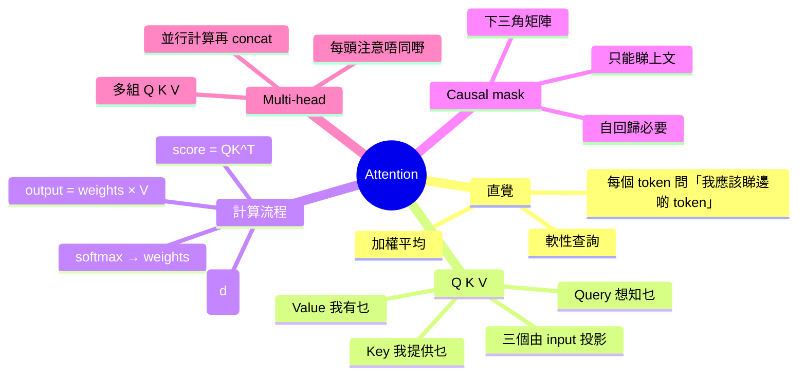

# Module 04: Attention 機制深入

Est. study time: 1.5h
Language: yue
Description: 用 Q/K/V 直覺拆解 attention 機制，scaled dot-product 點運作，causal mask 同 multi-head 概念

## Knowledge Map



---

## Learning Objectives
- 用 Q / K / V 直覺解釋 attention 點運作
- 描述 scaled dot-product attention 嘅四步計算
- 解釋 causal mask 點樣令 decoder-only 模型只睇上文
- 說明 multi-head attention 點解有效
- 辨認 attention 喺 long context 下面對嘅挑戰

---

## Real-World Example

> 一句「銀行喺河邊」要做 contextual embedding。
> 「銀行」要知道自己指「地理」意思 — 靠「河邊」呢個鄰近 token 提示。
> Attention 就係「銀行」token 攞住 query，問周圍所有 token：
> 「你哋邊個同我相關？」
> 然後按相關度加權 average 佢哋嘅 value。
> 結果：「銀行」獲得咗「河邊」嘅 context — 變成偏向地理意思。

## 1. 直覺：每個 token 嘅軟性查詢

Attention 嘅核心比喻：**每個 token 攞住 query，去「查」所有 token 嘅 key，根據相關度攞 value**。

想像圖書館：
- 你（query）想搵某類書
- 每本書有索引卡（key）描述內容
- 你按相關度攞書本內容（value）
- Attention 就係呢個軟性查詢過程

關鍵：唔係「攞最大概率果本」，而係「加權平均所有書本」。

## 2. Q / K / V 三兄弟

每個 token 嘅輸入向量 x 會投影出三個向量：
- **Q（Query）** = 我想搵咩
- **K（Key）** = 我提供咩索引
- **V（Value）** = 我嘅實際內容

數學上：
```
Q = X × W_Q
K = X × W_K
V = X × W_V
```

X = input embeddings，W_Q/K/V = 學習到嘅投影矩陣。

**直覺**：每個 token 通過唔同嘅「眼鏡」睇世界。Q 係「我嘅問題」，K 係「我嘅標籤」，V 係「我嘅內容」。

## 3. Scaled Dot-Product Attention — 四步計

公式：
```
Attention(Q, K, V) = softmax(QK^T / √d_k) × V
```

逐步拆解：

| 步驟 | 計算 | 作用 |
|---|---|---|
| 1 | QK^T | 計算每對 token 嘅相關度 score |
| 2 | ÷ √d_k | 縮放，避免 score 太大 softmax 後太尖 |
| 3 | softmax | 將 score 變概率分佈（總和 = 1） |
| 4 | × V | 用概率加權 average 所有 value |

**點解要 scaled (÷ √d_k)**：d_k 維度大，QK^T 嘅方差會大，softmax 變成 one-hot（接近 0 或 1），gradient 細難訓練。除以 √d_k 將方差 normalize 回 1。

## 4. Causal Mask — 解碼嘅必要設計

Decoder-only LLM（例如 GPT）訓練時要「預測下一個 token」，所以第 i 個 token 唔可以偷睇第 i+1 個之後嘅 token。

做法：**mask 矩陣** — 將上三角設為 −∞，softmax 後變 0。

```
矩陣可視化（4 token）：
1  0  0  0
1  1  0  0
1  1  1  0
1  1  1  1
```

讀法：row i 只能 attend 到位於 i 之前（包括自己）嘅 token。

冇 causal mask，模型訓練時直接「偷答案」，永遠學唔到語言結構。

## 5. Multi-Head — 多角度注意

單頭 attention 只能學一種「相關度」量度。Multi-head 並行跑 N 組（例如 32 頭），每組學唔同嘅 attention pattern：

- 頭 1 可能注意「動詞 → 主語」
- 頭 2 可能注意「形容詞 → 名詞」
- 頭 3 可能注意「上一句 → 下一句」
- ...

每頭獨立計 attention，然後 concat 起來再投影。

**點解 work**：唔同語法 / 語義關係需要唔同 query/key 投影，multi-head 提供多組「眼鏡」。

## 6. Attention 嘅長 context 挑戰

Attention 計算量 O(n²) — 序列長 n 翻倍，計算量變 4 倍。

- 2K context：輕鬆
- 8K context：仲得
- 32K-128K：需要 KV cache 優化（module 07）+ 稀疏 attention
- 1M+：仍係研究前沿

呢個就係點解 context length 係咁重要嘅工程指標 — 直接影響成本同可行性。

## 7. 你帶走嘅五個 insight

1. **Attention = 軟性查詢** — 加權 average，唔係揀 max
2. **Q/K/V 三種投影** — 同一 input 唔同角色
3. **Scaled ÷ √d_k** — 控制方差，穩定訓練
4. **Causal mask** = 解碼必要，防止偷睇未來
5. **Multi-head** = 多角度並行注意

---

## 自我檢測

- Q、K、V 三個投影分別代表乜嘢角色？
- 點解要 scaled dot-product（除以 √d_k）？
- Causal mask 對 decoder-only 模型點解必要？
- Multi-head attention 比起 single head 主要好處係乜？

完成 quiz 同 cloze，進入 module 05 — 將 attention 同 FFN 等組件組合為一個完整 Transformer Block。
