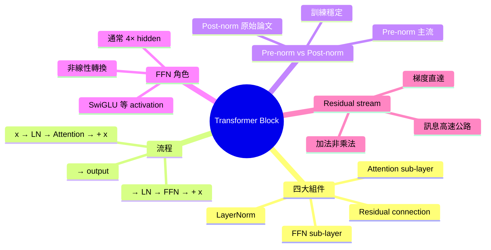

# Module 05: Transformer Block 全解構

Est. study time: 1.5h
Language: yue
Description: 一個 Transformer Block 嘅四大組件 — Attention、FFN、Residual、LayerNorm — 點樣組合

## Knowledge Map



---

## Learning Objectives
- 列出 Transformer Block 嘅四大組件同佢哋嘅角色
- 描述 pre-norm 同 post-norm 嘅分別同點解 pre-norm 主流
- 解釋 FFN 點樣提供非線性轉換
- 說明 residual connection 點樣令深層網絡可訓練
- 用 residual stream 直覺理解訊息點樣流過 96+ 層

---

## Real-World Example

> GPT-3 有 96 層 Transformer Block。
> 每一層都做差唔多嘅嘢：攞上層輸出 → attention → FFN → 傳落去。
> 點解要疊咁多層？每層學唔同抽象層次嘅特徵。
> 底層：詞性、syntax
> 中層：語義角色、short context
> 頂層：推理、long context 整合
> 呢個分層抽象就係 deep learning 嘅威力。

## 1. 一個 Block 嘅標準流程

Pre-norm Transformer Block 嘅典型計算路徑：

```
x = LayerNorm(x + Attention(x))    # 變體 A: post-attention add
x = LayerNorm(x + FFN(x))         # 變體 B: post-FFN add
```

更精確（主流 pre-norm 寫法）：

```
# Sub-layer 1: Attention
h = x + Attention(LayerNorm(x))

# Sub-layer 2: FFN
y = h + FFN(LayerNorm(h))
```

每個 sub-layer 包住一個核心操作（Attention 或 FFN），加 residual，加 LayerNorm。

## 2. 四大組件逐個拆

### 2.1 Attention sub-layer

呢個 module 04 詳細拆過。Block 入面嘅 attention 接收 normalized input，輸出 contextualized vectors。

### 2.2 FFN（Feed-Forward Network）

FFN 係兩層 MLP，結構簡單：
```
FFN(x) = W2 × activation(W1 × x + b1) + b2
```

典型維度：hidden 4096 → intermediate 16384 → hidden 4096（4× expansion）。

Activation 由早期 ReLU 演進到 SwiGLU / GeGLU（Llama 採用）。SwiGLU 提供更好嘅 gradient flow 同表達能力。

**角色**：FFN 提供非線性轉換。Attention 係線性組合（加權平均），冇非線性；FFN 加咗 activation 就令整個 block 可以學任意函數。

**直覺比喻**：Attention 係「睇周圍有乜」，FFN 係「消化吸收變成新理解」。

### 2.3 Residual connection

每個 sub-layer 都有：
```
output = sublayer(x) + x
```

即 input 直接加到 output。

**點解咁重要**：
1. **梯度直達** — 反向傳播時 gradient 可以直接穿過 residual，唔使經過 sublayer。深層網絡（96 層）冇 residual 根本 train 唔到。
2. **訊息保留** — 原始 input 訊息一定保留到 output，sublayer 只係學「加咩上去」。

呢個就係 **residual stream** 直覺 — 一條「高速公路」，sublayer 係「路邊站」，可以選擇性加嘢。

### 2.4 LayerNorm

LayerNorm 將每個 token 嘅 embedding 維度 normalize 到 mean=0, std=1。

**作用**：
- 穩定 activation 分佈
- 減少 internal covariate shift
- 訓練更快更穩

**Pre-norm vs Post-norm**：

| 設計 | 公式 | 優點 | 缺點 |
|---|---|---|---|
| Post-norm（原始） | LN(x + sublayer(x)) | 原始論文 | 深層難 train |
| Pre-norm（主流） | x + sublayer(LN(x)) | 訓練穩定 | 最終 output 未 normalize |

現代 LLM（Llama、GPT）全部用 pre-norm，因為深層（>24 層）post-norm 訓練極不穩定。

## 3. Residual stream — 點解深層 work

Residual stream 係理解 Transformer 嘅關鍵直覺。

想像一條河流：x 沿住 stream 流過 96 層，每層 sublayer 從 stream「攞嘢」、加工、再「加返入去」。

呢個設計嘅好處：
1. 訊息唔會被任何一層完全覆蓋
2. 梯度唔會被任何一層完全阻斷
3. 每層可以專注做「細微調整」，而唔係「從頭計」

**類比**：96 個人改一篇文章，每個人只改幾個字，加返入去畀下一個人改。比起一個人從頭寫到尾（無 residual），呢個分工更易做（訓練更穩定）。

## 4. 一層 vs 多層 — 點解要疊

單層 transformer 只能做淺層模式匹配。多層疊起，每層學唔同抽象：

- 第 1-10 層：詞性、字形、syntax
- 第 10-30 層：短語結構、語義角色
- 第 30-60 層：句子級語義、上下文整合
- 第 60-96 層：推理、抽象概念、長距依賴

呢個分層抽象**唔係人為指定** — 而係訓練時自然 emerge 出嚟。

## 5. 你帶走嘅五個 insight

1. **Block = Attention + FFN + Residual + LN** — 四大組件
2. **FFN 提供非線性** — attention 冇嘅嘢 FFN 補
3. **Residual = 梯度高速公路** — 深層可訓練嘅基礎
4. **Pre-norm 主流** — 訓練穩定
5. **Residual stream** — 每層加工，每層保留

---

## 自我檢測

- 一個 Transformer Block 嘅四大組件順序係乜？
- 點解要 FFN？Attention 唔夠嗎？
- Residual connection 點解對深層網絡必要？
- Pre-norm 同 post-norm 主要 trade-off？

完成 quiz 同 cloze，進入 module 06 — 解決 attention 缺乏位置感嘅問題。
