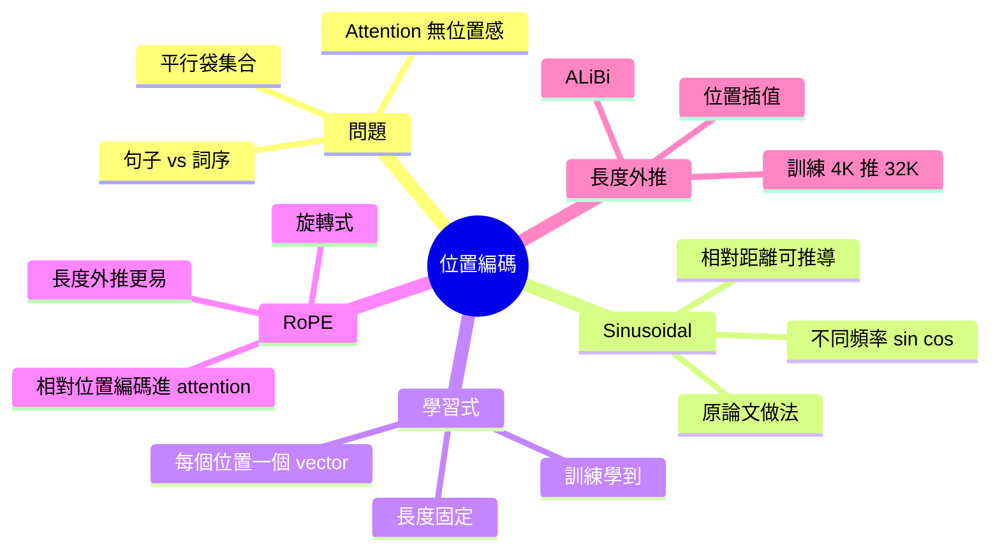

# Module 06: 位置編碼 — 點解同點做

Est. study time: 1.5h
Language: yue
Description: 點解 attention 本身冇位置感，sinusoidal、學習式、RoPE 點樣解決呢個問題

## Knowledge Map



---

## Learning Objectives
- 解釋點解 attention 本身冇位置感（permutation invariant）
- 描述 sinusoidal positional encoding 嘅直覺同公式
- 比較學習式、sinusoidal、RoPE 嘅優缺點
- 用直覺解釋 RoPE 點樣將相對位置 encode 入 attention score
- 辨識長度外推（length extrapolation）嘅挑戰

---

## Real-World Example

> 兩句：「狗咬人」同「人咬狗」
> 字完全一樣，但意思完全相反。
> 如果模型只睇「{狗, 咬, 人}」呢個集合（無序），
> 兩個句子對模型嚟講完全一樣。
> 呢個就係 attention 嘅根本限制 — **冇內建位置感**。
> 位置編碼就係補呢個缺口。

## 1. 點解 attention 冇位置感

數學上：attention 對 input sequence 做嘅操作係 permutation equivariant。

即係話打亂 token 順序，attention output 都係相應打亂（除咗 query 部分嘅 output 會跟打亂）。

**證明**：
```
output_i = Σ_j α_ij × V_j
```
α_ij 計嘅係 Q_i 同 K_j 嘅相關度，呢個分數同位置 i, j 本身無關，只同兩個 token 嘅 embedding 有關。

如果 input sequence 隨機打亂，Q_i 變咗 Q_{π(i)}，α 計算出嚟仍然合理，但**順序感**完全消失。

實驗證明：無位置編碼，transformer 訓練後表現接近 random baseline。

## 2. Sinusoidal Positional Encoding（原論文做法）

Vaswani 2017 原始論文提出，每個位置用 sin/cos 函數生成固定向量：

```
PE(pos, 2i)   = sin(pos / 10000^(2i/d))
PE(pos, 2i+1) = cos(pos / 10000^(2i/d))
```

直覺：每個維度用唔同頻率嘅 sin/cos。維度 0 頻率最高（每 2π 變一次），維度 d-1 頻率最低（每 2π × 10000 變一次）。

**神奇特性**：對於任何固定 offset k，PE(pos+k) 可以表達成 PE(pos) 嘅線性函數。即係話相對位置 k 嘅編碼可以從絕對位置推導出嚟，模型理論上學到相對位置關係。

**優點**：可推廣到訓練時未見過嘅長度（雖然實際表現會跌）。
**缺點**：實際訓練中，模型有時更鍾意用絕對位置，相對位置特性未必用盡。

## 3. 學習式 Positional Encoding

最直觀做法：每個位置（0, 1, 2, ..., max_len-1）學一個 embedding vector。

**做法**：
- 創建 max_len × D 嘅 matrix
- 訓練時同其他參數一齊學
- max_len 固定（例如 512、2048）

**優點**：簡單，模型直接學到對應位置表示。
**缺點**：
- 訓練時 max_len 以外嘅位置完全冇定義
- 無法外推到更長序列
- 浪費參數（每個位置一個獨立 vector）

## 4. RoPE（Rotary Position Embedding）

RoPE 係而家主流 LLM（Llama、Qwen、Mistral）採用嘅方案。

**核心 idea**：將位置信息 encode 入 Q 同 K 嘅方向（角度），唔係加落 input。

做法：對 Q_i 同 K_j 做旋轉，旋轉角度同 i, j 位置有關。
```
q'_i = q_i × e^(i × m × θ)
k'_j = k_j × e^(j × m × θ)
```

神奇嘅係，Q_i 同 K_j 嘅 dot product 自動 encode 咗相對距離 (i - j)：

```
q'_i · k'_j = q_i · R(i-j) · k_j
```

即係話 attention score 天然包含相對位置，唔需要額外加 PE。

**優點**：
- 相對位置直接 encode 入 score
- 容易外推到更長序列（雖然仍有限制）
- 主流 LLM 驗證有效

## 5. ALiBi — 線性偏置方案

ALiBi（Attention with Linear Biases）走另一條路：唔修改 embedding，直接喺 attention score 加 bias。

做法：對距離越遠嘅 token pair，減越多分數。
```
score_ij = q_i · k_j − λ × |i − j|
```

**優點**：超簡單，零額外參數，天然支持長度外推。
**缺點**：bias 太簡單，有時限制表達能力。BLOOM 用 ALiBi。

## 6. 長度外推挑戰

訓練 4K context 嘅模型推到 32K-128K，係實際部署嘅大問題。

方案：
- **位置插值（Position Interpolation）**：將超過訓練長度嘅位置「壓縮」到訓練範圍
- **ALiBi**：天然有外推能力
- **RoPE scaling**：調整 RoPE 嘅頻率參數
- **繼續預訓練**：用長 sequence 繼續 fine-tune

呢個仍然係 active research area。

## 7. 你帶走嘅五個 insight

1. **Attention 本身 permutation invariant** — 必須靠 PE 加位置感
2. **Sinusoidal** = 不同頻率 sin/cos，原論文做法
3. **學習式** = 每個位置一個 vector，簡單但外推差
4. **RoPE** = 旋轉式，相對位置 encode 入 score，主流方案
5. **長度外推** 係 active research — 訓練短 context 推長 context 仍難

---

## 自我檢測

- 點解 attention 一定要加位置編碼？
- Sinusoidal 同 RoPE 嘅最大分別？
- 點解 RoPE 對長度外推比學習式更有利？
- ALiBi 同 RoPE 嘅 trade-off？

完成 quiz 同 cloze，進入 module 07 — 探討 LLM 點樣逐個字生成同 KV cache 嘅威力。
