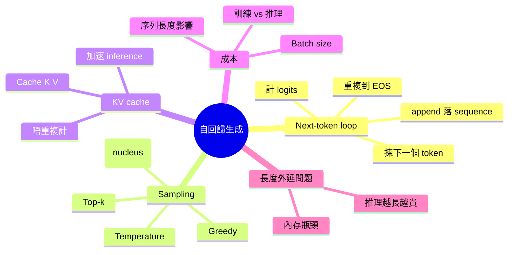

# Module 07: 自回歸生成同 KV Cache

Est. study time: 1.5h
Language: yue
Description: LLM 點樣逐個 token 生成，sampling 策略，KV cache 點樣大幅省 compute

## Knowledge Map



---

## Learning Objectives
- 描述 next-token prediction loop 嘅完整流程
- 解釋 greedy、top-k、top-p、temperature 嘅 sampling 策略同 trade-off
- 說明 KV cache 點樣透過重用 K/V 避免重複運算
- 量化 KV cache 對推理速度嘅影響
- 辨識 inference 成本主要受邊啲因素影響

---

## Real-World Example

> 用戶問 LLM：「香港有咩好食？」
> 模型唔係「一嘢寫晒成段答案」，而係：
> 1. 讀 prompt → 計 logits
> 2. 揀下一個 token（例如「當」）
> 3. append 落 sequence
> 4. 再讀「香港有咩好食？當」→ 計 logits
> 5. 揀下一個 token（例如「然」）
> 6. ... 重複到 EOS token
> 100 個 token 答案 = 100 次 forward pass

## 1. Next-Token Prediction Loop

每次 forward pass：
1. Input: 當前 sequence（prompt + 已生成 token）
2. Forward through transformer → logits vector（vocab size 維度）
3. Logits → probability distribution（softmax）
4. 根據 sampling strategy 揀下一個 token
5. Append token 落 sequence
6. 回到步驟 1，直到生成 EOS token 或達到 max length

關鍵性質：每次 forward pass 都要處理**整個 sequence**（因為 attention 要睇所有上文）。

## 2. Sampling 策略

LLM 唔一定揀概率最高嘅 token — 揀法直接影響 output 質素同多樣性。

### Greedy decoding
永遠揀概率最高 token。
- 優：穩定、可重複
- 缺：容易陷入重複、缺乏多樣性

### Top-k sampling
只從概率最高 k 個 token 中揀（例如 k=50）。
- 優：避免揀到極低概率嘅怪 token
- 缺：k 固定，動態分佈唔同場景難適應

### Top-p (nucleus) sampling
從累計概率達 p 嘅最小 token 集合中揀（例如 p=0.9）。
- 優：動態 — 高概率分佈保留多 token，低概率分佈保留少
- 缺：複雜啲，調參需要實驗

### Temperature
控制概率分佈嘅「尖 / 平」程度：
```
logits' = logits / T
```

| T | 效果 | 用途 |
|---|---|---|
| T → 0 | 接近 greedy，極尖 | 精確任務、code |
| T = 1 | 原始分佈 | 一般任務 |
| T > 1 | 較平，更多隨機 | creative writing |
| T → ∞ | 均勻分佈，隨機 | 罕用 |

## 3. KV Cache — Inference 加速關鍵

冇 KV cache，每生成一個新 token 都要重新 forward 整個 sequence（包括已生成嘅 token）。

例如生成 100 個 token：
- 冇 cache：100 + 99 + 98 + ... + 1 = 5050 次 token-level forward
- 有 cache：100 + 99（cache 已生成 token 嘅 K/V）+ ... + 1 仍然係 5050，但每步實際運算量大幅減少

**點解 work**：Attention 中 Q 係當前 token 計算，但 K 同 V 可以重用之前所有 token 嘅。

做法：每個 layer 維護一個 KV cache，存住之前所有 token 嘅 K 同 V。新 token 嚟到時，只需要：
- 計新 token 嘅 Q
- 從 cache 攞舊 token 嘅 K、V
- 計 attention score

咁每步只做 O(1) 新運算（對 n 個 cache 仍要 O(n) attention score），整體從 O(n²) 變 O(n)。

**記憶體成本**：每個 layer、每個 head、每個 token 都要存 K 同 V。序列長、batch 大，cache 容量大到限制 max batch size。

## 4. 推理成本結構

LLM 推理成本主要受三個維度影響：

| 維度 | 影響 | 典型 |
|---|---|---|
| Sequence length | KV cache、attention 計算 | 4K vs 128K = 32× |
| Batch size | 平行處理用戶數 | 1 vs 64 = 64× |
| Model size | 參數量、FLOPs | 7B vs 70B = 10× |

**Inference 兩階段**：
- **Prefill**：處理整個 prompt（一次大 forward）
- **Decode**：逐個 token 生成（多次小 forward，KV cache 加速）

Modern serving frameworks（vLLM、TGI）將兩者分開優化。

## 5. Sampling 對應用嘅影響

唔同應用要唔同 sampling：

- **Code generation**：低 T（0.2-0.4），greedy 或 top-p 0.95 — 需要精確
- **聊天**：中 T（0.7-1.0），top-p 0.9 — 平衡同自然
- **Creative writing**：高 T（1.0-1.3），top-p 0.95 — 多樣性
- **事實 QA**：低 T，greedy 為主 — 避免 hallucination 加劇

設定 T 太高，模型會輸出低概率怪 token（增加 hallucination 風險）。

## 6. 你帶走嘅五個 insight

1. **Next-token loop** = 重複 forward + sampling
2. **Sampling 策略** = greedy / top-k / top-p / temperature 影響多樣性同質素
3. **KV cache** = 重用 K/V 將推理從 O(n²) 變 O(n)
4. **推理成本** = sequence length × batch size × model size
5. **應用導向 sampling** — code 用低 T，creative 用高 T

---

## 自我檢測

- 一次 next-token prediction loop 嘅完整步驟？
- Top-p 同 top-k 嘅主要分別？
- KV cache 點樣將推理複雜度從 O(n²) 變 O(n)？
- Temperature 高低對 output 嘅影響？

完成 quiz 同 cloze，進入最後一個 module 08 — 探討規模、湧現同 LLM 嘅本質限制。
