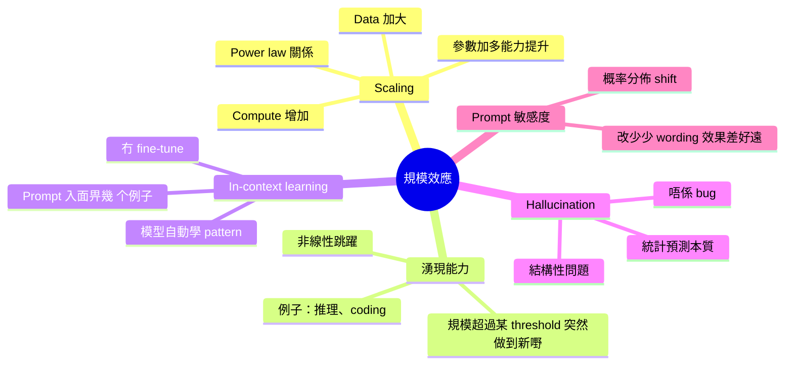

# Module 08: 規模、湧現同幻覺直覺

Est. study time: 1.5h
Language: yue
Description: 規模效應、in-context learning、湧現能力、hallucination 嘅結構性原因同 prompt 敏感度

## Knowledge Map



---

## Learning Objectives
- 描述 scaling law 嘅 power law 關係
- 解釋 in-context learning 點樣運作同點解有效
- 區分 emergent ability 同普通 scaling
- 說明 hallucination 嘅結構性原因同佢同 next-token prediction 嘅關係
- 用概率分佈直覺解釋 prompt 敏感度
- 連結所有8個 module 嘅知識，形成完整LLM架構理解

---

## Real-World Example

> GPT-2（1.5B 參數）寫唔到 Python code。
> GPT-3（175B 參數）突然可以寫 code — 但唔係因為有人專門訓練佢 coding。
> 佢只係見過訓練資料入面大量 Python code，規模大到學到呢個 pattern。
> 呢個就係湧現 — 規模大到某個程度，突然做到之前完全做唔到嘅嘢。
> 同時，佢有時會自信咁講錯事實 — 幻覺。呢個唔係 bug，係預測下一個字嘅本質。

## 1. Scaling Law — Power Law 關係

OpenAI 2020 年發現：模型嘅 test loss 同三个因素有 power law 關係。

```
L(C) ∝ C^(-α)
```

C = compute（FLOPs），α ≈ 0.05。

意思：compute 加大一倍，loss 下降一定比例。唔係線性，而係 **diminishing returns** — 每倍 compute 帶嚟嘅提升越來越少，但仍然有提升。

**Chinchilla（2022）修正**：早期 scaling 太注重大模型，Chinchilla 發現同時加大 data 更有效。最佳做法係模型大小同 data 量按比例增加。

**實踐影響**：
- Llama 1 7B 用 1T tokens 訓練
- Llama 2 7B 用 2T tokens 訓練
- Llama 3 8B 用 15T tokens 訓練

Data scaling 成為新戰場。

## 2. In-Context Learning — 點解有效

In-context learning（ICL）指 LLM 喺 prompt 入面畀幾個 example，模型就可以學到 pattern，**冇 fine-tune、冇 gradient update**。

例子：
```
Input: 「happy → 快樂」「sad → 悲傷」「angry → ？」
Output: 「憤怒」
```

模型冇更新參數，但透過 attention 自動學到「情感詞 → 中文」嘅 mapping。

**直覺解釋**：
- Attention mechanism 天然可以做 pattern matching
- 幾個 example 就足夠「激活」訓練時學到嘅相關 pattern
- 相當於喺 latent space 入面「揀」咗最近嘅 pattern

**更深理解**：ICL 本質上係 decoder-only transformer 嘅自然特性 — 每個 token 都可以 attend 到所有上文，example 直接影響 Q/K/V 投影，output 自然反映 pattern。

## 3. Emergent Ability — 湧現能力

**定義**：模型喺某個規模以下完全做唔到，但超過某個 threshold 突然做得到嘅能力。

**例子**：
| 能力 | GPT-2（1.5B） | GPT-3（175B） | GPT-4（~1.8T MoE） |
|---|---|---|---|
| Simple QA | ✅ | ✅ | ✅ |
| 多步推理 | ❌ | 部分 | ✅ |
| Coding（複雜） | ❌ | 部分 | ✅ |
| 邏輯謎題 | ❌ | ❌ | 部分 |

**同普通 scaling 嘅分別**：
- Scaling：loss 隨規模持續下降（diminishing returns）
- Emergence：能力喺 threshold 前完全冇，後突然有（非線性跳躍）

**爭議**：有學者認為 emergence 可能係 metrics 定義問題（threshold 假象），但實踐上確實有「升級感」。

## 4. Hallucination — 結構性幻覺

**核心問題**：LLM 生成嘅係「合理嘅下一個字」，唔係「事實」。

兩種 hallucination：
- **事實 hallucination**：講錯事實（「愛因斯坦發明電燈」）
- **忠誠度 hallucination**：唔跟指令（指令叫你寫 A，佢寫 B）

**結構性原因**：
1. 模型冇 ground truth — 只有概率分佈
2. 訓練資料有噪音同矛盾
3. 語言模型嘅 job 係預測常見 continuation，唔係預測事實
4. 規模越大，生成嘅文字越「流暢」，但流暢 ≠ 正確

**更根本嘅洞見**：LLM 本質上係一個 probability estimator。佢唔知乜嘢係真、乜嘢係假 — 只知乜嘢係「常見嘅下一個字」。呢個係 architectural limitation，唔係 engineering 問題。

## 5. Prompt 敏感度 — 點解改少少效果差好遠

同一個問題，唔同 wording 可以導致完全唔同嘅 output。

例子：
- Q1: 「用一句話解釋量子糾纏」→ 好答案
- Q2: 「解釋量子糾纏」→ 答案可能太長或太專業

**直覺解釋**：
- 每個 token 都影響下一個 token 嘅概率分佈
- Wording 改變 = probability distribution shift
- 模型喺呢個新分佈下可能「揀」到完全唔同嘅 continuation

**實踐意義**：
- Prompt engineering 點解重要
- Few-shot example 點解有效
- 為咩 same model + different prompt = dramatic quality difference

## 6. 連結8個 Module — 完整理解

回顧整個課程嘅邏輯鏈：

```
Module 01: 語言模型歷史
  → 由 n-gram 到 Transformer 嘅進化路徑

Module 02: Tokenization
  → 文字點入電腦（subword 切法）

Module 03: Embedding
  → token 變成高維向量（語義幾何）

Module 04: Attention
  → token 點互相「睇」（Q/K/V 直覺）

Module 05: Transformer Block
  → 一層做緊乜（Attention + FFN + Residual + LN）

Module 06: 位置編碼
  → 點解有順序感（sinusoidal → RoPE）

Module 07: 自回歸 + KV Cache
  → 點樣逐個字生成

Module 08: 規模 + 湧現
  → 大咗之後點解變勁（本質限制同直覺）
```

**最大 takeaway**：
LLM 唔係魔法，而係一系列**清晰可解釋嘅工程決策**疊起嚟：
- BPE 切 token → 降低 OOV
- Embedding 連續表示 → 語義幾何
- Attention 軟性查詢 → contextual
- Residual stream → 深層可訓練
- KV cache → 推理加速
- Scaling → 湧現能力

每個決策都有 trade-off，每個都係可解釋嘅工程選擇。呢個就係本課程想帶畀你嘅完整理解。

## 7. 你帶走嘅五個 insight

1. **Scaling law** = power law 關係，diminishing returns 但持續有效
2. **In-context learning** = attention 天然 pattern matching，冇 fine-tune
3. **Emergence** = 規模 threshold 後突然出現新能力
4. **Hallucination** = 結構性問題（probability estimator），唔係 bug
5. **Prompt 敏感度** = wording 改變 probability distribution，效果差好遠

---

## 自我檢測

- Scaling law 嘅 power law 關係指乜？
- In-context learning 點樣同 attention mechanism 連結？
- Hallucination 同 next-token prediction 嘅關係？
- Prompt 敏感度嘅概率解釋？
- 點解 LLM 不能被視為 database？

完成 quiz 同 cloze。恭喜，你已經完成 **大型語言模型架構入門** 全部8個 module！
你而家明白：LLM 嘅每一個組件都係可解釋嘅工程決策。
呢個理解將會幫你讀 advanced 課程（llm-moe-cot）時更有底氣。
