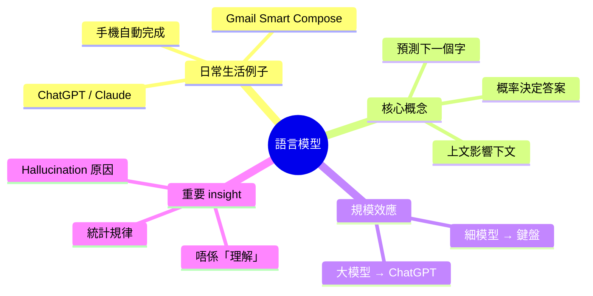
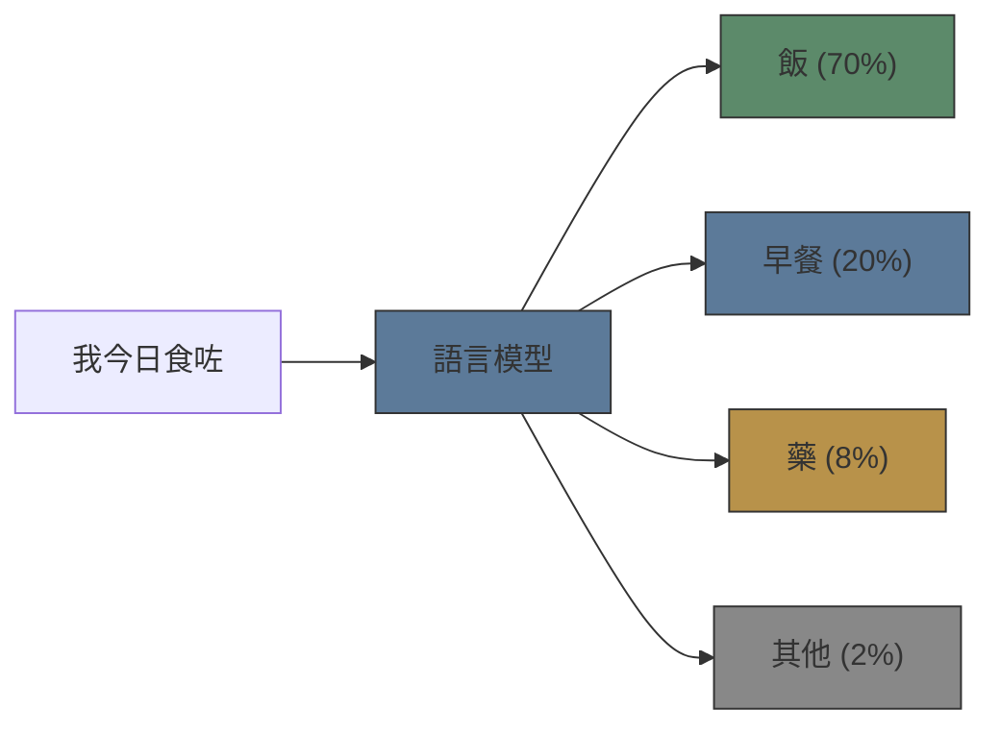

# Module 01: 語言模型係做緊乜？

Est. study time: 1.5h
Language: yue
Description: 語言模型最基本概念 — 乜嘢係語言模型、佢點樣運作、同日常生活有乜關係

## Knowledge Map



---

## Learning Objectives
- Explain what a language model is using everyday analogies
- Understand that language models predict the next word, not "think"
- Recognise how scale changes capability without changing the core mechanism
- Identify why language models sometimes produce wrong answers

---

## Real-World Example

你拎起手機打字。你打「我今日食咗」，手機彈出「飯」、「早餐」、「 lunch」俾你揀。你㩒咗「飯」，繼續打字。

呢個就係語言模型。你部電話入面有個超細嘅語言模型，不斷估你下一個字會打乜。

同一個原理，只係放大咗幾千倍，就變成你平時用嘅 ChatGPT、Claude、Gemini。唔係魔法 — 只係一個好大嘅「下一個字猜測器」。

> **Think**: 你覺得 ChatGPT 同你手機鍵盤嘅自動完成，本質上有冇分別？
>
> *Answer: 本質上冇分別。兩個都係「俾上文，估下一個字」。分別在於模型嘅規模、訓練數據嘅多少、同埋參數量。但核心機制一樣。*

---

## Core Content

### Section 1: 語言模型係一個「猜字遊戲」

語言模型要做嘅嘢好簡單：俾你一段文字，估下一個最有可能嘅字。

例如我話「尋日我去咗街市買」，你直覺話我聽下一個字好大機會係「餸」或者「生果」，唔會係「月亮」或者「程式碼」。點解你會咁估？因為你嘅大腦學過 — 喺你人生入面，「買」後面通常跟「餸/嘢/生果」，好少跟其他嘢。

語言模型做同一件事：佢喺大量文字入面學「呢啲字後面通常跟乜字」，然後計一個概率。



模型唔會逐個字諗「呢句嘢嘅意思係乜」，佢只係計 — 「俾咗『我今日食咗』呢四個字，下一個字係『飯』嘅可能性有幾高？」

> **Cloze**: "語言模型嘅核心任務係俾咗{上文}之後，預測{下一個字}係乜。"
>
> *Answer: 上文，下一個字*

> **Think**: 如果個模型成日都揀最高概率嘅字，會點？
>
> *Answer: 啲文句會好 predictable 但好悶 — 永遠係最 common 嘅字，冇創意。所以實際使用嗰陣，模型有時會 random 揀低概率啲嘅字，令 output 更多樣化。呢個就係「temperature」嘅概念，我哋之後會再講。*

### Section 2: 你已經用緊語言模型 — 自己唔知

語言模型唔係新嘢。你日常生活已經用緊：

| 例子                   | 邊度用   | 規模            |
| ---------------------- | -------- | --------------- |
| iPhone 鍵盤自動完成    | 你部電話 | 超細 (~幾十 MB) |
| Gmail Smart Compose    | Gmail    | 中等 (~幾 GB)   |
| Google Search 自動建議 | Google   | 大              |
| ChatGPT / Claude       | Web app  | 極大 (~幾百 GB) |

每個都係語言模型，只係規模唔同。

> **Think**: 點解手機 keyboard 嘅模型咁細都夠用？點解 ChatGPT 需要咁大？
>
> *Answer: 手機 keyboard 只需要 handle 簡單嘅 sentence completion，唔需要理解複雜指令或者記住大量知識。ChatGPT 要處理任何問題 — 寫 code、作詩、解釋量子力學 — 所以需要更多 parameters 同更多訓練數據。*

### Section 3: 乜嘢令 LLM 同普通 LM 唔同？

「Large Language Model」個「Large」字關鍵。

| 維度     | 普通 LM (手機) | LLM (ChatGPT)                |
| -------- | -------------- | ---------------------------- |
| 參數量   | ~100萬         | ~1000億+                     |
| 訓練數據 | ~10億字        | ~10兆字                      |
| 能力     | 完成短句       | 寫文、計數、coding、推理     |
| 湧現能力 | ❌              | ✅ — 突然出現細模型做唔到嘅嘢 |

湧現能力（Emergent abilities）係好關鍵嘅概念：當模型大到某個程度，佢會突然做到一啲細模型完全做唔到嘅事，例如：
- 計數學題
- 寫程式
- 多步驟推理

冇人刻意 train 佢做呢啲嘢 — 佢只係學「預測下一個字」，學到咁上下就自然識。

> **Predict**: 如果一個 LLM 識寫詩，你覺得係因為佢「理解」詩嘅美感，定係因為學過大量詩嘅 pattern？
>
> *Answer: 係 pattern matching。模型見過大量詩嘅例子 — 韻律、結構、用字 — 所以佢識生成相似嘅嘢。但佢唔會感受到詩嘅情感。呢個分別好重要，解釋咗點解 LLM 有時寫到好靚嘅詩，但有時又會作到 nonsense。*

### Section 4: 最重要嘅 insight — 模型唔係「理解」

呢個係成個 course 最重要嘅一句：

**語言模型唔理解文字。佢只係學咗字同字之間嘅統計規律。**

```text
你問：           香港嘅人口係幾多？
模型諗：        「香港」+「嘅」+「人口」+「係」+「幾多」
模型估下一個字： 「七百萬」(因為 training data 入面呢個 pattern 好常見)
```

但如果你問佢從未見過嘅問題：
```text
你問：           2045 年香港人口會係幾多？
模型諗：         ?
```

模型冇 ground truth，佢只可以根據類似 pattern 去估。所以有時答錯 — 呢個唔係 bug，係語言模型嘅本質限制。

> **Cloze**: "語言模型唔係{database}，佢唔會「記住」事實。佢嘅 weights 係 training data 嘅{compressed representation}。"
>
> *Answer: database, compressed representation*

> **Spot the Mistake**: 「我用緊 ChatGPT 嚟查事實，佢答到嘅嘢就係真嘅。」
>
> 錯咩？
>
> *Answer: ChatGPT 嘅 job 係 generate 合理嘅 continuation，唔係 verify 事實。佢答到嘅嘢只係「睇落合理嘅下一段文字」，唔一定係真。呢個就係 hallucination 嘅來源。用 LLM 查事實 = 用 probability estimator 做 retrieval — 工具錯配。*

---

### 點解呢個 insight 緊要

如果你理解語言模型係「猜字機」而唔係「思考體」，好多現象就自然解釋到：

1. **Hallucination**: 模型作嘢 — 因為佢嘅 job 係作合理嘅 continuation，唔係 recall facts
2. **Prompt sensitivity**: 同樣問題，轉少少 wording 就唔同答案 — 因為字嘅概率分佈變咗
3. **Inconsistency**: 同一個問題問兩次，答案可以唔同 — 因為每次係 random sample
4. **無法自我糾正**: 模型多數唔知自己錯 — 佢冇 internal fact checker

呢啲唔係模型「蠢」，而係語言模型嘅 fundamental nature。

---

## Key Takeaways
- 語言模型 = 下一個字嘅概率預測器，唔係思考引擎
- 手機 autocomplete 同 ChatGPT 本質一樣，只係規模唔同
- LLM 嘅「Large」帶嚟湧現能力 — 大過某個 threshold 就自動做到新嘢
- 模型唔理解文字，只係學咗統計規律
- Hallucination 係 feature 唔係 bug — 因為模型嘅 job 係 generate continuation，唔係 recall facts
- 理解呢個本質，幫你更好咁使用 LLM 同 debug 問題

---

## Common Misconception

**「LLM 係一個超級 database，你問佢問題 = 查 records。」**

錯。 LLM 冇 database。佢嘅 weights 係 training data 嘅 compressed representation。Training 嘅時候，佢唔係「記住」每一個 fact，而係學習字之間嘅統計規律。所以佢可以答到你未見過嘅問題（generalisation），但亦會答錯（hallucination）。

比喻：LLM 似一個讀過所有書嘅學生，但要佢憑記憶講返出嚟 — 有時記得、有時混淆、有時作嘢。你要佢俾準確事實，應該俾佢 access 一個真正嘅 database（RAG），而唔係靠佢嘅記憶。

---

## Spot the Mistake

「Temperature=0 就可以 guarantee 個 model 唔會錯，因為佢每次都揀最高概率嘅答案。」

錯咩？

*Answer: Temperature=0 確實令 output deterministic（每次都一樣），但 determinism ≠ correctness。如果模型本身嘅 probability distribution 將最高概率 assign 俾錯誤答案，argmax 只會 consistently 俾錯。Deterministic 唔代表正確 — 只代表每次都錯同一個答案。*

---

## Feynman Explain

用最簡單嘅話解釋俾一個小朋友聽：「你有個機械人朋友。你同佢講『我今日食咗』，佢要估你下一句講乜。佢睇過好多好多書，知道好多人講完『我今日食咗』之後會講『飯』或者『早餐』，好少人會講『火星』。所以佢會估『飯』。佢唔係真係知道飯係乜，佢只係知道呢個字成日跟喺『食咗』後面。呢個就係語言模型。」

---

## Reframe

諗一諗：如果語言模型只係「統計模式匹配」，點解我哋覺得佢有 intelligence？係咪我哋對 intelligence 嘅定義太寬鬆？定係 pattern matching 本身就係 intelligence 嘅一種形式？

呢個 debate 好重要 — 你對呢個問題嘅立場會影響你點樣設計 LLM 應用、點樣 evaluate 模型表現、同埋點樣解釋模型嘅行為。

---

## Drill

Run: `learn.sh quiz llm-basics 01-language-model-intro`
