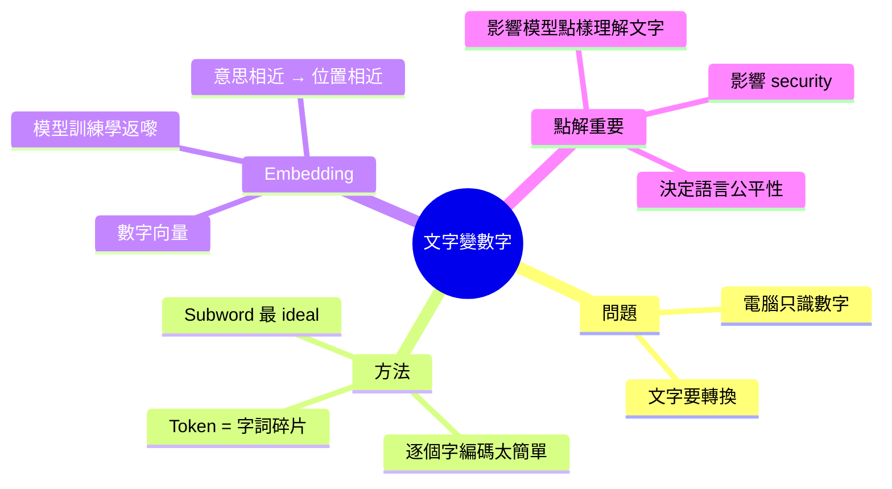
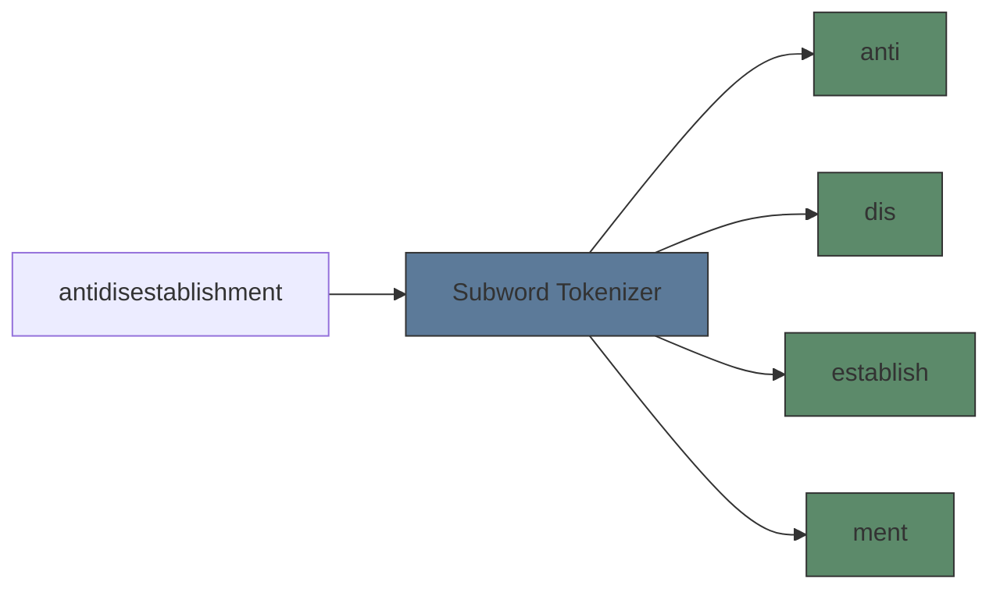
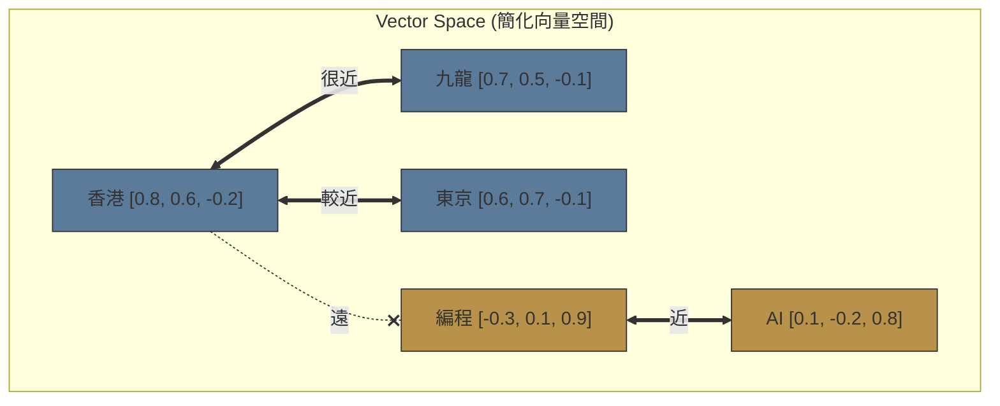

# Module 02: 文字點樣變成數字？

Est. study time: 1.5h
Language: yue
Description: 電腦點樣將文字变成佢處理到嘅數字 — tokenization、embedding、同 vector space 嘅直覺

## Knowledge Map



---

## Learning Objectives
- Explain why computers need numbers instead of text
- Understand what tokens are and why subword tokenization is used
- Describe embedding as "meaning coordinates" in a vector space
- Recognise how tokenizer choice affects model behaviour

---

## Real-World Example

你同朋友玩個遊戲：你要用 number code 代表每一個英文字。你話 A=1, B=2, C=3... Z=26。

然後你朋友寫咗段 message：「8 5 12 12 15」

你一睇就知係「HELLO」。

但問題嚟喇 — 你叫佢寫「HELLO WORLD」。「HELLO」=「8 5 12 12 15」，「WORLD」=「23 15 18 12 4」。加埋一齊好長。而且「HELLO」同「HI」嘅 number code 完全唔同（8 5 12 12 15 vs 8 9），睇唔出佢哋意思相近。

呢個就係 LLM 面對嘅問題：點樣將文字變成數字，同時保留語義資訊？

> **Think**: 如果用 A=1, B=2 嘅方法，「APPLE」同「APPLICATION」嘅 number code 似唔似？
>
> *Answer: 開頭一樣（1 16 16 12 5 vs 1 16 16 12 9 3 1 20 9 15 14），但數字本身冇語義 — 唔似「APPLE」同「APPLICATION」在意思上有關連。純數字編碼 loss 咗語義資訊。*

---

## Core Content

### Section 1: 點解文字要變成數字？

電腦唔識字。電腦只識數字。Transformer 模型入面全部係數學運算 — 矩陣乘法、加法、softmax — 全部都係同數字打交道。

所以任何文字入到模型之前，一定要做一件事：**將文字變成數字**。

呢個過程有兩個步驟：

```text
「我愛香港」 → [tokenization] → [12, 458, 7891] → [embedding] → [[0.3, -0.1, ...], [0.8, 0.2, ...], ...]
    文字                    token ID 嘅 array          向量嘅 array（模型真正處理嘅嘢）
```

> **Cloze**: "電腦唔識字，只識{數字}。文字入模型之前一定要轉換成 model 可以處理嘅{數字表示}。"
>
> *Answer: 數字，數字表示*

### Section 2: Tokenization — 將文字切碎

最直接嘅做法：逐個字做編碼。例如「我愛香港」→ 4 個字 → [1, 2, 3, 4]。

問題：
- 冇辦法處理未見過嘅字（粵語字、新 emoji）
- Vocabulary 太大（中文幾千個常用字，仲有古文、方言字）
- 逐個字 processing 效率低

第二個做法：成個詞做編碼。例如「我」、「愛」、「香港」→ 3 個詞。

問題：
- Vocabulary 更加大（「香港」、「香港人」、「香港島」⋯⋯）
- 永遠有未見過嘅詞（OOV — out of vocabulary）
- Embedding matrix 太大，記憶體唔夠

**Subword tokenization**：兩個世界嘅 best of both worlds。



Subword 嘅 insight：將字詞拆成常見嘅碎片組合。例如「unbelievable」→「un」+「believe」+「able」。即使模型未見過「unbelievable」，佢見過「un」同「believe」同「able」，就可以組合理解。

> **Think**: Subword tokenization 對罕見字或者新字（例如新 emoji）有乜好處？
>
> *Answer: Tokenizer 可以將罕見字拆成更細嘅單位（甚至 UTF-8 bytes）。即係無論乜嘢字入嚟，tokenizer 都可以處理到 — 唔會有 OOV 問題。呢個係 subword 嘅關鍵優勢。*

> **Cloze**: "Subword tokenization 將字詞拆成{常見碎片}，解決咗 word-level 嘅{OOV 問題}同 character-level 嘅{效率問題}。"
>
> *Answer: 常見碎片，OOV 問題，效率問題*

### Section 3: Embedding — 幫每個 token 搵個「地址」

Tokenization 完咗，我哋有咗一串數字（token IDs），例如「我今日食飯」→ [342, 5671, 89, 12056]。

但呢啲數字係 arbitrary 嘅 — 342 同 343 嘅分別冇任何意義。模型睇唔出「香港」同「九龍」有關係。

**Embedding** 就係為咗解決呢個問題。

Embedding = 每個 token 有一個 vector（數字 list）。呢啲 vector 嘅位置喺「語義空間」入面有意義：

```text
Token:      Vector (dimension=4, 簡化版):
「香港」 →  [0.8,  0.6, -0.2,  0.1]
「九龍」 →  [0.7,  0.5, -0.1,  0.0]
「東京」 →  [0.7,  0.4,  0.3, -0.1]
「編程」 →  [-0.3, 0.1,  0.9,  0.8]
```

睇到嗎？「香港」同「九龍」嘅 vectors 差唔多 — 因為佢哋都係地名，意思相近。「編程」就離佢哋好遠。呢個就係 embedding 嘅威力 — 將語義關係變成幾何關係。



Embedding matrix 係一個大 table：`[vocab_size, d_model]`。Vocab_size = tokenizer 嘅詞彙量（通常 32k-128k），d_model = 每個 vector 嘅維度（通常 512-8192）。

呢個 matrix 唔係人 hand-craft 嘅 — 係模型喺 training 嗰陣自己學返嚟嘅。一開始全部 random，訓練過程中慢慢調整，直到 similar tokens 有 similar vectors。

> **Think**: 如果「國王」減「男人」加「女人」≈「皇后」，你覺得 embedding 係唔係 understanding？
>
> *Answer: 唔係。呢個只係 vector space 入面嘅幾何關係。模型發現「國王」同「皇后」喺 training data 入面嘅 pattern 相似（都係 royalty），而「男人」同「女人」係 gender diff。佢唔需要 understanding 乜嘢係 royalty 都可以 capture 呢個 pattern。*

### Section 4: Tokenizer 嘅實際影響

Tokenizer 唔係一個 preprocessing detail — 佢直接影響模型點樣睇世界。

| 影響       | 例子                                                                    |
| ---------- | ----------------------------------------------------------------------- |
| 語言偏見   | English: 1 token/word，Korean: 2-3 tokens/word → English 更「平」       |
| 拼寫敏感度 | "german" vs "Germany" 拆成唔同 tokens → 模型要靠 context 先知道佢哋有關 |
| 新字處理   | 新 emoji 拆成 bytes → 模型可以 handle                                   |
| Security   | Adversarial prompt 可以透過 unusual tokenization bypass filter          |

> **Predict**: 如果用 word-level tokenizer 去處理粵語呢？即係成個詞做 token —「香港人」一個 token、「香港島」另一個 token。會遇到乜嘢問題？
>
> *Answer: 兩個問題：第一，vocabulary 會大得好誇張 — 每個詞組都係一個 token，記憶體唔夠。第二，永遠有未見過嘅詞（OOV）— 新詞、人名、口語組合都會拆唔到。呢啲就係 word-level tokenization 嘅根本限制，所以先要用 subword。*

> **Spot the Mistake**: 「Tokenizer 只係 preprocessing，對模型質素冇影響。」
>
> 錯咩？
>
> *Answer: Tokenizer 決定咗模型見到乜嘢 atomic units。唔同 tokenizer 對同一段文字會產生唔同嘅 token 序列，影響模型嘅 learning 同 generalisation。Tokenizer 嘅 bias（例如對某啲語言嘅 token 分配更多）直接影響模型喺唔同語言嘅表現。*

---

### 點解要明呢啲？

當你讀 advance course 嘅時候，你會見到：
- Tokenizer 嘅 algorithm 細節（BPE、SentencePiece）
- Vocab size 嘅 tradeoff（大 vocab = 短 sequence vs 大 embedding matrix）
- Embedding 同 unembedding 嘅 weight tying

呢個 module 俾咗你 conceptual foundation — 你知道 token 係乜、embedding 係乜、點解重要。細節可以之後補。

---

## Key Takeaways
- 文字要變成數字先入到模型 — 經 tokenization → embedding 兩個步驟
- Subword tokenization 係最佳平衡 — 處理 OOV 問題同時保持效率
- Embedding 將語義關係變成幾何關係 — similar tokens 有 similar vectors
- Embedding matrix 係 model training 嗰陣自己學嘅，唔係人定義嘅
- Tokenizer 選擇直接影響模型表現，特別係跨語言公平性
- One-hot encoding 太浪費 — embedding 嘅 dense vector 先 practical

---

## Common Misconception

**「Embedding 係預先 train 好嘅（word2vec/GloVe），然後 LLM load 入去用。」**

錯。現代 LLM 嘅 embedding 係 end-to-end 同 model 一齊 train 嘅。一開始 random，每個 token 嘅 vector 隨住 training 慢慢調整。Word2vec/GloVe 已經係十年前嘅技術。Embedding matrix 只係 neural network 嘅其中一層，同其他 layers 一齊用 gradient descent 更新。

---

## Spot the Mistake

「我用一個 character-level tokenizer（逐個字做 token），vocab size 好細（~200），好 efficient！」

錯咩？

*Answer: Vocab size 細但 sequence length 好長 — 「hello」變成 5 個 tokens，「I love programming in Python」變成 30+ 個 tokens。長 sequence = 更多 compute = 更慢嘅 training 同 inference。而且 character-level 失去咗所有 morphology 資訊 — 「run」、「runs」、「running」、「ran」完全冇 shared token。Subword 先係最佳平衡。*

---

## Feynman Explain

用最簡單嘅話解釋：「你有好多張卡紙，每張卡紙上面寫咗一個字。你要將呢啲卡紙放入電腦，但電腦只識數字。所以你幫每個字改咗個號碼 — 但唔係是但改，而係意思差唔多嘅字，號碼都差唔多。『貓』同『狗』嘅號碼好接近，『貓』同『電腦』就好遠。咁樣電腦就算唔識中文，都可以睇到邊啲字意思相近。呢個就係 embedding。」

---

## Reframe

諗一諗：如果 tokenizer 對唔同語言嘅效率唔同（English 1 token/word vs 某些語言 3-4 tokens/word），呢個係咪一種 bias？LLM 嘅「理解」係咪受限於 tokenizer 點樣切割文字？你覺得將文字切碎呢個步驟，本身會唔會 loss 咗一啲嘢？

---

## Drill

Run: `learn.sh quiz llm-basics 02-text-to-numbers`
