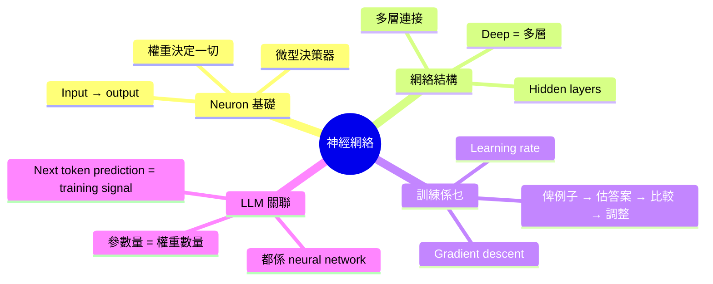
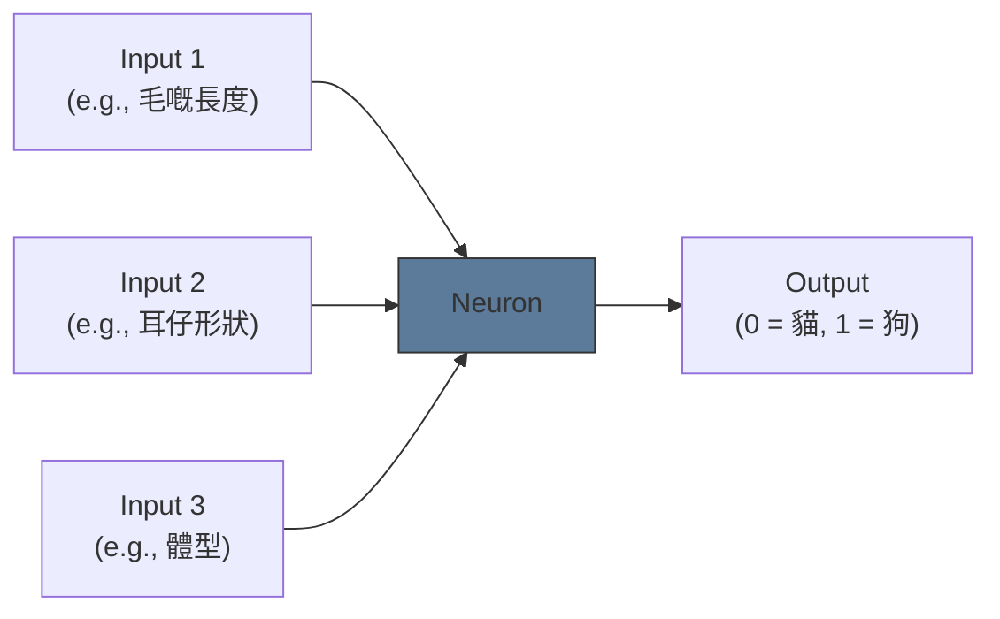
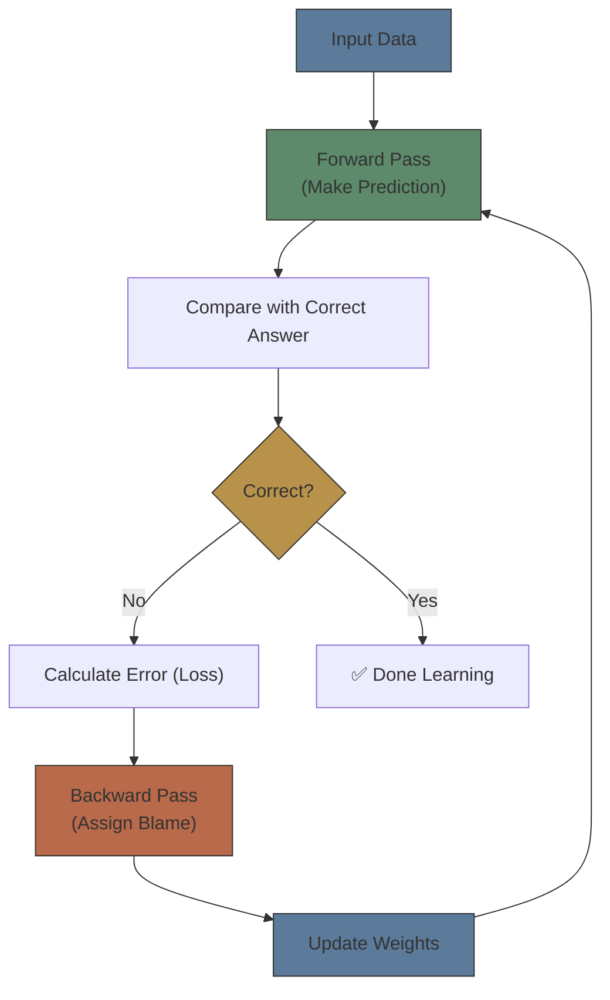
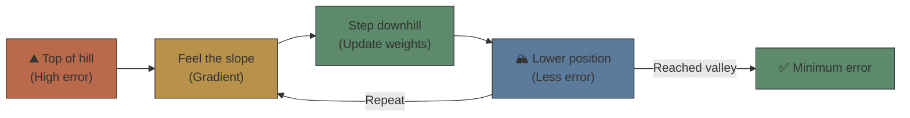

# Module 03: 神經網絡係乜？

Est. study time: 1.5h
Language: yue
Description: Neural network 最基本概念 — neuron、layer、gradient descent、同 training loop 嘅直覺理解

## Knowledge Map



---

## Learning Objectives
- Explain what a neuron and a neural network layer do at a conceptual level
- Understand what "training" means — adjusting weights based on error
- Describe gradient descent as "finding the valley by feeling the slope"
- Connect neural network concepts to how LLMs work

---

## Real-World Example

你想訓練一個程式分辨貓同狗嘅相。你冇寫 rules 俾佢 — 你冇話「如果耳仔尖係貓，如果鼻長係狗」。你只係俾咗好多貓相同狗相佢睇，每次話俾佢知「呢張係貓，呢張係狗」。

一開始佢亂咁估 — 貓當狗、狗當貓。但每次錯咗，佢都會 adjust 少少 internal 嘅參數。睇咗幾萬張相之後，佢越嚟越準。最後，佢睇到一張從未見過嘅貓相，都可以認得出係貓。

呢個就係 neural network 嘅本質：**俾例子 → 估 → 錯 → 調整 → 重複**。唔係 programming，而係 learning。

> **Think**: 你覺得呢種 learning 同傳統 programming （if-else rules）有乜 fundamental 分別？
>
> *Answer: 傳統 programming 你要明確定義 rules；neural network 係從例子入面自己歸納 patterns。好處係你唔需要 domain expertise 去寫 rule；壞處係你唔知佢學咗乜 patterns（black box problem）。*

---

## Core Content

### Section 1: Neuron — 一個微型決策器

Neural network 嘅基本單位係 neuron（神經元）。雖然個名嚟自 biology，但你唔需要理解生物神經元。

將 neuron 想像成一個微型決策器：



Neuron 做三件事：
1. 收 inputs（每個 input 附一個 weight）
2. 將 inputs × weights 加埋
3. 決定 output（用 activation function）

**權重（weights）** 係最關鍵嘅部分。每個 weight 代表「呢個 input 有幾重要」。毛嘅長度對分辨貓狗好重要 → high weight。Input 嘅 noise → low weight。

- 多個 neurons 組成一層（layer）
- 多層 layers 組成一個網絡
- 「Deep learning」嘅「deep」= 多層 hidden layers

> **Cloze**: "Neuron 嘅{權重}決定每個 input 嘅重要性。多個 neurons 組成{layer}，多層 layers 組成{network}。"
>
> *Answer: 權重，layer，network*

### Section 2: 點樣訓練？— 調整權重嘅過程

最關鍵嘅問題：權重一開始係 random，點樣變成有用？

```text
Training loop:

1. Forward pass:  俾 input → 網絡計 output（亂估）
2. Loss:          比較 output 同正確答案 → 計「錯咗幾多」
3. Backward pass:  計每個 weight 對個 error 有幾大責任
4. Update:         調整 weights 減少 error
5. Repeat:         做幾百萬次
```



呢個 loop 就係「訓練」。做完幾百萬次之後，weights 慢慢變得有用 — 網絡識得做正確嘅預測。

> **Think**: Weight 一開始 random，點解調整之後會 converge 到有用嘅值，而唔係 random 到 random？
>
> *Answer: 因為每次調整嘅方向係「減少 error」。雖然每一步係細微調整，但幾百萬步之後，weights 會逐步移向 error 低嘅區域。好似一滴水每次向低處流少少，最終會去到山谷。*

> **Cloze**: "訓練嘅核心 loop 係：forward pass → {計 loss} → {backward pass} → {update weights} → 重複。"
>
> *Answer: 計 loss，backward pass，update weights*

### Section 3: Gradient Descent — 搵山谷嘅直覺

Gradient descent 係調整 weights 嘅具體方法。數學上好複雜，但直覺好簡單：

**你喺一座山上面，要高嘅地方代表「多 error」。你要落山（減少 error）。你每一步 feel 吓邊個方向最斜，然後向斜嘅方向踏一步。**



**Learning rate** = 每一步嘅 size。
- Learning rate 太大 → 跨過山谷，永遠唔到最低點
- Learning rate 太細 → 好慢，train 到天荒地老
- Good learning rate → 每一步啱啱好，efficient 咁到達山谷

> **Think**: 如果 gradient descent 搵到嘅係「local minimum」（局部最低點）而唔係「global minimum」（全局最低點），會點？
>
> *Answer: 模型會停喺一個「唔係最好但已經唔差」嘅位置。呢個係 gradient descent 嘅已知限制。實際 training 會用 momentum、learning rate scheduling 等技巧嘗試避開 local minima。*

### Section 4: Neural Network 同 LLM 嘅關係

LLM 都係 neural network — 只係好大好大。

| 概念 | 一般 NN | LLM |
|------|---------|-----|
| 參數量 | 幾萬到幾百萬 | 幾十億到幾萬億 |
| Layers | 幾層 | 幾十到幾百層 |
| Training data | 幾萬張相 | 幾兆個 tokens |
| Training time | 幾小時 (GPU) | 幾個月 (幾千個 GPU) |
| Task | 分類貓狗 | 預測下一個字 |

**關鍵 insight**: LLM 嘅 training 同上面描述嘅 loop 完全一樣。只係 scale 唔同。

- Forward pass: 俾一段文字 → 預測下一個字
- Loss: 比較預測嘅字同真實嘅字
- Backward pass: 計每個 weight 嘅責任
- Update: 調整 weights

你 module 01 學咗「LM = 下一個字預測器」，呢度你學咗「neural network = weights 透過 training 調整」。兩者加埋 — LLM = 用 neural network 做 next token prediction，透過 gradient descent 訓練 — 就係完整嘅 picture。

> **Predict**: 如果你 train 一個 LLM 但 training data 入面「我今日食咗飯」出現咗 100 萬次，而「我今日食咗雪糕」只出現 1 次。模型學到嘅 weights 會點？
>
> *Answer: 「飯」跟喺「食咗」後面嘅 weight 會好高（因為成日出現），「雪糕」嘅 weight 好低。呢個解釋咗點解 LLM 偏好 common patterns — 佢係 training data 嘅統計反映。*

> **Spot the Mistake**: 「Neural network 嘅 training 係 deterministic — 俾同一 training data，每次 train 出嚟嘅模型一模一樣。」
>
> 錯咩？
>
> *Answer: Initial weights 係 random，training 過程入面有 randomness（data order、dropout etc.）。所以每次 train 出嚟嘅模型略略有唔同。呢個 randomness 係 feature — 可以幫助模型探索唔同嘅 weight configuration，避免 local minima。*

---

### 點解要明呢啲？

當你讀 advanced course 嘅時候，你會見到：
- Backpropagation 嘅數學細節（chain rule 點樣 propagate error）
- 唔同嘅 activation functions（ReLU、GELU、SwiGLU）
- Optimizer 嘅分別（Adam、SGD、learning rate scheduling）
- 點樣並行訓練（data parallelism、model parallelism）

呢度你學咗 conceptual foundation — 你知道 training 係「調整 weights 減少 error」，呢個 insight 已經夠你理解 LLM 訓練嘅 overview。

---

## Key Takeaways
- Neural network = 多層 neurons，每層有 weights 決定 input 嘅重要性
- Training = 重複做：predict → compare → adjust weights
- Gradient descent = 跟住 slope 逐步減少 error
- Learning rate = 每一步嘅 size — 太大 overshoot，太細太慢
- LLM 都係 neural network，只係規模超大
- Training 嘅 randomness 令每次 train 出嚟嘅模型略略唔同

---

## Common Misconception

**「訓練 neural network 需要好高深嘅數學，唔係普通人可以理解。」**

唔係。數學細節（chain rule、linear algebra）當然複雜，但直覺好簡單 — 俾例子、估答案、錯咗調整、重複。你可能唔需要寫 backpropagation 嘅 code（framework 幫你做晒），但你需要理解「training = weight adjustment」呢個概念，先至可以 debug 同設計模型。

Neural network 嘅 barriers 係 engineering（GPU、data、infrastructure），唔係數學。

---

## Spot the Mistake

「我用越多 layers 就一定越好。」（越多 layers = deep network = 越好 performance）

錯咩？

*Answer: 太多 layers 會令 training 更難 — gradient 喺 deep network 入面會消失（vanishing gradient）或者爆炸（exploding gradient）。而且 overfitting 嘅風險增加。Layer 數量要同 data size、task complexity、regularization 匹配。唔係越多越好。*

---

## Feynman Explain

用最簡單嘅話解釋：「你有個 friend 從來未見過貓同狗。你俾佢睇一張相，佢亂估 — 貓叫狗、狗叫貓。每次佢錯，你就話俾佢聽錯咗。佢會記住 — 『哦，原來尖耳仔多數係貓』。睇咗一萬張之後，佢 become 專家。呢個就係 neural network 嘅 learning。」

---

## Reframe

Neural network 嘅「學習」同人類學習根本唔同。人類學一個 concept 可以從幾個例子 generalize，NN 要幾千幾萬個例子。人類可以 transfer learning 到全新 domain，NN transfer 好 fragile。咁樣仲可以叫「學習」嗎？定係我哋要用一個新嘅詞去形容 weight adjustment？

---

## Drill

Run: `learn.sh quiz llm-basics 03-neural-network-basics`
