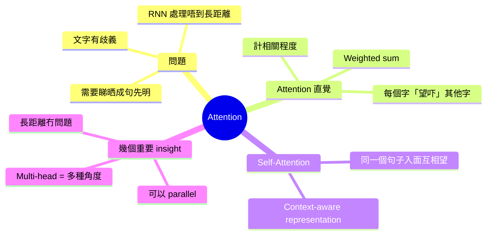
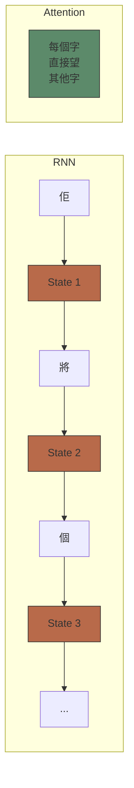
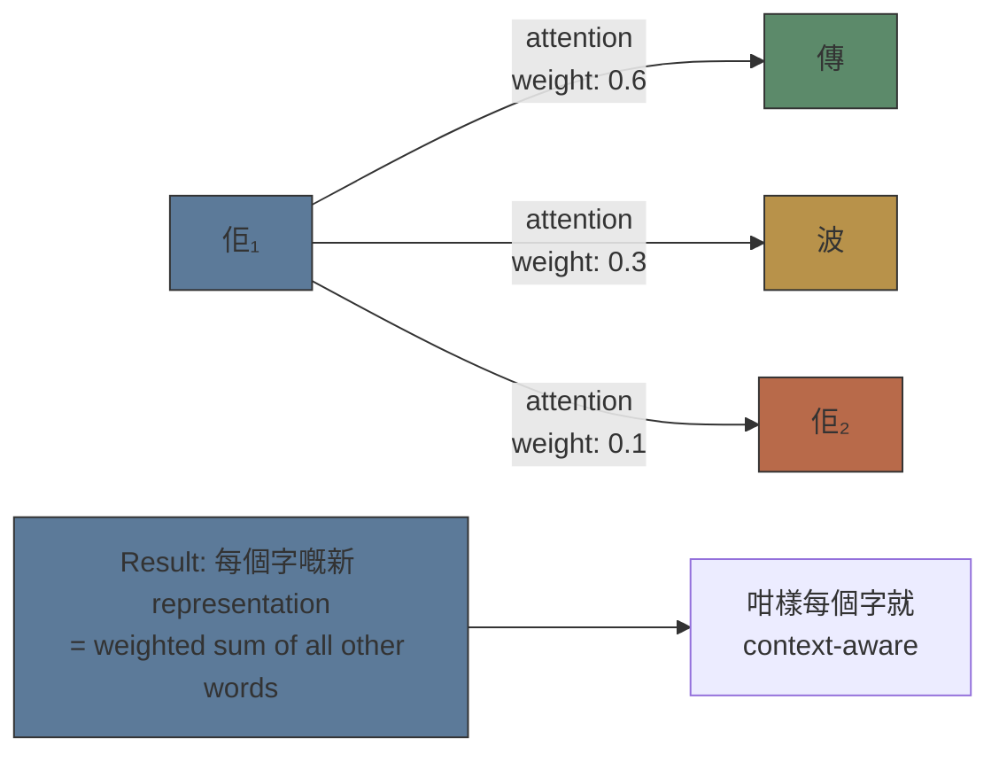
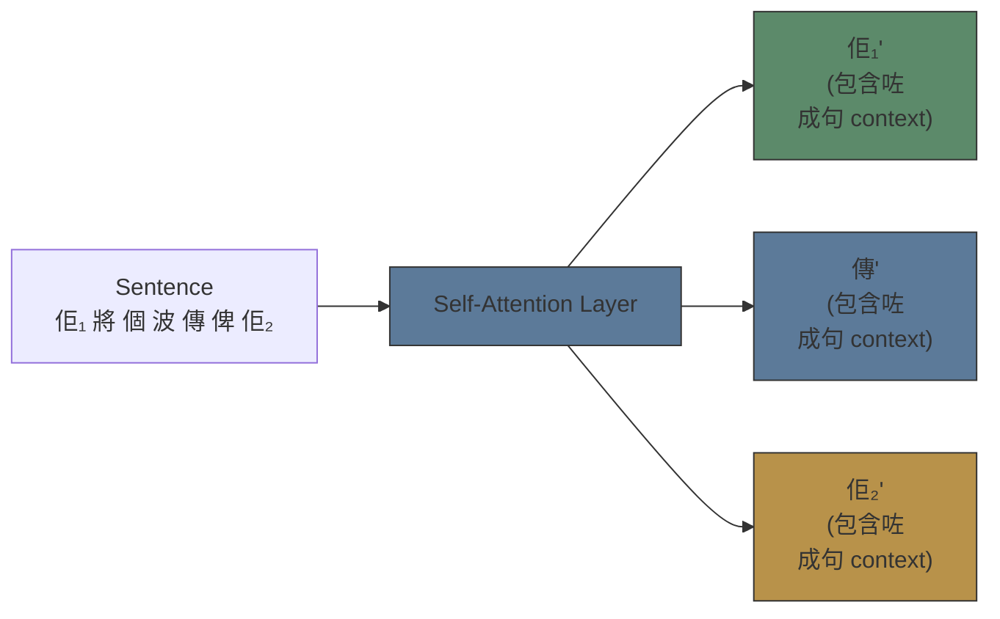
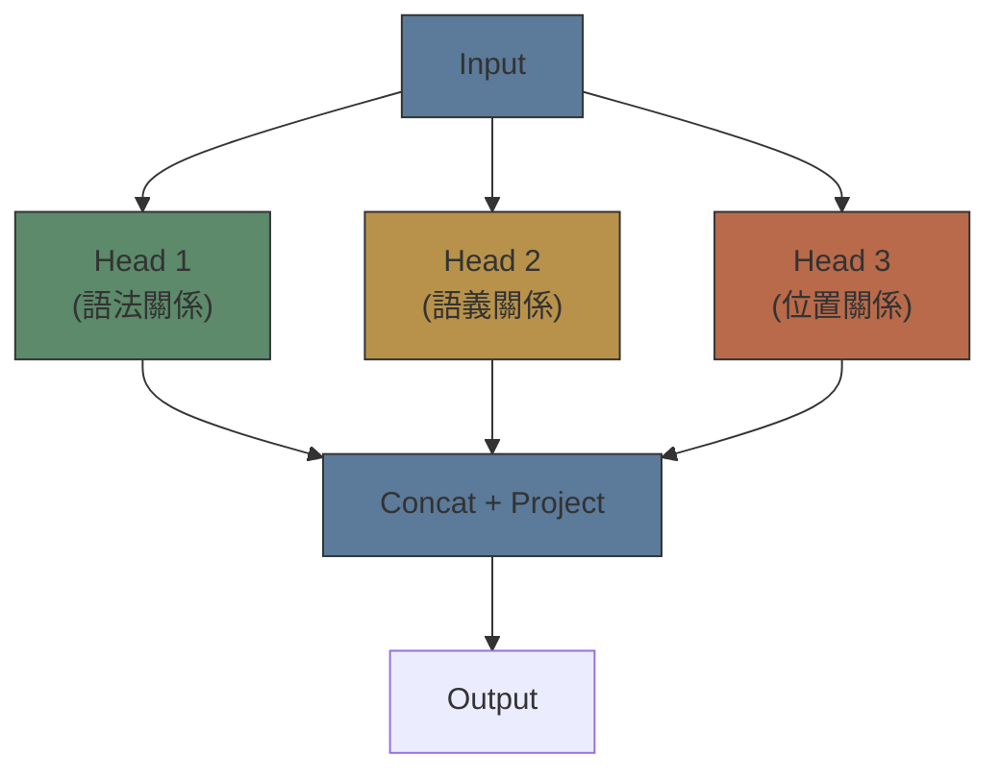

# Module 04: Attention 概念

Est. study time: 1.5h
Language: yue
Description: Attention mechanism 最基本直覺 — 點解要 attention、佢點樣運作、同 multi-head 嘅概念

## Knowledge Map



---

## Learning Objectives
- Explain why attention is needed — the ambiguity problem
- Describe attention as "each word looks at all other words to understand context"
- Understand self-attention as building context-aware word representations
- Recognise why attention enables parallel processing (unlike RNN)

---

## Real-World Example

睇呢句中文：「佢將個波傳俾佢，然後佢射門。」

「佢」係邊個？第一個「佢」、第二個「佢」、第三個「佢」係咪同一個人？

你作為人類，會望返成句句子去理解 — 「傳波」嘅人 = 球員A，「射門」嘅人 = 球員B。你唔可以逐個字獨立理解，你一定要睇 context。

Attention 機制就係做同一件事：**每個字要理解自己，必須望吓句子入面其他字**。

> **Think**: 如果一個模型逐個字處理（好似 RNN — 由左到右），佢處理「佢射門」嘅時候，仲記唔記得第一個「佢」係邊個？
>
> *Answer: RNN 理論上可以 carry information 向前，但實際上長距離資訊會慢慢 fade out（vanishing gradient）。Attention 解決咗呢個問題 — 每個字可以直接「望」返前面任何字，唔需要靠 memory 慢慢傳。*

---

## Core Content

### Section 1: 之前嘅方法有乜問題？

Attention 出現之前，主流做 sequence 嘅方法係 RNN（Recurrent Neural Network）。

RNN 嘅做法：逐個字行，每次 update 一個 hidden state，將見到嘅資訊 carry 向前。

```text
輸入： 「佢」→「將」→「個」→「波」→「傳」→「俾」→「佢」
State:  s1 →  s2 →  s3 →  s4 →  s5 →  s6 →  s7
```

問題：
1. **長距離依賴**：句子開頭嘅字嘅資訊，行到句子尾已經 fade 咗
2. **唔可以 parallel**：每個 step 要等前一個 step 完成 — GPU 嘅 parallel 優勢用唔到
3. **Bottleneck**：所有資訊要壓縮到一個 fixed-size state



> **Cloze**: "RNN 嘅問題包括：{長距離資訊} fade out、唔可以{parallel}運算、同{bottleneck}問題。"
>
> *Answer: 長距離資訊，parallel，bottleneck*

### Section 2: Attention 嘅核心直覺

Attention 嘅 insight 好簡單：**要理解一個字，你要睇吓句子入面其他字同呢個字有幾相關。**

舉例：句子「佢將個波傳俾佢」。

要理解第一個「佢」：
- 「佢」同「傳」好相關（傳波嘅人）
- 「佢」同「波」有啲關（傳嘅 object）
- 「佢」同第二個「佢」有關（傳俾邊個）



運算步驟（概念上）：

```text
Step 1: 每個字同每個字計相關度（attention score）
Step 2: Softmax 將 scores 變成 probabilities（加埋 = 1）
Step 3: 每個字嘅新 representation = 其他字嘅 weighted sum
```

**關鍵**：呢個步驟可以 parallel 做 — 所有字同時同所有字計相關度。唔洗逐個字行。

> **Think**: Attention 嘅 weighted sum 係咪似你 module 02 學過嘅 embedding analogy？
>
> *Answer: 係類似嘅概念！Embedding 係 static — 每個 token 有個 fixed vector。Attention 係 dynamic — 每個 token 根據 context 調整佢嘅 representation。Embedding 話你知 token 本身嘅意思，attention 話你知 token 喺呢個 context 入面嘅意思。*

### Section 3: Self-Attention — 自己同自己玩

「Self-attention」個「self」代表乜？

答案：attention 嘅 query、key、value 全部嚟自同一個 source — 即係句子本身。

用返足球例子：
- 你係「佢₁」（第一個佢）
- 你問句子入面每個字：「你同我有幾相關？」
- 「傳」答：「好相關！你係傳波嗰個人」
- 「波」答：「有啲關，你傳俾我」
- 「佢₂」答：「有關，我係你嘅目標」

每個 query（字）同每個 key（其他字）計相似度，然後用相似度做 weight 去 weighted sum 啲 values（其他字嘅資訊）。

結果：**每個字都有一個 context-aware 嘅 representation**。



冇 attention 之前，每個字嘅 embedding 係 static — 「佢」永遠係同一個 vector。有 attention 之後，「佢₁」同「佢₂」嘅 representation 會唔同 — 因為佢哋嘅 context 唔同。

> **Predict**: 如果一句句子好長（例如 1000 個字），attention 嘅計算量會點？
>
> *Answer: 每個字要同其他 999 個字計相關度，total 1000×1000 = 1,000,000 次運算。Attention 嘅 complexity 係 O(n²)。呢個係 attention 嘅主要代價 — 長句子好貴。實際會用 sliding window attention 或者 sparse attention 嚟 reduce。*

### Section 4: Multi-Head Attention — 多種角度睇同一句

一個字同另一個字嘅「相關」可以有很多種：
- 語法相關（主語、賓語）
- 語義相關（意思相近）
- 位置相關（隔幾遠）

Multi-head attention 嘅 insight：**用多組唔同嘅 attention 參數，capture 唔同類型嘅關係**。



比喻：你一個 sentence 俾三個唔同嘅 analyse 去睇。一個 analyst 睇 grammar，一個睇 meaning，一個睇 structure。然後 combine 佢哋嘅 findings。

Multi-head 令模型可以同時從多個角度理解文字關係 — 呢個係 Transformer 強大嘅關鍵之一。

> **Cloze**: "Multi-head attention 用多組唔同嘅{參數}去 capture 唔同類型嘅{關係}，例如語法關係同語義關係。"
>
> *Answer: 參數，關係*

> **Spot the Mistake**: 「Attention 解決咗所有 sequence modelling 嘅問題，RNN 已經完全冇用。」
>
> 錯咩？
>
> *Answer: Attention 嘅 O(n²) complexity 對長句子好貴。而且冇 positional information — attention 本身唔知字嘅位置順序（「我愛你」同「你愛我」喺 attention 入面睇落一樣，因為每個字可以互相望）。所以一定要加 positional encoding。另外，某啲 task（如 streaming、real-time）RNN 嘅 linear complexity 仍然有優勢。*

---

### 點解要明 Attention？

Attention 係 Transformer 嘅核心創新。當你讀 advanced course：
- 你會學 QKV（Query-Key-Value）嘅具體計算
- Scaled dot-product attention 嘅數學
- Causal masking（點樣防止睇到未來字）
- Multi-query / group-query attention（效率優化）

呢度你學咗「attention = context-aware representation through looking at other words」 — 呢個 insight 已經 cover 咗 80% 嘅概念。

---

## Key Takeaways
- Attention 解決 RNN 嘅長距離依賴同 parallel 問題
- 每個字通過「望」其他字來理解 context
- Self-attention = query/key/value 都嚟自同一句子
- Attention 可以 parallel 運算（唔似 RNN 逐個字）
- Multi-head = 多種角度同時 capture 唔同關係
- Attention 嘅代價係 O(n²) — 句子越長越貴

---

## Common Misconception

**「Attention 係 Transformer 先有嘅概念。」**

錯。Attention 機制喺機器翻譯領域早就出現咗（Bahdanau 2014），用喺 RNN-based encoder-decoder 入面。Transformer 嘅創新係「只用 attention，唔用 RNN」— 即係 pure attention architecture。Attention 本身唔係新嘢，Pure attention 先係新嘢。

---

## Spot the Mistake

「Attention 令每個字嘅 representation 變成 context-aware，所以模型而家可以理解語義。」

錯咩？

*Answer: Context-aware 唔等於理解。Attention 只係俾模型一個 mechanism 去動態調整每個 token 嘅 representation based on other tokens。呢個係更 powerful 嘅 pattern matching，但唔係 understanding。模型仍然係做統計預測，只係個統計模型更加 sophisticated。*

---

## Feynman Explain

用最簡單嘅話解釋：「你睇緊一張相入面有好多人。你要知其中一個人係乜水。你會望吓佢附近嘅人、佢著咩衫、佢做緊乜 — 用周圍嘅嘢去理解佢。Attention 就係咁 — 每個字望吓隔籬嘅字，用 context 去理解自己。」

---

## Reframe

Attention 係咪真係 intelligence 嘅必要 component？人類 cognition 入面，attention 的確係核心機制。所以當我哋話「attention is all you need」，係咪暗示緊 attention 就係 intelligence 嘅關鍵？定係只係一個好 practical 嘅 engineering breakthrough？

---

## Drill

Run: `learn.sh quiz llm-basics 04-attention-concept`
