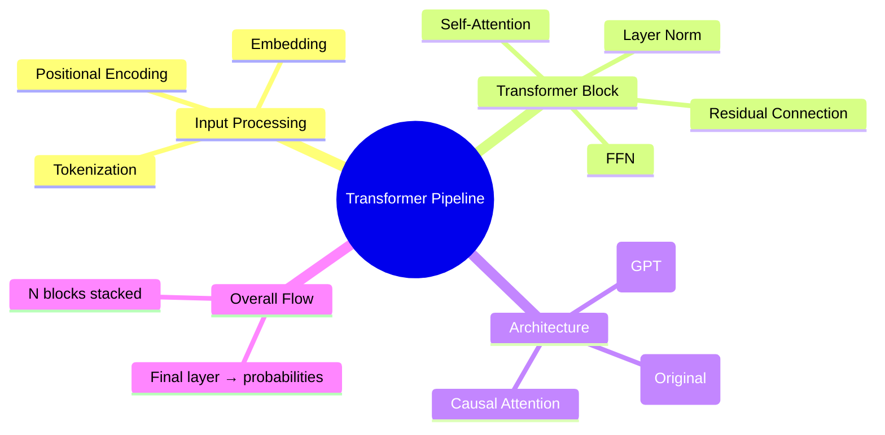
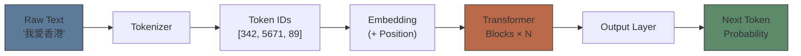
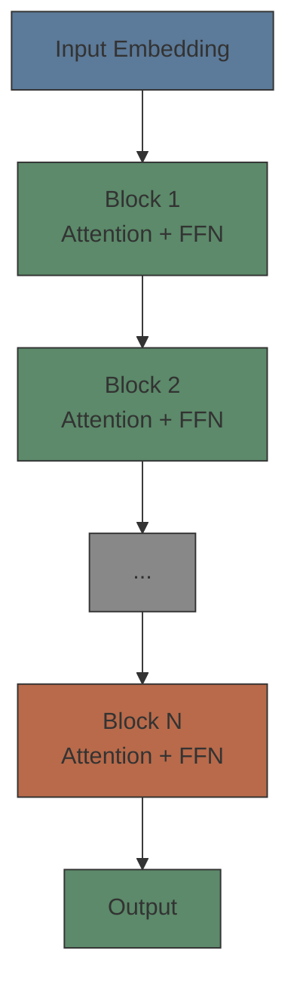
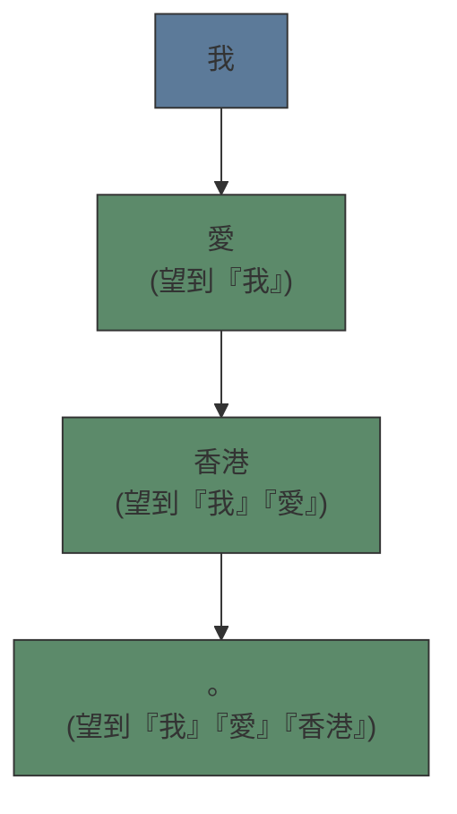

# Module 05: Transformer 整體流程

Est. study time: 1.5h
Language: yue
Description: 將之前學嘅嘢砌埋一齊 — tokenization、embedding、attention 點樣組成完整嘅 Transformer pipeline

## Knowledge Map



---

## Learning Objectives
- Describe the full Transformer pipeline from text input to token prediction
- Explain the structure of a Transformer block: attention → FFN → residual
- Contrast decoder-only (GPT) vs encoder-decoder architecture
- Understand why causal masking is needed for generation

---

## Real-World Example

你學咗整漢堡包嘅每個材料：
- **M02 (文字變數字)** = 麵包、牛肉、生菜（原材料）
- **M04 (Attention)** = 將所有材料擺埋一齊睇（點樣組合）
- **M03 (Neural Network)** = 點樣調整 recipe（training 過程）

而家要整一個完整嘅漢堡包 — 即係成個 Transformer。

Transformer 嘅 input 係一段文字，output 係下一個 token 嘅概率分佈。中間經過一連串嘅步驟，每個步驟 refine 個 representation。

> **Think**: 你覺得文字入到 Transformer，由第一層到最後一層，representation 有乜變化？
>
> *Answer: 底層 layers 主要 capture 表面特徵（詞性、文法），中層 layers capture 語義（意思、關係），高層 layers capture 抽象概念（意圖、整體理解）。愈高層愈 abstract。*

---

## Core Content

### Section 1: 完整 Pipeline

由 raw text 到 prediction，Transformer 做呢啲步驟：



**Step by step：**

| Step | 做乜 | 學過邊度 |
|------|------|---------|
| 1. Tokenization | 文字 → token IDs | M02 |
| 2. Embedding | Token IDs → vectors | M02 |
| 3. +Positional Encoding | 加位置資訊 | M04 提過 |
| 4. Transformer Blocks | Attention + FFN | M04 + 呢度 |
| 5. Output Layer | Vectors → probabilities | 呢度 |

**Positional encoding** 點解需要？Attention 本身唔知字嘅先後次序。你加一個「位置 signal」俾每個 token，等模型知道字嘅順序。

> **Cloze**: "Transformer pipeline 由 raw text 開始，經過{tokenization}、{embedding}、{transformer blocks}，最後 output{probability distribution}。"
>
> *Answer: tokenization，embedding，transformer blocks，probability distribution*

### Section 2: Transformer Block — 基本建築材料

一個 Transformer block（layer）包含兩個主要部分：

```text
Input
  │
  ├──→ [Self-Attention]  ← 每個字「望」其他字（M04）
  │
  ├──→ [Add & Norm]      ← 加返 input（residual）+ 歸一化
  │
  ├──→ [FFN]             ← Neural network layer（M03）
  │
  ├──→ [Add & Norm]      ← 再加返 input + 歸一化
  │
  Output（去下一個 block）
```

**解構：**

**1. Self-Attention**: Module 04 學過 — 每個字望其他字，產生 context-aware representation。

**2. Residual Connection（殘差連接）**: 將 attention 嘅 output 加上 original input。點解？因為 deep network 好易有 vanishing gradient — 越深的 layers gradient 越細，train 唔到。Residual connection 俾 gradient 一條「shortcut」由 output 直接流返 input，令 training 更容易。

```text
Output = Input + Attention(Input)
         ↑原本嘅    ↑attention 學到嘅新嘢
```

**3. FFN（Feed-Forward Network）**: Module 03 學過嘅 neural network layer。每個 token 獨立經過一個小型 neural network，做進一步嘅 transformation。

**4. Layer Norm**: 將數值 normalize，令 training 更穩定。

> **Think**: 點解 attention 之後要加 FFN？Attention 已經做咗 context mixing，FFN 仲有乜用？
>
> *Answer: Attention 做「資訊交換」（每個字睇其他字），FFN 做「資訊處理」（每個字獨立 transform 佢嘅 representation）。兩者有唔同角色 — attention 係 communication，FFN 係 computation。缺一不可。*

**Transformer 會重複呢個 block N 次**（例如 GPT-3 有 96 層）。每個 block 嘅 output 係下一個 block 嘅 input。



> **Predict**: 如果你得 1 個 block（shallow transformer），同 96 個 blocks（deep transformer），能力有乜分別？
>
> *Answer: 淺嘅 transformer capacity 好有限 — 每個 token 只可以有一次機會去望其他字同做 transformation。深嘅 transformer 可以逐層 refine — 第一層 capture 基本關係，之後嘅 layers 可以 capture 更複雜嘅抽象概念。但太深有 training 困難（雖然 residual connection 幫到手）。*

### Section 3: Decoder-Only — ChatGPT 用嗰種

原始 Transformer（2017）係 encoder-decoder：
- **Encoder**：睇晒成句（bidirectional）— 好似 BERT
- **Decoder**：由左到右逐個字生成（causal）— 類似 GPT

現代 LLM（GPT、Claude、Llama）用 **decoder-only architecture**。

關鍵特徵：**Causal attention（因果注意力 / masked attention）**。

Decoder-only 嘅 attention 有個限制：**每個字只可以望前面嘅字，唔可以望後面嘅字**。

```text
「我愛香港」
位置 1: 「我」 → 可以望嘅：得「我」自己
位置 2: 「愛」 → 可以望嘅：「我」、「愛」
位置 3: 「香港」 → 可以望嘅：「我」、「愛」、「香港」
```

點解要咁？因為 decoder 嘅 job 係**生成**文字。生成嗰陣，你只有前面嘅字（已經生成咗），未生成嘅字你係見唔到嘅。



> **Cloze**: "Decoder-only architecture 用{causal attention}，每個 token 只可以望{前面}嘅 token，唔可以望{後面}嘅 token。"
>
> *Answer: causal attention，前面，後面*

> **Spot the Mistake**: 「Encoder-decoder architecture 已經 outdated，冇人用。」
>
> 錯咩？
>
> *Answer: Encoder-decoder 喺某啲 task 仍然有用 — 例如機器翻譯、summarization，因為 encoder 可以雙向睇 input，capture 更豐富嘅 context。T5、BART 等模型仍然用 encoder-decoder。Decoder-only 嘅優點係更簡單、更 uniform，適合 scaling。*

### Section 4: 成個流程總結 — 用例子行一次

輸入：「香港嘅人口係」

```text
Step 1: Tokenization
  → 「香港」、「嘅」、「人口」、「係」 → [342, 789, 4561, 231]

Step 2: Embedding + Positional Encoding
  → 4 個 vectors，每個 d_model 維度
  → 每個 vector 加咗位置資訊（第1/2/3/4個字）

Step 3: Transformer Blocks × N
  Block 1:
    Attention: 「人口」望吓「香港」→ 知道係香港嘅人口
    FFN: 進一步處理
  Block 2:
    Attention: 結合更多 context
    FFN: 再處理
  ...
  Block N:
    最後嘅 representation 已經好 rich

Step 4: Output Layer
  → 最後一個 token（「係」）嘅 representation
  → 計 vocab 入面每個 token 嘅 probability
  → 「幾多 (70%)」、「大約 (15%)」、「超過 (10%)」...

Step 5: Sampling
  → 揀「幾多」做下一個字（如果 temperature 低）
  → 或者有啲 randomness（如果 temperature 高）
```

> **Think**: Output layer 點樣由 vector 變成 probability？
>
> *Answer: 最後一個 layer 係一個 linear layer（matrix multiplication），將 d_model vector 變成 vocab_size 嘅 scores，然後 softmax 變成 probabilities。呢個過程叫「unembedding」— embedding 嘅 reverse。*

---

### 點解要明 Pipeline

Advanced course 會深入每個 component：
- Layer norm 嘅具體計算（pre-norm vs post-norm）
- FFN 嘅 activation functions（SwiGLU、GeGLU）
- KV cache 點樣加速 inference
- 點樣 parallel 訓練多層 transformer

呢個 module 俾咗你完整嘅 mental model — 你知道成個 pipeline 點 flow，每個 component 做乜，同點解要咁設計。

---

## Key Takeaways
- Transformer pipeline: tokenize → embed → N×blocks → output probabilities
- Each block = attention（communication）+ FFN（computation）+ residual + norm
- Residual connections 解決 deep network 嘅 vanishing gradient problem
- Decoder-only 用 causal attention — 每個字只望前面
- 愈深嘅 layers capture 愈抽象嘅概念
- Output layer = unembedding（vector → probabilities）

---

## Common Misconception

**「Transformer 係一個 model，所有 LLM 都用同一個 architecture。」**

唔係。Transformer 係一個架構家族。有 encoder-only（BERT）、decoder-only（GPT）、encoder-decoder（T5）。即使 decoder-only，仲有好多 design choices — pre-norm vs post-norm、activation function、positional encoding 方法。每個 LLM 都有自己嘅 architecture variant。

---

## Spot the Mistake

「Residual connection 嘅 purpose 係令 model 更深嘅時候唔會變慢。」

錯咩？

*Answer: Residual connection 嘅主要目的唔係 speed，而係解決 vanishing gradient — 俾 gradient 一條 shortcut 由 output 直接流返 input。冇 residual connections，好難 train 超過 10-20 層嘅 network。而家有咗 residual，train 到 100+ 層都冇問題。Speed 係 bonus，唔係 main purpose。*

---

## Feynman Explain

「你有個工廠生產線。第一站將原材料加工（embedding），然後有 N 個工作站 — 每個工作站先睇吓其他站做緊乜（attention），再自己加工（FFN），然後將結果傳俾下一個站。最後一個站包裝出貨（output layer）。成條生產線就係 Transformer。」

---

## Reframe

Transformer 嘅 design 係 modular — attention 同 FFN 分開、residual connection 獨立、layer norm 獨立。呢種 modularity 係 engineering 嘅勝利定係 cognitive insight？人類大脑係咪都係 modular？定係我哋只係將 engineering convenience 投射到 AI architecture？

---

## Drill

Run: `learn.sh quiz llm-basics 05-transformer-pipeline`
