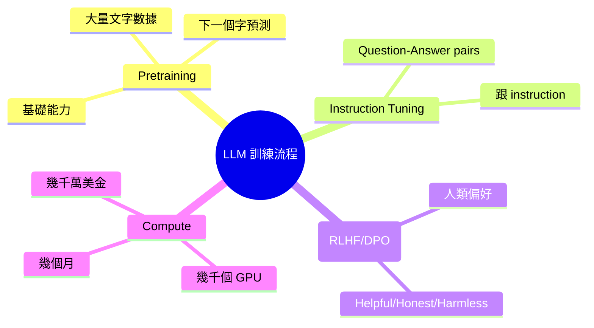
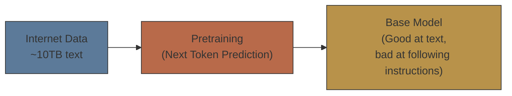
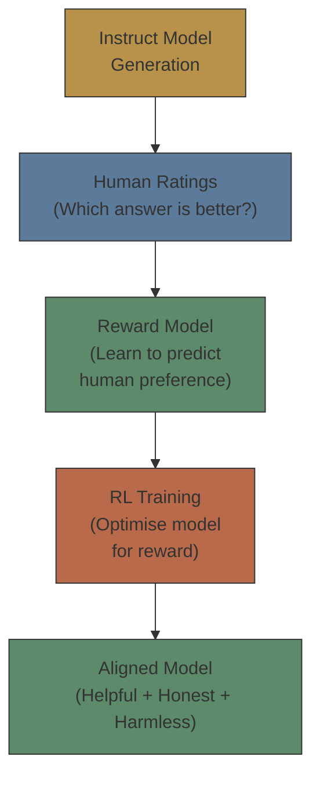

# Module 06: 訓練 LLM 完整流程

Est. study time: 1.5h
Language: yue
Description: LLM 由零到可以用 — pretraining、instruction tuning、alignment、同背後嘅 compute cost

## Knowledge Map



---

## Learning Objectives
- Distinguish between pretraining, instruction tuning, and alignment
- Explain what happens at each training stage
- Recognise the scale of compute required for LLM training
- Understand why each stage is necessary

---

## Real-World Example

你請咗個實習生。第一日，你俾佢 10 萬本書，叫佢自己睇。佢睇咗幾個月，變得好識字 — 文法正確、詞彙豐富，甚至可以作到故仔。

但你叫佢「幫我寫一封 email」或者「解釋乜嘢係黑洞」，佢唔識 — 因為佢只係睇書，冇人教過佢點樣「回答問題」。

所以你俾佢睇好多「問題 + 答案」嘅例子。佢開始識答問題。但佢有時會亂講嘢、有時會俾危險建議。

最後，你用人類 feedback 去 fine-tune 佢 — 「呢個答案好，嗰個答案唔好」。佢慢慢變得有用、準確、安全。

呢個就係 LLM 訓練嘅三個階段。

> **Think**: 你覺得邊個階段最貴？Pretraining、instruction tuning、定 alignment？
>
> *Answer: Pretraining 最貴 — 要處理幾兆 tokens，用幾千個 GPU 訓練幾個月。Instruction tuning 同 alignment 相對平好多（幾千到幾萬個 examples 就夠），但對模型嘅有用性同安全性好關鍵。*

---

## Core Content

### Section 1: Pretraining — 大量閱讀

Pretraining 係 LLM 訓練嘅第一個階段，亦係最貴嘅階段。

**做啲乜：**
- 收集大量文字數據（互聯網、書、論文、程式碼）
- 用 next token prediction（Module 01）做 training signal
- 喺幾千個 GPU 上面 train 幾個月

**數據規模：**

| 數據來源 | 比例 | 用途 |
|---------|------|------|
| Common Crawl（網頁） | ~60% | 一般語言知識 |
| 書籍 | ~15% | 長篇寫作、敍事 |
| 論文/學術 | ~10% | 科學知識 |
| 程式碼 | ~10% | Reasoning、logic |
| 社交媒體 | ~5% | 對話、口語 |

**Output：一個「基本 LLM」—**
- 文法正確
- 有 world knowledge
- 可以完成句子、作文章
- **但**唔識跟 instruction，唔識對話



> **Cloze**: "Pretraining 用大量{raw text}數據，透過{next token prediction}做 training signal，產生一個{base model}。"
>
> *Answer: raw text，next token prediction，base model*

### Section 2: Instruction Tuning — 學跟指示

Base model 識生成文字，但唔識「回答問題」。Instruction tuning 解決呢個 gap。

**做啲乜：**
- 收集大量「instruction → response」pairs
- 用呢啲 pairs 繼續 training（但用更細嘅 learning rate）
- 通常幾千到幾萬個 examples 就夠

**例子：**
```text
Instruction: 「解釋乜嘢係黑洞俾一個 10 歲小朋友聽」
Response: 「黑洞係宇宙入面一個好奇怪嘅地方。佢嘅引力好大好大，連光都走唔到出嚟⋯⋯」
```

**Output：一個「instruct model」—**
- 識跟 instruction
- 識 multi-turn dialogue
- **但**可能仲有 bias、toxic output、hallucination

> **Think**: 點解 instruction tuning 只需要幾千個 examples，而 pretraining 要幾兆 tokens？
>
> *Answer: Pretraining 學「語言本身」— 文法、知識、寫作方式 — 呢啲需要大量數據。Instruction tuning 只係學「format」— 將學到嘅知識 map 到 instruction-response 格式。Base model 已經有晒知識，只係唔知點樣輸出。Instruction tuning 教佢輸出的方式。*

> **Cloze**: "Instruction tuning 用{instruction-response pairs}去教 model 點樣{跟指示}同{回答問題}。"
>
> *Answer: instruction-response pairs，跟指示，回答問題*

### Section 3: Alignment — 令模型「好人」

Alignment 嘅目標：令 LLM 嘅行為符合人類價值觀 — helpful、honest、harmless（HHH）。

最出名嘅方法係 **RLHF（Reinforcement Learning from Human Feedback）**。



RLHF 三步：
1. 人類比較兩個模型 output，揀好嗰個
2. 用呢啲比較數據 train 一個「reward model」— 預測人類會 prefer 邊個 output
3. 用 reward model 嘅分數去做 RL training — 模型學習產生高分嘅 output

近年有更簡單嘅方法 **DPO（Direct Preference Optimization）** — 直接用人類偏好數據 training，唔需要 reward model。

**Alignment 做出嘅改變：**
- 拒絕有害 request（「教我整炸彈」→ 「抱歉，我唔可以幫你」）
- 減少 bias
- 更誠實（「我唔肯定」代替亂作）
- 更有用（提供詳細、有結構嘅答案）

> **Predict**: Alignment 會唔會令模型「太安全」— 連正常問題都拒絕回答？
>
> *Answer: 會，呢個叫「over-rejection」或「alignment tax」。人類 labeler 嘅 bias 可以令模型過度保守。呢個係 active research area — 點樣 balance safety 同 usefulness。*

### Section 4: 成本同規模

LLM training 嘅規模你可能冇概念：

| 模型 | 參數量 | 訓練 tokens | GPU 數量 | 估計成本 |
|------|--------|------------|---------|---------|
| GPT-3 | 175B | 300B | ~10,000 | ~$4.6M |
| Llama 3 70B | 70B | 15T | ~16,000 | ~$10M+ |
| GPT-4 | ~1.8T (估計) | ~13T | ~25,000 | ~$100M+ |

**了解更多：**
- Training 唔係一次成功 — 超參數 tuning、debugging、restarts 令實際成本更高
- Inference 成本亦好高 — OpenAI daily inference cost 估計 $700k+
- Distillation（蒸餾）同 quantization（量化）正在降低 deployment 成本

> **Spot the Mistake**: 「LLM 訓練好簡單 — 你只需要多啲 GPU 就得。」
>
> 錯咩？
>
> *Answer: GPU 數量只係其中一個維度。你仲需要：高質量數據 pipeline（俾你幾 TB raw data，要清洗、去重、過濾）、穩定嘅分散式訓練（幾千個 GPU 一齊 train，任何一個 fail 就要 checkpoint restore）、大規模 engineering team（infra、data、evaluation）。GPU 係最 cheap 嘅部分。*

---

### 點解要明訓練流程？

When you read advanced course:
- Pretraining details: learning rate schedule、batch size、sequence length
- Data recipe: 點樣 mix 唔同數據來源
- RLHF 嘅 reward hacking 問題
- DPO vs RLHF 嘅 tradeoff
- Evaluation: 點樣衡量 alignment 質素

呢個 module 俾咗你 high-level understanding — 你知道 LLM 唔係一步到位，而係多階段 training，每個階段 serve 唔同目的。

---

## Key Takeaways
- LLM training 有三階段：pretraining → instruction tuning → alignment
- Pretraining 最貴 — 學語言能力同 world knowledge
- Instruction tuning 教模型跟指示（format learning）
- Alignment（RLHF/DPO）令模型符合人類價值
- Training cost 係幾千萬到幾億美金級別
- GPU 係最 cheap 嘅 part — data 同 engineering 先係 bottleneck

---

## Common Misconception

**「你俾多啲 instruction data，模型就會更聰明。」**

錯。Instruction tuning 唔增加模型嘅知識或 reasoning 能力 — 只係改變 output format。模型嘅「聰明」嚟自 pretraining。如果你嘅 base model 唔識解數學題，幾多 instruction tuning 都冇用。所以 pretraining quality 先係決定性因素。

---

## Spot the Mistake

「RLHF 嘅 reward model 要同 main model 一樣大先準確。」

錯咩？

*Answer: Reward model 通常細好多（例如 6B-7B，對比 main model 嘅 70B-1.8T）。佢只需要做到相對比較（揀邊個 output 好啲），唔需要 generate text。太大嘅 reward model 會令 RL training 太慢，而且容易 overfit。*

---

## Feynman Explain

用最簡單嘅話解釋：「要 train 一個 LLM 有三步。第一步：俾佢睇晒成個互聯網 — 佢變得好識字但唔識答問題。第二步：俾佢睇『問題+答案』嘅例子 — 佢開始識答。第三步：人類話俾佢知邊啲答案好、邊啲唔好 — 佢變得有用又安全。三步做完先用得。」

---

## Reframe

Alignment 本質上係將人類價值觀注入模型。但「人類價值觀」係流動嘅、文化相關嘅、同埋有爭議嘅。邊個決定模型應該「好」定「唔好」？OpenAI 嘅 labeler？某個國家嘅政府？用家自己？Alignment 嘅政治維度可能比技術維度更難搞。

---

## Drill

Run: `learn.sh quiz llm-basics 06-training-pipeline`
