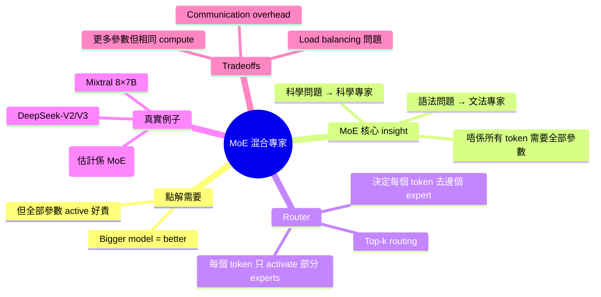
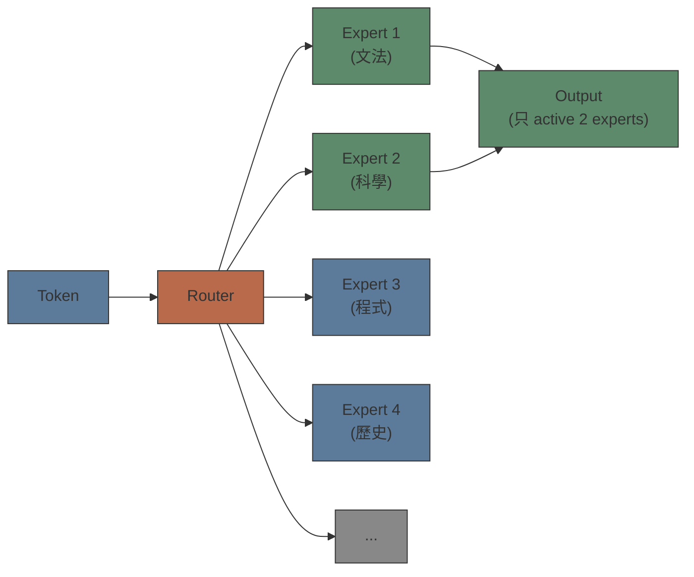

# Module 07: MoE 混合專家模型

Est. study time: 1.5h
Language: yue
Description: Mixture of Experts 嘅基本概念 — 點解同一個模型入面可以有多個「專家」、router 點樣決定邊個專家處理邊個 token

## Knowledge Map



---

## Learning Objectives
- Explain why MoE exists — scaling efficiency problem
- Describe the router's role in directing tokens to experts
- Understand that MoE increases total parameters without proportionally increasing compute
- Identify real-world MoE models (Mixtral, GPT-4, DeepSeek)

---

## Real-World Example

你開咗間大型醫院。每個病人入嚟，你嘅做法係：全部醫生一齊睇同一個病人。

心臟病人 → 心臟科 + 骨科 + 眼科 + 皮膚科 ⋯⋯ 全部醫生一齊睇。

好浪費。心臟科醫生做咗 95% 嘅 work，其他醫生喺度等。你俾咗 100 個醫生嘅人工，但每次只用到 2-3 個。

MoE 嘅 insight：**將模型分成多個「專家」+ 一個「router」。Router 決定邊個專家處理邊個 token。**

心臟病人 → router → 心臟科醫生（+ 可能需要嘅 1-2 個相關專家）

> **Think**: 如果唔用 MoE，要增加模型 capacity，你有乜選擇？
>
> *Answer: 你可以增加 d_model 或者增加 layers（即係更大嘅 dense model）。但每個 forward pass 全部參數都會 active — compute cost 同參數量成正比。MoE 令你可以有更多 parameters 但 keep compute cost 大致不變。*

---

## Core Content

### Section 1: Dense Model 嘅問題

一個 standard dense transformer（Module 05），forward pass 嘅時候**全部參數都 active**。

```text
Dense Model:
  - Total parameters: 70B
  - Parameters active per token: 70B (全部！)
  - Compute per token: proportional to 70B
```

問題：模型越大越聰明（scaling law），但每個 forward pass 嘅 compute cost 同等增加。

如果你將模型由 70B 增加到 1T parameters：
- 能力 ↑（應該）
- Compute cost ↑（同比例）
- Inference 慢 14 倍
- Training 貴 14 倍

Better model = more parameters = more compute = more money。

**MoE 打破呢個 tradeoff。**

> **Cloze**: "Dense model 嘅問題：{全部參數}喺每個 forward pass 都 active，所以 {更多參數} = {更高 compute cost}。"
>
> *Answer: 全部參數，更多參數，更高 compute cost*

### Section 2: MoE Architecture

MoE = Mixture of Experts。用一個 router + 多個「expert networks」代替 FFN layer。

```text
Standard Transformer Block:
  Attention → FFN (全部參數 active)

MoE Transformer Block:
  Attention → Router → Expert 1 / Expert 3 (只 active 2 個 experts)
```



Router 嘅 job：睇每個 token 嘅 representation，決定邊個 expert 最適合處理呢個 token。

Router 輸出 probability distribution over experts，然後揀 top-k（通常 k=2）。

```text
Token: 「質數」
Router scores: [文法: 0.1, 科學: 0.7, 程式: 0.15, 歷史: 0.05]
揀 top-2: 科學 (0.7) + 程式 (0.15)
Output = 0.7 × Expert_科學(token) + 0.15 × Expert_程式(token)
```

**關鍵：每個 token 只 activate 部分 experts — 唔係全部。**

> **Think**: 如果 k=2（每個 token activate 2 個 experts），total 有 8 個 experts，compute 同 2/8 參數嘅 dense model 差唔多？但 capacity 係 8 個 experts？
>
> *Answer: 大致正確。MoE 嘅 compute per token 大約等於 k/total_experts × parameters。但 capacity 遠大過同等 compute 嘅 dense model — 因為唔同 token 可以 activate 唔同 experts，total knowledge 係所有 experts 嘅知識加埋。呢個就係 MoE 嘅 efficiency gain。*

> **Cloze**: "MoE 的關鍵：每個 token 只 active {top-k} 個 experts，所以 total parameters 可以好大但 compute per token 大致{不變}。"
>
> *Answer: top-k，不變*

### Section 3: 真實 MoE 例子

| 模型 | Architecture | Total Parameters | Active per Token |
|------|-------------|-----------------|-----------------|
| Mixtral 8×7B | 8 experts, k=2 | 47B | 12.9B |
| GPT-4 (估計) | 8 experts, k=2 | ~1.8T | ~280B |
| DeepSeek-V2 | 160+ experts, k=6 | ~236B | ~21B |
| Qwen1.5-MoE | 8 experts, k=2 | 14.3B | 2.7B |

特別留意 **DeepSeek-V2** 嘅 design — 160+ experts，active 6，用 fine-grained experts（更多、更細分嘅 experts）。

**MoE 嘅 tradeoffs：**

| 優點 | 缺點 |
|------|------|
| 更多 parameters 但 same compute | Load balancing：某個 expert 可能 overload |
| 唔同 token 搵唔同 experts | Communication：experts 分散喺唔同 GPU |
| Efficient training + inference | Expert collapse：某啲 experts 學唔到嘢 |
| Scaling 更 efficient | Inference memory：全部 experts 要 load 入 RAM |

> **Predict**: 如果 router 成日將 90% 嘅 tokens 送去同一個 expert，會點？
>
> *Answer: 呢個叫「load balancing failure」。其他 7 個 experts 冇乜 tokens 處理 → 學唔到嘢 → capacity 浪費咗。實際 training 有用 auxiliary loss — 如果某個 expert 收到太少 tokens，loss 會增加，push router 更平衡咁分配。*

### Section 4: MoE 喺 LLM 嘅角色

MoE 唔係替代 dense transformer — 而係一種 scaling strategy。

**幾時用 MoE：**
- 你需要好大嘅 model capacity（好多 knowledge）
- 但你嘅 compute budget 有限
- Inference latency 係 concern（keep active parameters low）

**幾時用 dense：**
- Model 唔係好大（< 10B）
- Deployment infrastructure 簡單（MoE 嘅 distributed inference 複雜啲）
- Finetuning 更方便（dense model finetuning 更 straightforward）

> **Spot the Mistake**: 「MoE 模型嘅 total parameters = active parameters，因為每個 token 只 activate 部分 experts，所以總參數冇咁大。」
>
> 錯咩？
>
> *Answer: Total parameters 係全部 experts 加埋 — 係好大。Active parameters 係每個 token 用嘅部分 — 比較細。Mixtral 8×7B total 47B，但每個 token 只 active 12.9B。Model 嘅 RAM requirement 係 based on total parameters（全部 experts 要 load 入 memory），compute requirement 係 based on active parameters。*

> **Predict**: 點解 GPT-4 推測用 MoE？OpenAI 公開 GPT-4 info 好少，但大部分推測係 MoE。
>
> *Answer: 因為 GPT-4 嘅表現遠好過同等 compute cost 嘅 dense model。而且 OpenAI 係商業公司 — MoE 可以俾到更好嘅 performance-per-dollar。Inference cost 低啲 = 俾俾你個用戶收平啲 = competitive advantage。*

---

### 點解要明 MoE？

MoE 係目前 scaling LLM 嘅主流方法。DeepSeek-V2/V3、Mixtral、GPT-4 全部用 MoE。之後讀 advanced course 你見到：
- MoE 嘅具體 training 細節（auxiliary loss、capacity factor、z-loss）
- Fine-grained MoE（DeepSeek 式 — 多 experts × 細 experts）
- Expert parallelism（點樣將 experts 分佈喺 GPU）
- MoE 嘅 inference optimization

呢個 module 俾咗你 MoE 嘅直覺 — 你知道佢點解存在、點樣運作、同 tradeoffs。

---

## Key Takeaways
- Dense model: more parameters = more compute (proportional)
- MoE: more parameters but similar compute (只 activate top-k experts)
- Router 決定每個 token 去邊個 expert — 係一個 learned component
- MoE 嘅 key tradeoff: total memory vs active compute
- 真實例子: Mixtral 8×7B、GPT-4、DeepSeek-V2/V3
- Load balancing 係 MoE training 嘅核心 challenge

---

## Common Misconception

**「MoE 係新發明 — 近幾年先有。」**

唔係。MoE 嘅概念嚟自 1991（Jacobs et al.），叫「Adaptive Mixture of Local Experts」。2017 年 Shazeer et al. 將 MoE 引入 neural network（Sparsely-Gated MoE Layer）。但係直到 Mixtral 8×7B（2023）同 DeepSeek-V2（2024）先 become mainstream。概念舊，但 scaling 令佢 practical。

---

## Spot the Mistake

「MoE 模型 fine-tune 好簡單，同 dense model 一樣。」

錯咩？

*Answer: MoE fine-tuning 有佢嘅 challenges。Router 可能會 collapse — 全部 tokens 去晒同一個 expert。而且每個 expert receive 嘅訓練 signal 唔同 — 某啲 experts 可能 update 得多，某啲好少。MoE fine-tuning 要用特定技巧（例如 load balancing loss、expert dropout）去 maintain 專家嘅多樣性。*

---

## Feynman Explain

用最簡單嘅話解釋：「你有間超級公司，有 100 個專家。但每個問題你唔會叫晒 100 個人去睇 — 你睇吓係乜問題，然後叫最相關嗰 2-3 個專家去處理。咁你就可以請好多專家（知識多），但每次只係俾 2-3 個人嘅人工（compute 平）。呢個就係 MoE。」

---

## Reframe

MoE 其實好似人類 cognition — 你唔會用晒全個大脑做一個 task。大腦有 specialised regions：語言區、視覺區、運動區。Router 就好似 prefrontal cortex — 決定邊個 region 去做邊個 task。MoE 係咪第一次令 AI architecture 真正似人腦架構？定係只係一個巧合嘅 engineering solution？

---

## Drill

Run: `learn.sh quiz llm-basics 07-moe-intro`
