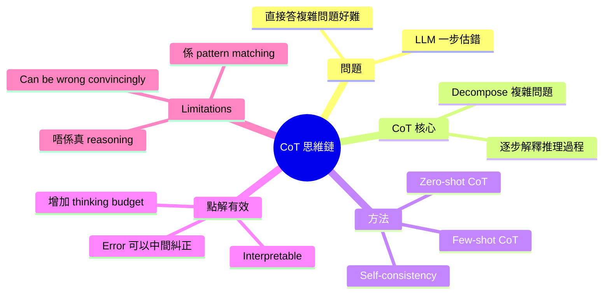
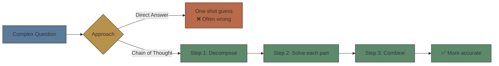
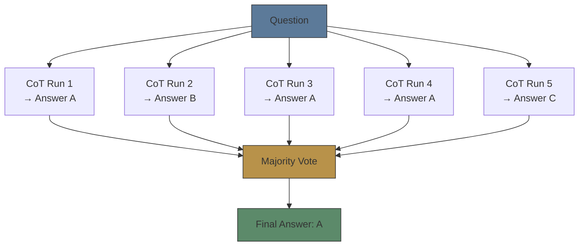
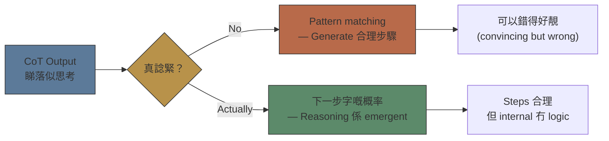

# Module 08: CoT 思維鏈與推理

Est. study time: 1.5h
Language: yue
Description: Chain of Thought — 點樣用「逐步思考」令 LLM 做到複雜推理，同呢個方法嘅 limitations

## Knowledge Map



---

## Learning Objectives
- Explain what Chain of Thought is and why it improves accuracy
- Distinguish between zero-shot CoT and few-shot CoT
- Recognise that CoT is not "real reasoning" but pattern matching
- Apply CoT prompting in everyday LLM use

---

## Real-World Example

你問一個小朋友：「小明有 23 粒糖，俾咗 7 粒俾小強，然後媽咪俾多佢 12 粒，佢而家有幾多粒？」

小朋友有兩種答法：

**直接答：**
「小明有 28 粒。」
（答案可能啱可能錯 — 睇佢彩數）

**逐步答：**
「小明原本有 23 粒。
俾咗 7 粒俾小強 → 23 - 7 = 16 粒
媽咪俾多 12 粒 → 16 + 12 = 28 粒
答案：28 粒。」

第二個方法明顯好啲。就算佢中間計錯，你都可以睇到邊步錯。而且佢自己做錯嘅機會細好多 — 因為佢將個大問題拆成細步驟。

呢個就係 **Chain of Thought (CoT)** — 引導模型逐步思考，唔係直接俾答案。

> **Think**: 你覺得小朋友用逐步思考嘅時候，係咪真係「諗緊」？定係只係跟住一個 template 做 pattern matching？
>
> *Answer: 呢個就係 CoT 嘅核心哲學問題。CoT 嘅 output 睇落似 reasoning，但模型可能只係 learn 咗「呢類問題要逐個 step 拆」嘅 pattern，然後跟住 generate 合理嘅 steps。Steps 睇落合理但 internal 冇真正嘅 logical consistency。*

---

## Core Content

### Section 1: 直接答 vs 逐步思考 — 數學題示範

睇呢個相差：

**直接答（Standard Prompting）：**
```text
Q: 一個農場有 12 隻雞同 7 隻牛。雞有 2 條腿，牛有 4 條腿。總共幾多條腿？
A: 76 條腿。
```

**逐步思考（CoT Prompting）：**
```text
Q: 一個農場有 12 隻雞同 7 隻牛。雞有 2 條腿，牛有 4 條腿。總共幾多條腿？
A: 雞嘅腿 = 12 × 2 = 24
   牛嘅腿 = 7 × 4 = 28
   總共 = 24 + 28 = 52
   答案：52 條腿。
```

結果：
- Direct: 76 ❌（random error）
- CoT: 52 ✅

CoT 令 accuracy 大幅提升，尤其對於需要多步驟計算嘅問題。



> **Cloze**: "CoT 將複雜問題{decompose}成多個{簡單步驟}，逐步 solve 每個步驟，最後{combine}答案。"
>
> *Answer: decompose，簡單步驟，combine*

### Section 2: Zero-shot CoT — 最簡單嘅 trick

最出名嘅 CoT prompt 得一句：「Let's think step by step.」

就係咁簡單。喺問題後面加「Let's think step by step」，模型就會開始逐步推理，accuracy 大幅提升。

呢個叫做 **zero-shot CoT** — 唔需要任何例子。

```text
Q: 一個盒子有 3 個紅色波同 5 個藍色波。我拎咗 2 個紅色波出嚟，然後放返 1 個藍色波入去。而家有幾多個藍色波？
A: Let's think step by step.

模型輸出：
一開始有 5 個藍色波。
我拎咗 2 個紅色波（唔影響藍色波數量）。
我放返 1 個藍色波入去 → 5 + 1 = 6。
答案：6 個藍色波。 ✅
```

**點解有效？**
- 俾模型更多「思考步驟」（thinking budget）
- 將問題拆細，每一步 error 更細
- 模型嘅 language pattern matching 對 short reasoning chains 更 reliable

> **Think**: 你估「Let's think step by step」係對所有問題類型都有效，定係某啲類型先有效？
>
> *Answer: 對需要多步驟推理嘅問題特別有效（數學、logic、planning）。對 fact retrieval 類問題（「法國首都係乜？」）冇乜幫助 — 呢類問題唔需要推理，直接 recall 就得。對 creative tasks 甚至有反效果 — 太 analytical 會 kill 創意。*

### Section 3: Few-shot CoT — 俾例子示範

Zero-shot CoT 唔係次次 work。有時模型唔知你想要乜嘢 format 嘅 reasoning。

**Few-shot CoT** = 俾 2-3 個「問題 + 逐步思考 + 答案」嘅例子，然後問新問題。

```text
Example 1:
Q: 5 個蘋果每個切開 4 份，總共有幾多塊？
A: 5 個蘋果 × 4 份 = 20 塊。答案：20 塊。

Example 2:
Q: 8 個 pizza 每個分俾 3 個人，總共可以分俾幾多人？
A: 8 個 pizza × 3 人 = 24 人。答案：24 人。

Now:
Q: 6 本書每本有 12 章，總共幾多章？
```

模型會跟住 pattern，輸出：

```text
A: 6 本書 × 12 章 = 72 章。答案：72 章。
```

**Self-consistency**：一個更 advanced 嘅技巧。同一個問題問多次（用高 temperature），每個 answer 有唔同嘅 reasoning paths，然後 majority vote 揀最 common 答案。



> **Predict**: 如果一個問題嘅 reasoning 每一步都係 deterministic（例如數學計算），self-consistency 仲有冇用？
>
> *Answer: 冇咁有用。Self-consistency 最有效係當 problem solving 有多條 possible paths — 唔同 paths converge 到同一個答案，你對答案更有信心。對於 deterministic 嘅問題，temperature 低就得，唔需要 multiple runs。*

### Section 4: CoT 嘅 Limitations — 模型仲係唔會「諗嘢」

CoT 睇落好 powerful，但你有冇諗過：**模型係真係諗緊，定係只係 generate 一個「睇落似 reasoning」嘅 text continuation？**



**CoT 嘅騙局：**

表面睇 CoT 已經 work — 用過數學題測試，CoT 輸出 steps 同最終答案都正確。但 CoT 唔等於真 reasoning。換一條 constraint inconsistent 嘅題目，CoT 嘅 pattern matching 就會跌入陷阱：

```text
Q: 籠入面有雞同兔。總共 35 個頭，95 條腳。雞有幾多隻？

CoT:
Let's think step by step.
設雞有 x 隻，兔有 y 隻。
x + y = 35
2x + 4y = 95
由第一條：x = 35 - y
代入：2(35 - y) + 4y = 95
70 - 2y + 4y = 95
2y = 25
y = 12.5
x = 35 - 12.5 = 22.5
答案：22.5 隻雞，12.5 隻兔 ✅
```

Steps format 完美、substitution 啱、algebra 啱。但答案有 0.5 隻雞同 0.5 隻兔 — 呢個 **物理上唔可能**。一條雞只有整數，一個籠唔可能裝半隻雞。題目本身 inconsistent：35 隻動物，2x+4y 永遠係偶數（兩條腿嘅雞 + 四條腿嘅兔都係 2 倍數），但 95 係奇數，所以 **呢條題目根本冇解**。

但 LLM 嘅 CoT 唔識 detect 呢個。佢 follow 咗「兩條 equation 兩個 unknown → 求解」嘅 pattern，output 一個睇落似樣嘅答案。佢冇內部 simulator 去 test「代入答案會唔會 work」或者「個問題本身有冇解」。

呢個就係 **CoT ≠ reasoning** 嘅核心：CoT 提升嘅係「睇落合理嘅 steps 嘅生成能力」，唔係「check 自己答案有冇 logical consistency 嘅能力」。

> **Spot the Mistake**: 「CoT 令 LLM 有 reasoning ability。」
>
> 錯咩？
>
> *Answer: CoT 提升嘅係 performance on reasoning tasks，唔係 reasoning ability 本身。模型仍然係 pattern matching — 佢 learn 咗「呢類問題要出 steps」同「steps 嘅典型 format」。如果問題嘅邏輯結構超出 training data 嘅 distribution（例如 inconsistent constraints、需要 meta-reasoning 嘅問題），CoT 會 output 睇落合理但實際上唔 self-consistent 嘅 steps。CoT = better pattern matching，唔係 reasoning。*

---

### 點解要明 CoT？

Advanced course 會講到：
- CoT 嘅理論分析（點解 decompose 有效）
- Tree of Thoughts（多個 reasoning paths 同時 explore）
- Self-consistency 嘅數學基礎
- CoT 同 tool use 嘅結合（code interpreter + reasoning）
- 點樣 evaluate reasoning quality

呢個 module 俾咗你 CoT 嘅直覺同 critical perspective — 你知道點樣用 CoT 改善 LLM output，亦知道唔好 overestimate 模型嘅 reasoning ability。

---

## Key Takeaways
- CoT = 引導模型逐步思考，唔係直接俾答案
- Zero-shot CoT: 「Let's think step by step.」— 最簡單 effective 嘅 prompt trick
- Few-shot CoT: 俾 reasoning examples 引導 pattern
- Self-consistency: 多個 reasoning paths → majority vote
- CoT 唔係真 reasoning — 係 pattern matching 嘅一種形式
- 對多步驟推理問題最有效，對 fact recall 同 creative tasks 幫助有限

---

## Common Misconception

**「CoT 係 prompting technique，對模型本身冇影響。」**

部分啱。CoT 的確係 prompting technique — 唔改變模型 weights。但佢改變咗模型嘅「thinking budget」— 俾更多 tokens 去 generate intermediate steps，每一步嘅 conditional probability 更準確。所以 CoT 唔係「打開咗模型入面嘅 reasoning module」，而係俾咗更多空間俾 pattern matching 去 work properly。

---

## Spot the Mistake

「我用 CoT 就可以 guarantee 答案正確。」

錯咩？

*Answer: CoT 提升 accuracy 但唔 guarantee correctness。模型仍然可以喺 intermediate steps 出錯。尤其係當問題有 distractors、unusual logic、或者需要 world knowledge 嘅時候。CoT steps 睇落合理但錯 — 呢個係最 dangerous 嘅 case，因為用家會信個答案（因為 steps 睇落好 logical）。Always verify LLM reasoning independently。*

---

## Feynman Explain

用最簡單嘅話解釋：「你問我『2 + 3 × 4 = 幾多？』。我直接答『20』或者『14』 — 可能錯。但係如果我話『先計 3 × 4 = 12，再加 2 = 14』，你見到每個 steps 就可以 check 我啱唔啱。CoT 就係叫模型『話俾我聽你點樣諗』。」

---

## Reframe

如果 CoT 提升準確率，但唔代表模型真係「諗緊」⋯⋯咁人類嘅「思考」同 pattern matching 嘅界線喺邊？人類 solve 數學問題嗰陣，係咪都係 subconscious 嘅 pattern matching + 有意識嘅 step verification？如果係嘅話，CoT 同人類 reasoning 嘅差距可能冇我哋想像咁大。

---

## Drill

Run: `learn.sh quiz llm-basics 08-cot-intro`
