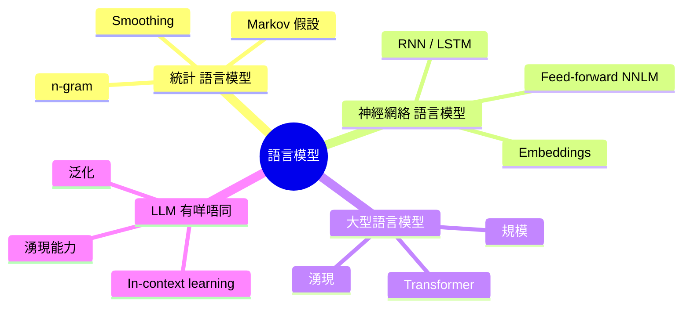
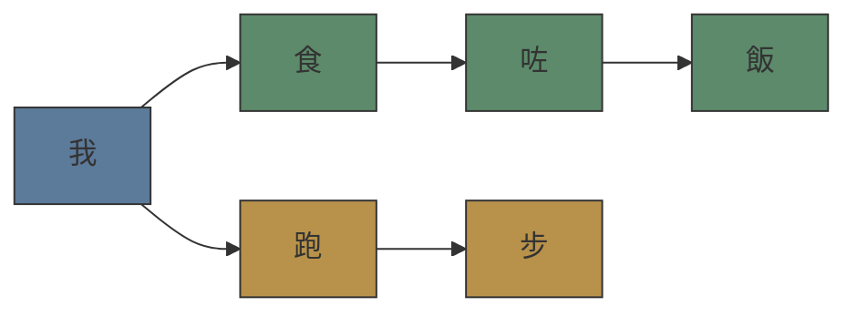

# Module 01: 語言模型係乜 — 由 n-gram 到 LLM

Est. study time: 2.0h
Language: yue
Description: 語言模型基礎 — n-gram, neural LM, 同 LLM 嘅核心分別

## 知識圖譜

---

## 學習目標
- 解釋語言模型係乜，同埋點解概率重要
- 對比統計、神經網絡、同大型語言模型嘅分別
- 指出 LLM 同早期 neural LM 嘅關鍵規模差異

---

## 真實例子

你整咗個 AI chatbot。你問佢「香港今日天氣點樣」，佢答咗句「我唔知，但我可以幫你查」。你覺得 OK。但係你試「今日會唔會落雨」，佢開始亂作 — 作咗個天氣報告出嚟，日期地點都錯晒。

點解同一個 model，有時答得合理，有時亂作？呢個唔係 bug — 係語言模型嘅本質。

> **Think**: 你覺得語言模型係「理解」緊你講乜，定係做緊其他嘢？
>
> *Answer: 語言模型唔係「理解」，而係計算「俾咗上文，下一個字係乜嘅概率」。呢個 fundamental 分別解釋咗點解有時答得合理（高概率路徑），有時亂作（概率分佈太平均，sampling 揀咗低概率答案）。*

---

## 核心內容

### Section 1: 語言模型嘅數學本質

Language model 嘅核心問題好簡單：俾一段文字，計算呢段文字出現嘅概率。

即係 P(香港今日天氣好熱) = ?

點解要計概率？因為我哋想 model 知道乜嘢句子「合理」——「我食咗飯」概率高，「飯食咗我」概率接近 0。

用 chain rule 拆開：

P(w₁, w₂, ..., wₙ) = P(w₁) × P(w₂|w₁) × P(w₃|w₁,w₂) × ... × P(wₙ|w₁,...,wₙ₋₁)

問題：句子越長，condition 嘅 history 越長，數據越稀疏。你唔會喺 training data 睇過每個可能嘅長句子前綴。

> **Think**: 如果有 100k 個 vocab，一個 length=10 嘅句子有幾多種可能？呢個數字對 training 有乜啟示？
>
> *Answer: 100k¹⁰ = 10⁵⁰ 種可能，遠超宇宙原子總數。所以直接計 full conditional probability 係不可能嘅，一定要做 approximation。*

> **Cloze**: "Language model 嘅核心係計算{token sequence}嘅概率，而唔係理解意思。"
>
> *Answer: token sequence (或者 word sequence)*

### Section 2: n-gram LM — 最直接嘅Approach

n-gram 嘅解決方法：Markov assumption — 當前字只依賴前 n-1 個字。

Bigram (n=2): P(wₙ|w₁...wₙ₋₁) ≈ P(wₙ|wₙ₋₁)
Trigram (n=3): P(wₙ|w₁...wₙ₋₁) ≈ P(wₙ|wₙ₋₂, wₙ₋₁)

計法好簡單：counting + normalisation。

P(wₙ|wₙ₋₁) = Count(wₙ₋₁, wₙ) / Count(wₙ₋₁)

Bigram 只睇前一個字。「我食」概率高過「我飯」，因為 P(食|我) > P(飯|我)。

> **Think**: n-gram 有冇辦法處理「尋日我去咗…今日我又去咗…」嘅 long-range dependency？
>
> *Answer: 冇。n=3 最多睇前兩個字，long-range context 完全 miss。呢個係 n-gram 嘅 fundamental limitation。*

> **Predict**: 如果 test set 出現 training set 從未見過嘅 bigram，n-gram model 會點？
>
> *Answer: Count = 0 → probability = 0 → perplexity = infinite。所以需要 smoothing (e.g., add-k, Kneser-Ney) 分配少少 probability 俾 unseen n-gram。*

**Smoothing 點解必要：** 唔係「最好有」，而係「一定要有」。冇 smoothing 嘅 n-gram 面對 unseen n-gram 會 assign P=0，成句概率變 0。

### Section 3: Neural LM — 用 Embedding 解決稀疏性

Neural LM 嘅關鍵 insight：唔係 count 每個 n-gram，而係 learn 一個 continuous representation。

**Feed-forward NNLM (Bengio 2003)**：
1. 每個 word 映射到一個 dense vector (embedding)
2. 前 n-1 個 word 嘅 embeddings concat 埋 → hidden layer → softmax over vocab
3. Train: predict next word

> **Cloze**: "Embedding 將{discrete symbol}映射到{dense vector space}，similar words 有 similar vectors。"
>
> *Answer: discrete symbol (one-hot token) → dense vector space (continuous低維空間)*

Embedding 嘅威力：similar words 嘅 vectors 相近。即使 test 出現「我食蘋果」，training 見過「我食香蕉」同「我食橙」，model 可以 generalise — 因為「蘋果」「香蕉」「橙」嘅 embeddings 相近。

**RNN / LSTM LM (Mikolov 2010)**：
無限 context（理論上）。每個 step 嘅 hidden state carry 前面嘅 info。

但 RNN 有實際問題：
- Gradient vanishing/exploding（長序列 train 唔到）
- Sequential computation（唔 parallelisable）
- 實際 effective context 遠比理論短

> **Think**: RNN 嘅 sequential 限制點解對 training 效率係致命？
>
> *Answer: 每個 token 嘅計算依賴前一個 hidden state，冇辦法 parallelise over sequence。GPU 嘅優勢完全發揮唔到。呢個係 Transformer 後來取代 RNN 嘅關鍵原因之一。*

> **Spot the Mistake**: 「Neural LM 用 embedding 之後，所有 word 之間嘅語義關係都 automatically captured。」
>
> 錯咩？
>
> *Answer: Embedding space 嘅 quality 取決於 training objective 同 data quality。Word vectors 可能 capture 到部分語義關係（如 analogy: king - man + woman ≈ queen），但唔係 automatically perfect。Polysemy（一詞多義）亦係難題 — 同一個 word 喺唔同 context 意思唔同，static embedding 搞唔掂。*

### Section 4: LLM — 乜嘢變咗

LLM 同上面 neural LM 有乜分別？唔係「大細」咁簡單。

| 維度 | Neural LM (2010s) | LLM (2020s) |
|------|-------------------|-------------|
| 架構 | RNN/LSTM | Transformer |
| 規模 | ~1B tokens, ~100M params | ~10T tokens, ~100B-1T params |
| 訓練目標 | Next word prediction | Next token prediction (same but scaled) |
| 湧現 | ❌ | ✅ — in-context learning, reasoning |
| 用途 | Only perplexity / generation | Anything (QA, coding, reasoning, tool use) |

關鍵位：**scaling laws**。Kaplan et al. (2020) 發現 model size、data size、compute 三者之間有 power-law relationship — 同時 scale 三者，performance predictable 咁提升。

到某個 threshold，**emergent abilities** 出現 — model 突然做到細 model 完全做唔到嘅 task（e.g., 數學推理、code generation）。

> **Think**: Emergent abilities 係「突然出現」定係「一直喺度，只係 threshold 未到」？
>
> *Answer: 學術界仲爭論緊。一派認為 emergence 係 metric 選擇嘅 artifact（用唔連續嘅 metric 就睇到「突然」，用連續 metric 就 smooth），另一派認為真係有 phase transition。2024 年嘅研究傾向認為：大部分 emergent abilities 其實係 smooth improvement，只係我哋用嘅 benchmark 太易/太難。*

> **Predict**: 如果語言模型唔係「理解」而只係計算 token probability，點解 CoT (Chain-of-Thought) prompting 會 work？
>
> *Answer: CoT 俾 model 更多 intermediate tokens，將複雜嘅 probability path 拆成細 steps。每個 step 嘅 conditional probability 比較集中（高概率路徑明確），減少「一步跳去低概率答案」嘅機會。呢個係我哋 module 22 會深入探討嘅問題。*

---

### 點解你嘅 App 會 unexpected

回到最頭嘅 chatbot 問題：

1. **LLM 係 probabilistic** — 同一個 prompt 每次 output 可以唔同（除非 temperature=0）
2. **沒有 ground truth** — model 唔知乜嘢係「事實」，只知乜嘢係「高概率 continuation」
3. **Sensitivity to prompt phrasing** — 微調 prompt 嘅 wording 可以完全改變 output 分佈
4. **Hallucination 係 feature 唔係 bug** — 因為 model 嘅 job 係 generate plausible continuation，唔係 recall facts

呢啲唔係你寫錯 code — 係語言模型嘅 fundamental nature。

---

## 重點回顧
- Language model 係下一個 token 嘅概率估計器，唔係理解引擎
- n-gram 用 Markov assumption 簡化，但 miss long-range context
- Neural LM 用 embedding 解決稀疏性，但 RNN 有 sequential bottleneck
- LLM = Transformer + scale + emergence
- LLM 嘅 probabilistic nature 解釋咗大部份 app unexpected behaviour

---

## 常見誤解

**「LLM 係數據庫，答問題 = 查記錄」**

錯。LLM 冇數據庫。LLM 嘅 weights 係 training data 嘅壓縮表示。佢唔係「記住」事實，而係學咗 token 之間嘅統計規律。所以你問事實性問題，佢可能答錯 — 因為佢喺做 continuation 而唔係 retrieval。

---

## 搵錯處

「我用 temperature=0 就保證 deterministic output，app 唔會再 unexpected。」

錯咩？

*Answer: Temperature=0 確實用 argmax (greedy decoding)，output 係 deterministic。但 model 嘅 determinism 唔等於正確。如果 model 嘅 probability distribution 本身將高概率 assign 俾錯誤答案，argmax 只會 consistently 俾錯嘅答案。Deterministic 唔等於正確。*

---

## Feynman 解釋
用五歲細路都明嘅方式解釋 language model：『想像有個細路睇晒世界上所有書。你開個頭 — 「尋日我食咗...」 — 佢根據所有書入面「食咗」之後通常跟邊啲字，估下一個字。佢唔知「食咗」係乜意思。佢只係知「pizza」同「飯」好常見喺「食咗」之後，而「快樂」就唔係。呢個就係 language model。大型 language model 睇咗咁多書，聽落好似明 — 但佢哋仍然只係估下一個字，估得超級好。』

---

## 重新理解
LLM 嘅「understanding」係真正 understanding 定係複雜 pattern matching？如果你接受 understanding 係「能夠 consistently 產生正確 output 嘅能力」，咁 LLM 有 understanding。如果你要求 understanding 包含 consciousness、intentionality、或 grounded semantics（words 同真實世界嘅因果連接），咁 LLM 冇。呢個分別對 app building 好重要 — 你唔應該假設 LLM 有人類級 understanding，但你應該利用佢嘅 pattern matching 能力。

---

## 練習
Run: `learn.sh quiz llm-moe-cot 01-intro-language-models`
