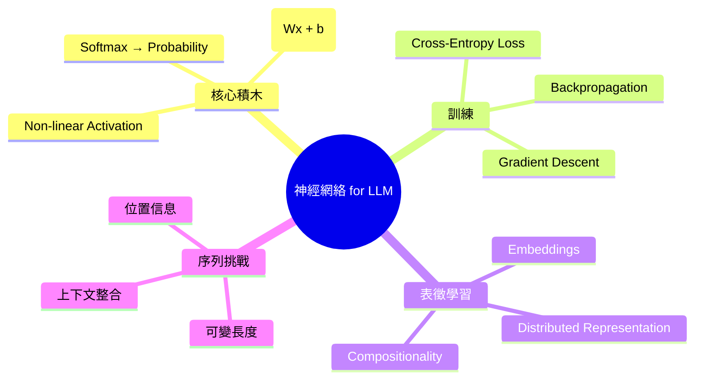
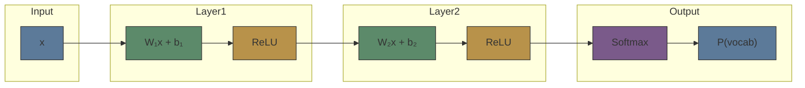

# Module 02: Neural Network 基礎 — LLM 必備

Est. study time: 2.0h
Language: yue
Description: 你需要嘅 deep learning 基礎 — linear layer, activation, backprop, embedding, sequence modeling

## 知識圖譜

---

## 學習目標
- 解釋 linear layer、activation、softmax 組成 token probability pipeline
- 描述 backpropagation 概念 — 點解 gradients 流經各 layers
- 解釋 embedding 作為 distributed representation vs one-hot
- 指出點解 sequence modeling 需要 special architecture（唔係淨係 MLP）

---

## 真實例子

Mod 1 講過 n-gram 用 counting，neural LM 用 embedding。但具體條數點計？你開住 PyTorch，見到 `nn.Linear(512, 256)` — 呢個 layer 做咗乜？點解疊好多層就可以 model 語言？

你寫 `x = torch.matmul(W, x) + b`，然後 `x = relu(x)` — 呢啲 operation 點解可以 learn 到 language？

> **Think**: 一個 linear layer (Wx + b) 本質係做咩 transformation？
>
> *Answer: Linear layer = 仿射變換 (affine transformation) — rotation + scaling + translation。單層 linear 只能 capture 線性關係。疊 non-linear activation 先可以 model 非線性關係（語言係高度非線性）。*

---

## 核心內容

### Section 1: Linear Layer — Neural Network 嘅基本單元

Neural network 最基本 = linear transformation + non-linear activation。

**Linear (Dense / Fully-Connected) Layer：**

y = Wx + b

- x ∈ ℝᵈ（input vector, d = 前一層嘅維度）
- W ∈ ℝᵏˣᵈ（weight matrix, k = 呢層嘅 output 維度）
- b ∈ ℝᵏ（bias vector）
- y ∈ ℝᵏ（output vector）

W 嘅每一行可以理解為一個「特徵 detector」— 同 x 做 dot product → 高值代表呢個 pattern 出現。

> **Cloze**: "Linear layer y = {Wx + b}，W 控制 rotation/scaling，b 控制 translation。"
>
> *Answer: Wx + b*

> **Think**: 如果 W 全是 0 會點？如果 b 全是 0 同全是 non-zero 有乜分別？
>
> *Answer: W=0 → output 全是 b，完全唔睇 input → gradient vanish / model 唔 learn 到。b=0 → decision boundary 必須穿過原點，限制 model 嘅 expressivity。所以 bias 雖然細，但重要。*

### Section 2: Non-linear Activation — 點解要非線性

疊多層 linear 等如單層 linear（因為 linear ∘ linear = linear）：

y = W₂(W₁x + b₁) + b₂ = (W₂W₁)x + (W₂b₁ + b₂) = W'x + b'

所以冇 activation → deep network = single linear layer → expressivity 冇增加。

**ReLU (Rectified Linear Unit):** ReLU(x) = max(0, x)
- 簡單、快、解決 vanishing gradient（相比 sigmoid/tanh）
- 缺點：dead ReLU（如果 input 長期 < 0，gradient = 0 → 永遠 learn 唔到）

**GELU / SwiGLU (modern LLM 常用)：**
GELU(x) = x · Φ(x) (Φ = standard Gaussian CDF)
SwiGLU = Swish(xW) ⊙ (xV) — gated variant

> **Cloze**: "ReLU = {max(0, x)}，解決咗 sigmoid 嘅{vanishing gradient}問題。"
>
> *Answer: max(0, x), vanishing gradient*

> **Predict**: 用 ReLU 嘅 network，如果某個 neuron 嘅輸入一直 < 0，會發生乜事？
>
> *Answer: Output = 0，gradient = 0 → 權重永遠唔 update → dead neuron。呢個問題喺 LLM 通常用 gated activation (SwiGLU) + proper initialisation 解決。*

### Section 3: Softmax — 從 Scores 到 Probabilities

LLM 最後一層必須將 scores (logits) 轉成概率分佈：

Softmax(zᵢ) = exp(zᵢ) / Σⱼ exp(zⱼ)

性質：
- 輸出加埋 = 1（正式概率分佈）
- Exponential 放大差異（max logit 嘅概率遠大於其他）
- Temperature scaling: Softmax(zᵢ/T) — T>1 平滑分佈，T<1 尖銳

> **Think**: 點解 softmax 用 exp 而唔係直接 normalize？
>
> *Answer: Exp 確保 output > 0（概率必須非負），同時放大 logits 之間嘅差異 — 令 model 可以「confident」。如果用直接 normalize，可能有負數問題。*

### Section 4: Cross-Entropy Loss — 點樣衡量「錯幾多」

Language model 嘅 loss function：

L = -Σᵢ yᵢ · log(pᵢ)

- y = ground truth (one-hot: 正確 token 位置 = 1)
- p = model 嘅 predicted probability

直覺：model assign 俾正確 token 嘅概率越高，loss 越低。
If p(correct) = 1.0 → loss = 0
If p(correct) = 0.01 → loss = 4.6

> **Cloze**: "Cross-entropy loss = -{y · log(p)}。Model predict {p(correct)=1} → loss=0。"
>
> *Answer: y · log(p), p(correct)=1*

> **搵錯處**: 「Cross-entropy loss 越低代表 model 越準確。」
>
> 錯咩？
>
> *Answer: Loss 低代表 model 對 training data assign 高概率俾正確 token，但可能係 overfitting。Low loss on train ≠ good generalisation。而且 perplexity = 2^loss 先係更 interpretable 嘅 metric（平均有幾多 choices）。*

### Section 5: Backpropagation — Gradient 點樣流

Chain rule 係 backprop 嘅核心：

∂L/∂W₁ = ∂L/∂y · ∂y/∂W₁

直覺：每個 weight 嘅 gradient = loss 對 output 嘅 sensitivity × output 對 weight 嘅 sensitivity。

Gradient 嘅大小話俾我哋知：
|gradient| = 0 → 呢個 weight 唔影響 loss → 唔會 learn
|gradient| 大 → 細微改變 weight 會大幅改變 loss → learn 得快

**Vanishing Gradient:** Activation function (sigmoid) 令 gradient 趨近 0 → 深層 network 嘅前面層 learn 唔到。
**Exploding Gradient:** Gradient 愈傳愈大 → weights 爆炸 → NaN。

> **Predict**: 如果 network 有 100 層，每層 gradient scale = 0.9，第一層嘅 gradient 係最後一層嘅幾多？
>
> *Answer: 0.9¹⁰⁰ ≈ 0.000027。幾乎為零。呢個就係 vanishing gradient — 越深嘅 network，前面層越難 train。Residual connection (mod 8) 就係為咗解決呢個問題。*

> **Think**: LLM 成百層 transformer，點解 backprop 仲 work？
>
> *Answer: 1) Residual connections 提供 gradient shortcut。2) LayerNorm 穩定 activation magnitude。3) Pre-norm 設計。4) Adam  optimizer 有 adaptive learning rate。呢啲全部係 module 8-10 嘅主題。*

### Section 6: Embedding — Representation Learning 嘅核心

Embedding = 每個 token 有一個 learnable vector。

**One-hot vs Embedding：**

| 層面 | One-hot | Embedding (Dense) |
|------|---------|-------------------|
| 維度 | |V| (e.g., 100k) | d (e.g., 4096) |
| Similarity | 所有 pairs 正交 (dot=0) | 語義相近 → vector 相近 |
| Generalisation | 冇 — 「蘋果」同「橙」完全獨立 | 有 — 「蘋果」≈「橙」 |
| Learnable | 唔係 | 係 — training 過程優化 |

**Embedding Matrix E ∈ ℝ|V|ˣᵈ：**
- 每一行 = 一個 token 嘅 embedding vector
- Training 過程中，similar contexts 嘅 tokens 會推埋一齊

> **Cloze**: "Embedding matrix E ∈ ℝ{|V|×d}，每行代表一個{token vector}。Training 令 similar context 嘅 tokens vectors {相近}。"
>
> *Answer: |V|×d, token vector, 相近*

### Section 7: 點解 Sequence Modeling 唔可以用 MLP

樽頸問題：MLP 需要固定維度 input。句子長度可變。

如果強行 padding + MLP：
- Padding 0 要 padding 到最大長度 — 浪費
- 每個位置用獨立 weights — 學唔到「同一 pattern 在不同位置」嘅 generalisation
- 冇內建位置感知 — 㩒同唔㩒意思完全唔同，但 MLP 冇辦法區分 token 順序

Transformer 嘅解決方案（預告）：
1. Self-attention — 每個 token 可以「睇」所有其他 token
2. Positional encoding — 加入位置信息
3. 可變長度 — attention 可以 handle 任何長度（計算量 quadratic 但係架構上冇限制）

> **Think**: MLP 處理「我食飯」同「飯食我」會點？點解？
>
> *Answer: MLP (bag-of-words approach) 可能俾類似 output — 因為三個 tokens 出現咗，但順序信息冇獨立建模。如果係 position-independent MLP，㩒同被㩒嘅關係 capture 唔到。Attention 就唔同 — attention 可以睇到「我」同「食」之間嘅關係。*

---

## 重點回顧
- Linear layer = affine transformation (Wx + b)，需要 non-linear activation 疊加先有 depth
- Softmax = scores → probability distribution，temperature 控制 confidence
- Cross-entropy = 衡量 predicted 同 true distribution 嘅距離
- Backprop = chain rule — gradient 從 output 逐層傳回 input
- Vanishing/exploding gradient = 深層網絡嘅 fundamental challenge
- Embedding = learnable dense vector per token，解決 one-hot 嘅稀疏性
- Sequence 需要 attention（唔係 MLP）因為長度可變 + 需要位置感知

---

## 常見誤解

**「Deep learning 係魔法，疊越多層越好。」**

唔係。Vanishing gradient、overfitting、diminishing returns (scaling laws 有 saturating behaviour) 都限制咗「越深越好」。Residual connection、normalisation、regularisation 呢啲 innovations 先令 deep network 變得 practical。

---

## 搵錯處

「Softmax output 係概率，所以可以直接用作 confidence 估計。」

錯咩？

*Answer: Softmax output = model 對 token 嘅相對偏好，唔等於 calibrated probability。一個 model 可能 softmax 出 0.99，但實際得 60% 準確。呢個叫 miscalibration。需要 temperature scaling 或 Platt scaling 做 calibration。LLM 常見 overconfident。*

---

## Feynman 解釋
「想像你喺猜一首歌嘅下一個字。你有齊所有字嘅 list。你根據前面啲字俾每個字一個 score。然後你用一個 special machine (softmax) 將啲 scores 轉成百分比，令佢哋加埋 = 100%。你嘅老師話俾你知邊個字係正確。你睇下你嗰個字嘅百分比 — 如果得 2%，你就調整你個 scoring machine 令下次高啲。你呢個做咗幾十億次，橫跨幾十億條句子。最終，你個 scoring machine 變得好叻。呢個就係 neural network training。」

---

## 重新理解
Neural network 係 universal function approximator（理論上可以 fit 任何 function）。但 language 嘅 function 極高維度、極複雜。Scaling（大 model + 多 data + 多 compute）係目前最 work 嘅 approach。呢個 trade-off — expressivity vs trainability — 貫穿整個 course。

---

## 練習
Run: `learn.sh quiz llm-moe-cot 02-neural-network-primer`

> **Spot the Mistake**: Code review note: someone applies x = torch.matmul(w, x) + b everywhere "to be safe" in a neural network 基礎 — llm 必備 codebase. Spot the mistake.
>
> *Answer: Blanket application hides which spots actually need x = torch.matmul(w, x) + b. Apply it where the semantics demand it, and document why.*

