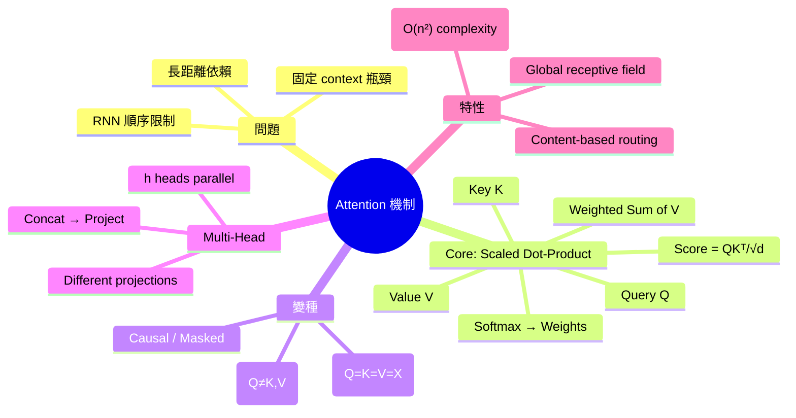
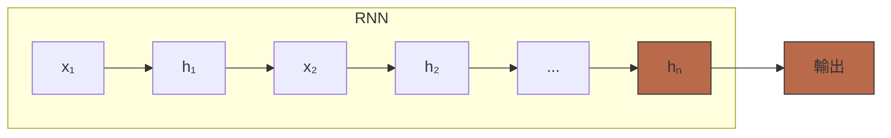
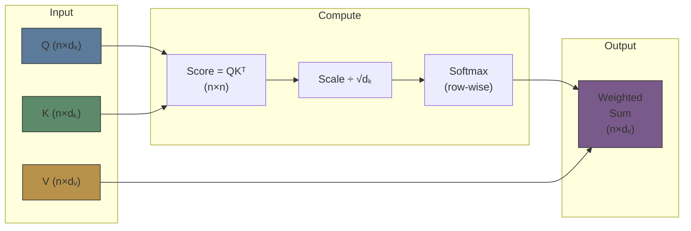
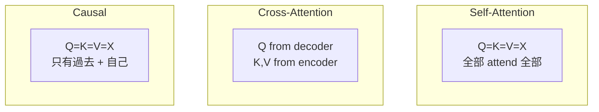
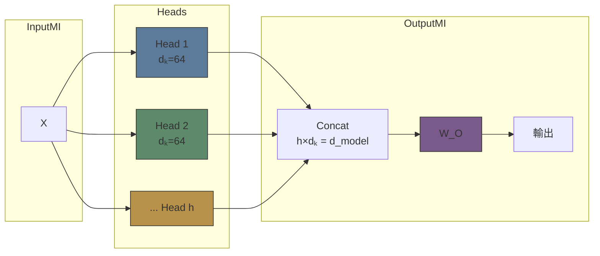

# Module 03: Attention 機制

Est. study time: 2.5h
Language: yue
Description: 核心發明 — Scaled Dot-Product Attention, QKV, Self-Attention, Multi-Head, Causal Masking

## 知識圖譜



---

## 學習目標
- 從 Q, K, V 推導 scaled dot-product attention
- 解釋點解 √dₖ scaling factor 係必要
- 對比 self-attention、cross-attention 同 causal attention
- 描述 multi-head attention — parallel heads 同唔同 subspaces

---

## 真實例子

Mod 2 末提過：MLP 分唔到「我食飯」同「飯食我」。RNN 理論上得但 sequential bottleneck。

你譯緊一句：「The animal didn't cross the street because it was too tired。」— 「it」指 animal 定 street？人一睇就知，但 model 點知？

Attention 俾 model 一個 mechanism：每個 token 可以「睇」其他所有 token，決定邊啲 context 重要。Softmax weights 話俾你知 — 為咗理解「it」，model 高 weight 睇「animal」，低 weight 睇「street」。

> **Think**: 如果冇 attention，一個 word-by-word 嘅 model 點決定「it」指緊邊個？
>
> *Answer: 冇辦法。RNN 嘅 hidden state 理論上 carry 前面 context，但越遠越 weak。Attention 係第一個 mechanism 俾 model 直接 access 任何位置嘅 info。*

---

## 核心內容

### Section 1: 從 RNN 嘅 Bottleneck 到 Attention

RNN 嘅問題：最後一步嘅 hidden state 要 encode 成個 sequence 嘅 info。



hₙ 係 bottleneck — 必須 carry 所有前面嘅 info。長 sequence → hₙ 有上限 → info loss。

**Bahdanau Attention (2015):** Decoder 每個 step 唔只靠最後嘅 hidden state，而係直接「睇」encoder 所有 hidden states，weighted sum。

呢個係「attention 係乜」嘅直覺：**Content-based weighted retrieval** — 你有個 query（e.g., 當前 decoder state），你去睇所有 keys（encoder hidden states），return weighted sum of values（encoder hidden states）。

> **Cloze**: "Attention = {content-based weighted retrieval}。Query 決定邊啲 Key 值得 high weight，然後 weighted sum Values。"
>
> *Answer: content-based weighted retrieval*

### Section 2: Scaled Dot-Product Attention — Q, K, V

Transformer 用嘅 attention (Vaswani et al., 2017)：

Attention(Q, K, V) = softmax(QKᵀ / √dₖ) · V

**三條 matrix：**
- **Q (Query):** 當前 token 想「問」啲乜 — 我想搵相關 context
- **K (Key):** 每個 token 嘅「標籤」— 我有呢啲 info
- **V (Value):** 每個 token 嘅「內容」— 如果揀中我，呢個 info 俾你

**Step-by-step：**



1. **Score matrix S = QKᵀ:** Q 同 K 嘅 dot product。S[i,j] = qᵢ · kⱼ = token i 對 token j 嘅「attention score」（越大越相關）
2. **Scale ÷ √dₖ:** dₖ = key 嘅維度。Dot product 嘅 magnitude 隨 dₖ 增長 — 唔 scale 嘅話 softmax 會極端（接近 one-hot），gradient vanish
3. **Softmax (row-wise):** 每行 normalize → attention weights（加埋 = 1）
4. **Weighted sum:** Attention weights × V → output

> **Think**: 點解要除以 √dₖ？假設 q, k 每個 element ~ N(0,1)，dot product q·k 嘅 variance 係幾多？
>
> *Answer: 如果 qᵢ, kᵢ ~ N(0,1) 且 independent，q·k = Σ qᵢ·kᵢ。每個 term variance = 1，dₖ 個 terms → variance = dₖ，std = √dₖ。唔 scale 嘅話，dₖ=4096 時 std=64 → softmax input 太大 → near one-hot → small gradients。√dₖ 將 std normalize 返去 ~1。*

> **Cloze**: "Scaled dot-product attention formula: Attention(Q,K,V) = softmax({QKᵀ / √dₖ}) · V。√dₖ 係{scale factor}防止 softmax 進入極端區域。"
>
> *Answer: QKᵀ / √dₖ, scale factor*

### Section 3: Self-Attention vs Cross-Attention vs Causal

**Self-Attention:** Q = K = V = X（同一個 sequence）

每個 token attend 到 sequence 嘅所有其他 tokens（包括自己）。Output = each token 嘅「context-aware representation」。

**Cross-Attention:** Q ≠ K, V

Q 來自 one sequence (e.g., decoder)，K, V 來自另一個 (e.g., encoder)。Encoder-decoder 架構用 cross-attention 將 input 嘅 info 傳俾 decoder。

**Causal (Masked) Attention:** Decoder-only 用。

每個 token 只可以 attend 到自己同前面嘅 tokens（唔可以睇未來 token）。



Causal mask: 上三角 matrix 填 -inf，softmax 後 weight = 0 for 未來 tokens。

```text
Mask matrix (n=4):
[0   -inf -inf -inf]    Token 0: can see [0]
[0    0   -inf -inf]    Token 1: can see [0, 1]
[0    0    0   -inf]    Token 2: can see [0, 1, 2]
[0    0    0    0  ]    Token 3: can see [0, 1, 2, 3]
```

> **Predict**: 如果 decoder-only model 冇 causal mask，train 嘅時候會點？
>
> *Answer: Model 可以「偷睇」未來 token。P(wₙ|w₁...wₙ₋₁) 變成 P(wₙ|w₁...wₙ₋₁, wₙ₊₁, ..., wₙ) — 即係見到答案先 predict。Train 時 loss 好低，但 inference 時冇未來 token → 完全 fail。呢個叫 label leakage。*

> **Think**: Self-attention 嘅 receptive field 係幾多？同 RNN 比？
>
> *Answer: Self-attention：成個 sequence（O(1) 步 reach 任何位置）。RNN：O(n) 步先 reach 遠距離位置。呢個「global receptive field in one step」係 transformer 嘅核心優勢。*

### Section 4: Multi-Head Attention

單一 attention 嘅局限性：每個 token 只可以 attend 到其他 tokens 嘅「一個 perspective」。

**Multi-Head = 多個 parallel attention 運算：**

MultiHead(Q,K,V) = Concat(head₁, ..., headₕ) · W_O

headᵢ = Attention(Q·W_Qⁱ, K·W_Kⁱ, V·W_Vⁱ)

- 每個 head 有獨立嘅 W_Qⁱ, W_Kⁱ, W_Vⁱ（projection matrices）
- 每個 head 睇唔同嘅「subspace」
- Head 可以 specialise：一個 head 睇 syntax，一個睇 semantics，一個睇 positional relations

**如果 d_model = 512, h = 8 heads → 每 head dₖ = 512/8 = 64**

> **Cloze**: "Multi-head attention = {h} 個 parallel attention heads，每個 head 學習{不同 subspace}嘅 representations。Output = Concat + {W_O}。"
>
> *Answer: h, 不同 subspace, W_O*



**Multi-Query / Grouped-Query Attention (optimisation):**

標準 MHA: Q, K, V 各有 h 組 projection → K, V 大 → KV cache 大
MQA: 所有 heads 共享 K, V（只有 Q 分 heads）→ KV cache 細好多
GQA: K, V 分成 g 組 (g < h)，平衡 quality 同 cache size

> **Think**: MQA 同 GQA 係為咗解決乜嘢實際問題？
>
> *Answer: KV cache 大小。Inference 時每個 token 嘅 K, V 要 cache 住俾未來 tokens 用。h=32, n=4096, dₖ=128 → KV cache per layer = 2×32×4096×128 = 33M floats。~100 layers → ~3.3B floats → ~13GB memory。MQA/GQA 大幅減少呢個 overhead。*

### Section 5: Attention 嘅計算複雜度

Self-attention: O(n² · d)
- n = sequence length
- d = hidden dimension

QKᵀ 係 (n×d) · (d×n) = n²·d operations。

呢個 quadratic complexity 係 transformer 嘅主要 bottleneck — n 越大，計算量 quadratic 增長。

> **Predict**: Sequence length 由 512 變 4096 (8×)，attention 嘅 computation 增長幾多倍？
>
> *Answer: O(n²) → 8² = 64 倍。呢個係為乜 LLM 有 context window limit — 唔係架構上唔 support 長 context，而係計算量同 memory 太貴。Flash Attention, sparse attention 等係解決呢個問題嘅技術。*

---

## 重點回顧
- Attention = content-based weighted retrieval: Query 決定 Keys 嘅重要性，weighted sum of Values
- Scaled dot-product: QKᵀ/√dₖ → softmax → × V
- √dₖ scaling 防止 softmax 極端化，維持 gradient flow
- Self-attention = Q=K=V (all-to-all), causal attention = mask future tokens
- Multi-head = h 個 parallel attention 捕捉不同 subspace
- O(n²) complexity = transformer 嘅 fundamental bottleneck

---

## 常見誤解

**「Attention 係 explainability 工具 — attention weights 話俾你聽 model 睇緊邊度。」**

部份啱但唔完全。Attention weights 係 model 計算嘅 intermediate value，唔等於「reasoning」。Jain & Wallace (2019) 證明：完全唔同嘅 attention weights 可以 produce 相同 prediction。所以 attention weights 嘅 interpretability 係有限嘅。

---

## 搵錯處

「Multi-head attention 嘅每個 head 學到獨立嘅 attention pattern，output 直接加埋。」

錯咩？

*Answer: Output 係 Concat 然後乘 W_O (output projection)，唔係直接加埋。W_O 可以 cross-head mixing — 即係 final output 可以混合不同 heads 嘅 info。*

---

## Feynman 解釋
「想像你同 7 個人開會。你想理解某人啱啱講嘅嘢。你望住每個人（呢個係 Query）。每個人有名牌（Key）同揸住文件（Value）。個人越關聯你嘅問題，你就俾越多 attention。然後你收集所有人嘅 info — 按你俾嘅 attention 加權 — 形成你嘅理解。而家想像 8 個你同時做呢件事，每個 focus 唔同方面（語氣、用詞、body language）。呢個就係 multi-head attention。」

---

## 重新理解
Attention 係 transformer 嘅「secret sauce」— 第一次讓 model 有 global receptive field 而唔使 sequential processing。但 O(n²) 嘅代價好大，所以之後 module 9 會講 attention 嘅 optimisation（Flash Attention, sparse attention, etc.）。

---

## 練習
Run: `learn.sh quiz llm-moe-cot 03-attention-mechanism`

> **Spot the Mistake**: Code review note: someone applies rnn everywhere "to be safe" in a attention 機制 codebase. Spot the mistake.
>
> *Answer: Blanket application hides which spots actually need rnn. Apply it where the semantics demand it, and document why.*

