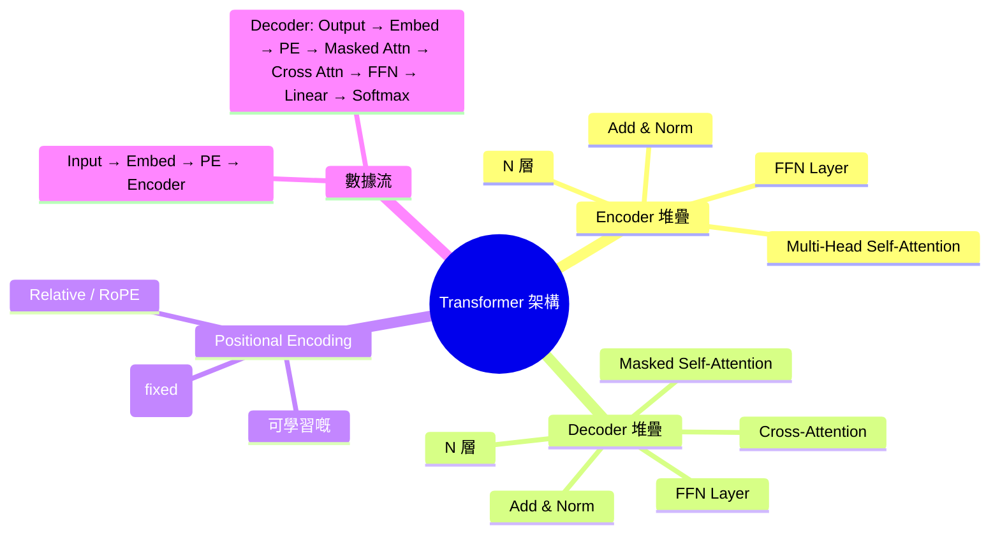
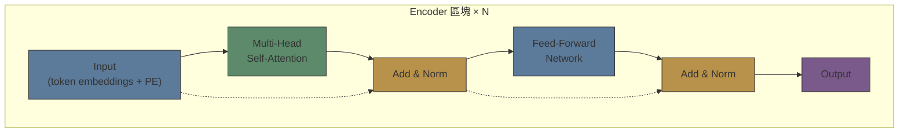
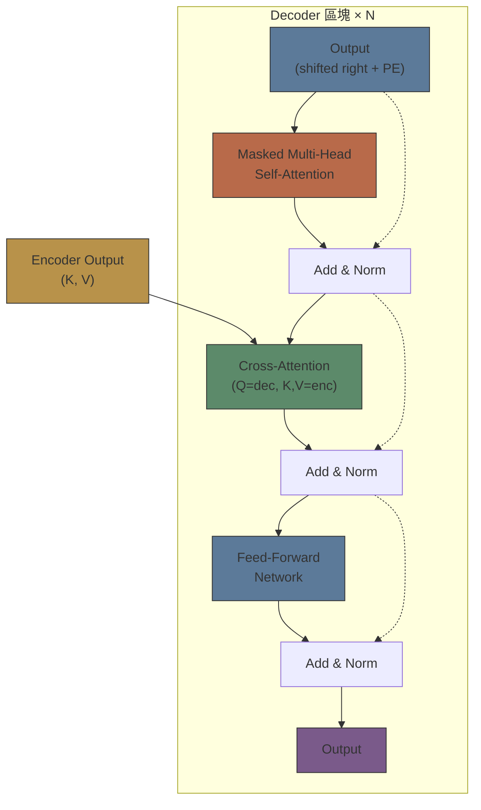

# Module 04: Transformer 架構

Est. study time: 2.5h
Language: yue
Description: Encoder-Decoder 結構 — Positional Encoding, Add & Norm, 完整 data flow

## 知識圖譜



---

## 學習目標
- 理解 Transformer encoder-decoder 完整架構
- 解釋 Add & Norm — 點解要用 residual + layer norm
- 比較 sinusoidal 同 learned positional encoding
- 追蹤 data flow 由 input tokens 到 output probabilities

---

## 真實例子

Mod 3 講咗 attention 係 building block。但呢堆 blocks 點砌埋一齊？點解呢個「砌法」成為咗成個 AI 領域嘅 foundation？

OpenAI 用 decoder-only, Google 用 encoder-only (BERT), DeepSeek 用 MoE — 但佢哋全部都係同一個 architecture pattern 嘅變體：**Transformer block + stacking + residual + norm**。

> **Think**: Encoder-decoder 同 decoder-only 嘅核心分別係乜？邊個適合 generation？
>
> *Answer: Encoder = bidirectional context（睇晒前後）。Decoder = causal context（只睇左邊）。Generation 需要 causal（由左到右逐個 gen）。Encoder-only 適合理解（BERT），decoder-only 適合生成（GPT）。*

---

## 核心內容

### Section 1: Transformer Encoder 區塊

Encoder block = Multi-Head Self-Attention → Add & Norm → FFN → Add & Norm



**兩個子層：**
1. **Multi-Head Self-Attention:** 每個 token attend 到所有 tokens（包括自己）。Bidirectional — 冇 mask，可以睇前後。
2. **FFN (Position-wise):** 每個 position 獨立嘅 2-layer MLP。通常 hidden dim = 4× d_model。

**兩個殘差連接：**
1. x + Attention(LayerNorm(x))
2. x + FFN(LayerNorm(x))

> **Think**: FFN 係「position-wise」— 即係每個 position 嘅 FFN 係獨立運算。呢個設計點解 make sense？
>
> *Answer: Attention 已經做咗 cross-position mixing。FFN 只需要 per-position transformation — 每個 token 獨立「消化」attention 帶嚟嘅 context info。呢個 separation of concerns 係 transformer 設計嘅 key insight。*

> **Cloze**: "Encoder 每層有 2 個 sub-layers: {Multi-Head Self-Attention} 同 {FFN}，每個 sub-layer 後面有{residual connection + layer norm}。"
>
> *Answer: Multi-Head Self-Attention, FFN, residual connection + layer norm*

### Section 2: Transformer Decoder 區塊

Decoder block = Masked Self-Attention → Add & Norm → Cross-Attention → Add & Norm → FFN → Add & Norm



**Three sub-layers:**
1. **Masked Self-Attention:** Decoder 嘅 self-attention 有 causal mask — 唔可以睇未來 token
2. **Cross-Attention:** Q = decoder representation, K, V = encoder output。Decoder 從 encoder「提取」input 嘅 info
3. **FFN:** Position-wise，同上

> **Predict**: Cross-attention 嘅 Q 同 K, V 分別來自邊度？如果 encoder output 係空（冇 encoder），cross-attention 會點？
>
> *Answer: Q = decoder (target side), K, V = encoder (source side)。冇 encoder → cross-attention 冇嘢可以 attend 到 → decoder 只有 masked self-attention 嘅 info → 純 language model (decoder-only 就係呢個 case)。*

### Section 3: Add & Norm — 殘差 + Layer Normalization

**殘差連接：** x + Sublayer(x)

解決 vanishing gradient — gradient 可以直接經 residual path 流到前面層（identity mapping 嘅 gradient = 1）。

**Layer Normalization (LayerNorm):**

LayerNorm(x) = γ · (x - μ) / √(σ² + ε) + β

- 每層嘅 activation normalize 到 mean ≈ 0, variance ≈ 1
- γ, β 係 learnable parameters（可以 learn 返最佳 scale/shift）
- 同 BatchNorm 嘅分別：LayerNorm normalize over features (per token)，BatchNorm normalize over batch

> **Cloze**: "LayerNorm: normalize over {features dimension} per token。γ 控制{scale}，β 控制{shift}。"
>
> *Answer: features dimension, scale, shift*

> **Think**: 點解 NLP 用 LayerNorm 而唔用 BatchNorm？
>
> *Answer: BatchNorm 嘅統計值 depend on batch — sequence tasks 嘅 batch 由不同長度嘅 sequences 組成，statistics 唔穩定。LayerNorm per token 獨立 normalize，唔受 batch 影響。仲有 inference 時 BatchNorm 嘅 running statistics 同 train 時嘅 batch distribution 可能 mismatch。*

### Section 4: Positional Encoding

Self-attention 係**permutation invariant** — 如果你 shuffle 輸入 sequence 嘅 tokens，output 會一樣（因為 attention 係 set operation）。

所以需要 positional encoding 加入位置信息。

**Sinusoidal (Vaswani et al.):**

PE(pos, 2i) = sin(pos / 10000^(2i/d_model))
PE(pos, 2i+1) = cos(pos / 10000^(2i/d_model))

性質：
- 每個 position 有獨特嘅 encoding vector
- 相對位置可以有線性關係（PE(pos+δ) 可以表示為 PE(pos) 嘅 linear function）
- 唔使 learn，可以 extrapolate 到未見過嘅 sequence length

**可學習位置嵌入：**
- 每個 position 有一個 learnable vector
- 簡單，但唔可以 extrapolate 到 training 未見過嘅位置

**RoPE (Rotary Position Embedding) — 現代 LLM 主流：**
- 將位置信息旋轉注入 Q, K vectors
- 相對位置 decaying — 遠距離 tokens 嘅 attention weight 自然細啲
- Extrapolate 能力好
- Llama, Mistral, DeepSeek 都用 RoPE

> **Predict**: 如果一個 transformer 冇 positional encoding，train 完之後 performance 會點？點解？
>
> *Answer: Performance 會好差 — model 睇到嘅 sequence 係 bag of tokens。「我打你」同「你打我」變成相同 representation，因為 token set 一樣。Order 對語言至關重要，冇 positional info model 根本冇可能分辨。*

### Section 5: 完整 Data Flow

以 machine translation 為例：En → Zh

```text
Input: "I love you"
Step 1: Tokenize → [I, love, you]
Step 2: Embed → 3 × d_model matrix
Step 3: + Positional Encoding
Step 4: Encoder Stack (×N)
  Layer 1: Self-Attention → Add&Norm → FFN → Add&Norm
  ...
  Layer N: Self-Attention → Add&Norm → FFN → Add&Norm
Step 5: Encoder Output → K, V for decoder

Decoder side:
Step 6: Start token [SOS] → Embed + PE
Step 7: Decoder Stack (×N)
  Layer 1: Masked Self-Attention → Add&Norm
           → Cross-Attention (Q=dec, K,V=enc) → Add&Norm
           → FFN → Add&Norm
  ...
Step 8: Linear (to vocab size) → Softmax → P(next token)
Step 9: Sample "我" → next step: ["SOS", 我] → repeat
```

> **Think**: Autoregressive decoding — 每次只能 generate 一個 token，然後成個 sequence 重新入 decoder。呢個 bottleneck 有乜實際影響？
>
> *Answer: Generation latency — 每 token 一次 forward pass。Sequence 越長越慢。KV cache 係關鍵 optimisation：cache 之前 tokens 嘅 K, V，唔使重新計。但 cache 隨 sequence 增長 — memory 同 latency 嘅 trade-off。*

---

## 重點回顧
- Encoder: bidirectional self-attention + FFN，適合理解
- Decoder: masked self-attention + cross-attention + FFN，適合生成
- Add & Norm = residual + layer norm — 穩定訓練，解決 vanishing gradient
- Positional encoding 解決 self-attention 嘅 permutation invariance
- Sinusoidal PE (fixed), learned PE (flexible), RoPE (relative + extrapolate) — RoPE 係現代 LLM 主流
- Autoregressive decoding — 逐 token 生成，KV cache 係關鍵 optimisation

---

## 常見誤解

**「Transformer 係成個 model 嘅名。」**

Transformer 係 architecture family — encoder-only (BERT), decoder-only (GPT), encoder-decoder (original Transformer)，全部係 transformer。MoE 係喺 FFN layer 上加 routing，唔係取代 transformer。

---

## 搵錯處

「Residual connection 只係為咗可以 train 更深 — 對 model 嘅 expressivity 冇貢獻。」

錯咩？

*Answer: Residual connection 唔只係 training stability。佢仲整體改變咗 model 嘅 behaviour — residual stream 令 model 嘅 representation 係「layer-by-layer refinement」而唔係「layer-by-layer transformation」。呢個 design 仲同 ensemble 有理論關係（Veit et al.: 多層 residual network ≈ 多個 shallow networks 嘅 ensemble）。*

---

## Feynman 解釋
"諗下工廠 assembly line。Raw material 入去（input tokens）。每個 station（encoder layer）check 晒成件嘢再做 adjustment — 好似睇每 part 點連接。Result 送去另一條 line（decoder），逐件砌 final product。每步 check 自己砌咗嘅 parts（masked attention），望返 raw material（cross-attention），再加 next piece。每個 station 之後有 quality check（layer norm）同 bypass conveyor belt（residual connection）確保冇嘢 lost。"

---

## 重新理解
Encoder-decoder 係 transformer 嘅「original form」，但 LLM 主流係 decoder-only。Decoder-only = encoder-decoder 嘅 simplification — 冇 cross-attention，stack decoder blocks only。呢個設計嘅 trade-off：少咗 cross-attention → 少咗參數同計算 → model capacity 細啲，但 scaling 更有效率。實際結果證明 decoder-only 夠 powerful。

---

## 練習
Run: `learn.sh quiz llm-moe-cot 04-transformer-architecture`

> **Spot the Mistake**: A developer treats section as optional because "it works without it." Where is the mistake?
>
> *Answer: It works only until the assumptions behind section are violated. The fix: treat it as part of the contract of transformer 架構, not an optimization.*

