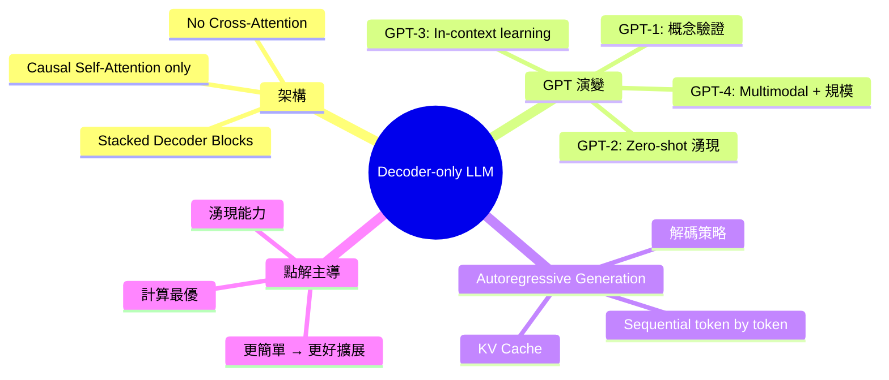
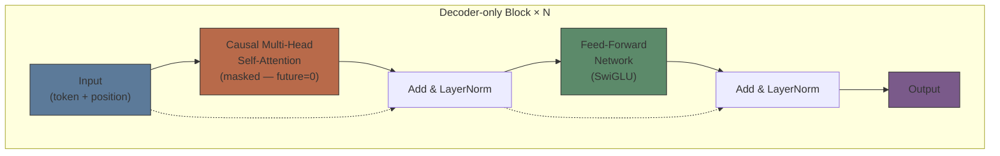
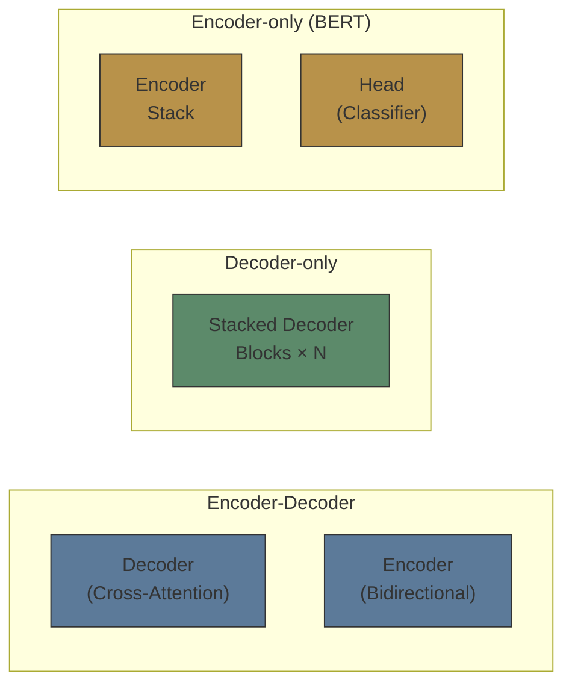
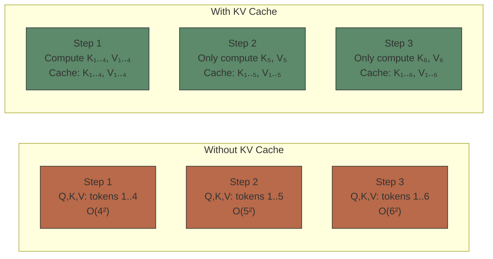

# Module 05: Decoder-only 架構

Est. study time: 2.0h
Language: yue
Description: GPT 家族 — Autoregressive Generation, KV Cache, 點解 decoder-only 係 LLM 主流

## 知識圖譜



---

## 學習目標
- 圖解 decoder-only 架構 — 同 encoder-decoder 有乜分別
- 解釋有冇 KV cache 嘅 autoregressive generation
- 追溯 GPT 演變：GPT-1 到 GPT-4 改咗啲乜
- 分析點解 decoder-only 贏過 encoder-decoder 成為 LLM 主流

---

## 真實例子

你問 ChatGPT 問題。你打字嘅時候佢已經開始 response — 逐隻字出嚟。點解佢唔係一次過俾晒成句？點解有時 response 一開始怪怪地但後面愈 write 愈順？

呢個「逐 token 生成」嘅 process — autoregressive generation — 係 decoder-only LLM 嘅 core inference pattern。每個 token 嘅生成依賴前面生成嘅所有 tokens。

> **Think**: Generation 同 understanding 嘅計算流程有乜 fundamental 分別？
>
> *Answer: Understanding (encoder) — 一次過睇晒成個 input → 單一 forward pass。Generation (decoder) — 逐 token 生成，每步 forward pass，output 作為下一步 input。Generation 係 sequential process，understanding 係 parallel。*

---

## Core Content

### Section 1: Decoder-only Block

Decoder-only block = Causal Self-Attention → Add & Norm → FFN → Add & Norm

同 encoder block 嘅唯一分別：**self-attention 係 causal (masked)**。
同 encoder-decoder decoder block 嘅分別：**冇 cross-attention**。



> **Think**: 冇 cross-attention，model 點樣「理解」user input？User input 同 generation 係同一 sequence 嗎？
>
> *Answer: User input prompt 同 generated tokens 係同一個 sequence。Prompt tokens 先，generate tokens 後。Causal attention cover 晒成個 sequence — prompt 嘅 context 自然俾 generation 用。Decoder-only = all-in-one sequence modeling。*

> **Cloze**: "Decoder-only block = {Causal Self-Attention} → Add&Norm → {FFN} → Add&Norm。冇{Cross-Attention}。"
>
> *Answer: Causal Self-Attention, FFN, Cross-Attention*

### Section 2: 點解 Decoder-only 贏咗

2017-2019 年主流係 encoder-decoder (translation) 同 encoder-only (BERT)。
2020 年後 decoder-only (GPT) 逐漸主導。

**關鍵原因：**

1. **Scaling efficiency:** Decoder-only 每層只有 1 個 attention + 1 個 FFN，encoder-decoder 有 2 個 attention。同樣參數預算，decoder-only 可以疊更多層或更大 hidden dim。
2. **Unified architecture:** 所有 tasks (QA, generation, classification, translation) 都可以用同一 architecture + same training objective (next token prediction)。
3. **Emergent abilities:** Scaling 到某個 threshold 後，in-context learning 同 reasoning 出現。Encoder-decoder 嘅 inductive bias 可能限制 emergence。
4. **In-context learning:** 唔使 fine-tune，俾 prompt + examples 就得。Decoder-only 嘅 causal attention 天然 support 呢個 pattern。



| 架構 | 訓練 | 生成 | 擴展 |
|-------------|----------|------------|---------|
| Encoder-decoder | Bidirectional enc + causal dec | Seq2seq | Most params per layer |
| Encoder-only (BERT) | Bidirectional + mask | No gen | Efficient understanding |
| Decoder-only (GPT) | Causal LM | Autoregressive | Best compute efficiency |

> **Predict**: Encoder-only 做 generation 可以嗎？點解？
>
> *Answer: 不可以。Encoder-only 嘅 training 冇 learn 到 causal generation — bidirectional attention 可以睇「未來」token。Inference 時冇未來 token → 無法逐 token 生成。Encoder-only 啱 classification/understanding tasks。*

### Section 3: GPT 演變

**GPT-1 (2018):** 12 layers, 117M params. 證明了 decoder-only + pre-training + fine-tuning 嘅 effectiveness。

**GPT-2 (2019):** 48 layers, 1.5B params. 發現 zero-shot transfer — 唔 fine-tune 都可以做 multi-task。關鍵 insight: scale 改善 generalisation。

**GPT-3 (2020):** 96 layers, 175B params. In-context learning — 俾幾個 examples 喺 prompt 就 work，唔使 update weights。Few-shot prompting 嘅時代開始。

**GPT-4 (2023):** 估計 ~1.8T params (MoE)。Multimodal (vision + language)。RLHF alignment。Reasoning 能力大幅提升。

> **Think**: GPT-1 → GPT-4 嘅進步，邊部分來自 architecture change，邊部分來自 scale？
>
> *Answer: Architecture change 相對細 — GPT-4 still decoder-only + self-attention + FFN。主要進步來自：1) Scale (117M → 1.8T params) 2) Data quality & diversity 3) Training techniques (RLHF) 4) MoE 架構 (稀疏化) 5) Multimodal 訓練。Architecture stability 證明 decoder-only 係 robust foundation。*

### Section 4: Autoregressive Generation

**Inference process:**

```text
Input: "What is LLM?"
→ Tokenize: [what, is, llm, ?]
→ Step 1: Forward([what, is, llm, ?]) → P(token|context) → sample "A"
→ Step 2: Forward([what, is, llm, ?, A]) → P(token|context) → sample "large"
→ Step 3: Forward([..., A, large]) → sample "language"
...
直到生成 [EOS] token
```

**KV Cache — 關鍵 optimisation：**

冇 cache：每 forward pass 重新計所有 tokens 嘅 K, V → O(n²·d) per step
有 cache：cache 已計算嘅 K, V → 每步只需計新 token 嘅 K, V → O(n·d) per step



KV cache memory cost: 2 × n_layers × d_model × n_tokens × bytes_per_param

Example: n_layers=80, d_model=8192, n_tokens=4096, fp16 → 2×80×8192×4096×2 = ~10GB per request

> **Cloze**: "KV cache cache 已計算嘅 {K, V} matrices。每 step 只需計 {new token} 嘅 K, V。Complexity 由 O(n²) 降到 {O(n)} per step。"
>
> *Answer: K, V, new token, O(n)*

### Section 5: 解碼策略

**Temperature:** Controls randomness
- T=0: argmax (deterministic, greedy)
- T=1: standard softmax sampling
- T>1: more uniform (random)

**Top-k sampling:** 只 sample 前 k 個最高概率嘅 tokens
**Top-p (nucleus) sampling:** 只 sample probability cumulative sum 達到 p 嘅 tokens

**Practical insight:** Greedy decoding (T=0) = high coherence but repetitive.
Top-p + T>0 = diverse but may hallucinate.

> **Think**: 同一 prompt 同 temperature=0，output 永遠一樣？呢個 guarantee 係真嘅嗎？
>
> *Answer: 理論上 temperature=0 → argmax → deterministic。實際上 GPU 嘅 floating point 運算有 nondeterminism (比如 CUDA convolution algorithms)。Framework 通常有 torch.use_deterministic_algorithms() 但影響 performance。Strict determinism ≠ guaranteed。*

---

## 重點回顧
- Decoder-only = stacked causal self-attention + FFN blocks，冇 cross-attention
- 點解贏：更簡單 → 更好擴展效率；統一 task 格式；湧現能力隨規模出現
- GPT 演變：GPT-1 (117M, fine-tune) → GPT-3 (175B, in-context) → GPT-4 (~1.8T MoE, multimodal)
- KV cache：用記憶體換速度，每步 complexity 由 O(n²) 降到 O(n)
- 解碼：temperature, top-k, top-p 控制創造力同確定性

---

## 常見誤解

**「GPT-4 係一個 gigantic decoder-only transformer。」**

GPT-4 係 MoE (Mixture of Experts) — 唔係 standard decoder-only。每層 FFN 變成 router + experts。呢個分別好大：MoE 用稀疏 activation，所以 total params (~1.8T) >> compute per token (~200B active). 我哋 module 15-21 會深入 MoE。

---

## 搵錯處

「Decoder-only 冇 encoder，所以 input 同 output 嘅 representation 係同一個 space。」

呢句本身係啱嘅，但佢 implied 「所以唔適合 translation」係錯嘅。點解？

*Answer: Decoder-only 做 translation 用「prompt format」: Translate to Chinese: {English text} →. Model 用 causal attention 睇 prompt + input + partially generated output。Cross-attention 唔必要 — 成個 sequence 喺同一空間。Google 嘅 PaLM 證明了 decoder-only 做 translation 都得。*

---

## Feynman 解釋
「幻想你逐個字寫故事。每寫一個新字，你就睇返之前寫過嘅所有嘢，決定下個字寫乜。你唔可以偷睇未來 — 咁係作弊。呢個就係 decoder。再幻想另一個人讀晒成個故事，理解佢 — 呢個就係 encoder。好耐以來，人人都覺得你需要兩樣嘢：一個 reader (encoder) 去理解問題，同一個 writer (decoder) 去回答。但 GPT 話俾我哋知，淨係 writer 一個，如果喺夠多故事上面訓練過，就可以同時理解問題同寫答案，只要佢好擅長估下個字係乜。」

---

## 重新理解
Decoder-only 嘅成功有啲反直覺：放棄咗 bidirectional understanding (encoder)，純靠 causal LM 嘅 scaling 就做到所有嘢。呢個結果話俾我哋知：next token prediction 係一個比想像中更 powerful 嘅 objective — 夠大嘅 model + 夠多嘅 data = 湧現 understanding 同 reasoning。

---

## 練習
Run: `learn.sh quiz llm-moe-cot 05-decoder-only-architecture`

> **Spot the Mistake**: Code review note: someone applies decoder everywhere "to be safe" in a decoder-only 架構 codebase. Spot the mistake.
>
> *Answer: Blanket application hides which spots actually need decoder. Apply it where the semantics demand it, and document why.*

