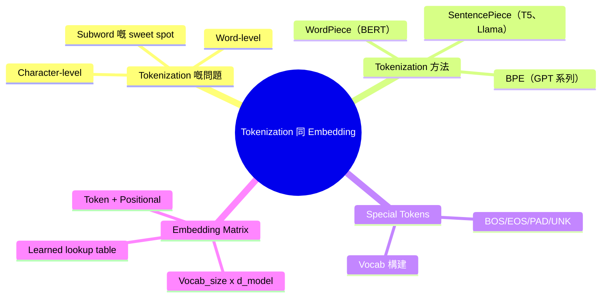
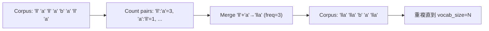
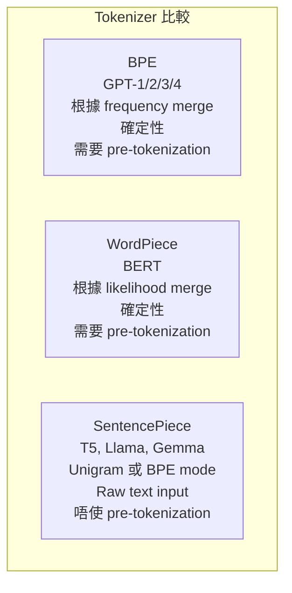
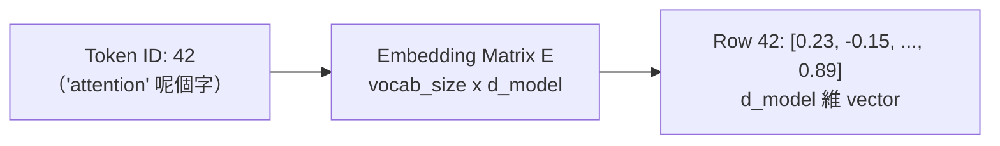

# Module 06: Tokenization 同 Embedding

Est. study time: 1.5h
Language: yue
Description: 原始文字點樣變成 LLM 理解得到嘅數值 token — subword tokenization 演算法（BPE、WordPiece、SentencePiece）同埋將 token 映射到 dense vector 嘅 embedding matrix。

## 知識圖譜

---

## 學習目標
- 解釋點解 subword tokenization 好過 character-level 同 word-level — CILO #1
- 描述 BPE、WordPiece、SentencePiece 演算法同佢哋嘅取捨 — CILO #1
- 理解 special token 嘅角色同 vocab 構建過程 — CILO #1
- 理解 embedding matrix 作為 learned lookup table，連接離散 token ID 同連續空間 — CILO #1

---

## 真實例子

LLM 處理「antidisestablishment」嗰陣未見過呢個字。點解？拆成已知部分：「anti」+「dis」+「establish」+「ment」。Model 唔會見到 raw char 亦唔會見到完整單字 — *subword token*。

> **唸下**：Tokenizer 遇到從來未見過嘅字符（例如新 emoji）會點？
>
> *答案：Unicode byte fallback。SentencePiece 將未知字符拆成 UTF-8 bytes（每個 byte 都在 vocab 入面）。Model 可以處理 ANY 字串。*

---

## 核心內容

### Section 1: Tokenization 嘅問題

Tokenization 將原始文字轉換成 model 處理嘅 integer ID。有三個粒度層次：

| 層次 | 好處 | 壞處 |
|-------|------|------|
| Character | 細 vocab (~200) | 長 sequence，冇 morphology |
| Word | 自然單位 | OOV，超級大 vocab (500k+)，embedding matrix 好腫 |
| Subword | 固定 vocab (16k-128k)，OOV 接近零 | Token 比 word 多 |

呢個就係現代 LLM 用緊嘅方法。

> **唸下**：對於 morphology 豐富嘅語言，好似土耳其文或者芬蘭文咁，你估每個字嘅 token sequence 會比英文長定短？
>
> *答案：每個字會長好多。土耳其文「geliyorum」（我緊係嚟緊）可能會拆成「gel」+「iyor」+「um」— 1 個字用 3 個 token。Morphology 塞晒喺 suffix 入面。*

> **Cloze**：「Tokenization 將原始文字映射成 {integer ID}。Character 同 word level 之間嘅 sweet spot 就係 {subword} tokenization。」
>
> *答案：integer IDs, subword*

### Section 2: BPE（Byte Pair Encoding）

BPE（GPT-1/2/3/4）。演算法：

1. 用 character/byte vocab 開始
2. 數 corpus 入面每對相鄰 pair 嘅 frequency
3. Merge 最常見嘅 pair → 新 token
4. 重複直到達到目標 vocab size（例如 50k）

例子：corpus `["low", "lower", "lowest"]`。最常見嘅 pair `l`+`o` → `lo`，然後 `lo`+`w` → `low`。最後常見嘅字變成單一 token。

**關鍵性質**：貪婪、確定性、基於 frequency。可能會產生唔係最好嘅 split（例如「unbelievable」→「un」+「b」+「el」+「ievable」，如果 `b`+`el` 好早就 merge 咗）。

> **唸下**：BPE 根據 frequency 嚟 merge。呢個做法對罕見字同常見字有乜 bias？
>
> *答案：常見字保留完整（常見嘅 pair 會早啲 merge）。罕見字或者串錯字會拆成更多部分。呢樣係好嘅 — 常見 token 有效率，罕見 token 靠組合處理。*

> **Predict**：如果 model 喺訓練時從未見過「ChatGPT」做一個完整字，BPE tokenization 會點處理？
>
> *答案：佢會拆開：可能係「Chat」+「G」+「PT」或者「Chat」+「GPT」（如果「GPT」曾經被視為一個 token）。點樣拆取決於訓練期間 merge 咗邊啲相鄰 pair。*

### Section 3: WordPiece 同 SentencePiece

**WordPiece**（BERT）：根據 **likelihood increase** 嚟 merge，唔係 frequency。Score = P(merged) / P(first)×P(second)。Merge score 最高嘅 pair — 會產生語言上更乾淨嘅 split。

**SentencePiece**（T5、Llama、Gemma）：Raw Unicode → subword，唔使 pre-tokenization。有兩種 mode：

1. **BPE mode**：喺 raw Unicode 上做相同演算法，冇 word pre-splitting
2. **Unigram mode**：概率性。EM algorithm：由所有可能嘅 subword 開始，逐步移除一啲 token — 移除佢哋對 corpus likelihood 影響最細 — 直到達到 target vocab

> **Cloze**：「SentencePiece 唔需要 pre-tokenization（按空格分割），所以係 {language agnostic}。相反，BERT 嘅 WordPiece 假設 {whitespace-separated words}。」
>
> *答案：language agnostic, whitespace-separated words*

> **搵錯處**：「SentencePiece 只不過係 BPE 嘅 open-source 實現，改咗個名咋。」
>
> 錯喺邊？
>
> *答案：誤導。SentencePiece 係一個 framework，支援 BPE mode 同 Unigram mode（自己嘅演算法）。關鍵分別：SentencePiece 直接處理 raw Unicode，唔使 whitespace pre-tokenization。BPE（原本）假設 whitespace-split 嘅字。SentencePiece 嘅 Unigram mode 係概率性，唔係確定性好似 BPE 咁。*

### Section 4: Vocab 構建同 Special Tokens

Tokenizer vocab 構建過程：

1. 收集大型 corpus（同訓練數據一樣）
2. 選擇演算法（BPE/WordPiece/SentencePiece）
3. 設定目標 vocab size（32k-128k）
4. 執行演算法 → token→ID 映射 + merge 規則
5. 加入 special tokens

| Token | 用途 |
|-------|---------|
| `[PAD]` | Pad sequences（ID=0） |
| `[UNK]` | 未知（BPE/SentencePiece 唔需要） |
| `[BOS]/[EOS]` | 開始/結束 sequence |
| `[SEP]/[CLS]` | BERT：分割 segment、aggregate representation |
| `[MASK]` | BERT pre-training |

現代 LLM 用最小集：`<s>`、`</s>`、`[PAD]`。

> **唸下**：Llama 3 用 SentencePiece 打造咗 128k token vocab。點解咁大？同 GPT-3（50k BPE）比較下。
>
> *答案：更大 vocab → 每個 token 更多資訊 → sequence 更短 → 每個 sequence 計算量更低。取捨：embedding matrix 更大。大咗 2.56 倍（128k/50k）。Llama 透過用相對參數量更細嘅 d_model 嚟平衡呢點。*

> **Cloze**：「喺 BERT tokenizer 入面，`[CLS]` token 嘅最終 hidden state 用做 {classification 嘅 aggregate sequence representation}。`[SEP]` token 標記 {兩個句子之間嘅邊界}。」
>
> *答案：aggregate sequence representation, boundary between two sentences*

### Section 5: Embedding Matrix

Tokenization 產生 integer ID。ID 點樣變成 transformer 處理得到嘅 vector？

**Embedding matrix** `E` 嘅 shape 係 `[vocab_size, d_model]`。每一行係嗰個 token 嘅 dense vector。操作：`x = E[token_id]` — 就係一個簡單嘅 lookup。

E 係喺 pre-training 期間從頭學返嚟嘅。最初係隨機，backprop 嘅 gradient 會調整每個 token 嘅 embedding 嚟捕捉語義同句法特性。

**比喻**：Distributional semantics — embedding 會將相似 token 喺 vector space 入面聚埋一齊。唔需要外部 pre-training（word2vec/GloVe）。Transformer 由頭到尾自己學。

**Positional embeddings**：Token embedding 係位置不變嘅 — 「dog bites man」同「man bites dog」需要位置信號。方法：

- Sinusoidal（固定頻率）或者 learned position embeddings
- RoPE：按位置旋轉 Q/K — 唔需要額外 matrix
- ALiBi：從 attention score 減去基於距離嘅 bias

> **唸下**：Embedding matrix `[50k × d_model=4096]`。有幾多 parameters？同模型總數比較。
>
> *答案：204.8M。喺 GPT-3 175B 入面，約佔 0.1%。喺 125M 模型入面，約佔 40%。Embedding 喺細模型入面主導晒。*

> **Predict**：如果訓練完成之後加一個新 token 落 vocab 度，embedding layer 會點？
>
> *答案：新 token 嘅 embedding row 係未初始化（或者要設定做某個合理嘅初值）。呢行冇 training signal。要 fine-tune 先學到。呢個就係點解喺 fine-tune 特定 token 期間 freeze 咗 embedding layer 會 lost 資訊。*

> **搵錯處**：「LLM 嘅 word embedding 係用 word2vec 或者 GloVe pre-train 出嚟，然後載入 embedding matrix。」
>
> 錯喺邊？
>
> *答案：錯。現代 LLM 喺 pre-training 期間由頭到尾自己學 embedding。唔需要外部 embedding pre-training。Embedding matrix 只係另一層，同所有其他參數一樣由 gradient descent 更新。Word2vec/GloVe 年代隨 transformer 架構而終結。*

---

## 點解重要

Tokenization 係每個 LLM input 經過嘅第一步。唔好嘅 tokenization 會導致：
- **有 bias 嘅字分割**（例如「Sumeria」vs「Sum」+「eria」→ model 學唔到 Sumeria 做一個概念）
- **唔一致嘅 encoding**（同一個字串根據 context 有唔同 tokenization）
- **語言唔公平**（英文大約 1 token/字，韓文每個音節 block 約 2-3 tokens → 英文每個意思更平）
- **安全漏洞**（token smuggling：對抗性字串透過唔尋常 tokenization 繞過內容過濾器）

Embedding 質量決定 model 對每個 token 學到啲乜。正確理解 embedding matrix 可以解釋 weight tying（綁定 input/output embeddings 可以慳參數）、vocab size 嘅取捨、同埋點解 fine-tune embedding layer 可能有風險。

---

## 重點回顧
- Subword tokenization 係原始文字同 model ID 之間嘅橋樑 — 每個現代 LLM 都用佢
- BPE merge 最常見嘅 character pair；WordPiece 根據 likelihood increase 嚟 merge；SentencePiece 直接處理 raw Unicode
- Tokenizer 喺 model 訓練之前訓練一次，用訓練 corpus
- Embedding matrix `E[vocab_size, d_model]` 將離散 token ID 映射到連續 vector — 由頭到尾自己學
- 位置資訊一定要加落 token embedding 度 — 模型用 sinusoidal、learned、RoPE 或者 ALiBi
- 揀咩 tokenizer 會影響模型行為、跨語言公平性同安全性

---

## 常見誤解

**「Tokenization 只係 preprocessing 嘅細節 — 唔會影響模型質量。」**

錯。Tokenization 改變咗模型當做原子單位嘅嘢。BPE 嘅 bias：「german」同「Germany」冇共同 BPE 部分（「ger」+「man」vs「Ger」+「many」— 大小寫敏感）。即係模型要從 context 學相似性，而唔係靠 token 重叠。SentencePiece 傾向產生語言上更連貫嘅單位。揀咩 tokenizer 直接塑造 embedding space 同 learned representation。

---

## 搵錯處

你自己實作 BPE。Corpus：`["aa", "ab", "aa"]`。你用 chars `a, b` 開始。目標 vocab size = 3。步驟：
1. 最常見嘅 pair：`aa`（喺 "aa" 同 "aa" 出現兩次 → count 2）。Merge `aa` → 新 token X。
2. Vocab 而家有：`a, b, X`。做完。

**錯喺邊？**

*答案：Off-by-one 或者 pair counting 問題。「aa」= 兩個 characters。BPE 係數所有位置嘅相鄰 pair。「aa」得一個 pair（位置 0-1 嘅 a+a），唔係兩個 pair。`aa` 嘅 count = 1（來自「aa」本身）+ 0 = 1。唔係 2。常見嘅實作錯誤：重叠 pair 計錯數。*

---

## Feynman 解釋
（用簡單說話同具體例子，教小朋友乜嘢係 tokenization 同 embedding。）

---

## 重新理解
（停一停。判斷 embedding matrix：每個 token 都儲一個完整 vector 係咪浪費？Tied embeddings 幾時有幫助、幾時有害？）

---

## Drill
Take the quiz. MCQs test different angles — recall, application, scenario.

Run: `learn.sh quiz llm-moe-cot 06-tokenization-embeddings`

> **Think**: How does **Section 1: Tokenization 嘅問題** relate to **Section 2: BPE（Byte Pair Encoding）** within tokenization 同 embedding?
>
> *Answer: They address adjacent failure modes: section 1: tokenization 嘅問題 governs the primary behavior, while section 2: bpe（byte pair encoding） constrains how far you can push it.*
> **Spot the Mistake**: A developer treats ["low", "lower", "lowest"] as optional because "it works without it." Where is the mistake?
>
> *Answer: It works only until the assumptions behind ["low", "lower", "lowest"] are violated. The fix: treat it as part of the contract of tokenization 同 embedding, not an optimization.*

