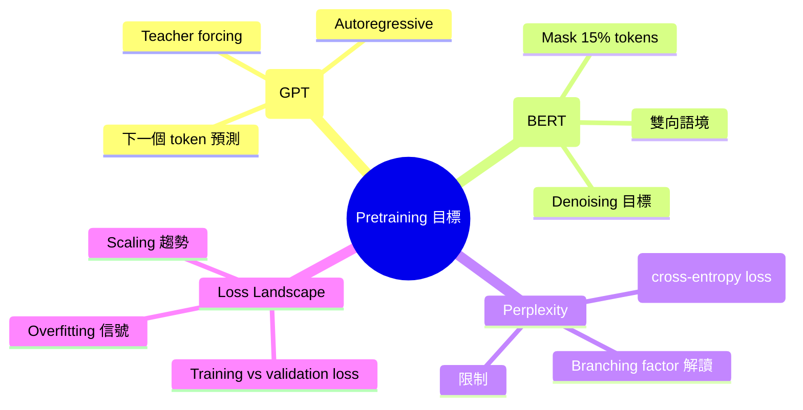
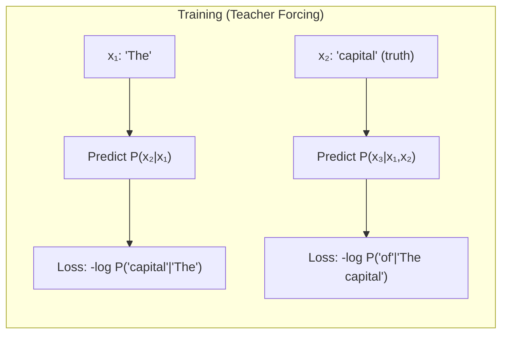
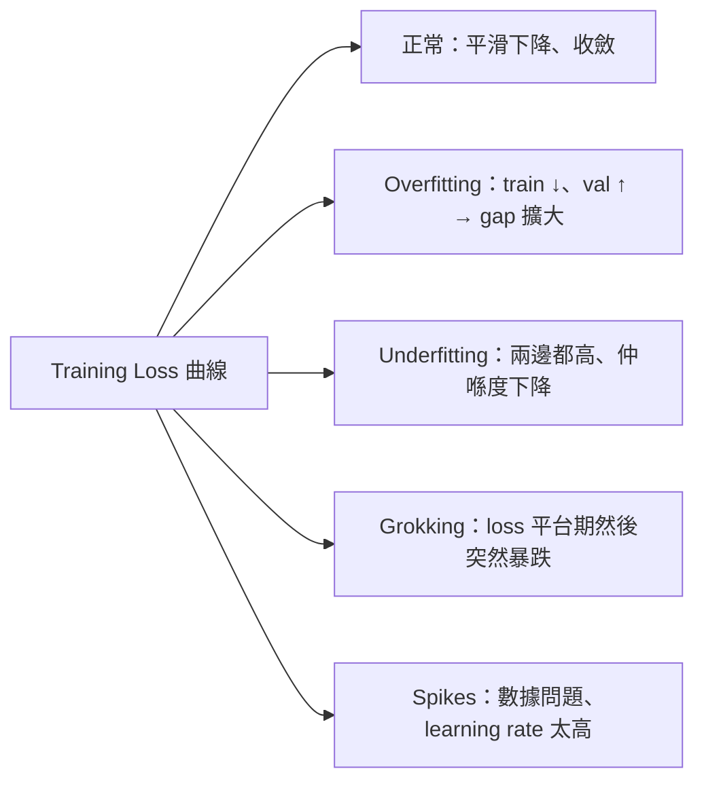

# Module 07: Pretraining 目標

Est. study time: 2.0h
Language: yue
Description: LLM 點樣訓練 — causal LM vs masked LM 目標、perplexity 做 evaluation metric、同埋 training 嗰陣 loss landscape 嘅變化。

## 知識圖譜




---

## 學習目標 (maps to course CILOs)
- 比較 causal LM (GPT 式) 同 masked LM (BERT 式) 目標 — CILO #1
- 從 cross-entropy loss 計 perplexity 同埋解讀佢嘅意思 — CILO #1
- 理解 teacher forcing 同 autoregressive generation 喺 training loop 入面 — CILO #1
- 辨認 loss landscape 模式：overfitting、underfitting、grokking — CILO #1

---

## 真實例子

你叫 GPT-4 接 "The capital of France is"，佢答 "Paris"。好似魔法咁。但 model 點樣學識答呢句？

Training 嗰陣，GPT-4 睇過幾十億條 snippets。每一條：「俾咗呢啲字，預測下一個字。」每個 prediction 同真實答案比對，計 cross-entropy loss。Model 從來冇「知道」France 嘅首都 — 佢只係變得極擅長 next-token prediction，而呢個能力 encode 咗事實知識。


> **諗一諗**：如果 GPT-4 只係 next-token predictor，點解佢識翻譯語言、寫 code、同 reasoning？
>
> *答案：Next-token prediction 迫 model 學習大量潛在知識先至預測得準。預測 "The capital of France is {Paris}" 下一個字需要地理知識。預測下一行 code 需要 programming 理解。呢個係 emergent — objective 簡單但能力複雜。*

---

## 核心內容

### Section 1: Causal LM — 下一個 Token 預測

Causal LM = 俾咗前面啲 tokens，預測下一個 token。GPT-family objective。

Token 序列 `x₁, ..., x_T`。每個位置 `t`，model 輸出 `P(x_t | x_<t)`。

**Loss**：所有位置 cross-entropy 總和：`L = -∑ log P(x_t | x_<t)`

**Teacher forcing**：Model 接收 ground-truth 前文做 input（唔係自己嘅 prediction）。好重要 — 冇咗佢，error 會累積。




> **諗一諗**：點解 teacher forcing 咁重要？如果用 model 自己嘅 prediction 做 input（好似 inference 嗰陣），會發生咩事？
>
> *答案：Teacher forcing 俾 ground-truth 前文，唔係 model 自己嘅 prediction。冇咗佢，早期 error 會 cascade — model 睇錯 tokens，學咗從錯誤 context 預測。Training 會 diverged。呢個叫 "exposure bias" — 可以用 scheduled sampling 或者 RL fine-tuning 減輕。*


> **填充**："Causal LM 預測 {下一個 token}，俾咗 {前面啲 tokens}。Loss 係 {cross-entropy} 加晒所有位置。Training 用 {teacher forcing} 提供 ground-truth 上文。"
>
> *答案：下一個 token、前面啲 tokens、cross-entropy、teacher forcing*

**Autoregressive generation**：Inference 嗰陣，model 每次 generate 一個 token。佢自己嘅 output 會 feed back 做下一個 step 嘅 input。呢個係點解 generation 咁慢 (O(n) sequential，冇得 parallelise)。

### Section 2: Masked LM — BERT 目標

MLM = mask 一部份 input tokens，用雙向語境 predict 佢哋。

**BERT 做法**：
1. 每條 sequence 揀 15% tokens
2. 當中：80% → `[MASK]`、10% → 隨機 token、10% 唔變
3. Model 用完整雙向語境 predict 原本 token

點解唔用 100% `[MASK]`？`[MASK]` 喺 fine-tuning 唔會出現。Noise 迫 model 學到 robust representations。

**Loss**：淨係計 masked 位置嘅 cross-entropy：`L = -∑_{t masked} log P(x_t | context)`


> **諗一諗**：點解 BERT 淨係 mask 15% tokens？呢個權衡平衡咗啲乜？
>
> *答案：15% 每 batch 俾到足夠 training signal，同時保留大部份 unmasked input 等 model 都學到 unmasked tokens 嘅有用 representations。Mask 太多 → unmasked tokens 太少 context 唔夠，雙向理解變差。Mask 太少 → 每次 forward pass training signal 唔夠。*

> **填充**："BERT training 入面，15% tokens 被揀選做 masking。當中 {80%} 變 [MASK]、{10%} 變隨機 tokens、{10%} 維持不變。呢個 noise strategy 防止 pretraining 同 {fine-tuning} 之間出現 mismatch。"
>
> *答案：80%、10%、10%、fine-tuning*

### Section 3: CLM vs MLM — 比較

| 維度 | Causal LM (GPT) | Masked LM (BERT) |
|-----------|-----------------|------------------|
| 方向 | 由左至右 | 雙向 |
| Loss 位置 | 所有 token | 15% masked tokens |
| Training signal | 密集（每個位置） | 稀疏（每 6-7 個 token 一個） |
| Generation | 原生 (autoregressive) | 需要另外嘅 decoder |
| 每步運算 | O(n²) causal attention | O(n²) full attention |
| Scaling | 證明可以去到 100B+ parameters | 有限 (~340M BERT-large) |
| Fine-tuning | Few-shot / zero-shot in-context | Task-specific heads |

CLM 天生係 generative。MLM 更擅長 understanding。T5 span corruption 兩者之間搭橋。


> **諗一諗**：點解 CLM (decoder-only) 喺 scaling 競賽贏過 MLM (encoder-only)？
>
> *答案：(1) CLM loss signal 嚟自每個 token — 每下運算 gradient 更多。(2) Autoregressive generation 一個 model 做晒所有嘢 — 唔需要另外嘅 decoder。(3) In-context learning 從 causal objective 湧現。(4) MLM 得 15% mask 代表 85% tokens 每步冇 learning signal — 大規模 training 嚟講好浪費。*

### Section 4: Perplexity

**Perplexity (PPL)** = `exp(L)`，其中 `L` 係成條 sequence 嘅平均 cross-entropy loss。

```text
PPL = exp(-1/T ∑ log P(x_t | context))
```

**解讀**：Perplexity 係 branching factor — model 喺每一步平均喺幾個可能性之間猶豫。

- PPL = 10：Model 嘅 uncertainty 等於從 10 個可能性均等嘅 tokens 揀一個
- PPL = 1：完美預測 (loss = 0)
- PPL = vocab_size：亂撞

**例子**：如果 model 每個位置俾正確 token probability 0.5，vocab 係 50k：
- Loss = -log(0.5) ≈ 0.693
- PPL = exp(0.693) ≈ 2.0


> **諗一諗**：一個 model 喺 Wikipedia 文字做到 PPL=3。呢個算好嗎？喺 code (Python) 你會 expect 幾多？
>
> *答案：PPL=3 係好低 — model 好有把握。Code 通常 PPL 高過自然語言，因為 code 有更多任意 token 組合（variable names、特定 API calls）。自然語言喺 token 層面更加 predictable。Python PPL expect ~5-15 視乎 model。*

> **填充**："Perplexity = {exp(loss)}。佢量度 model 每 token 嘅 {uncertainty}。Perplexity 等於 {vocab_size} 代表亂撞。Perplexity 唔可以喺唔同 {tokenizers} 之間比較。"
>
> *答案：exp(loss)、uncertainty、vocab_size、tokenizers*

**限制**：
- PPL 唔可以跨唔同 tokenizers 比較（唔同 vocab → 唔同 PPL scale）
- PPL 會因為 tokenisation 粒度唔同而唔公平咁懲罰 model（更多 tokens → 人為降低 PPL）
- 低 PPL 唔保證高質素 generation（model 可以淨係預測穩陣嘅 continuation 但缺乏創意）
- PPL 依賴 corpus — 報 PPL 嗰陣一定要講埋係咩 corpus

### Section 5: Loss Landscape

Training loss curves 透露 model 健康狀況：




**關鍵特徵**：
- **正常收斂**：Loss 早期跌得快，之後慢落嚟，最後 plateaus。Train/val gap 細。
- **Overfitting**：Training loss 繼續跌但 validation loss 開始升。Gap > training loss 嘅 5-10% 通常代表 overfitting。解法：更多數據、regularization、dropout、weight decay。
- **Scaling 趨勢**：更大 model → predictably 更低 loss（scaling laws — Module 11）。Loss 隨住 compute/data/model size 跟 power law。
- **Loss spikes**：單一 batch 嘅壞數據或者 learning rate 太高會導致 sudden spike。如果 model 好快 recover，通常冇事。如果 spike 持久，training 會 destabilized。

> **預測**：你 train GPT-2-scale model。Training loss 由 4.5 跌到 3.2。Validation loss 由 4.5 跌到 3.4。Gap 係 0.2。呢個 gap 代表咩？
>
> *答案：細 gap (0.2) 係正常 — model generalise 得幾好。Training loss 低過 validation loss 係預期嘅（model 對見過嘅數據有優勢）。如果 gap 變大（例如 3.0 train vs 3.8 val），就好可能係 overfitting。*


> **搵錯處**："Perplexity 50 代表 model 預測下一個 token 嘅準確率係 50%。"
>
> 錯喺邊？
>
> *答案：理解錯咗。PPL=50 代表 model 喺每一步 uncertainty 等於要從 50 個 equally likely tokens 入面揀一個。唔係 accuracy。一個 model 可以有 PPL=50 但喺容易嘅位置好高 accuracy、難嘅位置亂撞。PPL 係 inverse probability 嘅 exponential average，唔係 accuracy。*

---

## 點解呢課咁重要

揀咩 pretraining objective 決定咗 model 學到啲咩同可以做啲咩：
- CLM (GPT 式) → 擅長 generation、in-context learning、scaling
- MLM (BERT 式) → 擅長 understanding、句子層面嘅 tasks
- Span corruption (T5) → 平衡、適合 translation 同 summarization

Perplexity 係 training monitoring 最常用嘅 metric。解錯 PPL 會導致對 model 質素嘅錯誤結論。識睇 loss landscape 可以幫你喺浪費 compute 之前診斷 training 問題。

---

## 重點回顧
- Causal LM 由左至右預測下一個 token，用 teacher forcing；loss 計晒所有位置
- Masked LM 雙向預測 15% 被 corrupt 嘅 tokens；loss 淨係計 masked 位置
- CLM scaling 更勁因為 training signal 密集同埋原生 generation 能力
- Perplexity = exp(loss)；量度 uncertainty；唔可以跨 tokenizers 比較
- Loss landscape 揭示 overfitting、underfitting、同 training 穩定性


---

## 常見誤解

**"Perplexity 量度 model '有幾困惑' — PPL 越高代表越 confus。"**

方向性上冇錯但忽略咗細位。PPL 唔係直接俾人睇嘅分數。同一 model 喺 corpus A PPL=20、corpus B PPL=30，如果兩個 corpora 唔同，根本唔話到俾你知邊個 model 「好啲」。PPL 亦都唔量度 generation 質素 — 一個 model 可以永遠預測最穩陣、最沉悶嘅 continuation 而得到低 PPL，但另一個更有創意嘅 model 分數反而差啲。

---

## 搵錯處

學生由零開始 train BERT。佢將 mask rate 校到 50%，expect 「每 batch 更多 training signal」。10k steps 之後，training loss 卡喺 ~8.0。

錯喺邊？

*答案：50% mask rate 太高。一半 input 被 mask 咗，unmasked 嘅 context 太短，雙向理解唔夠。Model 冇足夠 context 去推測 masked tokens。標準 15% 係 optimal — 夠高嚟有 signal density，夠低嚟有 context richness。*

---

## Feynman 解釋
(用細路仔都明嘅方法解釋 causal LM objective。簡單字眼。用句子例如 "The cat sat on the {___}" 示範。)

---

## 重新理解
(停一停。判斷 perplexity：佢係咪適合用嚟比較唔同 tokenizers 嘅 model？你會提議咩 alternatives？)

---

## 練習
做 quiz。MCQs 考你唔同角度 — recall、application、scenario。

Run: `learn.sh quiz llm-moe-cot 07-pretraining-objectives`

> **Predict**: Commit to an answer: does pretraining 目標 get simpler or harder once x₁, ..., x_t enters the picture?
>
> *Answer: Harder locally, simpler globally: individual pieces carry more rules, but the overall system needs fewer special cases.*
> **Think**: What would break first if you ignored **Section 1: Causal LM — 下一個 Token 預測** in a production pretraining 目標 setup?
>
> *Answer: Correctness holds at small scale, then behavior diverges as load or complexity grows — exactly what **Section 1: Causal LM — 下一個 Token 預測** guards against.*
> **Spot the Mistake**: Code review note: someone applies ，model 輸出 everywhere "to be safe" in a pretraining 目標 codebase. Spot the mistake.
>
> *Answer: Blanket application hides which spots actually need ，model 輸出. Apply it where the semantics demand it, and document why.*

