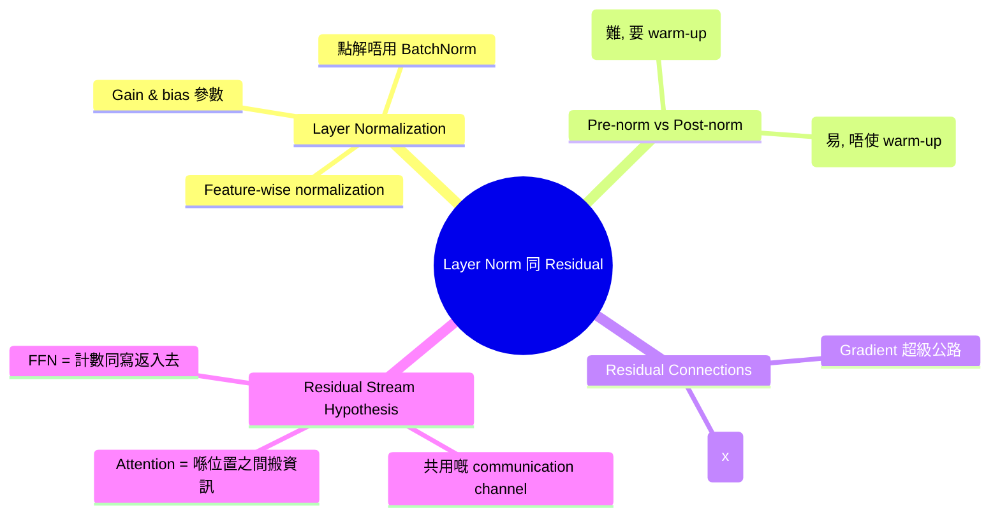
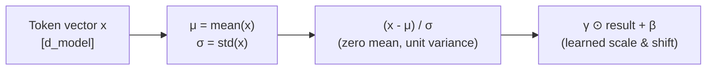
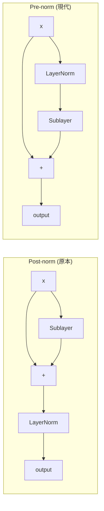
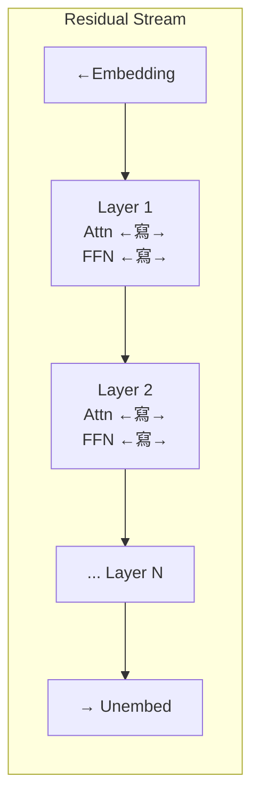

# Module 08: Layer Norm 同 Residual Connection

Est. study time: 1.5h
Language: yue
Description: LayerNorm 點樣令 deep transformer 可以穩定噉訓練、pre-norm 同 post-norm 嘅擺位、residual connection 做 gradient 高速公路、同 residual stream hypothesis。

## 知識圖譜



---

## 學習目標 (對應課程 CILOs)
- 解釋 Layer Normalization 同對比 Batch Normalization — CILO #1
- 比較 pre-norm 同 post-norm 嘅擺法同佢哋嘅訓練穩定性取捨 — CILO #1
- 理解 residual connection 點樣做 gradient 高速公路令 deep model 成立 — CILO #1
- 描述 residual stream hypothesis — CILO #1

---

## 真實例子

你由頭開始訓練一個 transformer。疊 12 層。冇任何技巧之下，training loss 開頭 ~11，過咗 1000 步都幾乎唔跌。加 LayerNorm — loss 喺第 500 步跌到 ~5。加 residual connection — loss 喺第 500 步去到 ~3。

就係呢兩個架構設計決定，令「個 model 唔識訓練」同「個 model 收斂得好快」完全唔同。

> **諗下**：點解一個 12 層 transformer 冇 normalization 會訓練唔到，但 3 層版本就冇問題？
>
> *答案：愈深嘅網絡會逐層放大 variance。冇 normalization，activation 會失控噉增長。早期層嘅 gradient 會消失或爆炸。Normalisation 可以令 activation scale 保持喺有限範圍。*

---

## 核心內容

### Section 1: Layer Normalization

LayerNorm 對每個 token 獨立噉沿 feature dimension 做 normalization：

```text
LayerNorm(x) = γ ⊙ (x - μ) / σ + β
```

其中 `μ = mean(x)`，`σ = std(x)`。`γ` (scale) 同 `β` (shift) 係 learned parameters。



**點解唔用 BatchNorm？** BatchNorm 沿 batch dimension 做 normalization — 依賴 batch statistics。有問題嘅情況：
- Variable sequence lengths（padding 問題）
- 細 batch size（統計數據好嘈）
- Autoregressive generation（用唔到未來 token）

LayerNorm 每個 token 自己做 normalization — 唔睇 batch。任何 sequence length 都用到。

> **諗下**：如果拎走 LayerNorm 嘅 γ 同 β，會發生咩事？個 model 仲識唔識學習？
>
> *答案：識，但冇咁靈活。γ 同 β 俾 model 學習每個 feature 嘅最佳 scale 同 shift。冇咗佢哋，output 永遠係 zero-mean unit-variance — model 要浪費 capacity 嚟還原 normalization 嘅效果。*

> **填充**："LayerNorm 沿 feature dimension 計 {μ} 同 {σ}。然後 normalize 到 {zero mean} 同 {unit variance}，再加 learned {γ} (scale) 同 {β} (shift)。"
>
> *答案：μ, σ, zero mean, unit variance, γ, β*

### Section 2: Pre-norm vs Post-norm

LayerNorm 放喺 sublayer 嘅邊一邊，決定咗兩種模式：

**Post-norm**（原本 Transformer）：`LayerNorm(x + Sublayer(x))`

```text
x → Sublayer → + → LayerNorm → output
```

**Pre-norm**（現代 GPT/Llama/PaLM）：`x + Sublayer(LayerNorm(x))`

```text
x → LayerNorm → Sublayer → + → output
```



**點解 pre-norm 贏咗**：

| 特性 | Post-norm | Pre-norm |
|----------|-----------|----------|
| 訓練穩定性 | 深嘅話唔穩定 → 要 warm-up 同小心 init | 由頭到尾都穩定 |
| Learning rate 敏感度 | 高（LR 窗口好窄） | 低（穩陣） |
| 最終 loss | 有機會更低（如果 tune 得靚） | 稍高但穩定 |
| 要唔要 warm-up | 要（LR ramp 大概 ~10k 步） | 可選 |
| 深層堆疊（100+ 層） | 好難 | 得 |

直覺：Pre-nnorm 防止 sublayer 之前 output 爆炸。Sublayer 永遠收到 normalized input。Post-norm 嘅 sublayer output 加落 residual 先 normalization —— 可以造成大 spike。

> **諗下**：一個 pre-norm model 唔用 warm-up 訓練，loss 低過 post-norm 用 warm-up。點解某啲情況下 post-norm 仍然可能係更好嘅選擇？
>
> *答案：當 hyperparameters 完美 tune 好嘅時候，post-norm 可以達到稍微低啲嘅收斂 loss。有啲研究（例如 DeepNet）顯示 post-norm 配合特定 init 可以 outperform pre-norm。但 pre-norm 係實用上嘅預設，因為簡單。*

> **預測**：你將一個 GPT-2 訓練由 pre-norm 轉做 post-norm。所有其他 hyperparameter 不變。會發生咩事？
>
> *答案：好大機會 divergence 或者收斂得好慢。Post-norm 需要唔同嘅 LR schedule、weight init 同 warm-up。用 pre-norm 嘅設定，post-norm 嘅 activation 會爆開。*

### Section 3: Residual Connections

`output = x + Sublayer(x)` 其中 `x` 係 input，`Sublayer` 係 attention 或者 FFN。

**點解 residuals 對 deep learning 咁重要：**
- Gradient 流動：`∂Loss/∂x = ∂Loss/∂output × (1 + ∂Sublayer/∂x)`。呢個 `1` 項令 gradient 可以直接繞過 sublayer。
- 令深度變可能：冇 residuals，8+ 層網絡嘅 performance 會 plateau。有 residuals，1000+ 層（ResNet）都得。

**喺 transformer 嘅 context 嚟講：**
- 每層有兩個 residuals：一個圍住 attention，一個圍住 FFN
- Residual path 保存資訊，同時 sublayers 加入處理
- Gradient 沿 residual path 流過，唔會變弱

> **填充**："Residual connection: output = x + {Sublayer(x)}。Gradient bypass: gradient = gradient_from_output × (1 + {∂Sublayer/∂x})。個 {1} 項令 gradient 可以 skip 成個 sublayer。"
>
> *答案：Sublayer(x), ∂Sublayer/∂x, 1*

### Section 4: Residual Stream Hypothesis

Residual stream hypothesis（Elhage et al., 2021）將 residual connections 視為一條 **共用嘅 communication channel**，貫穿所有 layers：



**主要想法：**
1. **Attention 從 stream 讀取**，喺 positions 之間搬資訊，**寫返入去**（additive）
2. **FFN 從 stream 讀取**，做 transformation，**寫返入去**（additive）
3. 每個 token 嘅 residual stream 就係佢嘅 **當前 representation**，累積咗之前所有 layers 嘅貢獻
4. 早期 layers 處理低層次 pattern；後期 layers 喺上面繼續起

**證據**：喺 GPT-2 入面 ablate 後期 layers 對 output 嘅影響細過 ablate 早期 layers —— 早期 layers 對 residual stream 嘅貢獻係基礎性嘅。

> **諗下**：如果 residual stream 係 additive 嘅，隨住深度增加，token representations 嘅 magnitude 會點變？
>
> *答案：Magnitude 會隨深度增長（單調上升），因為每層都加但唔會減。LayerNorm 喺每個 attention/FFN input 之前會 re-normalise（pre-norm），但 raw residual stream 係會增長。呢個就係 pre-norm 咁重要嘅原因 — 佢喺讀取之前 normalize 咗先。*

> **搵錯處**："Residual connections 喺 transformers 入面係多餘嘅，因為 attention 已經可以處理 long-range dependencies。"
>
> 錯喺邊？
>
> *答案：混淆咗資訊流動機制同 optimisation。Attention 處理 token 之間嘅關係。Residuals 處理 gradient 傳播。就算 attention 完美，deep transformers 冇 residuals 都訓練唔到，因為 vanishing gradients。*

### Section 5: Gradient Flow in Practice

Gradient 喺 residual network 入面嘅流動：

```text
Layer 6: x₆ = x₅ + FFN(LN(x₅))
```

對 x₅ 嘅 gradient：

```text
∂L/∂x₅ = ∂L/∂x₆ × (1 + ∂FFN(LN(x₅))/∂x₅)
```

即係由 layer 6 到 layer 1 嘅 gradient 係：

```text
∂L/∂x₁ = ∂L/∂x_L × ∏(1 + ∂Sublayer_k/∂x_k)
```

`(1 + ∂Sublayer/∂x)` 嘅乘積唔會消失，因為每項都包括 `+1`。就算 `∂Sublayer/∂x → 0`（saturated sublayer），gradient 仍然可以經 `1` 流過去。

> **諗下**：如果所有 sublayers 同時產生 gradient ∂Sublayer/∂x = -1，會點？Gradient flow 會變成點？
>
> *答案：`1 + (-1) = 0`。Gradient 喺嗰層完全消失。但呢個情況實際上幾乎冇可能發生 — 唔同 sublayers 學唔同 functions，gradient contributions 係唔相關嘅。*

---

## 點解呢個咁重要

LayerNorm 同 residual connections 就係令 deep transformer 可以訓練到嘅兩個架構選擇。冇咗：
- Post-norm → 訓練唔穩定，hyperparameter 敏感
- 冇 residuals → vanishing gradients，深度局限喺 ~6-8 層

Residual stream hypothesis 解釋咗點樣理解 model 內部 — 每層嘅貢獻係共用 stream 上面嘅 additive delta。呢個框架係 mechanistic interpretability 嘅基礎。

---

## 重點回顧
- LayerNorm 對每個 token 逐個 feature 做 normalization（μ, σ），然後加 learned γ, β — 唔依賴 batch
- Pre-norm（LayerNorm 放 sublayer 之前）比 post-norm 穩定；現代標準做法
- Residual connection `x + Sublayer(x)` 經 `∂Loss/∂x × (1 + ∂Sublayer/∂x)` 創造 gradient 高速公路
- Residual stream hypothesis：共用 additive channel，attention 搬資訊，FFN 計數
- 冇 residuals，deep transformers 訓練唔到

---

## 常見誤解

**「LayerNorm 同 BatchNorm 可以互換 — 邊個快就用邊個。」**

錯。BatchNorm 沿 batch 方向做 normalization（batch × sequence × features → batch statistics）。呢個喺 transformers 會出問題因為：(1) variable sequence lengths，(2) autoregressive generation 用唔到未來 tokens，(3) 細 batch 會俾嘈嘅 statistics。LayerNorm 沿 features 逐個 token 做 normalization — 唔睇 batch。佢哋解決同一個問題（activation scaling）但機制完全唔同。

---

## 搵錯處

實作：`output = LayerNorm(x + Sublayer(x))` 用 48 層，LR=3e-4，冇 warm-up。訓練喺第 200 步 diverge 咗。

錯喺邊？

*答案：Post-norm 設定（LayerNorm 放 addition 之後）。Post-norm 需要 warm-up（LR ramp ~10k 步）同小心 init。48 層用 post-norm 加冇 warm-up 會造成 activation 爆炸。修正：加 warm-up、減 LR、或者轉做 pre-norm。*

---

## Feynman 解釋
（用細路仔聽得明嘅方式教 residual connections。用「捷徑」比喻。點解 deep networks 冇佢哋就學唔到嘢？）

---

## 重新理解
（停一停。判斷 residual stream hypothesis：係一個有用嘅抽象概念，定係過度解讀？有咩反證存在？）

---

## 練習
做測驗。MCQs 測試唔同角度 — 記憶、應用、情境。

執行：`learn.sh quiz llm-moe-cot 08-layer-norm-residual-connections`

> **Predict**: Commit to an answer: does layer norm 同 residual connection get simpler or harder once μ = mean(x) enters the picture?
>
> *Answer: Harder locally, simpler globally: individual pieces carry more rules, but the overall system needs fewer special cases.*
> **Think**: Could you implement layer norm 同 residual connection without **μ = mean(x)**? What would the cost be?
>
> *Answer: Yes, but you'd hand-roll what **μ = mean(x)** already handles — more code, more edge cases, fewer guarantees.*
> **Spot the Mistake**: Code review note: someone applies σ = std(x) everywhere "to be safe" in a layer norm 同 residual connection codebase. Spot the mistake.
>
> *Answer: Blanket application hides which spots actually need σ = std(x). Apply it where the semantics demand it, and document why.*

