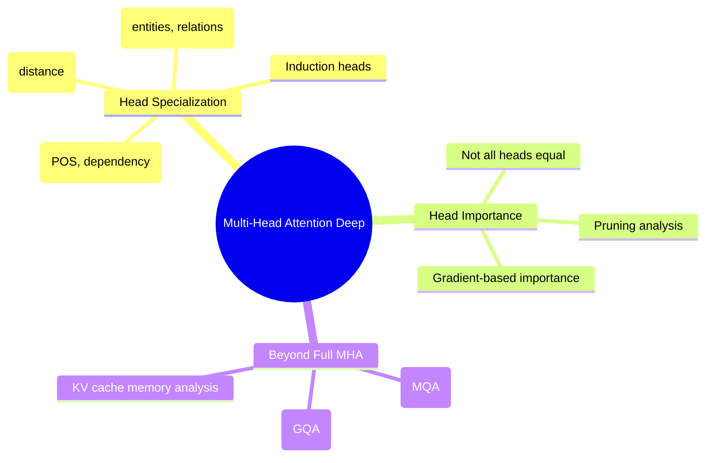
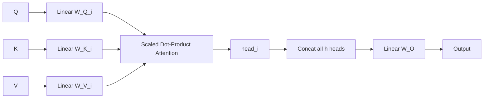
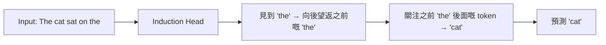
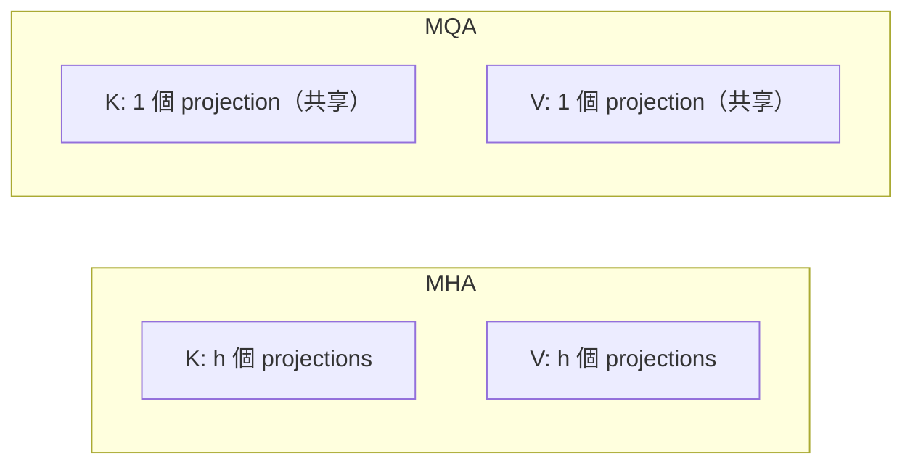
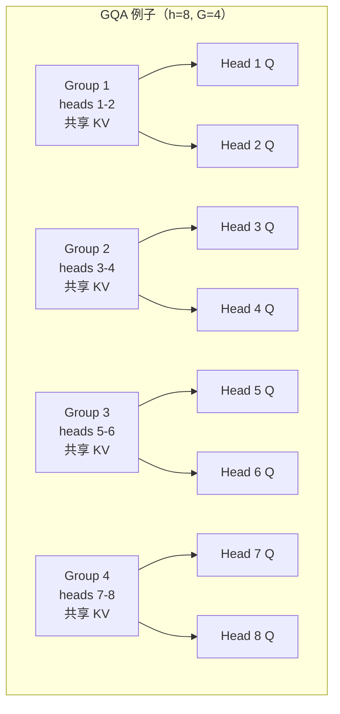

# Module 09: Multi-Head Attention 深入探討

Est. study time: 2.5h
Language: yue
Description: 超越基本 attention——heads 點樣專門化、邊啲 heads 最緊要、同埋 MQA/GQA 點樣慳推理記憶體同時保持質素。

## 知識圖譜



---

## 學習目標（對應課程 CILOs）
- 解釋 attention heads 點樣喺唔同語言功能上專門化——CILO #1
- 分析 head importance 同 pruning 唔重要 heads 嘅效果——CILO #1
- 比較 MHA、MQA、GQA 喺記憶體、質素同推理速度方面——CILO #1

---

## 真實例子

你 deploy 一個 70B 參數 LLM。Inference latency 係 500ms per token。80% 嘅時間用喺 memory bandwidth 去 load KV cache——儲起 K 同 V 俾每一個 head、每一層、每一個 token。

Llama 2 70B 用 Grouped-Query Attention：唔係 64 個 KV heads，而係得 8 個 KV head groups。咁樣將 KV cache 減咗 8 倍。Inference latency 跌到 150ms/token。質素損失：幾乎量度唔到。

理解 MHA vs MQA vs GQA 直接影響 deployment 成本。

> **Think**: 點解 KV cache 喺推理記憶體嘅佔比仲大過 model weights？
>
> *答案：Weights 係靜態嘅——load 一次就搞掂。KV cache 隨住 sequence length 增長（O(batch × seq × layers × heads × d_head × 2)）。長 context（32k tokens）× 大 batch = KV cache 超過 weight 記憶體。*

---

## 核心內容

### Section 1: Multi-Head Attention 重溫

每個 head 有自己嘅 Q、K、V projection matrices：

```text
head_i = Attention(Q W_Q_i, K W_K_i, V W_V_i)
output = Concat(head_1, ..., head_h) W_O
```



h=12（BERT-base），h=16（BERT-large），h=96（GPT-4）。每個 head 投影到低維 subspace：`d_k = d_model / h`。原因：h 個 split 容許模型同時關注唔同位置嘅唔同特徵。

> **Cloze**: 「喺 multi-head attention 裡面，每個 head 將 QKV 投影到 {lower-dimensional} subspaces，維度係 d_k = d_model / {h}。Outputs 會被 {concatenated} 然後通過 {W_O} 投影。」
>
> *答案：lower-dimensional, h, concatenated, W_O*

### Section 2: Head Specialization

唔同 heads 學到質素上唔同嘅 patterns。透過 mechanistic interpretability 觀察到：

**Syntactic**：關注文法角色——verb→subject、[SEP] detector、主謂一致。

**Positional**：根據距離唔係內容嚟關注——previous token head、broad pattern heads。

**Induction**（Olsson et al., 2022）：令 in-context learning 成為可能。模式：關注當前 token 之前出現過嘅位置。「[A][B]...[A]」→ 向後望 → 預測 [B]。出現喺 GPT-2 中後期 layers。



**Semantic heads**：關注相關實體。「Paris」→「France」。「Einstein」→「physics」。

> **Think**: 係咪所有 heads 都只得一個功能，定係一個 head 可以做好多個角色？
>
> *答案：兩樣都有。有啲 heads 有清楚嘅單一功能（例如 previous-token head）。其他係 polysemantic（一個 head 根據 context 做多個功能）。呢種 polysemanticity 係活躍研究領域。*

> **Cloze**: "{Induction heads} 令 in-context learning 成為可能，做法係匹配當前 token 同佢之前出現過嘅位置，然後關注嗰個位置嘅 {next token}。佢哋喺 {critical data size} 嗰陣喺訓練過程中出現。"
>
> *答案：Induction heads, next token, critical data size*

### Section 3: Head Importance

唔係所有 heads 對模型質素嘅貢獻都一樣。透過 pruning 分析：

**研究**（Michel et al., 2019）：30-40% 嘅 heads 可以剪走，PPL 損失好細。

**Head importance 指標**：
1. **Magnitude-based**：|W_O| 或者 attention variance。簡單但嘈雜。
2. **Gradient-based**：|gradient × parameter|——如果個 head 被移除嘅 loss 變化。最準確。
3. **Confidence-based**：跨 inputs 嘅 attention variance。Uniform attention → 冇咁重要。

**Pruning**：計分 → 移除最低分 → fine-tune → 重複。後面嘅 layers 更冗餘。

> **Predict**: 你從 GPT-2 剪走 50% heads。Perplexity 由 35 升到 42。你估計 fine-tune 1k 步之後會點？
>
> *答案：Perplexity 好大機會恢復到接近原本（可能 35-37）。Pruning 移除冗餘；fine-tuning 讓剩低嘅 heads 補償。但係剪得太勁（70%+）會造成永久損害。*

> **搵錯處**: 「所有 attention heads 一樣重要，因為每個處理唔同嘅 subspace。」
>
> 有乜嘢錯？
>
> *答案：實證上係錯嘅。Head redundancy 好高——多個 heads 學到相似 patterns。剪走 30% 最低重要性 heads 幾乎唔影響輸出。Subspaces 重疊。唔係所有 heads 都貢獻獨特價值。*

### Section 4: KV Cache——推理瓶頸

推理嗰陣，autoregressive generation 為每個新 token 計算 K 同 V，然後 cache 起佢哋俾未來步驟用。冇 cache：每一步都要重新計算所有之前 tokens 嘅 K,V → O(n³) 總計。

**KV cache** = batch × seq × layers × heads × d_head × 2（K+V）× precision

Llama 2 70B，batch=1，seq=4096，FP16：`1×4096×80×64×128×2×2 = 10.7GB`

Weights 初期佔大頭。到長 context 嗰陣，KV cache 會追上嚟。

> **Think**: 對一個 32k context window 加 batch=32 嚟講，Llama 70B 需要幾多 KV cache？
>
> *答案：32 × 32000 × 80 × 64 × 128 × 2 × 2 = 2.68 TB。單張 GPU 冇可能。呢個就係點解 MQA/GQA 同 context parallelism 對長 context 咁重要。*

### Section 5: Multi-Query Attention (MQA)

MQA：所有 heads 共享 K,V。每個 head 有自己嘅 Q。

```text
K_proj = K W_K (shared)
V_proj = V W_V (shared)
Q_proj_i = Q W_Q_i (per head)
```



**KV cache 減少**：`num_heads × d_head` → `1 × d_head` 每層。對 64 個 heads 嚟講，MQA 將 KV cache 減到 1/64。

**質素**：MQA 損失大約 0.5-1 PPL。K,V 需要嘅 head-specificity 比 Q 少。

**使用模型**：PaLM、Gemini、Falcon。

> **Think**: 點解 K 同 V 可以跨 heads 共享，而 Q 就需要每個 head 自己嘅？
>
> *答案：Q 決定要關注邊啲位置（query）。唔同 heads 專門化喺唔同 attention patterns——每個都需要自己嘅 Q。K 同 V 代表每個位置「我有啲乜嘢」——共享嘅表示就夠。*

### Section 6: Grouped-Query Attention (GQA)

GQA：MHA 同 MQA 之間嘅中間點。將 h 個 heads 分做 G 個 groups。每個 group 共享 K 同 V。

```text
G groups，每個有 h/G 個 heads
K_g, V_g 俾每個 group g
每個 group g 入面嘅 head 用 K_g, V_g
```



**KV cache 減少**：`h` → `G` 個 KV heads。比例 = G/h。

**配置**：
- G = h → Full MHA（冇減少）
- G = 1 → MQA（最大減少）
- G = 2, 4, 8 → 典型 GQA

**使用模型**：Llama 2（G=8）、Llama 3（8B 用 G=8，70B 用 G=4）。

**質素 vs MQA**：GQA 彌補差距。喺 G=8、h=64 嘅情況下，GQA 嘅 perplexity 同 MHA 好接近，同時將 KV cache 減到 1/8。

> **Cloze**: 「GQA 有 {G} 個 KV head groups。每組 {h/G} 個 query heads 共享一個 K,V projection。KV cache 減少比例 = {G/h}。MQA 係 G= {1} 嘅 GQA。MHA 係 G= {h} 嘅 GQA。」
>
> *答案：G, h/G, G/h, 1, h*

> **Predict**: 一個有 MHA 同 64 個 heads、4k context 嘅模型用咗 2GB KV cache。你轉為 GQA 用 8 個 groups 同 128k context。而家 KV cache 有幾大？
>
> *答案：128k/4k = 32x 更長 context，GQA = 8/64 = 每個 token 嘅 1/8 KV。總計：32 × (1/8) × 2GB = 8GB。之前 128k MHA 會係 64GB——GQA 令 128k 變得可行。*

### Section 7: 訓練 vs 推理

**訓練**：MHA 最快（更多 parallelism）。MQA/GQA 可以由頭訓練或者 upcycle。

**推理**：MQA/GQA 減少 KV cache memory bandwidth。短 context → MHA 冇問題。長 context + 大 batch → GQA 必不可少。

**Upcycling**：平均化 MHA checkpoint 入面嘅 K,V projections → 初始化 MQA/GQA。Fine-tune 5-10k 步。質素恢復 0.1-0.2 PPL。

> **Think**: 點解 upcycle 而唔係由頭用 GQA 訓練？可能會損失啲乜嘢？
>
> *答案：Upcycling 重用預訓練知識。由頭訓練需要 10 倍以上算力。不過，upcycled GQA 繼承咗 MHA 嘅 head redundancy——heads 未必學到獨立嘅最佳共享 KV patterns。由頭訓練理論上可以搵到更好嘅 KV 共享方式。*

---

## 點解呢個重要

**點解呢個重要**：head specialization 解釋咗 LLM 嘅 coherence。Head redundancy 顯示 transformer 容量高度可壓縮。MQA/GQA 係 serving 嘅實際選擇——每個 deploy 嘅 frontier model 都用佢哋。

---

## 重點回顧
- Attention heads 專門化喺 syntactic、positional、semantic 同 induction patterns
- 最多 30-40% 嘅 heads 可以剪走而損失好細——冗餘度好高
- KV cache 係長 context 嘅主要推理記憶體瓶頸
- MQA 跨所有 heads 共享 K,V → 1/h KV cache，輕微質素損失
- GQA 喺 groups 入面共享 K,V → 可調節取捨（G 由 1 到 h）
- Llama 2/3 用 GQA；PaLM/Falcon 用 MQA

---

## 常見誤解

**「Multi-Query Attention 相比完整 Multi-Head Attention 損失好多模型質素。」**

謬誤。喺大規模（10B+ 參數），MQA 損失 <0.5 PPL，實際上感覺唔到。GQA 用合理 groups（G=8, h=64）嘅 perplexity 同 MHA 喺噪音範圍內一致。KV cache 節省（8x-64x）遠遠超過極小嘅質素倒退。所有 frontier models 都用 MQA 或 GQA。

---

## 搵錯處

學生實作 MQA：共享 K,V，但亦共享 Q 跨 heads。訓練 loss 明顯高過 MHA baseline。

有乜嘢錯？

*答案：共享得太勁。Q 需要每個 head 自己嘅，因為每個 head 學唔同 attention patterns。MQA 只共享 K,V。共享 Q 會令所有 heads 坍縮成同一個 query pattern——將有效容量降低到 single-head attention。修正：保持 Q 每個 head 獨立，只共享 K,V。*

---

## Feynman 解釋
（將 head specialization 解釋俾細路聽。用「專家團隊」比喻：一個人睇動詞，另一個 check 位置，另一個搵名詞。）

---

## 重新理解
（停一停。judge 個 prune-then-finetune 做法：係實際壓縮技術，定係只係顯示原本訓練唔夠好？如果模型由頭就 train 少啲 heads 又會點？）

---

## 練習
做測驗。MCQs 考唔同角度——recall、應用、場景。

執行：`learn.sh quiz llm-moe-cot 09-multi-head-attention-deep`

> **Spot the Mistake**: A developer treats d_k = d_model / h as optional because "it works without it." Where is the mistake?
>
> *Answer: It works only until the assumptions behind d_k = d_model / h are violated. The fix: treat it as part of the contract of multi-head attention 深入探討, not an optimization.*

