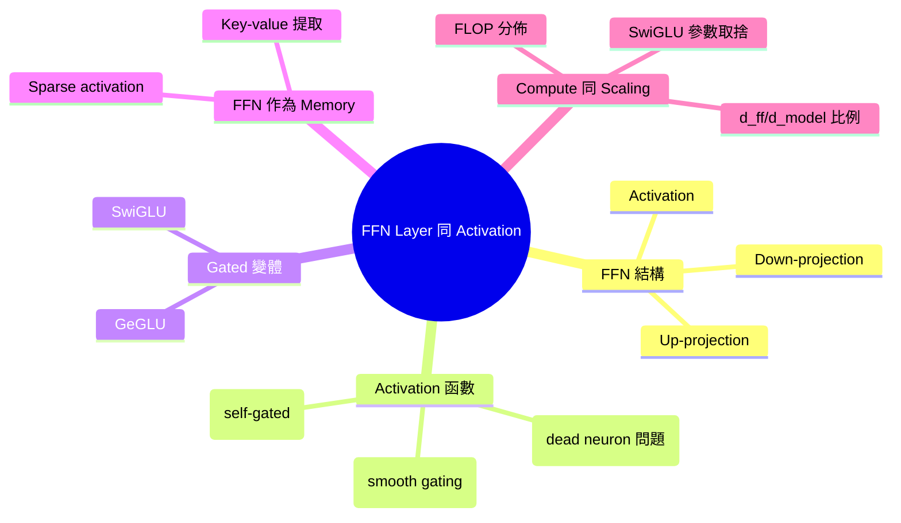
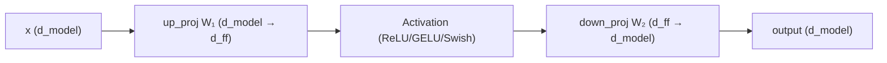
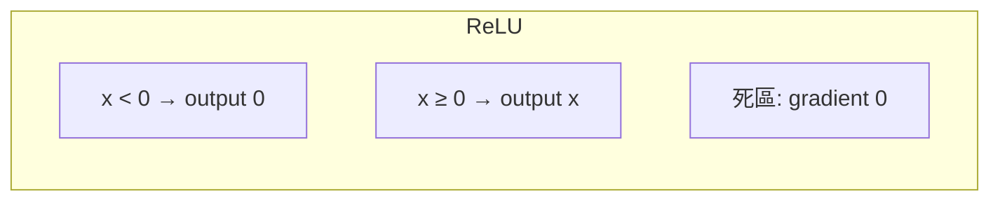
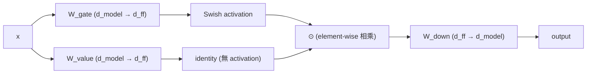
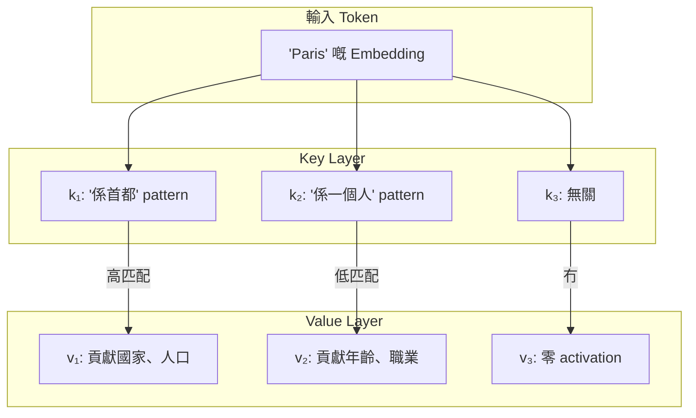

# Module 10: FFN Layer 同 Activation 函數

Est. study time: 1.5h
Language: yue
Description: 除咗 attention 之外 — FFN 點樣處理資訊、activation 函數嘅演變、gated 變體、同埋 compute 佔比。

## 知識圖譜


---

## 學習目標

- 解釋 FFN 結構同 activation 函數點樣塑造資訊流 — CILO #1
- 比較 ReLU、GELU、Swish、SwiGLU 嘅 gradient 性質同實證質量 — CILO #1
- 分析 FFN 作為 key-value memory 同 sparse activation — CILO #2
- 計算 attention 同 FFN 之間嘅 FLOP 分佈 — CILO #2

---

## 真實例子

你訓練一個 1B 參數嘅 LLM。行咗 50k steps 之後，20% 嘅 neuron 對任何輸入都輸出零 — 永久死亡。Model perplexity 比預期差 1.5 點。Activation 退化靜靜雞搞死緊你個 model。

與此同時，Llama 3 用 SwiGLU — 零死 neuron，一半訓練 compute 就達到更好 perplexity。揀邊個 activation 函數決定咗你個 model 訓練得好唔好。

> **諗下**：點解 neuron 會對所有可能輸入都出零？咩原因導致永久 silence？
>
> *答案：ReLU 對負數輸入出零。Weights 推郁所有數據嘅 activation 變負數 → neuron 永遠唔著（gradient 係零） — 永久死亡。*

---

## 核心內容

### Section 1: FFN 結構

每個 transformer block 都有：Attention → FFN → output。FFN 係兩個 linear layers 中間夾住 activation：

```text
FFN(x) = down_proj( activation( up_proj(x) ) )
up_proj:   d_model → d_ff
activation:  element-wise 非線性
down_proj: d_ff → d_model
```



每個 token 獨立處理 — 冇跨 token 互動。Attention 負責跨 token；FFN 負責每個 token 嘅特徵。

現代 LLM 通常冇 bias。慳參數之餘質量唔跌。

> **諗下**：點解 FFN 需要 activation 但 attention 唔需要？
>
> *答案：Attention 本身有 softmax 做非線性。FFN 冇 activation 嘅話 = 兩個 linear transforms = 一個 linear transform（W₂(W₁x) = (W₂W₁)x） — 學唔到非線性互動。Activation 打破線性。*

### Section 2: Activation 函數

**ReLU**：`max(0, x)`。平（比較就得），負數出零。用喺原始 Transformer（Vaswani 2017）。

問題：**Dying ReLU**。Weights 飄到某個 neuron 嘅 pre-activation 永遠係負數 → output 永遠 0 → gradient 0 → 永遠翻唔到身。大規模嗰陣，5-20% 嘅 neuron 永久死亡。



**GELU**（Gaussian Error Linear Unit，Hendrycks 2016）：`x × Φ(x)` 當中 Φ 係標準常態 CDF。平滑近似：`0.5 × x × (1 + tanh(√(2/π) × (x + 0.044715 × x³)))`。BERT、GPT-3 用咗佢。

```text
GELU(x) ≈ 0.5x(1 + tanh(√(2/π)(x + 0.044715x³)))
```

GELU 係 smooth — 所有區域都有非零 gradient。佢做埋 stochastic regularizer：根據輸入「大過隨機噪音」嘅機率嚟 gating。

**Swish/SiLU**（Ramachandran 2017）：`x × σ(x)` 當中 σ 係 sigmoid。Self-gating — 輸入控制自己嘅 gate。學到平滑嘅 ReLU 形狀。

```text
Swish(x) = x × sigmoid(x)
```

> **填充**：「ReLU 喺輸入係 {正數} 嗰陣 activate，輸出 x。輸入係負數嗰陣，輸出係 {0}，gradient 係 {0} — 咁就搞出咗 {dying ReLU} 問題。GELU 喺任何地方都有 {非零 gradient}，避免永久 neuron 死亡。」
>
> *答案：正數，0，0，dying ReLU，非零 gradient*

> **諗下**：GELU 貴過 ReLU。點解值得俾呢個成本？
>
> *答案：1) 冇死 neuron → 更好參數利用率。2) 平滑 gradient → 穩定訓練。3) 實證上同 compute 下 ~0.3-0.5 PPL 更好。成本：每個 element 做 tanh — 同 matmul 比微不足道。*

### Section 3: Gated FFN 變體

標準 FFN：一條路徑，單一 activation。

**Gated FFN**：拆做兩條路徑 —「gate」同「value」。Gate 行 activation，然後同 value 做 element-wise 相乘。

```text
SwiGLU(x) = (Swish(x W_gate) ⊙ (x W_value)) W_down
```



由兩個 weight matrices 變成三個：W_gate、W_value、W_down。解決方法：將 d_ff 縮小 2/3。LLaMA：d_ff = (8/3) × d_model 而唔係 4×。

**SwiGLU**（Shazeer 2020）：Swish gate + linear value。LLM 預訓練入面最有實證嘅 activation。用家：Llama 2/3、PaLM、Mistral。

**GeGLU**：GELU gate + linear value。質量同 SwiGLU 差唔多。某啲變體用佢。

**點解 gating 有效**：乘法互動 — gate 控制 value 通過幾多。標準 FFN 係加法（activated feature 直接向前傳）。Gated FFN 係乘法 — 學識條件運算。

> **推測**：SwiGLU 用 3 個 matrices 而標準 FFN 得 2 個。Llama 點樣縮細 d_ff 嚟保持總 FFN 參數差唔多？
>
> *答案：標準 FFN：2 個 matrices @ d_ff = 4× d_model。總數：2 × d_model × 4d_model = 8d_model² 參數。SwiGLU：3 個 matrices @ d_ff = ~(8/3) × d_model（約 2.67×）。總數：3 × d_model × (8/3)d_model = 8d_model² — 同標準一樣！Llama 用 2/3 d_ff 嚟對齊參數量。*

> **填充**：「SwiGLU 用 {3} 個 weight matrices：W_gate、W_value、W_down。標準 FFN 用 {2} 個。為咗保持相同參數量，SwiGLU 將 d_ff 縮細到標準嘅 {2/3}。Gating 機制喺 gate 同 value 路徑之間創造咗 {乘法} 互動。」
>
> *答案：3，2，2/3，乘法*

### Section 4: FFN 作為 Key-Value Memory

FFN 第一層儲存 patterns；第二層提取返出嚟。（Geva et al., 2021 —「Transformer Feed-Forward Layers Are Key-Value Memories」）

**解讀**：
- Up-projection 入面每個 neuron = **key**：偵測特定輸入 pattern
- Down-projection 入面對應嘅 row = **value**：為嗰個 pattern 產生 output
- Activation 函數 = **key 匹配強度**：呢個 pattern 啱用幾多

```text
FFN(x) = Σ_i activation(⟨x, W₁[i,:]⟩) · W₂[:, i]
        i=1..d_ff
```

每個 neuron 貢獻：activation(key_match_i) × value_vector_i。

**Sparse activation**：對於任何輸入，得 ~5-10% 嘅 neuron 顯著著火。大部分 neuron 係 silent。FFN 好似 **mixture of experts**，每個 expert 係一個 neuron。



> **諗下**：如果 FFN 係 key-value memory，model size 增大（d_ff 大啲）嗰陣會點？
>
> *答案：多啲 keys = 記多啲 patterns。每個 d_ff neuron 儲一個 pattern。350B 參數 model 有 ~1M 密集 FFN neurons → 儲 ~1M 個 patterns。呢個解釋咗點解大模型記到更多事實 — 佢哋有更大 key-value 儲存量。*

### Section 5: Compute 同 Scaling

**Attention vs FFN FLOP 分佈**：以標準 decoder layer 計：

- **QKV projection**：3 × d_model²（每個 head 一個，加埋）
- **Attention score**：2 × seq_len × d_model
- **Output projection**：d_model²
- **FFN up**：d_model × d_ff
- **FFN down**：d_ff × d_model
- **FFN 總數**：2 × d_model × d_ff

d_ff = 4 × d_model 嘅話：FFN 係 (8d_model²) / (3d_model² + 2d_model × seq + d_model²) ≈ **~2/3 總 FLOPs**。

FFN 主導因為 d_ff >> d_model。呢個就係點解 MoE 用多個細 FFN 取代一個大 FFN — 每個 token 嘅 FFN FLOPs 減少。

**d_ff / d_model 比例**：
- GPT-2 / BERT：4×
- LLaMA（SwiGLU）：~8/3×（≈2.67×）— 為咗對齊參數量
- GPT-4（估計）：~3×
- 闊 vs 深取捨：闊（大 d_ff）記更多 patterns；深（多 layers）做到組合式推理。

> **推測**：你將 FFN 換成 MoE，用 8 個 experts、top-2 routing。每個 expert 有相同 d_ff。FLOP 會點變？
>
> *答案：每個 token activate 2 個 out of 8 個 experts。FFN FLOPs：2/8 × 原本 = 原本嘅 25%。2/3 × 0.25 ≈ 總 layer FLOP 減少 ~54%。呢個就係點解 MoE 訓練得更快 — 但 memory 要 load 晒全部 8 個 expert 嘅參數。*

> **搵錯處**：「GELU 同 SwiGLU 係等價嘅 activation 函數，只係名唔同。」
>
> 錯喺邊？
>
> *答案：GELU 係 scalar activation（x → σ(x)，σ 係 smooth gating）。SwiGLU 係 gated FFN 架構 — 用兩個 weight matrices 加 Swish activation 再加 element-wise 相乘。佢哋係唔同層次嘅嘢，冇得直接比較。SwiGLU 係 FFN 組織方式嘅結構改變。GELU 只係喺標準 FFN 入面換個 activation 函數。*

---

## 點解呢課重要

FFN 食咗 LLM 三分之二嘅 compute。揀咩 activation 函數決定咗死唔死 neuron、訓練穩定性、同最終質量。SwiGLU 將 LLaMA 預訓練效率提升約 1.5-2 倍。FFN 作為 key-value memory 解釋咗點樣闊度（而唔淨係深度）儲到更多知識。MoE 係建基於 FFN 嘅替換。

---

## 重點回顧

- FFN = up-proj → activation → down-proj；冇跨 token 互動
- ReLU → GELU（smooth，冇死 neuron）→ SwiGLU（gated，乘法）係演變路徑
- SwiGLU：3 個 matrices，~2/3 d_ff 嚟對齊參數量；LLaMA、PaLM、Mistral 用緊
- FFN 表現為 key-value memory：每個 neuron 儲一個 pattern，每個輸入得 ~5-10% 著火
- FFN 佔總 model FLOPs 約三分之二 — 效率改善嘅首要目標（MoE）

---

## 常見誤解

**「FFN 只係加非線性 — attention 先做真功夫。」**

錯。FFN 儲事實知識（key-value memory）、處理每個 token 嘅特徵、主導 compute。將訓練好嘅 model 移除 FFN 會導致比移除 attention 更大嘅質量損失（中等 seq length）。FFN 係主要 compute engine，唔係 helper。

---

## 搵錯處

工程師將一個用 ReLU 訓練嘅 model 嘅 activation 換成 GELU。Perplexity 變差。佢斷定 GELU 差過 ReLU。

錯喺邊？

*答案：Activation 函數唔可以喺訓練後先換。預訓練權重係為 ReLU 優化嘅 — ReLU 會 activate 嘅 FFN subspace（正區域）同 GELU 嘅 gating 行為唔同。GELU 對正負值都會作用。為 ReLU 硬邊界訓練出嚟嘅權重，經 GELU 平滑 gate 會出錯 output。Activation 必須喺訓練前揀定。*

---

## Feynman 解釋

（同小朋友解釋 FFN：圖書館管理員比喻。up-proj = 按主題編號搵書，activation = 檢查本書啱唔啱，down-proj = 將本書放上 output 書架。每個 neuron = 一個專科管理員。）

---

## 重新理解

（判斷 gated FFN vs 標準：Gating 係真係更好定只係多咗參數幫手？SwiGLU 喺 2/3 d_ff 就達到同等質量 — 暗示 gating 參數效率高 ~50%。呢個對標準 FFN 架構講咗啲乜？）

---

## 練習

做 quiz。MCQs 考唔同角度 — recall、應用、場景。

行：`learn.sh quiz llm-moe-cot 10-ffn-layers-activations`

> **Predict**: Commit to an answer: does ffn layer 同 activation 函數 get simpler or harder once max(0, x) enters the picture?
>
> *Answer: Harder locally, simpler globally: individual pieces carry more rules, but the overall system needs fewer special cases.*
> **Think**: Could you implement ffn layer 同 activation 函數 without **max(0, x)**? What would the cost be?
>
> *Answer: Yes, but you'd hand-roll what **max(0, x)** already handles — more code, more edge cases, fewer guarantees.*
> **Spot the Mistake**: Code review note: someone applies x × φ(x) everywhere "to be safe" in a ffn layer 同 activation 函數 codebase. Spot the mistake.
>
> *Answer: Blanket application hides which spots actually need x × φ(x). Apply it where the semantics demand it, and document why.*

