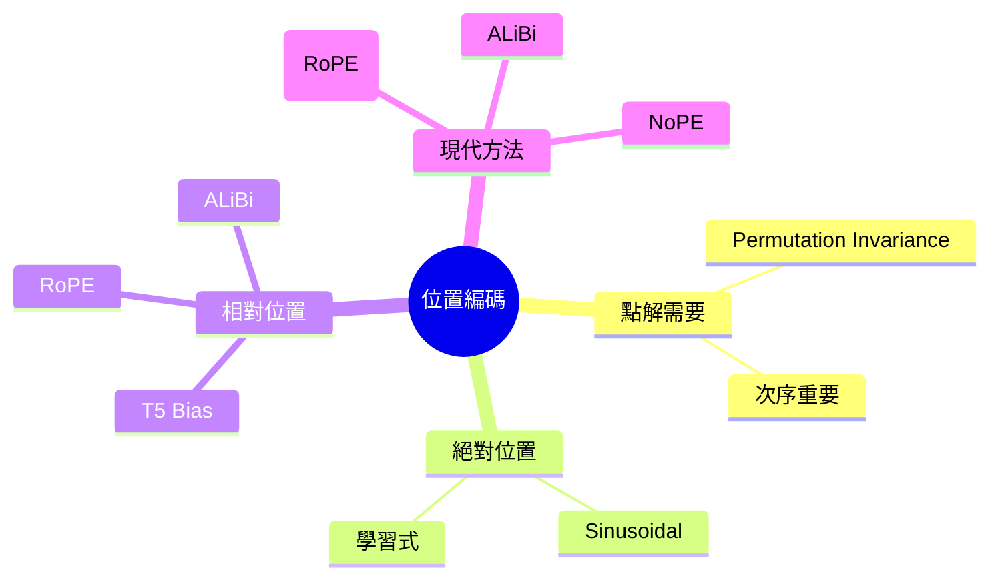
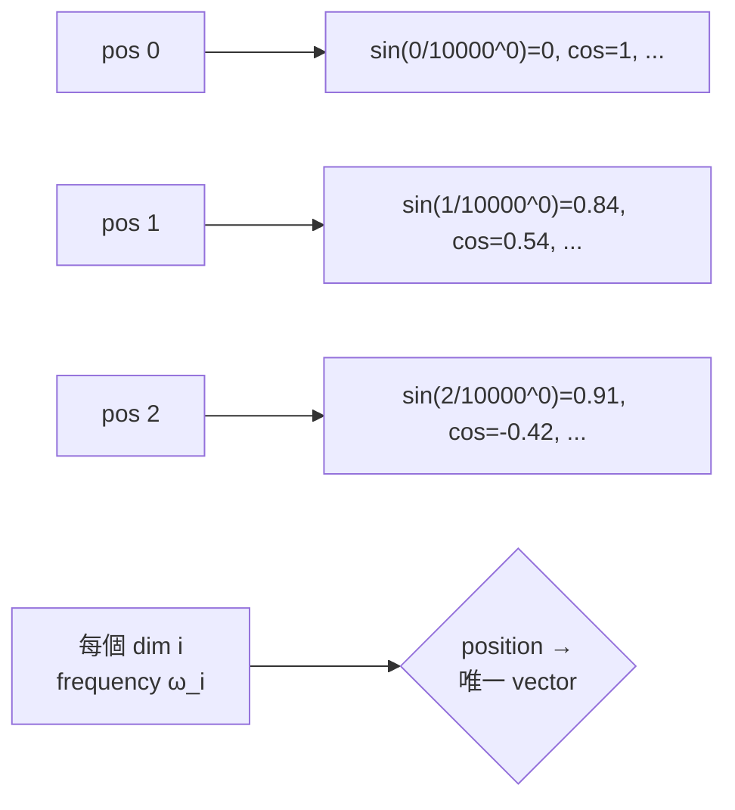
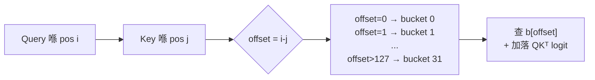
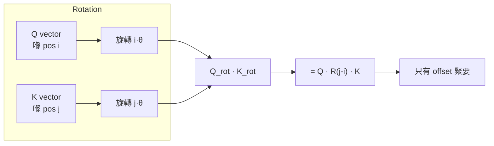
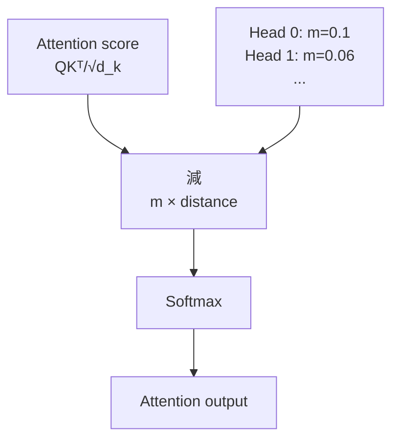

# Module 11: 位置編碼

Est. study time: 2h
Language: yue
Description: 位置編碼 — Sinusoidal, RoPE, ALiBi

---

## 知識圖譜



---

## 學習目標
- 解釋點解 self-attention 需要位置資訊（permutation invariance）
- 對比 absolute vs relative position encoding 方法
- 推導 RoPE 旋轉點解可以保留相對位置
- 比較 RoPE、ALiBi 同 learned embeddings 嘅 trade-offs

---

## 真實例子

Fine-tune BERT 做 sentiment。Input: "I love this movie, not" → 預測 positive。錯！BERT 嘅 absolute position embeddings 搞唔掂 negation scope。Relative position 喺 "love" 同 "not" 之間比 absolute positions 3 同 5 重要好多。

> **Think**：點解 absolute position 對 negation 失效？"not" 可以離被否定嘅詞幾遠？
>
> *Answer："not" 可以出現得好遠（"I don't actually really love this movie"）。Absolute codes 捕捉唔到 dependency。Relative positions 先得。*

---

## 核心內容

### 位置問題

Self-attention 係 **permutation-invariant**。QKᵀ 計算 pairwise similarity 唔睇輸入次序。"Paris is in France" 同 "France is in Paris" 會產生一樣嘅 attention pattern 如果 tokens 一樣。

> **Cloze**："Self-attention 將輸入當做 {bag of tokens} — 次序資訊完全唔存在。"
>
> *Answer: bag of tokens*

Transformers 透過 **positional encoding (PE)** 注入位置：加落 embeddings 或者修改 embeddings 嘅信號，等模型知道每個 token 喺邊個位。

> **Think**：可唔可以用 raw integer 嚟做位置？有乜問題？
>
> *Answer：冇上限範圍、跟 seq length 變、冇自然距離 metric — 更難學習。*

### Sinusoidal Positional Encoding (Vaswani et al. 2017)

Original Transformer 用固定嘅 sinusoids：

PE(pos, 2i) = sin(pos / 10000^(2i/d_model))
PE(pos, 2i+1) = cos(pos / 10000^(2i/d_model))

每個位置有獨特 pattern。唔同 frequency 沿住 d_model 維度 — low frequencies 編碼長距離結構，high frequencies 編碼精細 offset。

優點：冇 learned parameters、可以 extrapolate 超越 max training length（喺更長 sequence 測試）、positions 之間有線性關係。



> **Think**：點解要多個 frequency 而唔係每個 dim 一個？
>
> *Answer：多個 frequency 等模型可以同時關注附近（fast osc，區分相鄰）同遠處（slow osc，相似嘅遠距離位置）。*

> **Cloze**："Sinusoidal PE 透過 position vectors 嘅線性變換編碼 {relative} 位置。"
>
> *Answer: relative*

### Learned Position Embeddings

唔用固定 sinusoids，每個位置學一個 vector 去到 max_len。用喺 BERT、GPT-2 等早期模型。

每個位置喺 embedding matrix 有可訓練嘅 row。模型喺訓練期間決定 "position" 代表乜。

缺點：
- **冇 extrapolation**：處理唔到長過 max_len 嘅 sequence（緊急情況：position 512 乜都冇）
- **冇 inductive bias**：每個位置同樣可學習 — 模型可能編碼唔到有用結構

> **Think**：BERT 最多 512 個 positions。如果餵 600 tokens 會點？
>
> *Answer：Runtime error — index out of bounds。Workaround：truncate 或者 slide window。*

> **Predict**：Learned embeddings 喺 position 511 同 position 1 嘅表現會點？
>
> *Answer：兩個都可學習但 position 511 好少見到（大部份 sequence 更短）— 訓練得差嘅 embedding，cold-start 問題。*

### Relative Position Encodings

關鍵 insight：**relative offset**（token_j 喺 token_i 右邊 3 個位）比 absolute position（token_i 喺位置 7）更重要。

#### T5 Relative Bias (Raffel et al. 2020)

唔係將位置加落 embeddings，而係直接修改 attention logits：

score(i, j) = (x_i W_Q)(x_j W_K)ᵀ / √d_k + b(i-j)

其中 b 係每個 relative offset range 嘅 learned scalar bucket。T5 用 log-bucketing：近距離位置精細（offset 0-7），遠距離粗略（offset 128+ 全部同一 bucket）。

優點：參數有效率（每個 bucket 一個 scalar）、直接將位置信號送入 attention。

> **Cloze**："T5 relative bias 係一個 {learned scalar} 加落 attention logit，基於 positions 之間嘅 {relative offset}。"
>
> *Answer: learned scalar / relative offset*



> **Think**：點解要 log-bucket？點解唔每個唔同 offset 用一個參數？
>
> *Answer：Sequence length 可以好長（最多 2048+）。每個 offset 一個參數 = O(L²) 參數，好浪費。Log-bucketing 俾近距離精細解析度（precision 重要嘅位）同遠距離粗略解析度（precision 冇咁需要）。*

### RoPE — Rotary Position Embedding (Su et al. 2021)

**Current standard**（Llama 2/3、Mistral、Gemma、PaLM、Qwen、DeepSeek）。

核心：**旋轉** query 同 key vectors，角度同位置成正比。

旋轉 Q 同 K 入面每對 dimensions (2i, 2i+1)：

R(θ, pos) = [[cos(pos·θ_i), -sin(pos·θ_i)], [sin(pos·θ_i), cos(pos·θ_i)]]

其中 θ_i = 10000^(-2i/d_model)（同 sinusoidal PE 一樣嘅 frequency scheme）。

應用：Q'_pos = R(θ, pos) · Q_pos，K'_pos = R(θ, pos) · K_pos

關鍵性質：Q'_i · K'_j = Q_i · R(θ, j-i) · K_j

Dot product **只取決於 relative offset** (j-i)，唔係 absolute positions i 同 j。因為 rotation matrices 係 composable：R(θ, i)ᵀ · R(θ, j) = R(θ, j-i)。

> **Cloze**："RoPE 令 attention score 只取決於 query 同 key 之間嘅 {relative} 位置，唔係佢哋嘅 absolute positions。"
>
> *Answer: relative*



> **Think**：RoPE 修改哂 Q 同 K。如果淨係旋轉 Q 唔旋轉 K 會點？
>
> *Answer：Dot product 會係 Q·R(i)·K_j — 仍然依賴 i 同 j 各自。需要兩邊都旋轉先做到 R(i)ᵀ·R(j)=R(j-i)。Symmetry 係關鍵。*

RoPE 優點：
- **Relative encoding** 冇額外參數
- **Decay with distance**：高頻 dimensions 旋轉得快，dot product 會震盪 — 大致上，長距離 tokens 得到較低 attention（decaying bias）
- **Extrapolatable**：可以處理比訓練更長嘅 sequence（LLMs 透過 RoPE + position interpolation 將 4k 延伸到 32k）
- **Zero overhead at inference**：RoPE 每個位置預先計算並 cached

缺點：位置資訊會 decay，唔係直觀咁 tune。

> **Predict**：Llama 2 喺 4k context 訓練。有人將佢延伸到 32k 透過將 rotation frequencies 減半（NTK-aware scaling）。附近 token 嘅解析度會點？
>
> *Answer：將 θ 減半意味住旋轉變慢 — 附近 tokens 更難區分（佢哋旋轉距離更細）。Trade-off：長距離連貫性得到改善，短距離精準度損失。NTK-aware scaling 保留高頻率唔變（保留局部解析度），只係減慢低頻率。*

### ALiBi — Attention with Linear Biases (Press et al. 2022)

比 RoPE 更簡單：將 **negative linear bias** 加到 attention scores，同距離成正比：

score(i, j) = (x_i W_Q)(x_j W_K)ᵀ / √d_k - m · |i-j|

其中 m 係 head-specific slope。Head 0 最斜（精細近距離），後面 heads 較平緩（更濶嘅 focus）。

> **Cloze**："ALiBi 喺 softmax 之前將一個 bias 為 {−m·|i−j|} 加到 attention score。"
>
> *Answer: −m·|i−j|*

Input layer 冇 position embeddings。Attention 自己 carry 位置。

優點：簡單、強 extrapolation（1k→2M）、冇額外 params。
缺點：表達能力低過 RoPE；用喺 MPT、部分 BLOOM。



### NoPE — No Position Encoding (Kazemnejad et al. 2024)

近期：decoder-only transformers 可以透過 **causal masking + residual stream** 學習位置。有時追得上 sinusoidal PE。

點解：causal mask 創造時間次序 — pos 3 依賴 1、2 但唔依賴 4+。模型利用呢點。

NoPE 未係主流。大部份模型用 RoPE。

> **Think**：Causal mask 自己點樣俾出位置信號？冇 PE 嘅情況下可唔可以分辨 position 5 同 position 6？
>
> *Answer：部分得 — 模型知道 5 vs 6 個 tokens 見過。但 "apple" 喺 pos 5 vs pos 50：一樣嘅 mask，一樣嘅 visible count。NoPE 依賴分佈差異（早期 tokens 同晚期 tokens 唔同）。*

### 比較表

| Method | Type | Extrapolates? | Learned? | Used by | Year |
|---|---|---|---|---|---|
| Sinusoidal | Absolute | Yes (w/ decay) | No (fixed) | Original Transformer | 2017 |
| Learned | Absolute | No | Yes | BERT, GPT-2 | 2018 |
| T5 Bias | Relative-bucket | Limited | Yes (buckets) | T5, PaLM | 2020 |
| RoPE | Relative-rotary | Yes (w/ interpolation) | No (freq fixed) | Llama, Mistral, Gemma | 2021 |
| ALiBi | Relative-linear | Yes | No (slopes fixed) | MPT, BLOOM | 2022 |
| NoPE | None | Yes | N/A | Research | 2024 |

### RoPE 上下文延伸

**PI**：縮放位置 pos→pos·L_train/L_new（4k→32k：除以 8）。同一個 rotation range 覆蓋更多 tokens。相鄰 tokens 幾乎分唔開 — 局部解析度下降。

**NTK-aware scaling**：保留高頻 dims（局部解析度），只縮放低頻。每個 dim 唔同 factor。短距離保留更好。

---

## 點解重要

PE 嘅選擇決定 context length、extrapolation、fine-tuning 行為。揀錯 = 處理唔到長文檔、推理失敗。RoPE 主導現代 LLMs — 理解佢嘅機制有助延伸 context、tune interpolation、診斷位置相關嘅失敗。

---

## 重點回顧
- Self-attention 係 permutation-invariant — 需要注入位置
- Absolute PE（sinusoidal/learned）將位置編碼落 embeddings
- Relative PE（T5 bias、RoPE、ALiBi）直接修改 attention
- RoPE 旋轉 Q/K vectors — dot product 只取決於 relative offset
- RoPE 支援 context extension 透過 position interpolation 或 NTK scaling
- ALiBi 最簡單方法、最好 extrapolation、但表達能力較低

---

## 常見誤解

"Position encodings 係細微嘅 implementation detail — 好容易換。"

錯。PE 同訓練深度耦合。RoPE 模型冇辦法換去 ALiBi 而唔重新訓練。唔同 PE 產生唔同 attention patterns。

---

## 搵錯處

> Code snippet:
> ```python
> def rope(q, k, pos):
>     # Applies rotation using cos/sin from position
>     q_rot = q * cos(pos * theta) + rotate_half(q) * sin(pos * theta)
>     k_rot = k * cos(pos * theta) + rotate_half(k) * sin(pos * theta)
>     return q_rot, k_rot
> ```
> Bug：q 同 k 都用同一個 `pos`。有乜問題？

Answer：Query 喺 i、key 喺 j 應該用唔同角度。q 旋轉 i·θ、k 旋轉 j·θ → dot = q·R(j-i)·k。同角度 = 冇 relative encoding — 互相抵消。

---

## Feynman 解釋
用細路仔解釋 RoPE：「兩個舞者喺旋轉舞台上，每個人根據 arrival time 旋轉。佢哋相對轉咗幾多話俾你知佢哋喺條隊入面相距幾遠。」

---

## 重新理解
比較 RoPE vs Learned embedding：RoPE 有強 inductive bias（distance-decay、relative）。Learned 靈活但需要更多數據。新 architecture 時咩情況下揀 learned 而唔係 RoPE？

---

## 練習
執行：`learn.sh quiz llm-moe-cot 11-positional-encodings`

> **Spot the Mistake**: A developer treats pos as optional because "it works without it." Where is the mistake?
>
> *Answer: It works only until the assumptions behind pos are violated. The fix: treat it as part of the contract of 位置編碼, not an optimization.*

