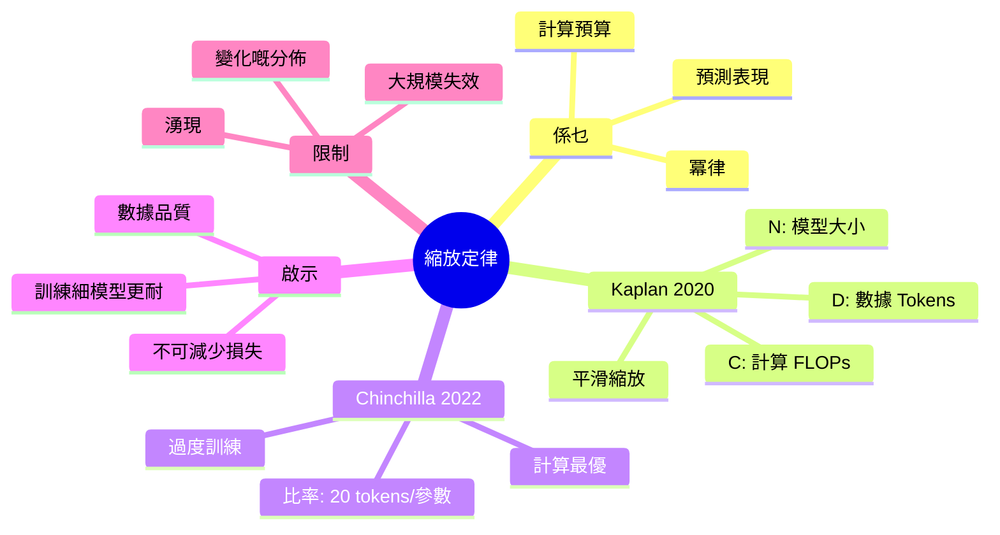
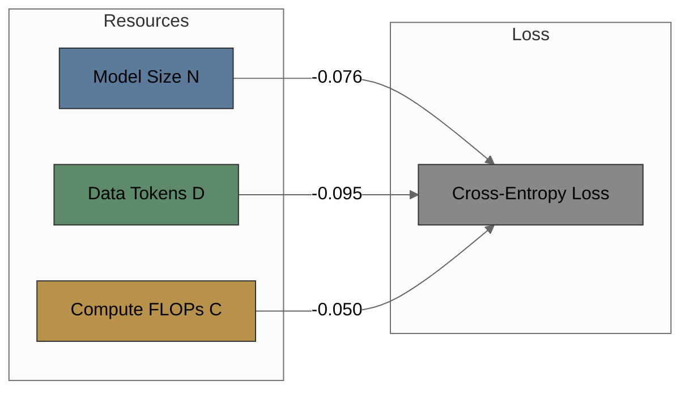
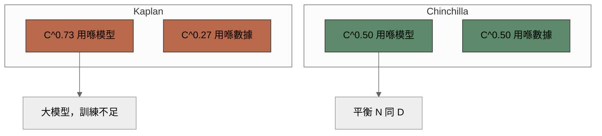
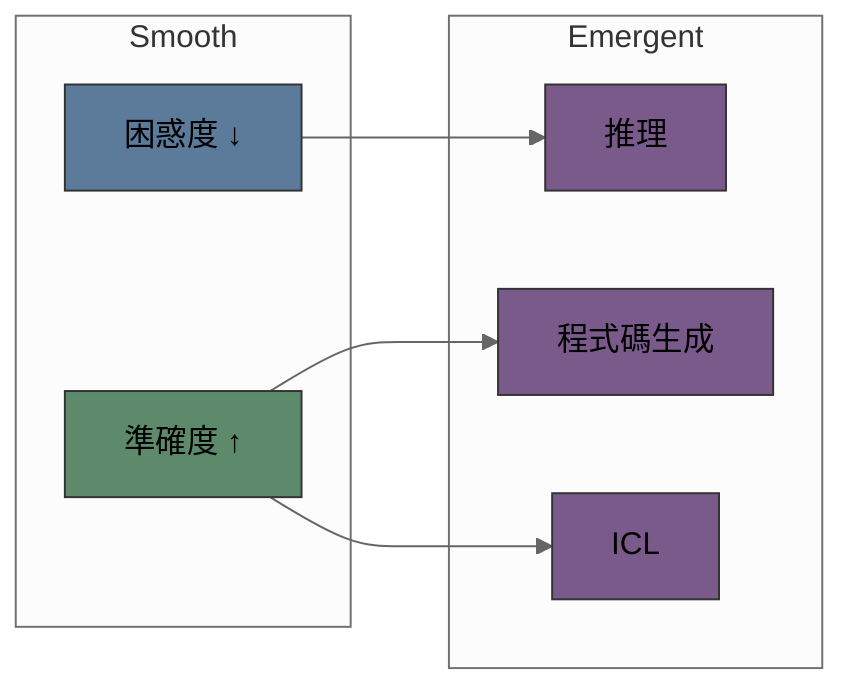

# Module 12: 縮放定律

Description: Kaplan, Chinchilla, 同 Compute-Optimal Training

Est. study time: 2.5h
Language: yue

---

## 知識圖譜

---

## 學習目標
- 解釋 loss 同 model size/data/compute 之間嘅 power-law scaling 關係
- 對比 Kaplan 同 Chinchilla 嘅 compute-optimal ratio
- 俾個 compute budget 計到 optimal model size
- 認出 irreducible loss 嘅來源同埋佢哋嘅影響

---

## 真實例子

Train 7B param model 用 2T tokens。Train 13B param model 用同樣 2T tokens。Perplexity: 13B 贏但係 training cost ~2x。如果 train 7B 耐啲 — 4T tokens 呢？Chinchilla 話 7B 用 4T 好過 13B 用 2T，同樣 FLOPs budget。Compute-optimal ratio ~20 tokens per parameter。

> **諗下**: 點解 train 細 model 耐啲好過 train 大 model 用同樣 data？
>
> *答案: 大 model 如果冇 proportional 嘅 extra tokens 會 underfit data。Compute 浪費喺唔 converge 嘅 params 度。Chinchilla 顯示 4:1 tokens-to-params ratio。7B param 最少需要 ~140B tokens。13B 需要 ~260B。*

---

## 核心內容

### 縮放定律係乜嘢？

Scaling law 預測 model loss，俾定 compute budget、model size、或者 data size。Kaplan et al. (2020) 嘅 key finding: loss 跟每個 resource 成 power-law 關係，唔係 exponential — 即係 diminishing but predictable returns。

$$
L(x) \propto x^{-\alpha} + L_{\infty}
$$

$x$ 係 model size $N$、data $D$、或者 compute $C$。$\alpha$ 係 exponent（steepness）。$L_{\infty}$ 係 irreducible loss。

> **Cloze**: "Scaling law 嘅 exponent (\alpha) 控制 \{回報遞減\} 速度 — \alpha 越細 saturation 越快。"

### Kaplan et al. 2020

Train咗 400+ 個 models，由 768 到 1.5B params。發現三個 power-laws:

**Model Size:** $L(N) \propto N^{-0.076}$ — doubling params 會 predictable 咁降低 loss。Early saturation warning: exponent 細，returns 縮水。

**Dataset Size:** $L(D) \propto D^{-0.095}$ — 多啲 data 改善 loss。留意 $D$ exponent ~25% 大過 $N$ — data 每次 doubling 嘅 impact 大過 parameters 少少。

**Compute:** $L(C) \propto C^{-0.050}$ — combined effect。Exponent 最細因為 compute 橫跨 N 同 D。

**Compute-Optimal Allocation:** 俾定 fixed compute budget $C$，按比例分配俾 N 同 D。Kaplan 發現 optimal: N 按 $C^{0.73}$ 增長，D 按 $C^{0.27}$ 增長 — 即係將 compute 主要用嚟加大 model，唔係加 data。

> **Cloze**: "Kaplan scaling 將大部份 compute 分配俾 \{model size\} (C^{0.73})，唔係 \{data\} (C^{0.27})。"

> **Predict**: 如果 double model size 但係 keep data constant 會點？
>
> *答案: Loss 一開始跌然後到平台期。Model 記住 training data 但係 overfit。Test loss 唔再改善。Data bottleneck。*

### Chinchilla Scaling (Hoffmann et al. 2022)

重新檢視 compute-optimal allocation。Train咗 400 個 models 由 70M 到 16B params。發現 **唔同結論**: model size 同 data 應該等比例 scaling。

$$N_{\text{opt}} \propto C^{0.5}, \quad D_{\text{opt}} \propto C^{0.5}$$

Chinchilla 70B: train 用 1.4T tokens (~20 tokens per parameter)。Compare GPT-3 175B train 用 300B tokens (<2 tokens/param) — GPT-3 以 Chinchilla 標準嚟講係 severely under-trained。

點解同 Kaplan 唔同？Kaplan 用 fixed training budget per model size（細 model 早停）。Chinchilla 系統咁 varying N 同 D。Kaplan 嘅 methodology 有 bias 偏向大 model。

**Practical Rule:** 每個 parameter 大約 train ~20 tokens。7B model 需要 ~140B tokens。70B model 需要 ~1.4T tokens。

### Irreducible Loss

就算係 infinite model 加 infinite data 都做唔到 zero loss。來源:

- **Linguistic entropy:** natural language 唔係 deterministic。俾你 "The cat sat on the ___"，有多個 valid completions (mat, chair, floor...)。Model 將 probability mass 分配俾所有 valid options。
- **Noise:** web text 有 typos、formatting errors、contradictory statements。
- **Inherent ambiguity:** 字有多個意思，referents 唔清楚。

$L_{\infty}$ 估計 ~1.2-1.6 nats (bits: ~0.7-1.1) 對 web text 嚟講。呢個 set 咗 fundamental ceiling。

> **Cloze**: "Irreducible loss L_{\infty} 來自 \{linguistic entropy\}、\{noise\}、同 \{ambiguity\}。唔可以低過 ~\{1.2\} nats。"

> **諗下**: 點解 model 有 perfect understanding 都做唔到 0 cross-entropy？
>
> *答案: Cross-entropy 量度 model 預測 next token 有幾準。就算人類估下一個字都會錯（多個 valid continuations）。語言本質上係 probabilistic。*

### Scaling 嘅含義: Emergence

Scaling law 預測 smooth improvement。但係有啲 abilities 突然间喺 threshold model size 出現:

Emergence 爭論: 真係 phase transition 定係 measurement artifact？Smooth metrics 例如 loss 預測 smooth scaling。Discontinuous metrics (exact match、multiple-choice accuracy) 製造咗 sudden emergence 嘅 illusion。Power-law in log-probability → threshold in accuracy。

### Beyond Power Laws: Scaling 失效

Scaling law 唔係 universal — 有幾個 breakdown modes:

- **Data wall:** web text 用盡咗 ~5T unique tokens。Synthetic data 填補 gap 但 quality 有問題。
- **Diminishing returns:** 去到夠大 scale，power-law 可能會 bend。證據: loss curves 超過 ~1T params 開始 flatten (GPT-4、PaLM)。
- **Changing data distribution:** 用 2015-2023 嘅 internet data 訓練，預測唔到 2025+ 嘅語言變化嘅 performance。
- **Over-training vs overfitting:** over-training (多 tokens 過 Chinchilla-optimal) 降低 loss 但 diminishing return。Overfitting (memorization) 係另一回事。

> **Error-spotting**: "Scaling law 保證每個 model size 都會 proportional 咁 improvement 跟住 compute 投入。Double compute 就 loss 減半。"
>
> *错咗。Scaling law 係 power-law 唔係 linear。Double compute 將 loss 減少 factor 2^{-0.05} ≈ 0.966，唔係 0.5。Returns 係 diminishing。*

---

## 總結表

| 發現 | Kaplan 2020 | Chinchilla 2022 | 實際應用 |
|---------|-------------|-----------------|-----------|
| N 指數 | C^0.73 | C^0.50 | N 同 D 等比例 scaling |
| Tokens/param | ~2 | ~20 | 7B → 140B tokens |
| 數據優先級 | 較低 | 相等 | 數據品質 好重要 |
| 適合 | 大 model demo | 成本效益訓練 | 你嘅 application budget |

---

## Feynman 解釋

同識 ML basics 但未學過 LLM 嘅同事解釋 scaling law。包括: 佢哋預測啲乜、Kaplan vs Chinchilla 嘅分別、點解 irreducible loss 存在。解釋完之後追問: "點解 GPT-3 用 175B params 但只 train 咗 300B tokens？" — 呢個 gap 揭示 under-training 概念。

---

## 延伸閱讀
- Kaplan et al. 2020: "Scaling Laws for Neural Language Models"
- Hoffmann et al. 2022: "Training Compute-Optimal Large Language Models"
- Henighan et al. 2020: "Scaling Laws for Autoregressive Generative Modeling"
- Michaud et al. 2023: "The Quantization Model of Neural Scaling"

> **Think**: How does **縮放定律係乜嘢？** relate to **Kaplan et al. 2020** within 縮放定律?
>
> *Answer: They address adjacent failure modes: 縮放定律係乜嘢？ governs the primary behavior, while kaplan et al. 2020 constrains how far you can push it.*
> **Spot the Mistake**: A developer treats kaplan et as optional because "it works without it." Where is the mistake?
>
> *Answer: It works only until the assumptions behind kaplan et are violated. The fix: treat it as part of the contract of 縮放定律, not an optimization.*

