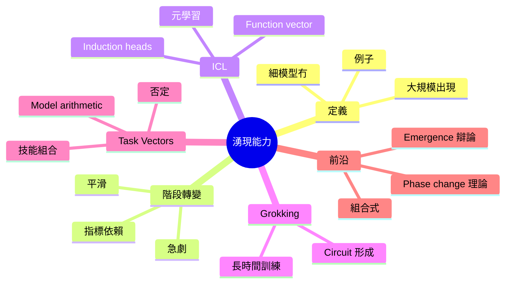
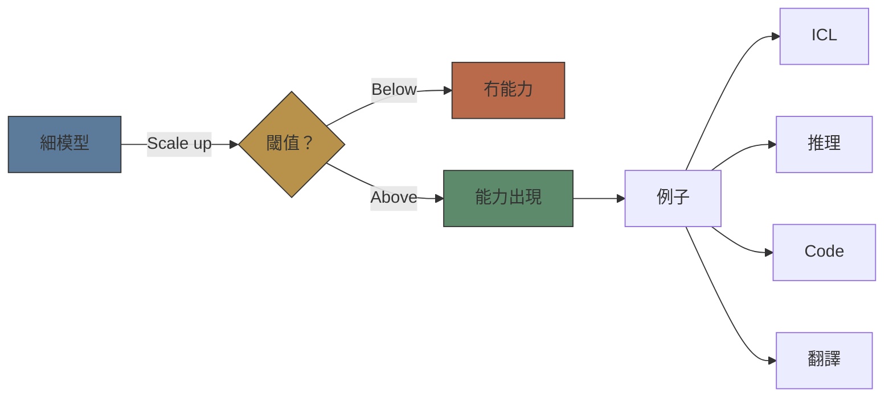
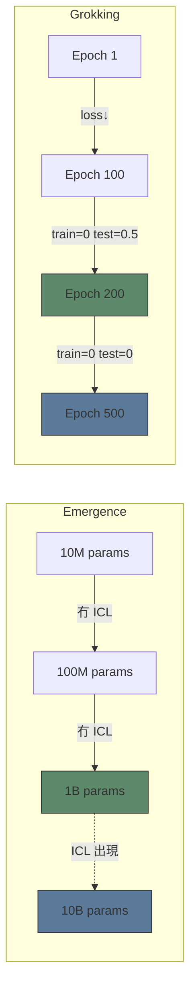
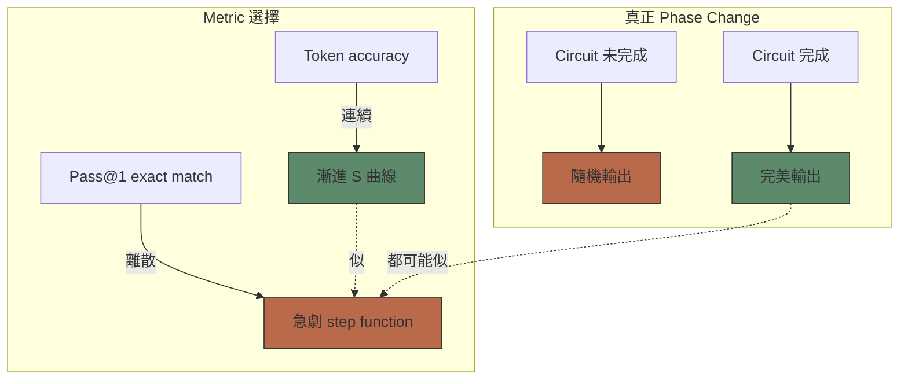
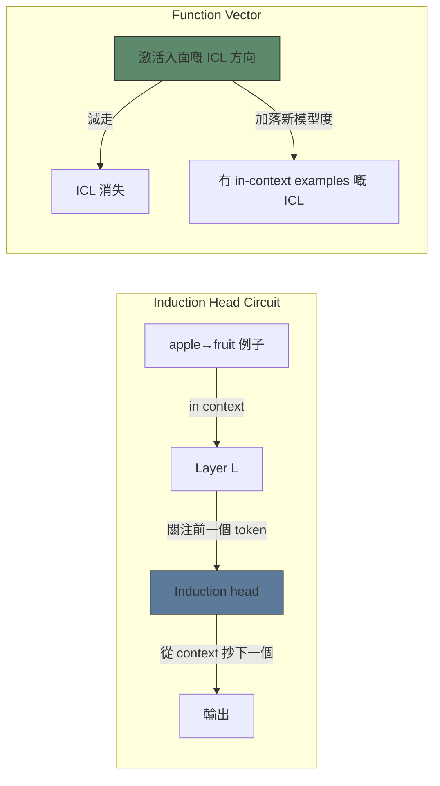
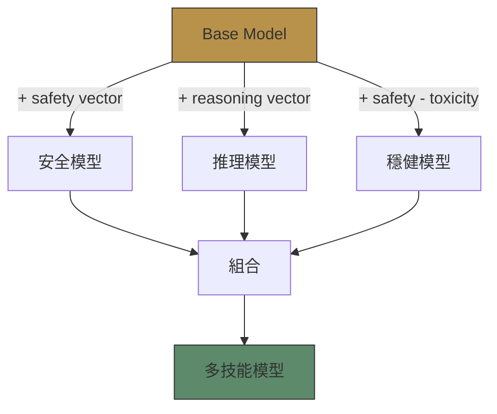

# Module 13: 湧現能力

Est. study time: 2.0h
Language: yue



## 學習目標
- 定義 emergent abilities，區分佢同 grokking
- 解釋模型 scaling 嘅 phase transition 模式
- 描述 in-context learning 機制（induction heads、function vectors）
- 分析 emergence 辯論：真實現象 vs metric artifact

---

## 1. 咩係 Emergent Abilities？

細模型冇嘅能力，大型模型先有。唔係逐步改進——係質嘅飛躍。

> **Cloze**: "Emergent abilities 係指 \{細模型度唔存在\}、但 \{大模型度出現\} 嘅能力。"

**例子（Wei 2022）**：
- **In-context learning**：GPT-2（1.5B）—— ICL 好弱。GPT-3（175B）—— ICL 好強。
- **算術**：細模型做到 2+3。大模型 reliably 做到 347×289。
- **多步推理**：「如果 A>B 同 B>C，跟住點？」——低過 threshold 就 fail。
- **Code generation**：HumanEval pass@100 喺接近 100B params 時由 ~0% 跳到 ~70%。



> **Think**: 點解能力會喺特定規模突然出現，而唔係逐步提升？*答案：某啲能力需要 critical mass 嘅 parameters 去 implement 一個 functional circuit。低過 threshold 嘅話，circuit 唔完整。高過 threshold，佢就凝聚成形。*

---

## 2. Emergence vs Grokking

兩個都涉及突然嘅能力提升——但係唔同軸。

| 維度 | Emergence | Grokking |
|-----------|-----------|----------|
| 軸心 | 模型規模（params） | 訓練時間（steps） |
| 觸發條件 | Parameter count 跨過 threshold | 模型 memorise → 搵到 general circuit |
| 機制 | Circuit 嘅容量 | 延遲嘅 generalisation |
| 例子 | ICL 喺 10B params 出現 | 算術 generalisation 喺 100× overfitting 之後 |

**Grokking**（Power 2022）：細 transformer 行 modular arithmetic。Training loss 去到 0（背熟咗）。然後 test loss 突然跌到 0——模型搵到 generalising circuit。



> **Predict**: 如果一個 100M-param 模型用多 100 倍 tokens 去訓練，佢可唔可以 grok ICL？*答案：應該唔得。Emergence 取決於 capacity（parameters），唔係訓練長度。Grokking 解鎖現有 capacity；emergence 需要新 capacity。*

---

## 3. Phase Transitions: Smooth vs Sharp

唔係所有 emergence 都係突如其來。取決於你用咩 metric。

**Smooth emergence**：模型逐步改善。Reasoning tasks 嘅 per-token accuracy 平穩上升。所謂「emergence」只係 binary metrics（pass/fail）套落 continuous improvement 產生嘅 artifact。

**Sharp emergence**：真正嘅 phase transition。例子：Indirect Object Identification（IOI）circuit——circuit components 要全部齊全。爭一塊 → random performance。齊晒 → perfect。

> **Cloze**: "Schaeffer（2023）認為 emergence 係 \{metric artifact\}——用 discontinuous metrics（pass@1）去度 continuous model improvements。Ganguli（2022）用 algorithmic tasks 上嘅 \{per-token accuracy\} 證明咗存在真正嘅 phase transitions。"



---

## 4. In-Context Learning 機制

ICL：模型從示範中學習，唔使更新 weights。點樣做到？

**Induction heads**（Olsson 2022）：一種 attention head，去搵「當前 token 之前出現過嘅位置」，然後從嗰段 context 預測下一個 token。例子：

```text
Input:  "apple → fruit, banana →"
Pattern: [apple][fruit]...[banana] → predict [fruit]
```

Induction heads 形成一個 **prefix-matching** circuit：
1. Previous token head：關注當前 token 最後一次出現嘅位置
2. Induction head：複製嗰個 match 後面嘅 token

呢個係 ICL 最基本嘅 circuit。大模型有多層 induction heads → 更複雜嘅 patterns。

> **Cloze**: "Induction heads 實現咗一個 \{prefix-matching\} circuit：關注當前 token 之前出現嘅位置，然後預測嗰段 context 嘅 \{下一個 token\}。"

**Function vector**（Todd 2023）：激活空間入面嘅一個特定方向，編碼咗 ICL function。減走佢 → 模型冇咗 ICL。加落去 → 模型唔使 examples 都有 ICL。



---

## 5. Task Vectors 同 Model Arithmetic

**Task vector** = weight space 入面編碼某種能力嘅方向。由 fine-tuned model weights 減去 base model weights 得到。

```text
θ_task = θ_finetuned - θ_base
```

Model arithmetic：
- **加法**：θ_base + θ_task → 模型獲得能力
- **否定**：θ_base - θ_task → 模型失去能力
- **組合**：θ_base + θ_task_A + θ_task_B → 模型同時獲得兩種能力

> **Predict**: 如果將「誠實」嘅 task vector 加上去，再減走「毒性」嘅 task vector，會發生咩事？*答案：模型變得更誠實、更少毒性——model arithmetic 大致係線性而且可以組合。*

**Skill composition**（Ilharco 2023）：Task vectors 可以 scaling、否定、組合。例子：「truthful QA」+「helpful chatbot」→ 更好嘅 assistant。



---

## 6. Emergence 辯論

兩個陣營：

| 陣營 | 立場 | 證據 |
|------|----------|----------|
| **Wei 2022** | 真正 phase change | 好似 3-digit arithmetic 呢啲 tasks 低過 threshold 真係做唔到 |
| **Schaeffer 2023** | Metric artifact | 同一 task 嘅 per-token accuracy 平穩改善；binary pass@1 製造出 step function 嘅假象 |
| **Ganguli 2022** | 混合 | 有啲能力 smooth（per-token），有啲 sharp（algorithmic tasks 有可驗證 solution） |

現實：兩邊都啱。

- **Metric-induced**：ICL few-shot accuracy on classification——用 token accuracy 量度係 smooth
- **真正 phase change**：多步推理需要 circuit depth；唔夠 layers → 冇可能做到
- **狹窄能力**：細模型做到某啲 reasoning，但局限喺有限領域

> **Think**: 你會點測試 emergence 係真定係 metric artifact？*答案：用 per-token accuracy（連續）代替 pass/fail（二元）。如果 per-token accuracy 平穩上升但某個 threshold 令 binary 結果跳升，就係 metric artifact。如果 per-token accuracy 喺 threshold 之前 keep 住 random，就係真正嘅 phase change。*

---

## 7. 實際影響

- **Scale thresholds**：知道你需要嘅能力大約喺邊個 threshold
- **ICL ≠ fine-tune**：ICL 對 safety 嚟講唔可靠——可以被 context override
- **Skill composition**：Task vectors 令能力組合唔使完全 retrain
- **Emergence 不可預測性**：新能力會喺 scaling 時無預警出現

> **Error-spotting**: 「一個 1B-param 模型表現出強 in-context learning。一個 100M-param 模型就冇。所以 emergence 係真正嘅 phase transition。」*錯喺邊？ICL 可能係一個連續嘅能力，只係超越 threshold 之後先達到有用嘅精確度。量度正確 continuation 嘅 token probability——佢可能喺唔同 scales 平穩改善。要支持「真正 phase transition」呢個 claim，需要 per-token accuracy 嘅測量。*

---

## Feynman 解釋

同一位 ML engineering 同事解釋 emergent abilities：

1. 定義：細模型冇、大模型先有嘅能力
2. 點解 emergence 會發生：capacity thresholds、circuit completion、phase changes
3. 辯論：measurement artifact vs 真正 phase transition
4. 例子：ICL mechanics（induction heads、function vectors）、task vectors

寫完之後，check：我分唔分到 emergence 同 grokking？我解唔解釋到點解 emergence debate 會存在？我識唔識喺 mechanistic level 描述 ICL circuit 點運作？

> **Spot the Mistake**: Code review note: someone applies 湧現能力 everywhere "to be safe" in a 湧現能力 codebase. Spot the mistake.
>
> *Answer: Blanket application hides which spots actually need 湧現能力. Apply it where the semantics demand it, and document why.*

